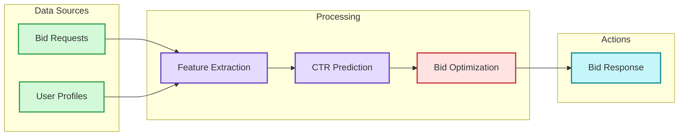
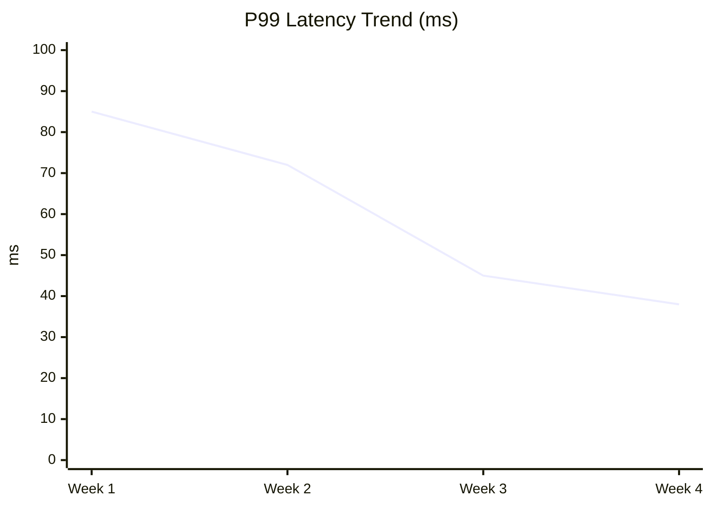
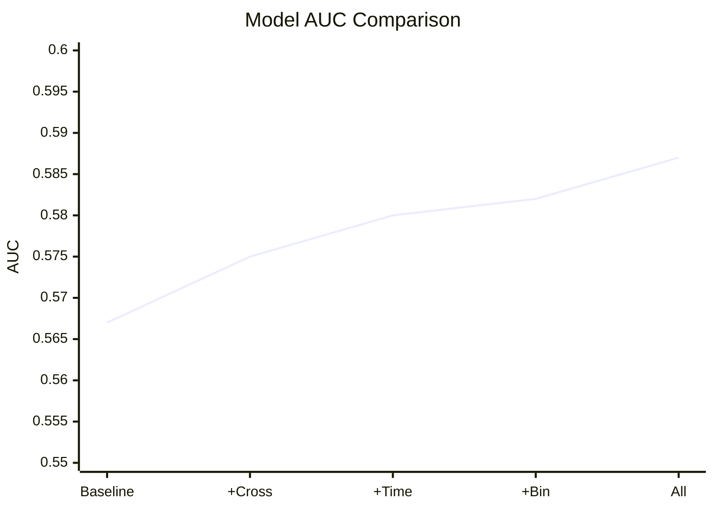
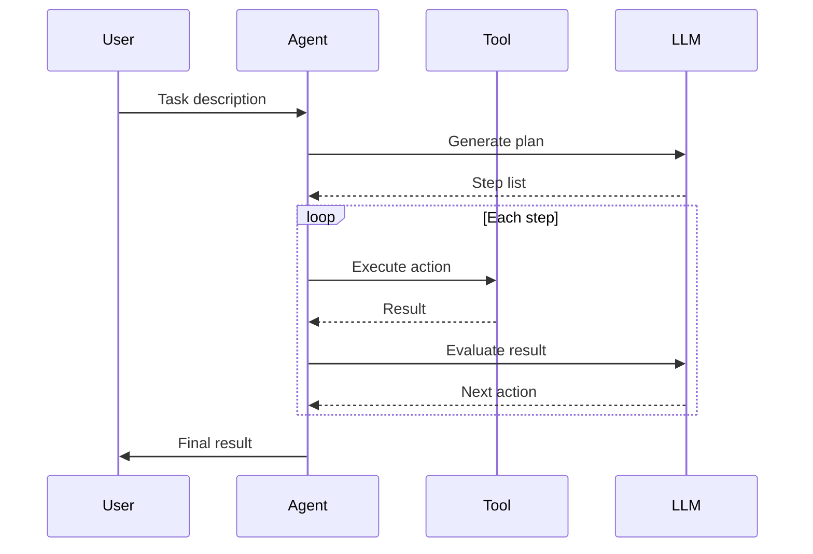
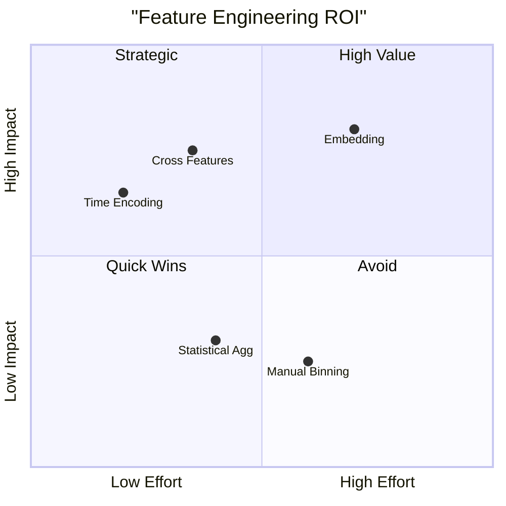
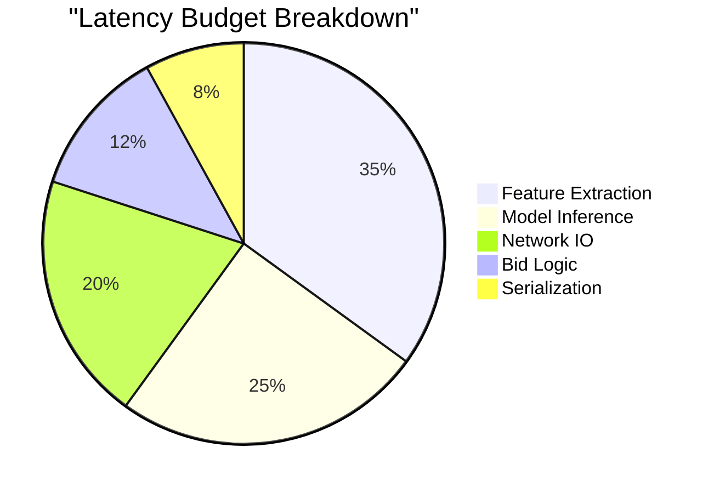
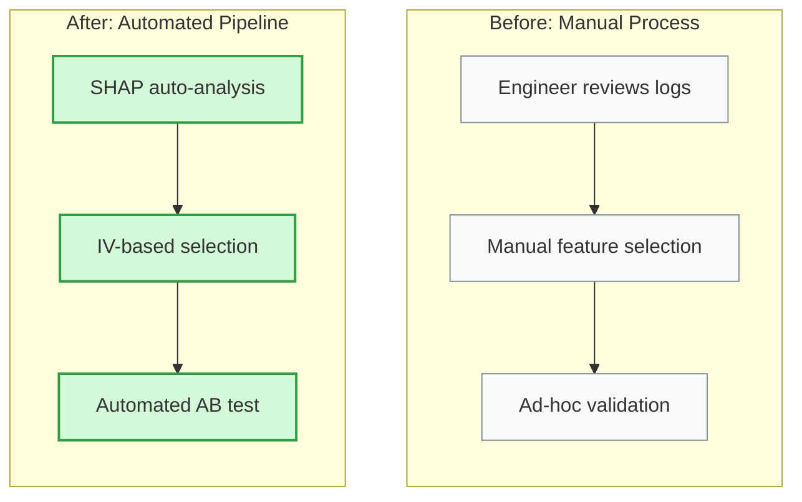

# Mermaid Diagrams for Blog Posts

Quick reference for creating Mermaid diagrams in blog posts. This covers the diagram types most useful for technical blog writing, with syntax patterns that are safe for Obsidian and GitHub rendering.

For the complete Mermaid syntax reference, see the vault's mermaid-visualizer skill at `../..\mermaid-visualizer/references/syntax-rules.md`.

## Critical Safety Rules

These rules prevent the most common rendering failures. Violating any of them will break the diagram.

### 1. No List Syntax in Node Text

```
BAD:  [1. Step One]        --> Parse error
GOOD: [1.Step One]         --> Remove space after period
GOOD: [(1) Step One]       --> Parentheses
GOOD: [Step 1: Step One]   --> Prefix
```

### 2. Subgraph Naming

```
BAD:  subgraph Core Process        --> Space without quotes
GOOD: subgraph core["Core Process"] --> ID + display name
```

### 3. Node References by ID Only

```
BAD:  Title --> Core Process         --> References display name
GOOD: Title --> core                 --> References ID
```

### 4. Special Characters

```
Use 『』 instead of quotes
Use 「」 instead of parentheses
No emoji in node text
```

### 5. No Emoji

Diagrams must never contain emoji. Use text labels and color coding to convey meaning.

## Diagram Types for Blog Posts

### Architecture / Data Flow: `graph TB` or `graph LR`

The workhorse of technical blog diagrams. Use for system architectures, data pipelines, and process flows.



**When to use:** Explaining system architecture, showing data flow, comparing before/after designs.

**Tips:**
- Use `LR` for pipelines (data flows left to right)
- Use `TB` for hierarchies or processes with branching
- Group related nodes in subgraphs
- Color-code by function (green=input, purple=processing, red=decision, cyan=output)

### Trend Data: `xychart-beta`

For showing metrics over time or comparing performance numbers.



**When to use:** Performance benchmarks, trend analysis, before/after comparisons.

**Tips:**
- Keep x-axis labels short (abbreviate if needed)
- Always include units in y-axis label
- Title should describe what the chart shows
- Use `bar` for categorical comparisons, `line` for trends

### Multi-line Chart



### Interaction Flow: `sequenceDiagram`

For request-response patterns, API interactions, multi-step protocols.



**When to use:** API call chains, agent interaction patterns, protocol descriptions.

**Tips:**
- Keep participant names short (4-8 chars)
- Use `->>` for synchronous calls, `-->>` for responses
- Use `loop`, `alt`, `opt` blocks for control flow
- Limit to 4-5 participants max

### 2D Analysis: `quadrantChart`

For mapping items across two dimensions (risk vs reward, effort vs impact, etc.).



**When to use:** Comparing multiple items on two dimensions, strategic analysis.

**Tips:**
- Label axes clearly (what each direction means)
- Name quadrants descriptively
- Coordinates are 0-1 range
- Limit to 8-10 items for readability

### Distribution: `pie`

For showing proportions. Use sparingly -- only when the breakdown is genuinely interesting.



**When to use:** Budget breakdowns, time distribution, category proportions.

**Tips:**
- Maximum 6-7 slices (combine small ones into "Other")
- Order from largest to smallest
- Include actual numbers or percentages in labels if helpful

### Comparison: Parallel Subgraphs

For before/after or A-vs-B comparisons -- a very common blog pattern.



**When to use:** Before/after system changes, comparing two approaches, traditional vs modern.

**Tips:**
- Gray for "old/before", green for "new/after"
- Keep both sides structurally parallel for easy comparison
- Use matching node names where the function is equivalent

## Color Palette

Standard semantic colors for consistent visual language across posts:

| Role | Fill | Stroke | Usage |
|------|------|--------|-------|
| Input/Start | #d3f9d8 | #2f9e44 | Data sources, entry points |
| Decision | #ffe3e3 | #c92a2a | Decision points, problems |
| Processing | #e5dbff | #5f3dc4 | Core logic, computation |
| Action | #ffe8cc | #d9480f | External calls, mutations |
| Output | #c5f6fa | #0c8599 | Results, responses |
| Storage | #fff4e6 | #e67700 | Databases, caches, state |
| Learning | #f3d9fa | #862e9c | ML models, optimization |
| Metadata | #e7f5ff | #1971c2 | Titles, labels, info |
| Neutral/Old | #f8f9fa | #868e96 | Legacy, background |

Apply styles consistently:
```
style NodeID fill:#d3f9d8,stroke:#2f9e44,stroke-width:2px
```

## Diagram Placement Strategy

Diagrams should appear at points where visual representation genuinely helps comprehension:

1. **After introducing a system** -- show the architecture right after describing it in text
2. **Before a comparison** -- visual side-by-side before diving into details
3. **With trend data** -- chart immediately after mentioning the numbers
4. **At the transition** -- between theory and practice, show how concepts map to implementation

**Avoid:**
- Diagrams that just restate what the text already says clearly
- Decorative diagrams that don't carry information
- More than 4 diagrams per post (diminishing returns on visual impact)

## Pre-Render Checklist

Before including any Mermaid diagram in a post:

- [ ] No `number. space` patterns in any node text
- [ ] All subgraphs use `subgraph id["Display Name"]` format
- [ ] All node references use IDs only
- [ ] No emoji anywhere in the diagram
- [ ] Colors applied with proper hex format (#xxxxxx)
- [ ] Direction explicitly set (TB, LR, etc.)
- [ ] Arrow syntax is valid (-->, -.->)
- [ ] Text fits within nodes (under 40 characters)
- [ ] Diagram adds information that text alone doesn't convey well
