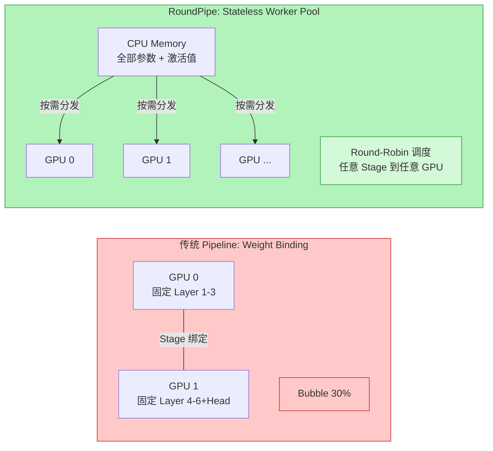
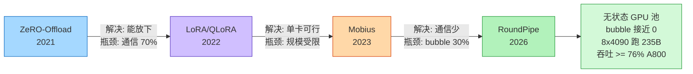

一张 RTX 4090 的算力和 A100 相当，价格却只有后者的 20%。但在 LLM 微调场景里，几乎没人用它。原因很简单：24GB 显存放不下 8B 模型的训练状态（需要 128GB），PCIe 带宽不到 NVLink 的 20%，一做多卡并行通信就成瓶颈。

RoundPipe 刚发布的论文给出了一个令人注目的数字：在一台 8 张 RTX 4090 的机器上，用 LoRA 微调 Qwen3-235B 模型，序列长度 31K。一台消费级服务器，跑一个 235B 的 MoE 模型。他们还报告了 1.48x 到 2.16x 的吞吐量提升（相比当前 SOTA 基线），以及一个更关键的结论：4090 的训练吞吐量达到了现有 A800 方案的 76% 以上。

这篇文章拆解 RoundPipe 的核心设计思想、它解决的技术问题为什么传统方法解决不了、以及消费级 GPU 训练这条路到底走到了哪里。

## 为什么消费级 GPU 训练这么难

先明确问题边界。消费级 GPU 训练面临两个硬件级瓶颈，不是靠算法优化就能绕过的：

**瓶颈一：显存容量**。RTX 4090 有 24GB VRAM，RTX 5090 有 32GB。但一个 8B 模型在标准混合精度训练下，模型状态（参数 + 梯度 + 优化器状态）需要 128GB。32B 模型需要 512GB。这还没算激活值——LLaMA-3.1-8B 在 16K 序列长度下单次前向传播的激活值就占 68GB。显存差了一到两个数量级。

**瓶颈二：互联带宽**。消费级 GPU 之间通过 PCIe 连接，带宽不到 NVLink 的 20%。做数据并行（如 ZeRO）需要在每层计算前后做 all-gather 和 reduce-scatter，前人的测量显示 DeepSpeed 在消费级 GPU 上有 70% 的训练时间花在通信上。

这两个瓶颈叠加的结果是：要么根本放不下模型，要么放下了但通信开销吃掉了大部分算力。

## 已有方案的局限性

在 RoundPipe 之前，消费级 GPU 训练的技术栈大致经历了三个阶段：

**阶段一：数据并行 + CPU Offloading（ZeRO-Infinity）**

核心思路：把模型状态分散到多张 GPU 上，放不下的部分卸载到 CPU 内存甚至 NVMe。每层计算前用 all-gather 重新收集参数，计算后用 reduce-scatter 分发梯度。

问题：在 PCIe 互联下，这些集合通信操作的延迟太高。实测数据表明，70% 的训练时间花在 GPU 之间的参数交换上。GPU 大部分时间在等数据，而不是在算数据。

**阶段二：Pipeline 并行 + Offloading（Mobius）**

核心思路：不做全量参数交换，而是把模型按层切分成流水线段（stage），每张 GPU 负责一段。参数从 CPU 按需加载到 GPU，GPU 之间只传递激活值（远小于全量参数）。

这解决了通信量的问题——激活值比全量参数小得多，P2P 通信开销可接受。但引入了一个新问题：**pipeline bubble**。

Pipeline bubble 来自两个来源：

1. **结构性气泡**：前向传播和反向传播之间的数据依赖导致某些 GPU 必须等待
2. **不平衡气泡**：不同 stage 的计算量不同（典型例子：LM head 远大于普通 transformer layer），最慢的 stage 拖慢整条流水线

实测数据：Llama-3.1-8B 的 pipeline bubble 高达 30%。意味着 8 张 GPU 中有接近三分之一的算力在空转。

**阶段三：LoRA / QLoRA**

核心思路：不微调全部参数，只训练一个低秩矩阵。把显存需求从 128GB 降到几个 GB。

这是目前使用最广泛的方案，但有两个限制：

1. 单卡能做的序列长度有限——激活值仍然很大
2. 模型规模上限受限——QLoRA 能在单张 4090 上跑 70B，但 100B+ 就力不从心了
3. 多卡 LoRA 的扩展效率低下（仍需要跨卡同步）

RoundPipe 提出的方案本质上是在 Pipeline 并行这条路上的突破——它解决了 Mobius 未解决的 bubble 问题。

## RoundPipe 的核心洞察

RoundPipe 的核心洞察用一句话概括：**既然参数已经卸载到了 CPU，那 GPU 就不需要"绑定"特定的 stage。**

传统 pipeline 并行的"weight binding"假设：每张 GPU 拥有固定的几层参数，这些层的前向和反向计算都在这张 GPU 上完成。这个假设在数据中心是自然的——参数存在 GPU 显存里，当然在哪里存就在哪里算。

但在 CPU offloading 的场景下，参数的"家"是 CPU 内存。无论分配给哪张 GPU 执行，都需要一次 CPU→GPU 的传输。既然传输无论如何都要发生，那目标 GPU 可以是任何一张空闲的卡。

这个洞察打破了一个根深蒂固的约束：**stage 和 GPU 之间不再是静态绑定关系。GPU 变成了无状态的执行工人池（stateless worker pool），stage 被动态调度到空闲的 GPU 上。**

## RoundPipe 的技术设计

基于上述洞察，RoundPipe 包含三个关键设计：

### Round-Robin 调度

RoundPipe 将 micro-batch 处理分成多轮（round）。每轮内，所有前向 stage 和反向 stage 排成一个线性序列，按轮转方式依次分配给不同 GPU。

关键区别：传统 looped schedule 的 stage 数必须是 GPU 数的整数倍（这导致了分配不均）。RoundPipe 没有这个约束——它可以有任意数量的 stage，因为 stage 不绑定到特定 GPU。

轮转调度还有一个优雅的性质：不同轮次之间可以无缝衔接，不需要 pipeline flush。这意味着迭代边界处的 warmup 和 cooldown bubble 也被消除了。

### 非对称 Stage 切分

Transformer layer 的前向计算比反向计算快大约 3 倍（因为反向需要做 activation recomputation）。传统 pipeline 对前向和反向使用相同的层切分方案，导致快的前向 stage 必须等待慢的反向 stage。

RoundPipe 为前向和反向维护独立的切分方案。比如前向每 3 层一个 stage，反向每 1 层一个 stage——这样每个 stage 的执行时间大致相等，消除了前向-反向转换处的 bubble。

具体来说：一个 fused stage 将前向和反向合并，让前向计算直接作为反向所需的 recomputation，省掉一次重复计算。

### 优先级感知的传输调度

```mermaid
gantt
    title GPU 计算与 PCIe 传输时间线
    dateFormat X
    axisFormat %s

    section GPU 计算
    Stage F1           :active, f1, 0, 3
    Stage B2           :active, b2, 3, 6
    Stage F4           :active, f4, 6, 9
    Stage B5           :active, b5, 9, 12

    section PCIe 传输
    激活值上传 (优先)   :crit, a1, 0, 1
    参数预取 (填空闲)   :done, p1, 1, 3
    激活值下载 (优先)   :crit, a2, 3, 4
    参数预取 (填空闲)   :done, p2, 4, 6
    激活值上传 (优先)   :crit, a3, 6, 7
    梯度回传 (填空闲)   :done, g1, 7, 9
```

GPU 和 CPU 之间持续有大量数据搬运：参数上传、梯度下载、激活值上传下载。如果不做优先级管理，大块的参数传输会阻塞关键路径上的激活值传输。

RoundPipe 维护 4 条专用通信流（每个方向 2 条：参数/梯度流 + 激活流），并且：
- 激活值传输优先——因为下一个 stage 等着它才能开始计算
- 参数传输填入激活值传输之间的空闲窗口
- 大张量（如 LM head 的参数）被切成小块，通过 LPT 调度算法均匀分配到各个空闲窗口

## 性能数据

论文在 8 张 RTX 4090 的服务器上评估了 1.7B 到 235B 的模型：

| 模型 | vs SOTA 基线 | vs A800 方案 | 备注 |
|:-----|:------------|:------------|:-----|
| 1.7B | 1.48x 吞吐量提升 | ~100% | 小模型差异小 |
| 8B | ~1.6x | ~85% | 激活值开始成为瓶颈 |
| 32B | ~2.0x | ~80% | bubble 消除效果显著 |
| 235B (MoE) | **唯一能跑的方案** | 76%+ | 31K 序列长度, LoRA |

几个关键对比：

- **vs Mobius**（之前的 SOTA pipeline 并行方案）：1.48-2.16x 吞吐量提升。核心原因是 bubble 从 30% 降到接近 0。
- **vs ZeRO-Infinity**：在消费级 GPU 上快得多，因为避免了 all-gather 的通信瓶颈。
- **序列长度**：支持 7.3x 更长的序列（通过更高效的激活值管理）。
- **4090 vs A800**：4090 方案达到 A800 方案 76% 以上的吞吐量。考虑到价格差 5 倍，性价比优势巨大。

还有一个重要的理论分析：RoundPipe 做了 roofline analysis 证明 PCIe 传输时间可以被计算完全遮盖——只需要 batch size >= 8（dense 模型）或 >= 80（MoE 模型）。这意味着 computation dispatch paradigm 不是一个吞吐量-内存的 tradeoff，而是一个吞吐量无损的调度空间扩展。

## 技术限制和适用边界

RoundPipe 不是万能的。几个需要注意的边界：

**硬件要求**。需要足够的 CPU 内存来存放完整的模型状态和激活值。235B MoE 模型需要的 CPU 内存是巨大的。这不是一台普通台式机能搞定的——需要专门配置的多路服务器。

**batch size 下限**。Roofline analysis 表明，batch size 必须足够大才能让计算完全遮盖传输。对于 dense 模型最低 8，MoE 模型最低 80。如果你的微调场景只需要很小的 batch size（如 reinforcement learning 的某些阶段），效率会下降。

**staleness-1 语义**。RoundPipe 使用异步 optimizer（梯度滞后一步）。论文引用了前人的工作表明这不影响收敛，但对于收敛要求极高的场景（如 RL alignment 的最后几步），需要额外验证。

**全量训练 vs LoRA**。论文的 235B 实验使用的是 LoRA。全量微调 235B 在 8 张 4090 上的可行性不清楚——optimizer 状态本身可能就超出了可接受的 CPU 内存范围。

## 消费级 GPU 训练的技术演进脉络

把 RoundPipe 放在更大的技术演进中来看：

| 时期 | 代表方案 | 核心突破 | 局限 |
|:-----|:---------|:---------|:-----|
| 2021 | ZeRO-Offload/Infinity | 参数卸载到 CPU/NVMe | 通信占 70% 时间 |
| 2022 | LoRA/QLoRA | 只训练低秩矩阵 | 单卡上限、扩展效率 |
| 2023 | Mobius | Pipeline + Offloading | 30% pipeline bubble |
| 2024 | GaLore | 低秩梯度投影 | 仍受限于单卡 |
| 2026 | **RoundPipe** | 无状态 GPU + 非对称切分 | 需要大 batch + 充足内存 |

每一代方案解决了上一代的核心瓶颈，但也引入了新的约束。ZeRO 解决了"放不下"但通信太慢；LoRA 解决了显存但限制了微调能力和规模；Mobius 解决了通信但 bubble 太大；RoundPipe 解决了 bubble 但需要足够的 batch 和 CPU 内存。

趋势是清晰的：消费级 GPU 训练的可行边界在持续向上推移。两年前单卡 LoRA 跑 7B 就是极限，现在 8 张 4090 可以跑 235B。如果这个趋势持续，12-18 个月后我们可能看到消费级硬件上做全量微调 70B 成为常态。

## 对实践者的意义

**如果你在考虑自建训练基础设施**。RoundPipe 让一台 8 张 4090 的服务器成为了可行的训练节点。硬件成本大约 2-3 万美元（vs 8 张 A100 的 15-20 万美元），吞吐量达到后者的 76%+。对于持续微调的场景，ROI 计算开始有利于自建。

**如果你在做 LoRA 微调**。RoundPipe 的价值在于解锁了更大的模型和更长的序列。之前 4090 上 LoRA 70B 就吃力，现在 235B 成为可能。序列长度从几千提升到 31K，对需要处理长文档的场景（如 RAG 系统的 fine-tuning）很有价值。

**如果你在做成本优化**。不是所有微调任务都需要 A100 集群。常规的 SFT 和 DPO 任务如果对延迟不敏感（不需要实时训练），消费级方案的总成本可以低 70-80%。

---

RoundPipe 的核心贡献不只是一个具体的系统实现，而是证明了一个更深层的观点：消费级 GPU 训练的瓶颈不是算力，而是调度。当 GPU 被视为无状态的计算资源池而非固定的"模型住所"，pipeline 并行的效率上限被重新打开了。

RTX 4090 发布三年了。这三年里，它在推理场景被广泛使用，但在训练场景一直被视为"不够格"。RoundPipe 正在改变这个叙事——不是通过新硬件，而是通过重新思考"GPU 应该怎么用"这个基本问题。

---

**参考链接**

- [RoundPipe 论文](https://arxiv.org/abs/2604.27085)
- [RoundPipe GitHub](https://github.com/ITcarrot/RoundPipe)
- [RoundPipe 文档](https://itcarrot.github.io/RoundPipe/)
- [Mobius: Near-Zero Bubble Pipeline Parallelism](https://arxiv.org/abs/2211.05322)
- [ZeRO-Infinity](https://arxiv.org/abs/2104.07857)
