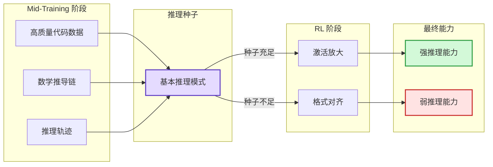
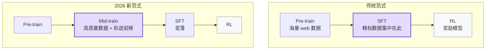

import Callout from '../../components/blog/Callout.astro'
import TechGraph from '../../components/blog/TechGraph.astro'
import Diagram from '../../components/blog/Diagram.astro'

Kimi K3 的技术报告上周开源了。2.8 万亿参数、896 专家激活 16 个、100 万 token 上下文，数字确实炸裂。但翻完整篇 report，让我真正在意的不是它写了什么，而是它没写什么。

Report 第 3.3 节 Training Recipe 里有一个叫 "Cooldown Phase" 的阶段，描述不到两页：合成长序列拼接任务、上采样长文档数据、学习率退火。然后就直接跳到 Post-Training 讲 SFT 和 RL 了。

但翻到技术社区的讨论，会发现一个有趣的共识：K3 真正的能力跃迁大概率发生在这个被一笔带过的 "cooldown" 阶段，而非 report 浓墨重彩描述的 RL 和 MOPD 蒸馏。这个阶段在学术上有一个正式名字：Mid-Training。

## K3 Report 的策略性沉默

K3 report 对 cooldown 阶段的描述极度克制。它告诉你做了上下文扩展（256K 到 1M），告诉你合成了长序列训练数据，告诉你退火了学习率。但每个阶段用了多少 token、cooldown 阶段代码/数学/推理/agent 轨迹数据各占什么比例、合成数据在整个 mid-train 中占多大比重，一概没有。

这不是疏忽。把 K3 和 Meta 的 Llama 3 report 放在一起看，差异很明显：Llama 3 对 annealing 阶段给了相对详细的数据描述，上采样了多少比例的代码数据、用了哪些高质量子集，开源社区可以较好地复现。K3 选择不给这些信息，社区想复现 cooldown 阶段的效果就只能猜。

Mid-training 的数据配方是当前大模型竞争中最核心的商业机密，比模型架构值钱得多。架构可以公开，KDA、MLA、NoPE 这些别人看了也不容易照搬；数据配方一旦公开，复现门槛就低得多。K3 report 花了大量篇幅描述 RL 和 MOPD 蒸馏的精巧设计，对 cooldown 阶段却惜字如金。哪部分才是真正的竞争力，答案藏在沉默里。

## Mid-Training 的三步操作

<TechGraph src="/images/posts/LLM-Mid-Training-被Tech-Report遮掩的关键训练阶段/pipeline.png" title="训练流水线全景图" caption="Pre-training → Mid-training (Cooldown) → Post-training 三阶段，K3 report 对中间阶段着墨最少" />

IBM Research 今年 4 月发了一篇大规模实验论文，跑了 500 多组对照实验来验证 mid-training 为什么有效。Shopee 团队 2025 年 10 月的首篇 Mid-Training Survey（arXiv:2510.06826）给出了正式定义。综合这些工作，mid-training 做的事情可以拆成三块：数据退火、上下文扩展、领域强化。

数据退火是预训练末期的一次分布切换，从海量 web 噪声切换到高质量子集：教科书、学术论文、竞赛代码、数学推导、高质量合成 CoT，学习率同步衰减到预训练峰值的 1/10 到 1/100。打个比方，预训练是把整个图书馆过一遍，mid-training 是考试前刷精选题。

上下文扩展是渐进式拉长模型能处理的序列长度。K3 的路径是 8K 到 64K（预训练阶段）再到 256K 到 1M（cooldown 阶段），需要专门清洗和合成的长文档数据，以及位置编码适配。K3 用 NoPE 完全抛弃了显式位置编码，和 Llama 系列的 RoPE 外推路线完全不同。

领域强化针对预训练中偏弱的方向做定向补强：代码（高质量代码库 + 编程竞赛题）、数学（证明过程 + 推导链）、推理（逻辑推理 + 多步问题求解）、agent 轨迹（工具调用序列 + 多步任务执行记录）。尤其是 agent 轨迹这一项，K3 report 只字未提，但业界讨论普遍认为这是 cooldown 阶段数据构成中占比相当可观的一部分。

## Mid-Training 决定了 RL 能走多远

2025 年有一篇值得注意的论文叫 OctoThinker（arXiv:2506.20512），来自上海交大和 GAIR Lab。它研究了一个具体问题：为什么 Qwen 系列模型做 RL 后推理能力提升很明显，而 Llama 做类似的 RL 训练效果却大打折扣？

结论是差距不在 RL 本身，而在预训练和 mid-training 阶段是否埋入了足够的推理种子。Qwen 的预训练数据中包含了更多代码和数学推理数据，这些在 mid-training 阶段被进一步强化，模型进入 RL 之前就已经具备基本的推理模式。RL 做的事情更接近"激活和放大"，而不是"从零学习"。

<Diagram title="Mid-Training 与 RL 的因果关系" caption="OctoThinker 的核心发现：RL 的天花板由 mid-training 阶段的数据质量决定">

</Diagram>

CMU 今年初的一项控制变量实验进一步验证了这一点：固定总计算预算时，分一部分算力给 mid-training 做高质量数据退火、剩余给 RL，效果显著优于把全部预算投在 RL 上。特别是对于分布边缘的困难样本，mid-training 的贡献比 RL 更大。

这解释了一个业界困惑：开源社区拿到 Llama 或 Qwen 的 base 模型后自己做 RL，效果总是和官方版本差一截。答案可能不是 RL 方法不对，而是你拿到的 base model 已经是 mid-training 之后的产物，真正的能力差距在那个阶段就已经拉开了。

## 后训练信号正在系统性前移

2026 年 2 月，上海交大和腾讯优图联合发了 ReMiT（arXiv:2602.03075），正式把"RL 信号反馈到 mid-training"做成了一个闭环框架。同期还有 RL-Guided Annealing 的工作，在 token 级别用 RL reference 模型的信号来重新加权退火数据。

<Diagram title="训练范式迁移" caption="高质量信号从 Post-Training 系统性前移到 Mid-Training">

</Diagram>

这些工作指向同一个趋势：传统上属于 post-training 的高质量信号（人类偏好、推理轨迹、工具调用数据）正在系统性地前移到 mid-training 阶段。逻辑很直接：SFT 阶段数据量级是十亿 token 级别，模型只能学到表面对齐（格式、风格、指令跟随），底层能力提升有限；mid-training 的数据量级是百亿到千亿 token，模型有足够的梯度步来真正学会推理模式而不只是模仿格式；RL 的 scaling 效率在模型基础能力不足时很低，做了 mid-training 之后 RL 的边际收益才能释放出来。

回到 K3，report 里的 Post-Training 章节描述了一个精巧的 RL 系统：3 个任务领域乘 3 个推理深度得到 9 个专家，再用 MOPD 蒸馏回一个统一模型。系统确实漂亮，但如果 OctoThinker 和 CMU 的发现是对的，K3 之所以能在 RL 阶段大幅提升，前提是 cooldown 阶段已经把推理种子种好了。MOPD 是收割，cooldown 才是播种。

## 透明度梯度

各家对 mid-training 的公开程度形成了一个清晰的梯度。AI2 的 OLMo 2 是目前最透明的：完全开源，包括 cooldown 阶段的数据配比、学习率调度、上下文扩展策略，社区可以完整复现。Llama 3 给了中等细节：上采样了高质量代码和 STEM 数据、用了特定的学习率退火曲线，够理解方向但不够复现精确配比。Qwen 2.5 和 GLM-4 部分公开，提到了长上下文扩展和领域增强，具体数据构成含糊。K3 几乎完全遮掩，只说"cooldown phase 做了长上下文扩展"，其余核心操作一概不提。

这个透明度梯度本身就是信息。越商业化、越追求性能优势的模型，mid-training 细节藏得越深。OLMo 的价值在于学术基线，不在商业竞争，所以可以全部公开。K3 要在 benchmark 上打赢 GPT-4o 和 Claude，mid-training 配方是它最不愿意交出的底牌。

## 读 Report 的方法论

如果你在做模型训练，IBM 的 500 组实验给了一个明确信号：mid-training 的投入产出比远高于在 RL 上加码。把退火阶段做扎实对最终模型质量的贡献，在中小规模模型上甚至超过了 post-training。不要跳过这个阶段直接做 SFT + RL。

如果你在做开源模型微调，需要理解你拿到的 base model 已经包含了 mid-training 的效果。直接在 base model 上做 RL 时，效果天花板可能不是 RL 方法的问题，而是 mid-training 阶段的数据选择决定了 RL 能走多远。选择 base model 时，mid-training 的质量比参数量更值得关注。

如果你在读 tech report，把注意力放在报告没写的部分。Cooldown、annealing、continual pre-training，不管叫什么名字，如果 report 对这个阶段语焉不详，通常意味着它是模型真正的竞争力所在。对 RL 和 RLHF 的详细描述反而可能是障眼法，那部分本来就不是最核心的差异化来源。

---

**References:**

- Kimi K3 Technical Report (Moonshot AI, 2026.7)
- Mo et al. "Mid-Training of Large Language Models: A Survey" (arXiv:2510.06826, 2025.10)
- Wang et al. "OctoThinker: Mid-training Incentivizes Reinforcement Learning Scaling" (arXiv:2506.20512, 2025.6)
- Huang et al. "ReMiT: RL-Guided Mid-Training for Iterative LLM Evolution" (arXiv:2602.03075, 2026.2)
- Huang et al. "Improve LLM Pre-training with RL-Guided Annealing" (OpenReview, 2026.2)
- IBM Research. "How an extra training step can unlock AI's reasoning power" (2026.4)
- Liu et al. "Midtraining Bridges Pretraining and Posttraining Distributions" (OpenReview, 2026.4)
