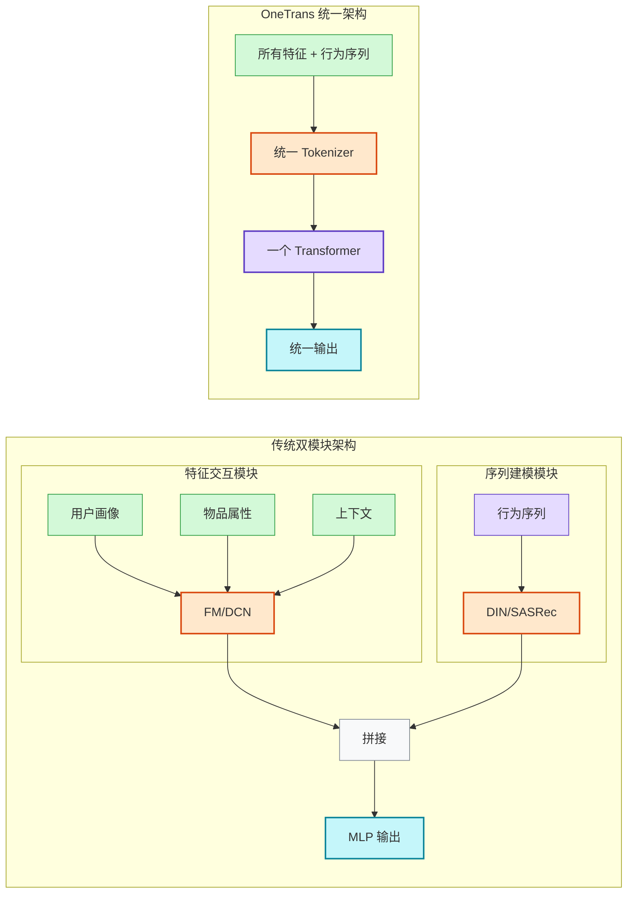
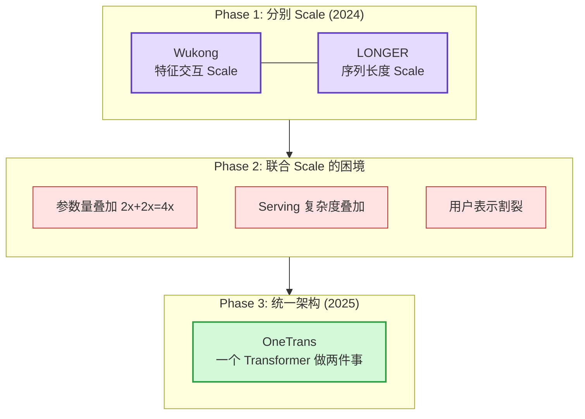
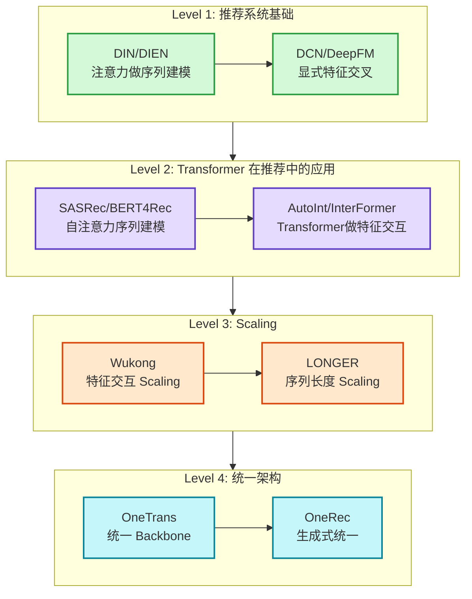

推荐系统的 ranking 模型做两件事：特征交互（用户画像、物品属性、上下文之间的交叉）和序列建模（从用户行为历史里捕捉兴趣演化）。过去十年，这两件事一直由两套独立的模块完成——DNN/FM 系列做特征交互，DIN/SASRec 系列做序列建模。两套模块各自迭代，各自 scale，各自维护。

字节跳动在 2024-2025 年分别把这两条路线推到了极致：Wukong（KDD 2024）用 FM 架构把特征交互 scale 到了前所未有的参数量，LONGER（WWW 2025）把用户行为序列建模拉长到 10000+ 步。两条路线都拿到了显著的线上收益。但当团队试图同时 scale 两个模块时，发现了一个结构性瓶颈：**两个独立模块的参数量和计算量是相加的，serving 的延迟和成本是叠加的，而它们对同一份用户表示的理解却各自为政。**

[OneTrans](https://arxiv.org/abs/2510.26104)（WWW 2026）是字节跳动的回答：用一个 Transformer backbone 同时完成特征交互和序列建模，用统一的 tokenization 和混合参数化来处理结构化特征和行为序列之间的本质差异。线上 A/B 测试结果是 per-user GMV 提升 **5.68%**。这个数字在推荐系统的存量优化里非常可观——通常一个 ranking 模型的迭代能拿到 0.3-0.5% 就值得全量上线。

本文从四个问题出发：OneTrans 是什么，为什么要走统一架构这条路，最终拿到了什么 ROI，以及如果想学习这个方向应该从哪里开始。

## 什么是 OneTrans

### 推荐 ranking 模型的两个核心任务

先明确这两件事各自在做什么。

**特征交互**（Feature Interaction）：用户侧有年龄、性别、城市、设备等画像特征，物品侧有品类、价格、品牌等属性特征，还有时间、位置、网络环境等上下文特征。这些特征之间的交叉蕴含了推荐信号——比如"25 岁女性 + 美妆品类 + 晚间时段"是一个有意义的交叉模式。FM、DeepFM、DCN 系列模型的核心工作就是高效地学习这些交叉。

**序列建模**（Sequence Modeling）：用户在过去一段时间里点击、购买、浏览了哪些商品，构成了一条行为序列。从这条序列里捕捉用户兴趣的演化——比如用户最近从浏览手机转向了浏览耳机，说明兴趣发生了迁移。DIN、DIEN、SASRec、BERT4Rec 系列模型专门做这件事。

传统做法是把两个模块拼接在一起：序列建模模块输出一个用户兴趣向量，和特征交互模块的输出拼接后送入最终的 MLP 预测点击率。

### OneTrans 的四个核心设计

OneTrans 的目标是让一个 Transformer 同时做好这两件事。但直接把所有特征和行为序列拼成一条序列扔进 Transformer 是不行的——结构化特征和行为序列在统计性质上有根本差异。OneTrans 用四个设计来解决这些差异。

**设计一：Unified Tokenizer。** 推荐系统的输入是异构的：有些是类别型（性别、城市），有些是数值型（价格、年龄），有些是序列（行为历史）。OneTrans 设计了一个统一的 tokenizer，把所有这些异构输入转换成统一的 token 序列。具体做法是给每个属性字段（field）分配一个 token 位置，通过 field-specific embedding 把不同类型的原始值映射到同一个向量空间。行为序列中的每个历史 item 也被映射为一个 token。最终，一个推荐请求变成了一条由"属性 token + 序列 token"组成的统一序列。

**设计二：Mixed Parameterization。** 这是 OneTrans 最关键的创新。序列 token（行为历史中的 item）天然有很强的共性——它们都代表"用户交互过的 item"，应该共享参数来学习序列内的依赖关系。但非序列 token（用户画像、物品属性、上下文）彼此之间的统计分布差异很大——"年龄"和"品类"需要完全不同的变换来捕捉各自的信号。

OneTrans 的方案是：在 Transformer 的每一层，序列 token 共享同一套 QKV 投影和 FFN 参数；非序列 token 则每个 token 位置有独立的参数。这样序列 token 之间可以高效地做自注意力（和 SASRec 一样），同时非序列 token 保持了足够的区分能力（和 DCN 一样）。

这个设计和上一篇博客里讨论过的 GPR 的 Token-Aware FFN/LN 是同一个思想：**异构 token 不能用均一参数混合处理。** 两篇独立的工业论文收敛到了同一个结论。

**设计三：Pyramid Stack。** 行为序列很长（可达 10000+ 步），但 Transformer 的 self-attention 复杂度和序列长度平方成正比。OneTrans 的做法是在 Transformer 的层间逐步裁剪序列 token 的数量——底层用完整序列捕捉细粒度模式，高层只保留最重要的序列 token 做全局聚合。类似图像领域的 Pyramid Vision Transformer，用层级结构在精度和效率之间取得平衡。

**设计四：Cross-Request KV Caching。** 这是 OneTrans 在 serving 上的关键优化。在传统架构中，同一个用户的每个候选广告都要重新计算用户侧的表示——如果有 C 个候选，用户侧就被计算 C 次。OneTrans 利用 Transformer 的 KV cache 机制，把用户侧（画像 + 行为序列）的 Key 和 Value 预计算好，对该用户的所有候选共享这份缓存。用户侧计算从 O(C) 降到 O(1)。这和 LLM 推理中 prefill + decode 分离的思路完全一致。

## 为什么要走统一架构这条路

### 字节跳动的演进路径：从分别 scale 到发现天花板

理解 OneTrans 的动机，需要先看字节跳动在 2023-2025 年走过的 scaling 路径。

**Phase 1：分别 scale 特征交互和序列建模。**

2024 年，[Wukong](https://arxiv.org/abs/2403.02545)（KDD 2024）用 stacked factorization machine 的方式把特征交互模块做大。核心发现是推荐系统的特征交互也有 scaling law——模型参数量增加时，预测准确率持续提升，没有饱和。

同期，[LONGER](https://arxiv.org/abs/2412.17135)（WWW 2025）把序列建模的行为历史从几百步拉长到 10000+ 步。更长的序列覆盖了更多的用户兴趣变化，带来了显著的增量。

两条路线各自拿到了不错的线上收益。

**Phase 2：发现分开 scale 的天花板。**

当团队试图同时用更大的 Wukong 和更长的 LONGER 时，遇到了三个问题：

第一，**参数量和计算量是叠加的**。特征交互模块有自己的参数，序列建模模块有自己的参数，两者的参数量和 FLOPs 直接相加。如果各自 scale 2x，总计算量是 4x。

第二，**serving 复杂度是叠加的**。两个模块有各自的缓存策略、各自的推理优化、各自的资源配置。运维成本随模块数线性增长。

第三，也是最根本的——**两个模块对用户表示的理解是割裂的**。特征交互模块学到的"这个用户对美妆品类有偏好"和序列建模模块学到的"这个用户最近在看耳机"，在最终拼接之前没有任何交互。拼接层的 MLP 需要从两个独立表示中重新发现它们之间的关联，这是一个不必要的信息瓶颈。

### 统一的三个结构性优势

OneTrans 的统一架构直接解决了上述三个问题。

**优势一：表示共享意味着特征交互和序列建模互相增强。** 在 OneTrans 的 Transformer 里，序列 token 和非序列 token 在每一层都通过注意力机制交互。这意味着序列建模可以利用物品属性来理解行为（"用户点了一个 200 元的耳机"比"用户点了 item_37291"包含更多信息），同时特征交互可以利用行为上下文来理解属性（"用户在手机品类上有兴趣"这个信号可以和用户最近的浏览序列相互验证）。消融实验证实了这一点：去掉序列 token 或去掉非序列 token，模型效果都会显著下降，且下降幅度大于各自独立模型的差距——说明两者的联合建模产生了 1+1>2 的效果。

**优势二：一个模型 scale 比两个模型 scale 成本低。** 只有一套参数、一次前向传播、一份 KV cache、一套推理优化。scale 2x 就是 2x 的计算量增长，不是 4x。训练也只需要一份数据 pipeline、一个训练任务、一套超参数搜索。

**优势三：Cross-Request KV Caching 自然成立。** 在统一架构里，用户侧的所有信息（画像特征 + 行为序列）都在同一个 Transformer 的前半部分处理。这份计算结果天然可以用 KV cache 在所有候选之间共享。在分离架构中，这种共享需要两个模块各自实现各自的缓存机制，工程复杂度更高。

### 行业共识：统一架构是方向

OneTrans 不是孤例。字节内部同期还有 HyFormer（混合统一架构）在做类似的统一尝试。快手的 [OneRec](https://arxiv.org/html/2506.13695v4) 从另一个方向走到了同一个终点——它用生成式推荐的范式，同样实现了端到端的统一模型。

更广泛地看，推荐系统的演化路径和 NLP 高度一致：先是专用模型各做各的（word2vec 做 embedding、LSTM 做序列、CNN 做特征提取），最终被一个统一的 Transformer 架构全部替代。推荐系统正在走同样的路。

## 最终的 ROI 结果

### OneTrans 的线上数字

OneTrans 在字节跳动的电商推荐场景全量部署，线上 A/B 测试结果：

| 指标 | 提升幅度 |
|:-----|:---------|
| Per-user GMV | **+5.68%** |
| Scaling 验证 | 参数量增加时近 log-linear 的效果提升 |
| 推理效率 | Cross-request KV caching 显著降低用户侧重复计算 |

论文同时验证了 OneTrans 在离线指标上一致优于 Wukong、LONGER、RankMixer 等 baseline——不是在某些指标上好某些差，而是全面优于。

### 字节跳动 scaling 路线的其他产出

OneTrans 不是字节 scaling 实验的唯一产出。同一条技术路线上还有几个值得注意的数字：

**TokenMixer-Large / RankMixer**：把 token-mixing 架构（类似 MLP-Mixer）scale 到 7B-15B 参数级别，线上订单 +1.66%，GMV +2.98%。这个实验验证了推荐模型在大参数量下的持续收益，但也暴露了 serving 成本的挑战——15B 参数的推荐模型在延迟预算内 serve 需要大量的工程优化。

**[UG-Sep](https://arxiv.org/abs/2502.14267)**（CIKM 2025）：专门解决统一模型的 serving 效率。核心思路是把用户侧（User）和物品侧（Good/Item）的计算分离预处理，减少在线实时计算的负担。这是 OneTrans Cross-Request KV Caching 思想的更激进版本。

### 快手 OneRec 的对照

快手的 OneRec 从不同的技术路径（生成式推荐）到达了相似的目标——端到端统一模型：

| 指标 | 数值 |
|:-----|:-----|
| App Stay Time | +0.54%（主端）/ +1.24%（极速版） |
| QPS 占比 | 处理 25% 的总 QPS |
| OPEX | 仅为传统 pipeline 的 **10.6%** |

OneRec 最值得关注的不是效果数字，而是 OPEX 数字。传统 pipeline 的运维成本有超过 50% 花在多模块之间的通信和存储上，统一模型直接消除了这部分开销。

### 这些数字意味着什么

推荐系统是存量优化的战场。在字节和快手这种日活数亿的系统上，ranking 模型的一次迭代能拿到 0.3-0.5% 的指标提升就已经值得全量上线。OneTrans 的 5.68% GMV 提升和 OneRec 的 OPEX 降低到 10.6%，不是常规迭代能达到的幅度——它们来自架构层面的范式切换，而非模型层面的微调。

这也解释了为什么字节和快手都在投入大量工程资源推进统一架构。这不是一次性的收益，而是打开了新的 scaling 空间：统一模型可以持续通过增加参数量来获得近 log-linear 的收益提升，而传统分离架构的 scaling 效率要低得多。

## 如果想学习这个方向，应该如何入门

### 推荐的学习路径

这个方向涉及推荐系统、Transformer 架构、大规模系统工程三个知识域。以下是一条从基础到前沿的路径。

**Level 1：推荐系统基础。** 理解推荐系统 ranking 模型的基本框架。重点读两篇：DIN（阿里，2018）解释了为什么用注意力机制做序列建模，DeepFM/DCN（华为/Google）解释了为什么需要显式的特征交叉。这两篇是后续所有工作的基础。如果时间有限，只看 DIN 和 DCN v2 就够了。

**Level 2：Transformer 在推荐中的应用。** SASRec（2018）把 self-attention 引入推荐序列建模，BERT4Rec（2019）尝试了双向注意力。这两篇解决的是序列建模的范式升级。同时看 AutoInt（2019），理解 Transformer 如何做特征交互——这是 OneTrans 统一两者的思想源头。

**Level 3：Scaling。** Wukong（字节，KDD 2024）和 LONGER（字节，WWW 2025）是必读的。Wukong 证明了推荐系统有 scaling law，LONGER 证明了更长的序列能持续带来收益。理解这两篇，就理解了为什么 OneTrans 的统一 scale 比分别 scale 更高效。

**Level 4：统一架构。** 到这一层才读 OneTrans（WWW 2026）和 OneRec（快手，2025）。有了前三层的积累，OneTrans 的设计动机和技术选择会非常清晰——它解决的每一个问题，都能在前面的论文里找到对应的局限性。

### 工程视角的补充阅读

如果你的角色偏工程而非算法，有几篇额外值得看的：

- **UG-Sep**（字节，CIKM 2025）：专门讲统一模型的高效 serving，包括用户侧/物品侧分离预计算、KV cache 策略等。对理解大模型在推荐系统里怎么 serve 非常有帮助。
- **GR4AD 的 LazyAR**（快手，2026）：讲了 Transformer 推理中 layer 间依赖不对称性的优化，QPS 翻倍，收入损失仅 -0.15%。思路简洁，实现成本低。
- **vLLM / SGLang 相关文档**：统一推荐模型的 KV caching 策略和 LLM 的 KV cache 管理高度相似。理解 PagedAttention、prefix caching 这些概念，对推荐模型的 serving 优化有直接帮助。

### 最后

推荐系统正在经历一次和 NLP 类似的范式迁移：从专用模块拼接走向统一 Transformer 架构。OneTrans 的 5.68% GMV 提升和 OneRec 的 10.6% OPEX 证明了这条路线的商业价值。但更重要的是，统一架构打开了 scaling 的空间——推荐系统第一次有机会像 LLM 那样，通过持续增加模型规模来获得可预测的效果提升。

对于从业者来说，这个方向的窗口期正在收窄。字节和快手已经跑通了从论文到全量部署的全流程。下一步的竞争不在"要不要做统一架构"，而在"谁能把模型 scale 得更大、serve 得更快"。

---

**References:**

- [OneTrans: One Transformer for Unified Feature Interaction and Sequence Modeling in Ranking](https://arxiv.org/abs/2510.26104) - 字节跳动 (WWW 2026)
- [Wukong: Towards a Scaling Law for Large-Scale Recommendation](https://arxiv.org/abs/2403.02545) - 字节跳动 (KDD 2024)
- [LONGER: Scaling Up Long-Sequence Modeling in Industrial Recommendation](https://arxiv.org/abs/2412.17135) - 字节跳动 (WWW 2025)
- [UG-Sep: User-Side and Good-Side Separate Pre-Computing for Efficient Inference](https://arxiv.org/abs/2502.14267) - 字节跳动 (CIKM 2025)
- [OneRec: End-to-End Generative Recommendation](https://arxiv.org/html/2506.13695v4) - 快手 (2025)
