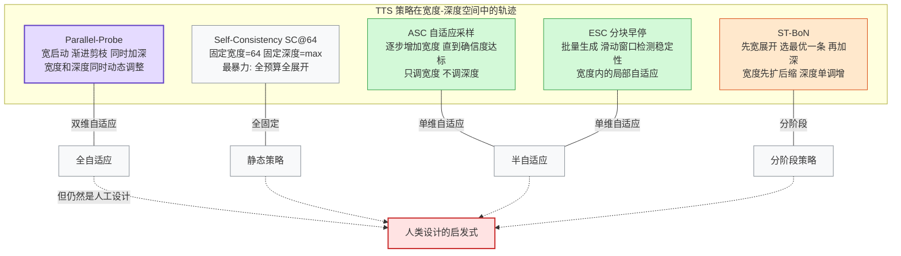
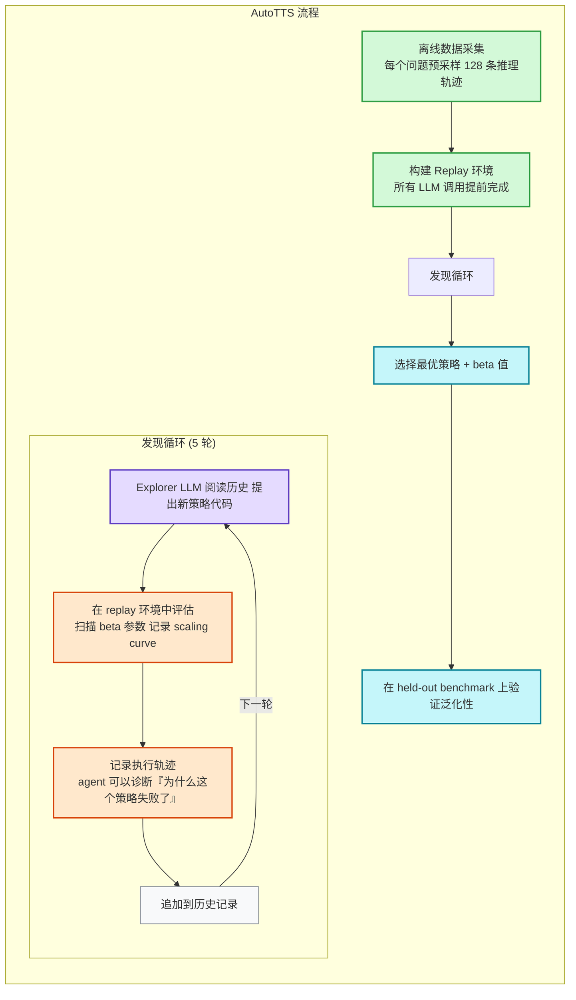

import Callout from '../../components/blog/Callout.astro'

Test-Time Scaling（TTS）的核心思想很简单：推理时多花计算，换取更好的结果。Self-Consistency 采样 64 条推理路径然后投票，Best-of-N 生成多个答案然后用验证器选最好的，Adaptive Stopping 在确信度足够时提前停止——这些方法在数学推理基准上带来了实质性的提升。

但所有这些策略有一个共同特征：**它们全部是人类手工设计的。** 研究者凭直觉决定什么时候分支、什么时候剪枝、什么时候停止、什么时候投票。每一种策略都是在庞大的"计算资源分配"空间中手工选取的一个点。

Google 的 [AutoTTS](https://arxiv.org/abs/2605.08083) 论文（HuggingFace #1 Paper of the Day）提出了一个自然但之前无人尝试的问题：**能不能让 LLM 自己搜索出更好的 TTS 策略？**

答案是可以。一个 LLM agent（Claude Code）在离线环境中搜索了 5 轮，花了 $39.9 和 160 分钟，发现了比所有手工设计 baseline 更优的策略——而且这些策略泛化到了未见过的 benchmark 和模型规模。

这篇文章拆解 AutoTTS 的技术方案，分析它解决的核心问题（如何让搜索变得可行），以及它对 TTS 之外更广泛的"LLM 作为元优化器"范式的意义。

## 所有 TTS 策略都是同一个控制空间的手工特例

理解 AutoTTS 之前，需要先看到一个被忽视的结构性事实。

现有的 TTS 策略看起来形态各异——有的做并行采样，有的做序列延伸，有的做树搜索，有的做自适应停止——但论文指出，大部分策略可以在一个统一的"宽度-深度"控制空间中表示。宽度是并行推理分支的数量，深度是每条分支的推理步数。在这个空间里，每种策略就是一条特定的轨迹：

这个统一视角的价值在于：它把"设计 TTS 策略"的问题从"发明一个新启发式"变成了"在控制空间中搜索一条好轨迹"。而搜索是可以自动化的——前提是你能让搜索的成本变得可控。

## AutoTTS：从设计策略到设计环境

AutoTTS 的核心范式转移是：**人类不再直接设计 TTS 策略，而是设计一个搜索环境，让 LLM agent 在环境中自动发现策略。**

具体来说，人类的工作变成了定义四个元素：状态空间（当前有多少条分支、每条多深、已经获得了什么 probe 信号）、动作空间（分支、继续、探测、剪枝、停止）、反馈信号（准确率-计算成本的 tradeoff）、和搜索目标（最大化准确率同时控制计算预算）。

LLM agent 的工作是在这个环境中迭代提出候选策略（以代码形式），评估效果，分析失败原因，提出改进方案。

这个分工的精妙之处在于：环境定义是相对稳定的（宽度-深度空间不太会变），但策略空间是开放的——agent 可以发现任何人类可能想不到的分支/剪枝/停止的组合模式。

## 三个关键创新让搜索变得可行

直接让 LLM 搜索 TTS 策略面临三个障碍：评估成本太高、搜索空间太大、反馈信号太粗。AutoTTS 用三个设计分别解决它们。

### 离线 Replay 环境：评估不需要重新调用 LLM

这是 AutoTTS 最关键的工程洞察。

评估一个候选 TTS 策略通常意味着：对每个问题，运行策略（分支、探测、剪枝、停止），每一步都需要调用基座 LLM 生成推理内容或探测中间答案。如果搜索 100 个候选策略，每个策略在 100 个问题上评估，每个问题平均 50 次 LLM 调用——总共 50 万次 LLM 推理，成本完全不可接受。

AutoTTS 的做法是：**把所有 LLM 调用提前做完。** 对每个问题预采样 128 条完整的推理轨迹，每条轨迹切分成固定长度的区间，每个区间末尾记录中间答案（probe signal）。这些数据存储在一个"replay 矩阵"里。

之后，评估任何候选策略时，策略的每个动作（分支 = 从 replay 矩阵取一条新轨迹，继续 = 取下一个区间，探测 = 读取存储的 probe signal）都是对 replay 矩阵的查表操作，不需要任何 LLM 调用。评估变成了确定性的、廉价的、可重复的。

这个设计之所以可行，是因为 TTS 策略的控制决策（什么时候分支、剪枝、停止）只依赖于 probe signal 和分支状态，不依赖于策略对推理内容的修改——策略不改变推理轨迹本身，只选择走哪些轨迹、走多远。

### Beta 参数化：一个标量控制所有超参数

在预实验中，AutoTTS 团队发现 LLM agent 倾向于提出包含大量超参数的策略——多达 10 个。在只有 5 轮搜索的预算下，10 维的超参数空间根本探索不过来，agent 会收敛到过拟合搜索集的极端方案（比如过于激进的剪枝阈值）。

解决方案是 beta 参数化：每个候选策略只允许暴露一个标量超参数 beta，策略内部的所有阈值、概率、预算分配都必须是 beta 的确定性函数。而且这个映射必须是单调的——更大的 beta 对应更大的计算预算。

这把搜索空间从高维参数调优压缩到了一维扫描。评估时只需要在 beta 的值域上做 sweep，就能得到策略的完整 scaling curve（准确率 vs 计算成本的 tradeoff）。

约束是强的，但并没有限制策略本身的表达能力——agent 仍然可以自由设计分支/剪枝/停止的逻辑，只是所有内部阈值必须从 beta 推导出来。这是一个在"策略灵活性"和"搜索可行性"之间的巧妙平衡。

### 执行轨迹反馈：告诉 Agent 为什么失败

如果只给 agent 一个标量反馈（准确率 0.45，token 数 12000），它能知道策略不够好，但不知道为什么不够好。是分支太少？剪枝太早？还是停止太晚？

AutoTTS 在每次评估时记录完整的执行轨迹——策略在每一步做了什么决策、每条分支的状态变化、probe signal 的值、最终的答案聚合过程。这些轨迹作为上下文的一部分提供给 explorer LLM，让它可以诊断具体的失败模式。

例如，如果 agent 看到"在某类问题上，策略在第 3 步就剪掉了最终证明是正确答案的分支"，它就可以在下一轮针对性地调整剪枝逻辑。这比只看标量分数然后盲目尝试新策略要高效得多。

这和最近另一项工作的发现一致：在代码生成和 harness 工程的 agent 循环中，细粒度的执行反馈显著提升了发现效率。

## 结果：$39.9 发现了什么

### 发现成本

整个搜索过程用 AIME24 作为搜索集，Qwen3 系列（0.6B/1.7B/4B/8B）四个模型的 replay 环境，5 轮搜索，Claude Code 作为 explorer agent。总成本 $39.9，耗时 160 分钟。

这个成本之所以这么低，完全归功于离线 replay 环境——搜索过程中没有任何基座 LLM 的推理调用。所有成本来自 explorer LLM（Claude Code）的 API 调用。

### 策略质量

发现的策略在搜索集（AIME24）上优于所有手工 baseline（SC@64、ASC、ESC、Parallel-Probe），在准确率-计算成本的 Pareto 前沿上全面占优。

更重要的是泛化性：

**跨 benchmark 泛化。** 策略在 AIME24 上搜索发现后，直接在 AIME25 和 HMMT25 上测试——两个从未在搜索中使用的数学推理基准——同样优于手工 baseline。这说明发现的策略不是对搜索集的过拟合，而是捕捉到了数学推理任务的某种通用结构。

**跨模型规模泛化。** 搜索在四个 Qwen3 模型（0.6B-8B）的联合环境中进行，发现的策略在每个模型规模上都有效。这说明策略的有效性不依赖于特定的模型能力水平。

论文没有公开发现的策略的具体代码逻辑（附录中有但 HTML 版本未完整渲染），但从描述来看，发现的策略包含了人类不太会手工设计的非直觉模式——比如在特定深度做非均匀的分支扩展，或者基于 probe signal 的方差而非绝对值做剪枝决策。

## 更大的图景：LLM 作为元优化器

AutoTTS 的技术贡献是具体的（一个 TTS 策略发现框架），但它指向的范式是通用的：**用 LLM 自动搜索原本需要人类专家手工设计的算法。**

这个范式有三个要素：

1. **定义搜索空间。** 把待设计的算法参数化为一个结构化的空间。AutoTTS 用的是宽度-深度控制空间，但其他领域可以定义其他空间。
2. **构建廉价评估环境。** 这是核心瓶颈。AutoTTS 的离线 replay 把评估成本从"调用基座 LLM"降到了"查表"。不是所有领域都有这么干净的评估廉价化路径，但原则是通用的：如果你能把评估成本降几个数量级，搜索就变得可行。
3. **用 LLM 做 explorer。** LLM 的优势是它能读代码、理解执行轨迹、生成新的候选方案。这比传统的超参数搜索（网格搜索、贝叶斯优化）灵活得多——它搜索的不是参数空间，而是程序空间。

AutoTTS 不是这个范式的第一个实例。Google DeepMind 的 FunSearch（2023）用 LLM 搜索数学函数，在 cap set 问题上超越了人类已知的最优解。AlphaCode 用 LLM 生成海量候选程序然后筛选。但 AutoTTS 可能是第一个把"LLM 搜索算法"应用到"LLM 自身推理策略"上的工作——LLM 在优化 LLM 的推理方式。

这个自指性（self-referential）的结构很有意思。它暗示了一种可能的正反馈循环：更好的推理策略 -> 更强的 LLM 能力 -> 更好的 explorer -> 发现更好的推理策略。当然，这个循环是否真的能持续收敛、还是会遇到固定点，目前没有理论保证。

### 局限性和开放问题

AutoTTS 的成功建立在两个前提上：

**前提一：TTS 策略的控制决策不改变推理轨迹本身。** 策略只选择"走哪条轨迹、走多远"，不影响轨迹的内容。这让离线 replay 成为可能。但如果 TTS 策略涉及对推理过程的主动干预（比如在中间步骤插入修正提示、或者根据其他分支的结果动态调整当前分支的推理方向），replay 环境就不再适用。

**前提二：宽度-深度空间足够覆盖有效策略。** 论文自己承认，很多 TTS 方法涉及更丰富的结构——树搜索、验证器引导的 refinement、多轮 debate 等——不能简单地用宽度-深度来描述。当前的 AutoTTS 是一个 proof-of-concept，证明了"在结构化空间中自动发现策略"的可行性，但控制空间的设计仍然需要人类专家的判断。

另一个值得注意的局限是：发现的策略目前只在数学推理任务上验证，这类任务有天然的可验证性（答案是确定的）。对于开放性任务（写作、翻译、创意生成），TTS 策略的评估本身就更困难，自动发现的可行性也更低。

### 对从业者的启示

**如果你在做 TTS 优化：** AutoTTS 的离线 replay 思路值得借鉴，即使你不用它的完整框架。预采集推理轨迹后，你可以快速评估大量手工策略变体，而不需要每次都重新运行推理。这本身就是一个成本降低几个数量级的工程优化。

**如果你在做 agent 框架：** AutoTTS 是 agent 做算法发现的一个成功案例。它的三个设计原则——廉价评估环境、一维参数化控制搜索复杂度、细粒度执行反馈帮助 agent 诊断失败——可以迁移到其他"让 LLM 搜索算法"的场景中。

**如果你关心 LLM 的长期趋势：** AutoTTS 指向的方向是"LLM 改进 LLM"的元优化循环。目前它还在 proof-of-concept 阶段——只在一个领域（TTS）验证了可行性，而且搜索空间的定义仍然依赖人类。但如果这个范式能扩展到更多领域（训练策略发现、架构搜索、奖励函数设计），LLM 发展的瓶颈可能从"需要更多人类专家来设计改进方案"变成"需要更好的搜索环境设计"。

---

**References:**

- [LLMs Improving LLMs: Agentic Discovery for Test-Time Scaling](https://arxiv.org/abs/2605.08083) - Google/UMD/Meta (2026.5)
- [Listwise Policy Optimization: Group-based RLVR as Target-Projection on the LLM Response Simplex](https://arxiv.org/abs/2605.06139) - Tencent Hunyuan (2026.5)
- [FunSearch: Making New Discoveries in Mathematical Sciences Using LLMs](https://www.nature.com/articles/s41586-023-06924-6) - Google DeepMind (2023)
- [Parallel-Probe: Efficient Test-Time Scaling via Cross-Branch Information](https://arxiv.org/abs/2602.07028) - UMD (2026)
