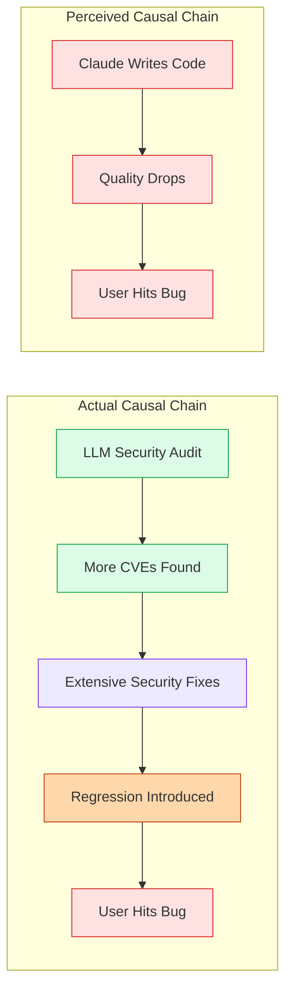
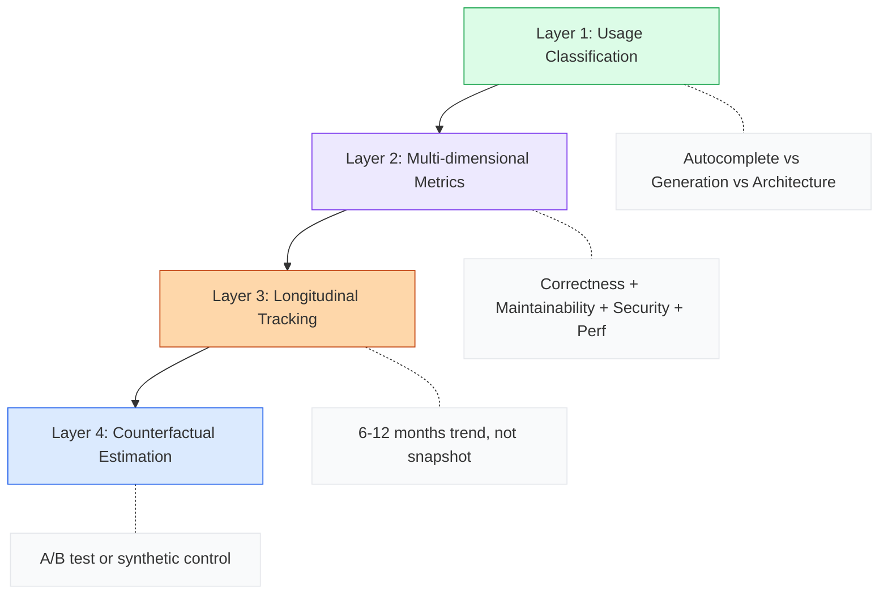

import Callout from '../../components/blog/Callout.astro'
import Diagram from '../../components/blog/Diagram.astro'
import TechGraph from '../../components/blog/TechGraph.astro'

2026 年 5 月底，rsync 社区炸了。一条 Mastodon 帖子指出 rsync v3.4.3 存在回归 bug，同时注意到这个版本包含 Claude 生成的 commit。几天之内，一个 GitHub issue 标题为 "Please Do Not Vibe Fuck Up This Software" 累积了 350+ 条评论，从技术讨论升级到死亡威胁。有人画了 MLP 角色掐死"推了 AI 代码的维护者"的同人图。

但一周后，一份基于 rsync 全部 36 个版本的统计分析报告给出了结论：exact permutation test p=46%。翻译成人话——随机抽两个历史版本，有近一半的概率比 Claude 辅助的版本更差。

这个事件本身很有戏剧性，但更让我感兴趣的是它暴露的一个深层问题：**我们评判 AI 代码质量时，连基本的方法论都没有。** 所有人都在凭直觉下结论，而直觉在统计学面前一文不值。

## 事实：两个版本，两个方向

先还原数据。rsync 有两个包含 Claude commit 的版本：

| 版本 | Bug 数 | 严重性加权/10c | Claude commits | 历史百分位 |
|:------|:-------|:--------------|:---------------|:-----------|
| v3.4.2 | 0 | 0.00 | 9 | 0th |
| v3.4.3 | 17 | 3.29 | 28 | 77th |

v3.4.2 零 bug。v3.4.3 在第 77 百分位——高于中位数，但有 8 个历史版本比它更差。两个 Claude 版本分别在 IQR（四分位距）的两侧，一个低于下界，一个高于上界。它们不是异常值，而是正好横跨了分布的中间地带。

对比之下，rsync 历史上 bug 率最高的版本是 v3.4.1：59 个 bug / 9 个 commit，严重性加权得分 39.39/10c。这个版本完全没有 AI 参与。但没有人发 GitHub issue 骂维护者，因为没有 AI 可以当靶子。

<TechGraph src="/images/posts/ai-code-quality-rsync/distribution.svg" title="BUG RATE DISTRIBUTION" caption="rsync 全部 36 个版本的 bug 率分布。Claude 辅助的两个版本（蓝色）横跨 IQR 两侧，统计检验均不显著。" />

## 方法论：你不能用感觉去衡量代码质量

rsync 分析报告做了几件事值得仔细看：

**指标设计**：severity-weighted bugs per 10 commits (sev/10c)。每个 bug 由 Qwen 3 35B 按 0-100 分打分，有明确的 rubric：数据丢失 90-100，crash/hang 70-89，功能回归 50-69，小问题 30-49，cosmetic 10-29，feature request 为 0。这比简单计数 bug 数量合理得多——一个 typo 和一个数据损坏不应该等权。

**统计检验**：

- Exact permutation test：列举所有 C(35,2)=595 种两版本组合，看有多少组的均值 &gt;= Claude 组的 1.65。结果是 272 组，即 46%。
- Fisher's exact test：Claude 版本落在中位数以上的概率 vs 历史版本——p=74%，odds ratio 1.06（基本是 1:1）。

**控制变量**：

- 代码量：Claude 版本平均改了 3756 行（vs 历史 696 行），p=5%——确实改得多。但绝对 bug 数并没有相应增加（p=77%）。更多代码，没有更多 bug。
- Regime check：有人说 v2.x 时代更不稳定，不应该放一起比较。实际上 v3.x 的均值反而更高（4.23 vs 1.11 sev/10c），Claude 版本在 v3.x 子集内依然不突出。

这套方法论并不完美——作者自己承认它不控制 commit 复杂度和安全敏感度。但它比"我升级之后遇到了 bug，而且这个版本有 AI commit，所以是 AI 的错"严谨一万倍。

## 认知偏差：为什么直觉如此不可靠

rsync 事件是一个教科书级的认知偏差案例。至少三种偏差在同时起作用：

**确认偏差（Confirmation Bias）**：社区已经有一个先验信念——"AI 写的代码质量差"。当 v3.4.3 出现 bug 时，这个信念被"确认"了。但人们忽略了 v3.4.2 零 bug 的事实，也忽略了 v3.4.1（无 AI）是历史最差的事实。人只看到支持自己观点的证据。

**可得性启发（Availability Heuristic）**：一个 Mastodon 帖子被转发几千次，形成了"rsync 被 AI 搞烂了"的叙事。这个叙事的传播速度远超任何统计分析能达到的速度。等分析报告出来时，公众意见已经固化了。

**归因偏差（Attribution Error）**：当有一个明确的"责任方"（AI）时，人们倾向于将所有问题归因于它。HN 上有人指出：那个所谓的"bug"实际上是一个 2007 年就存在的编码错误，在修复 CVE 时才暴露出来。真正的因果链是：LLM 发现安全漏洞 → 需要修复 → 修复引入回归。但这个链条太长了，不如"AI 写了烂代码"好传播。

<Diagram title="CAUSAL CHAINS" caption="社区感知的简化归因 vs 实际发生的多步因果链">

</Diagram>

## 更大的问题：我们没有衡量 AI 代码质量的科学方法

rsync 事件暴露的不只是一次社区过激反应。它揭示了一个行业级的方法论缺失。

回顾过去两年 AI 代码质量相关的"研究"：

**2025 年 7 月，METR 研究**：16 位资深开源开发者用 AI 工具完成任务，结果平均慢了 19%。这是迄今为止最严格的对照实验之一。但它测量的是"速度"，不是"质量"。而且样本量只有 16 人——在统计学上几乎什么都说明不了。

**HN 上的各种体验帖**：548 条评论的"Oh shit moments with GenAI"帖子，充满了个人体验。有人说 AI 救了创业项目，有人说 AI 代码导致了生产事故。N=1 的案例什么都证明不了，但传播效果比任何论文都好。

**rsync 这次的分析**：方法论上最接近"正确"的一次尝试。但作者自己承认：两个数据点不够建模，不够外推，只够说"目前没有证据支持 AI 让事情变差"。

## 为什么现有方法都不够好

让我逐一拆解几种常见的"衡量方法"和它们的致命缺陷：

### Bug 计数法（rsync 报告使用的方法）

优点：直观，数据可获取，能做统计检验。

致命缺陷：
- **反事实不可测**：如果 Tridge 没用 Claude，v3.4.3 会有多少 bug？也许更少，也许更多（因为他可能压根不会做那些安全修复）。你永远无法测量不存在的版本。
- **归因链条模糊**：一个 Claude commit 修了安全漏洞但引入了回归——这该算 AI 的"bug"还是"fix"？
- **样本量问题**：rsync 只有 2 个 Claude 版本。即使有 20 个，对于置换检验来说仍然 underpowered。

### 对照实验法（METR 研究使用的方法）

优点：有控制组，能排除混淆变量。

致命缺陷：
- **生态效度问题**：实验室任务和真实项目差异巨大。METR 的任务是"完成一个定义好的 issue"，但现实中 AI 最有价值的地方可能是"帮你想到你没想到的 issue"。
- **时间尺度问题**：实验通常持续几小时。但 AI 代码质量问题可能需要数月才能显现（技术债务、可维护性下降）。
- **Hawthorne 效应**：人在被观察时行为会改变。开发者知道自己在参与实验时，可能会更/少依赖 AI。

### 代码指标法（圈复杂度、重复率等）

优点：自动化，可大规模应用。

致命缺陷：
- **代理指标不等于质量**：低圈复杂度的代码可能逻辑错误，高圈复杂度的代码可能完全正确。
- **AI 特别擅长优化这些指标**：让 AI"重构代码降低复杂度"几乎必然成功，但重构本身可能引入 bug。你在优化的是指标，不是质量。

<Callout type="warning" title="没有银弹">
没有一种方法是完美的。而行业目前的做法是：要么用一种不完美的方法得出一个结论就停止思考，要么干脆不衡量、凭感觉。
</Callout>

## 一个更诚实的框架：承认不确定性

如果我们对 AI 代码质量的讨论是诚实的，应该承认几个事实：

**我们不知道 AI 代码的长期质量影响。** rsync 的数据不够长，METR 的实验不够深。现在下任何确定性结论都是草率的——包括"AI 代码没问题"和"AI 代码有问题"。

**质量是一个多维度概念。** 代码可能在"正确性"维度上没问题，但在"可维护性"维度上是灾难。或者反过来——AI 生成的代码风格统一、注释完整，但逻辑有微妙的 edge case 缺陷。用单一指标去捕捉这些维度是注定失败的。

**使用方式决定一切。** Tridge 说他在"cautiously"使用 AI。某个 solo dev 在 vibe coding。把这两种场景的结果混在一起讨论毫无意义。一把锤子可以盖房子也可以砸窗户，讨论"锤子好不好"这个问题本身就是错的。

<Diagram title="EVALUATION FRAMEWORK" caption="AI 代码质量评估应该分四层递进，而非单一指标">

</Diagram>

**第一层：区分使用场景。** "AI 辅助代码补全"和"AI 从零生成整个功能"是完全不同的风险级别。评估时必须分开讨论。

**第二层：多维度指标。** 不只是 bug 计数。至少需要覆盖正确性（bug 率、回归率）、可维护性（后续修改的难度）、安全性（漏洞引入率）、性能（资源使用变化）。

**第三层：纵向跟踪。** 代码质量不是一个快照概念。你需要跟踪 6-12 个月才能看到技术债务的积累效应。rsync 的两个版本远远不够。

**第四层：反事实估计。** 最难的一步——尝试回答"如果没用 AI，情况会怎样"。A/B 测试是金标准，但对开源项目几乎不可行。Synthetic control（用类似项目作为对照组）可能是次优选择。

## 回到 rsync：Tridge 说了什么

在所有噪音中，rsync 维护者 Andrew Tridgell 自己的回应反而是最清醒的：

> 对于那些说"我是 xyz 大学的博士，我告诉你 LLM 只是随机工具"的人，我想说你们过时了。软件工程世界在过去几个月里发生了翻天覆地的变化。去年你学到的关于这些东西的知识，已经跟来自另一个星球一样了。
>
> 底线是我大概知道 LLM 是怎么工作的，但这并不意味着它们没用。这意味着你需要谨慎，而我正在谨慎使用。

这段话里有两个关键信息。第一，触发大量代码修改的不是"vibe coding 上瘾"，而是 AI 辅助安全审计发现了大量以前没人注意的漏洞。第二，维护者对 AI 工具的态度是 cautious but practical——和社区想象中的"把代码全交给 AI 然后不审查"完全不同。

这引出了一个尴尬的事实：大部分批评者攻击的是一个想象中的稻草人（"他在 vibe coding！"），而不是实际发生的事情（经验丰富的维护者谨慎使用 AI 工具辅助安全修复）。

## 我的判断

**rsync 事件不能证明 AI 代码有问题，也不能证明没问题。** 两个数据点什么都证明不了。那个 p=46% 只是说"目前的数据不支持 AI 让事情变差"，这和"AI 代码和人类代码一样好"是完全不同的断言。

**行业需要的不是更多观点，而是更多数据。** 我们有太多"我觉得 AI 代码质量如何如何"的文章，太少"我用严格方法测量了 AI 代码质量"的研究。rsync 报告的价值不在于它的结论，而在于它示范了一种可以被复制的方法。

**最有用的下一步是大规模 A/B 测试。** Google、Meta 这样的公司有条件做：随机分配 AI 工具给一部分团队，跟踪 6 个月的 bug 率、回归率、代码审查通过率。但出于商业原因，这些数据可能永远不会发布。

**在数据到来之前，最合理的态度是：用 AI，测量结果，保持怀疑。** 不是怀疑 AI 有没有用（对于日常编码，答案显然是有用的），而是怀疑任何关于其"质量"的笼统断言——包括乐观的和悲观的。

Tridge 被骂了两周，收到了死亡威胁，被画成被勒死的小马。而他的"罪行"是什么？用 AI 工具帮忙修安全漏洞，结果两个版本的 bug 率完全在历史正常范围内。

这不是一个关于代码质量的故事。这是一个关于科学素养缺失的故事。

---

**References:**

- [Did Claude Increase Bugs in rsync? Data Analysis](https://alexispurslane.github.io/rsync-analysis/)
- [GitHub Issue #667: Please Do Not Vibe Fuck Up This Software](https://github.com/RsyncProject/rsync/issues/667)
- [METR Study: AI and Experienced Open-Source Developers](https://metr.org/blog/2025-07-10-early-2025-ai-experienced-os-dev-study/)
- [Ask HN: What was your "oh shit" moment with GenAI?](https://news.ycombinator.com/item?id=48406174)
