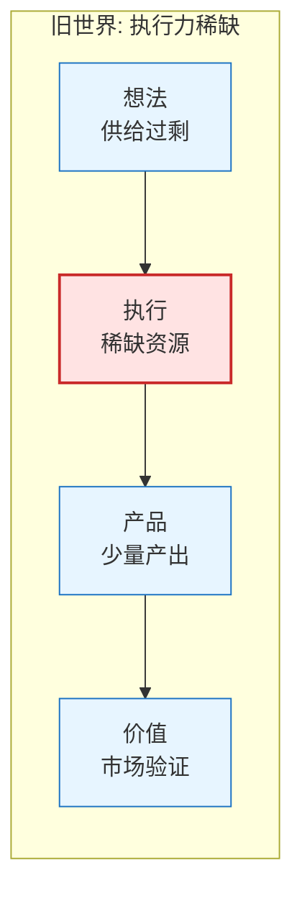
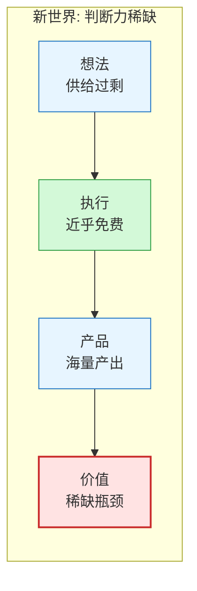
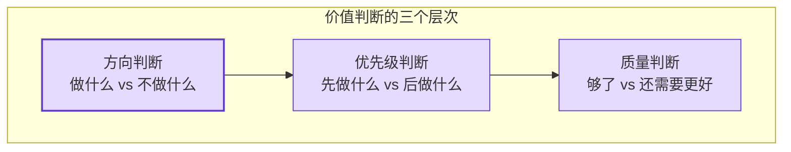
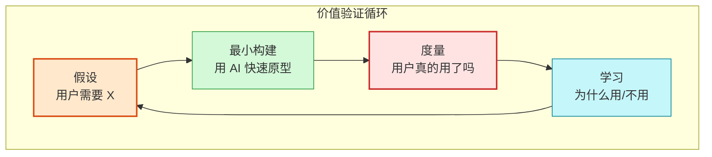

import Callout from '../../components/blog/Callout.astro'
import TechGraph from '../../components/blog/TechGraph.astro'

# 构建变得容易了，但创造价值依然很难

谷歌 2026 年开发者大会透露，其内部超过 75% 的新代码由 AI 生成，工程师的角色正在从"写代码的人"变成"审代码的人"。Anthropic 的 Claude Code 让一个人可以在周末搭出过去需要三人团队干两周的 MVP。Cursor、Windsurf、Copilot 把代码生成的边际成本压到趋近于零。

然后呢？

一个不太舒服的事实：构建速度提升了 10 倍的团队，产出有商业价值的产品的概率并没有同比提升。能写出 App 的人变多了一个数量级，但能做出有人愿意付费的 App 的人，比例反而在下降。

**Building is easier, generating value is still hard.** 构建门槛的下降没有降低价值创造的门槛，它只是把稀缺性从一个维度转移到了另一个维度。

<TechGraph src="/images/posts/building-is-easier-generating-value-is-still-hard/value-scarcity-shift.svg" title="稀缺性转移" caption="产品数量暴增，但创造真实价值的比例反而更低" />

## 旧世界：执行能力本身就是护城河

回到 2022 年之前。那时候"会写代码"本身就是一种稀缺资源。

一个非技术创始人有了产品想法，面前横着一道真实的壁垒：找到开发者，付得起工资，还得管理进度。大量"好想法"因为这道壁垒止步于 PPT。VC 投技术团队，本质上投的是执行能力。你有一个想法我有一个想法，但你有三个全栈工程师而我没有，所以钱给你。

在这个世界里，稀缺性的分布很清晰：

瓶颈卡在执行层。大多数想法死于"做不出来"，而不是"没人要"。

这造成了一个副作用：市场上缺乏足够的验证样本。产品太少，很难判断"市场到底需不需要这个东西"，大家默认"只要做出来就会有人用"。供给稀缺的环境里，这个假设经常成立。

## 拐点：当构建成本趋零

2025-2026 年发生的事情，不是代码质量的渐进提升，是构建成本的阶跃式坍缩。

几个关键数据点：

- 谷歌：75% 新代码由 AI 生成，基础编码岗位裁员 3000 人
- Sonar 数据：AI 生成代码可完成 65% 基础编码任务，人力成本降低 70%
- 个体案例：一个产品总监用 5 个月带 AI 团队重构了整个技术栈，自己不写一行代码

格隆汇有篇文章把这个转变描述得精确：**从"空谈廉价"到"代码廉价"。** 过去是想法不值钱，因为人人都有想法。现在代码也不值钱了，因为 AI 人人都能用。

那什么还值钱？

新世界的稀缺性分布发生了根本性的翻转：

瓶颈从执行层转移到了价值层。产品不再死于"做不出来"，而是死于"没人要"，或者"有人要但你不知道谁要"。

## 三个真正稀缺的维度

世界经济论坛在 2026 年 5 月发了一篇关于"判断型工作"（Judgement Work）兴起的报告。核心观点：AI 本质上是一种预测技术，能根据数据推算结果，但无法判断什么结果重要，更无法根据目标和价值观来解读结果。

波士顿咨询预计，未来两三年内美国 50-55% 的就业岗位将被 AI 重新塑造。不是消灭，是解绑：每个职业被拆成"可自动化"和"依赖人类判断"两部分，后者的溢价正在急剧上升。

我把"判断力"拆解为三个具体维度：

<TechGraph src="/images/posts/building-is-easier-generating-value-is-still-hard/three-dimensions.svg" title="三个稀缺维度" caption="价值发现、价值判断、价值验证：构建门槛下降后真正稀缺的能力" />

### 维度一：价值发现——看见别人没看见的需求

价值发现不是"想到一个好点子"。AI 时代点子的执行成本极低，点子本身也不稀缺。稀缺的是**从真实场景中识别出未被满足的需求**。

央广网报道的"手搓经济"案例中，成功者普遍有两种模式：

1. **深厚领域积累型**，在某个领域沉浸多年，清楚地知道哪些问题存在但无人解决。AI 让他们把过去需要团队才能做的事变成一个人就能做。
2. **独特洞察型**，对真实生活中的痛点有敏锐感知，在别人觉得"理所当然"的地方看到了缺口。

两种模式的共同点：**价值发现来自现实世界的深度浸泡，不来自坐在电脑前头脑风暴。**

腾讯云一篇文章揭示了一个有趣的数据：AI 让开发效率提升了数倍到十几倍，但需求环节原地踏步。开发越快，需求瓶颈越明显。这不是流程问题，是认知问题。知道"该做什么"比"怎么做"难得多。

### 维度二：价值判断——在无限可能中选择正确方向

当构建成本趋零，你面前不再是"能做什么"的受限集合，而是"什么都能做"的无限可能。最重要的能力变成了**做出正确的取舍**。

选项越多，做出好选择越难。心理学上叫选择悖论（Paradox of Choice），工程领域有更具体的表现：

- Vibe Coding 两个月后，很多开发者发现自己成了项目里"最不懂代码的人"。AI 太快了，人的思考速度跟不上代码生成速度，需求的模糊被执行速度直接放大
- 多个团队复盘发现：AI 生成代码的速度惊人，但后期维护成本呈指数级攀升。不是代码质量差，是方向选错了，速度让错误放大得更快
- "看起来能用但实际上没用"的产品大量涌现。能做出来不等于该做

世界经济论坛报告中有个概念叫"判断力溢价"（Judgement Premium）：当预测变得便宜且精准时，决定预测结果是否重要、如何解读预测结果的能力，溢价就会上升。

映射到工程师日常：

- AI 能秒出十个技术方案，但选哪个需要理解业务约束、团队能力、维护成本的长期影响
- AI 能生成完整的系统架构图，但判断这个架构在两年后是否还扛得住需要经验和洞察
- AI 能写出满足需求的代码，但判断这个需求本身是否正确需要对用户和市场的理解

### 维度三：价值验证——证明你做的东西真的有人要

最容易被忽视的维度。

构建成本下降后，市场上涌现了海量产品。央广网的报道显示，"手搓经济"让社会创新活力大增，但大量项目做出来之后发现"没人用"。这不是失败，这是新常态。执行不再是瓶颈，验证就成了新瓶颈。

价值验证包含几个层面：

1. **用户验证**，真的有人需要这个东西吗？不是"朋友说很好"，是有人愿意拿真金白银换。
2. **市场验证**，需求的规模是否足以支撑一个产品/生意？
3. **持续性验证**，用户第一次用了之后还会再来吗？还是一次性新鲜感？

Stripe 的 Minions 系统每周让 AI 出上千个 PR，但前提是人只做 review。为什么能这样运转？因为 Stripe 已经完成了价值验证，他们知道用户要什么，AI 只是在执行已确定的价值。

但从零开始的项目，价值本身是未知的。你需要的不是更快地写代码，而是更快地验证假设。

AI 加速的是循环中"最小构建"这一步（绿色），但整个循环的速度取决于最慢的一步。如果你不知道如何设计验证实验，不知道度量什么指标，不知道如何从数据中学习，那 AI 只是让你更快地做出没人要的东西。

## 对工程师的具体启示

抽象层面说完了，落到个体。

### 第一：从"会写代码"到"会定义问题"

2022 年之前，面试考 LeetCode 是合理的，它筛选执行能力。2026 年之后，区分工程师水平的不是代码能力，是问题定义能力：

- 你能把一个模糊的业务目标拆解成清晰的技术问题吗？
- 你能识别出"看起来该做但其实不该做"的需求吗？
- 你能判断一个技术方案在三个月后会不会变成技术债吗？

谷歌前 CEO 施密特说，工程师角色从"写代码的人"跃迁为"AI Agent 的指挥中枢与系统架构师"。这个描述有道理，但还不够深，架构师做的事情也在被 AI 辅助。不可替代的是：**在模糊地带做决策的能力。**

### 第二：深耕一个领域比广泛会很多工具重要

手搓经济中成功的人有一个共性：他们不是"什么都会一点的全栈"，而是"在某个领域有深厚积累的专家"。AI 把他们的专业能力杠杆化了。

这和过去十年的叙事相反。过去推崇"T 型人才"，横向广度加纵向深度。但 AI 时代横向广度被工具抹平了（AI 什么都会一点），差异化只能来自纵向深度。

具体到技术领域：与其学习五种框架各会三分，不如深入理解一个业务领域的核心挑战。框架会过时，AI 会学会，但对"广告系统里什么决策真正影响 ROI"的理解不会过时。

### 第三：验证能力比构建能力值钱

写一个 MVP 现在可能只需要一个周末。但知道这个 MVP 应该验证什么假设、如何设计验证实验、如何解读结果，这需要方法论和经验。

建议建立一套验证习惯：

- 写代码之前先写"这个功能验证什么假设"
- 每个 sprint 的目标从"做完 X feature"改成"验证 X 假设"
- 用 AI 加速构建，但把省下来的时间花在用户调研上，而不是花在做更多功能上

## 谁在新世界里赢了

回到开头那张图。两排圆点里，红色的是创造了价值的项目。第一排红点在中间，旧世界里你只要做出来，就有一定概率创造价值（供给本身稀缺）。第二排红点在最后，新世界里只有完成了价值发现、价值判断、价值验证全链条的项目，才能脱颖而出。

这不是悲观。对于那些本来就善于发现问题、做出判断、验证想法的人，AI 是巨大的杠杆。过去你有洞察力但没有执行力，现在执行力几乎免费。过去你看到了需求但组不起团队，现在你一个人就能干。

好消息：构建门槛下降了，价值创造的门槛没变。**能够创造价值的人，在新世界里的杠杆比旧世界大得多。**

坏消息：如果你过去的竞争力仅仅建立在"我会写代码而你不会"上，那个护城河正在被填平。新的护城河在价值发现、价值判断、价值验证这三个维度里。

---

*参考来源：*
- [World Economic Forum: The rise of 'judgement work' in the age of AI](https://www.weforum.org/stories/2026/05/rise-of-judgement-work-in-age-of-ai-jobs-skills-this-month/)
- [从 Vibe Coding 到 Harness Engineering：注意力时代的软件工程](https://cj.sina.cn/articles/view/7879848900/1d5acf3c401902xrsq)
- [模型不再稀缺对AI创业者有什么影响](https://cj.sina.cn/articles/view/7879848900/1d5acf3c4068031kr6)
- [从"空谈廉价"到"代码廉价"](https://m.gelonghui.com/p/4002890)
- [央广网：手搓经济——小主意搓出大生意](http://www.cnr.cn/mspd/sywzl/20260630/t20260630_527682724.shtml)
- [AI 开发越来越快，为什么需求反而成了最大瓶颈](https://cloud.tencent.com/developer/article/2675319)
