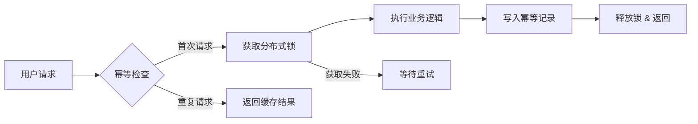
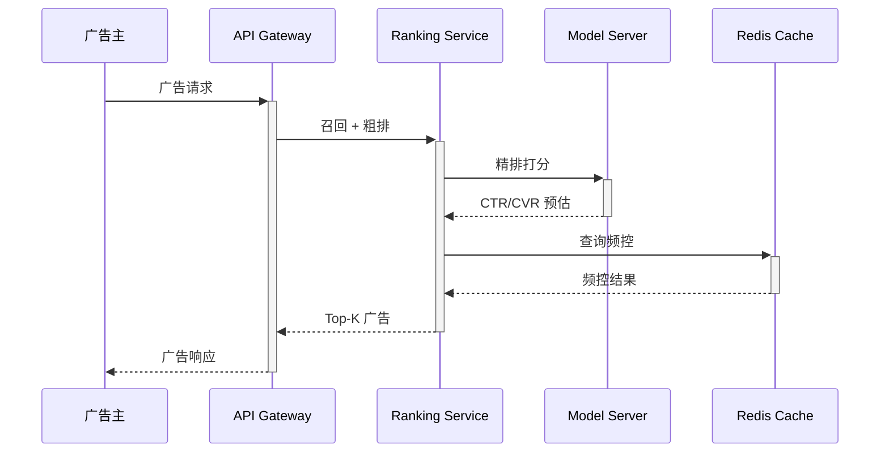

import Callout from '../../components/blog/Callout.astro'
import Figure from '../../components/blog/Figure.astro'
import Diagram from '../../components/blog/Diagram.astro'
import Steps from '../../components/blog/Steps.astro'
import StepItem from '../../components/blog/StepItem.astro'
import Timeline from '../../components/blog/Timeline.astro'
import TimelineItem from '../../components/blog/TimelineItem.astro'
import Comparison from '../../components/blog/Comparison.astro'
import Card from '../../components/blog/Card.astro'
import CardGrid from '../../components/blog/CardGrid.astro'

这篇文章展示了博客中可用的所有 MDX 增强组件。在 `.mdx` 文件中导入即可使用。

---

## Callout 信息框

四种类型，替代 blockquote 做重点标注：

<Callout type="info" title="信息提示">
  Content Collections 会在构建时校验所有 frontmatter schema，确保数据一致性。
</Callout>

<Callout type="warning" title="注意并发安全">
  幂等层在高并发场景下可能成为性能瓶颈，需要合理设计锁粒度。
</Callout>

<Callout type="tip" title="最佳实践">
  使用 `SETNX` 配合 TTL 实现分布式锁，避免死锁风险。
</Callout>

<Callout type="note">
  没有标题时，图标和内容水平排列，适合简短提示。
</Callout>

---

## Steps 步骤流程

适合教程和操作指南：

<Steps>
  <StepItem title="定义幂等 Key">
    选择业务唯一标识（如订单号 + 操作类型）作为幂等 Key，确保同一操作的多次请求映射到同一个 Key。
  </StepItem>
  <StepItem title="实现锁机制">
    使用 Redis `SETNX` 实现分布式锁，设置合理的 TTL 防止死锁。推荐 TTL 为预期处理时间的 3-5 倍。
  </StepItem>
  <StepItem title="执行业务逻辑">
    获取锁后执行实际业务操作，完成后将结果写入幂等记录表，供后续重复请求直接返回。
  </StepItem>
  <StepItem title="处理并发冲突">
    未获取到锁的请求进入等待-重试循环，超时后返回友好错误提示。
  </StepItem>
</Steps>

---

## Timeline 时间线

适合版本演进、事件序列：

<Timeline>
  <TimelineItem date="2023-Q1" label="v1.0">
    基于规则引擎的推荐系统上线，支持基础的用户画像匹配。
  </TimelineItem>
  <TimelineItem date="2023-Q3" label="v1.5">
    引入协同过滤算法，冷启动问题初步解决。
  </TimelineItem>
  <TimelineItem date="2024-Q1" label="v2.0" active>
    深度学习模型上线（DeepFM），CTR 提升 15%，RPM 提升 8%。
  </TimelineItem>
  <TimelineItem date="2024-Q4" label="v3.0">
    生成式推荐引入，支持多目标优化（CTR + CVR + 用户体验）。
  </TimelineItem>
</Timeline>

---

## Comparison 对比卡片

适合方案对比、技术选型：

<Comparison
  left={{ title: "Redis 分布式锁", items: ["超低延迟 (< 1ms)", "支持高并发 (10w+ QPS)", "需维护 Redis 集群", "有时钟漂移风险", "适合短时锁场景"] }}
  right={{ title: "数据库乐观锁", items: ["无额外基础设施", "天然持久化", "高并发下性能衰减", "实现相对简单", "适合低频更新场景"] }}
  leftLabel="推荐"
  rightLabel="备选"
/>

---

## CardGrid 卡片网格

适合特性展示、技术栈列表：

<CardGrid cols={3}>
  <Card title="SFT 监督微调" icon="book">
    使用高质量标注数据进行监督微调，建立模型基础能力。
  </Card>
  <Card title="ValueFT 价值训练" icon="chart">
    训练价值函数评估生成质量，为 RL 阶段提供奖励信号。
  </Card>
  <Card title="RL 强化学习" icon="rocket">
    通过 PPO/DPO 优化策略模型，对齐业务目标。
  </Card>
</CardGrid>

两列布局：

<CardGrid cols={2}>
  <Card title="在线推理" icon="bolt">
    实时特征拼接 + 模型推理，P99 延迟控制在 50ms 以内。
  </Card>
  <Card title="离线训练" icon="gear">
    每日增量训练 + 周全量训练，使用 TFRecord 格式存储样本。
  </Card>
</CardGrid>

---

## Mermaid 增强

Mermaid 图表现在使用与博客主题协调的暖色配色：



使用 `Diagram` 组件可以添加标题和说明：

<Diagram title="系统架构" caption="图1: 广告推荐系统的在线服务链路">



</Diagram>

---

## Figure 图片增强

`Figure` 组件为图片添加边框、圆角和说明文字（此处使用占位示意）：

```mdx
<Figure
  src="/images/posts/xxx/architecture.png"
  caption="图2: 推荐系统整体架构图"
  width="80%"
/>
```

---

## 组合使用

这些组件可以与普通 Markdown 自由混合。正文依然用 Markdown 写，在需要更好视觉效果的地方插入组件即可。

<Callout type="tip" title="写作建议">
  新文章使用 `.mdx` 扩展名，旧 `.md` 文章无需修改。组件只在需要时使用，不必每篇文章都用。
</Callout>
