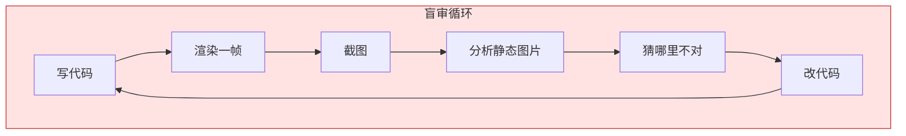
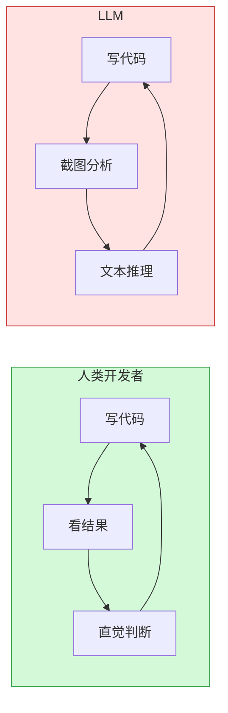

import Callout from '../../components/blog/Callout.astro'
import Diagram from '../../components/blog/Diagram.astro'
import Comparison from '../../components/blog/Comparison.astro'
import Figure from '../../components/blog/Figure.astro'

Andrej Karpathy 刚从 OpenAI 跳到 Anthropic 不久，就用自家模型做了一件让整个开发者社区停下来想了想的事：把《指环王》开篇第一段话扔给 Claude Opus 5，给 100 万 token 预算，要求只有一句——用 Three.js 把这段文字渲染成 3D 场景。

两小时后，模型交出 5500 行代码。浏览器里打开，中土世界的夏尔就这么出现了：丘陵、河流、霍比特人的洞穴、走动的角色、推进的镜头。每棵树的坐标、每块岩石的几何体、每段动画的时间线，全是代码一行行写出来的，没用一张外部贴图。

成本：大约 10 美元。

这件事本身已经够震撼了。但 Karpathy 真正想说的不是"看，AI 多强"——他想说的是"看，AI 在哪里断裂"。

## 从鹈鹕骑自行车到中土世界

两年前，测试 LLM 空间推理能力的标准姿势是让它画一张"鹈鹕骑自行车"的 SVG。这需要模型理解自行车的结构、鹈鹕的身体比例、两者的空间关系，再用路径和坐标把它们组合起来。大部分模型画出来的东西在"勉强能看"和"抽象派"之间反复横跳。

Karpathy 这次做的事，量级完全不同。不是一张静态矢量图，而是一个有叙事节奏的 3D 动画世界。模型需要：

1. 理解托尔金文字中隐含的地理信息（夏尔在哪里、水弥尔河怎么流）
2. 把叙事元素拆解为可编程的几何资产
3. 在三维坐标系中摆放上千个物体
4. 编写镜头运动、角色动画、场景切换的时间线代码
5. 让整个东西在浏览器里跑起来

这已经不是"画个图"的问题了。这是系统工程。

<Diagram title="从文字到世界" caption="Opus 5 的处理流程">

</Diagram>

从一段自然语言到一个完整的交互式 3D 世界，中间没有人工干预。这说明当前顶级 LLM 的代码生成能力已经触及了过去需要一个小型团队协作数周才能完成的工程复杂度。

## 盲人雕刻家的困境

但问题来了。

Karpathy 自己用了三个词评价成品：janky but fun。翻译过来就是——糙，但有意思。

糙在哪里？到处都糙。角色模型是盒子和圆柱体拼出来的火柴人。树冠是几个绿色球体叠在一起。有些物体位置偏移，有些动画节奏失调。更关键的是性能问题：原版场景用了 569 次独立渲染调用；如果使用 instanced mesh（实例化网格），1154 个重复物体只需要 4 次调用就能搞定。模型完全没有主动做这个优化。

为什么？因为 Opus 5 看不见自己造出来的东西。

这是整件事最值得深想的部分。Karpathy 原话是：

> "They can't easily audit their work because they aren't able to efficiently and natively perceive videos or play games within them."

LLM 是文本引擎。它吃文字、吐文字。它没有眼睛，没有 3D 感知，不能在场景里"走"。写完代码后想检查对不对，它只能走一个极其低效的循环：

<Diagram title="LLM 的盲审循环" caption="每一步都在丢信息">

</Diagram>

截图能告诉它树在不在画面里、山的颜色对不对。但告诉不了它：角色走路时有没有穿模？镜头移动是否流畅？两个物体之间的遮挡关系是否正确？动画的节奏感对不对？

这就像一个闭着眼睛的雕刻家：能凭记忆和手感雕出大致形状，但没法退后一步看看整体效果。每次想检查，只能让别人拍一张照片描述给他听。

## 生成能力 vs 感知能力：一条结构性裂缝

<Figure src="/images/posts/karpathy-llm-blind-renderer/blind-loop.svg" alt="LLM 盲审循环 vs 人类开发者反馈循环" caption="LLM 只能通过截图低效审查，人类开发者拥有即时高带宽视觉反馈" />

这不是 Opus 5 的特例。这是所有 LLM 面对视觉输出时的共同困境。

在传统软件开发中，写代码和看结果之间有一个紧密的反馈循环：写几行 → 保存 → 热重载 → 用眼睛看 → 发现问题 → 改。整个循环可能只需要几秒。人类开发者的视觉系统是免费的、即时的、高带宽的。

LLM 没有这个循环。或者说，它的循环是残缺的：

<Diagram title="反馈循环对比" caption="人类的视觉是免费的高带宽通道，LLM 只有截图这条窄路">

</Diagram>

人类开发者看一眼就知道"这棵树飘在空中"——不需要分析，不需要推理，视觉系统直接告诉你。LLM 需要先截图，再把图片转成 token，再在文本空间里推理"根据像素分布，树的底部似乎没有与地面接触"——这个过程慢、损耗大、容易出错。

更要命的是，视觉审查对于 3D 内容来说本来就不够。你需要的是交互式的、连续的感知：从不同角度看、在场景里走动、触发不同的动画状态。单张截图永远不能代替这些。

这就是为什么 5500 行代码虽然"能跑"，但到处透着毛坯房的感觉——模型完成了生成，但从未真正"体验"过自己的作品。

## 这不只是 3D 的问题

把视角拉远一点，这个"写了看不见"的问题其实弥漫在 LLM 应用的各个角落：

**前端开发**：LLM 能写出语法正确的 CSS，但不知道渲染出来的按钮是不是歪了、间距是不是怪异、在移动端是不是溢出了。Cursor、Claude Code 这些工具的解决方案是什么？截图 → 多模态分析。跟 Karpathy 实验里的循环一模一样。

**数据可视化**：模型能生成 D3.js 图表代码，但不知道坐标轴标签是不是重叠了、颜色对比度够不够、动画是否流畅。

**游戏开发**：能写游戏逻辑，但没法 playtest。不知道手感对不对、难度曲线是否合理、某个关卡是否有卡死的可能。

所有这些场景的共同点是：**代码的质量最终由视觉/交互结果定义，而不是由代码本身定义**。语法正确、逻辑自洽的代码，渲染出来可能完全不是你想要的。

这是一个架构层面的缺陷，不是通过"更聪明的推理"能解决的。你不能靠想象力代替眼睛。

## Ephemeral GTA on Demand：愿景与现实的距离

Karpathy 对未来的描绘很诱人：

> "I'm excited about creating hyper custom worlds that you can imagine dropping players into... Something like an ephemeral GTA of X on demand."

按需生成临时开放世界。用户指定任何小说、历史事件或虚构设定，模型实时搭出一个可交互的世界。玩完即弃，像用完即扔的纸杯。

经济逻辑是成立的：当生成成本降到 10 美元，那些过去因为"太个性化、投入产出比太低"而永远不会被制作的内容，突然有了存在的可能。一个只给你一个人看的中土世界，过去需要几万块预算和一个星期的工期；现在 10 美元，两小时。

但"能跑"和"值得玩"之间还有巨大的鸿沟。当前的瓶颈不是生成能力——5500 行代码证明这已经不是问题。瓶颈是质量控制循环：模型没法自己 playtest，没法判断"这个场景有趣吗"、"这个交互自然吗"、"这个节奏对吗"。

要填补这个鸿沟，需要的不是"更大的模型"或"更长的上下文"，而是架构层面的变化：

1. **原生视觉流**：模型需要能像人一样连续观看视频帧，而不是一帧一帧截图分析
2. **交互式环境接入**：模型需要能在自己生成的世界里"走动"——发出动作指令、接收环境反馈
3. **实时感知-行动循环**：生成一段代码 → 在环境中执行 → 实时观察结果 → 调整，这个循环需要变成毫秒级而不是分钟级

这三件事中的任何一件，都是比"让模型写更多代码"困难得多的工程问题。

## 两条路线的碰撞

"用代码生成 3D 世界"并不是唯一的路线。另一条路线是所谓的"世界模型"——像 Google 的 Genie 2 或 World Labs 的方案那样，不写代码，直接根据输入预测下一帧画面。

两条路线解决的是不同层面的问题：

| 维度 | 代码生成世界 | 神经世界模型 |
|------|-------------|-------------|
| 输出物 | 可编辑、可调试的代码 | 像素流/视频 |
| 视觉质量 | 依赖代码精度，容易粗糙 | 可以很真实 |
| 可控性 | 高，每个对象有明确状态 | 低，黑盒 |
| 物理规则 | 需要显式编码 | 隐式学习 |
| 审计难度 | 代码可读但视觉难审 | 几乎不可审计 |

Karpathy 的实验属于第一条路线。它的优势是透明——5500 行代码你想改哪里就改哪里。它的劣势就是这篇文章讨论的：写代码的模型看不见代码渲染出来的东西。

未来更可能的形态是两条路线的融合：LLM 负责规划、设计规则、生成结构性代码；世界模型负责填充视觉细节、提供物理直觉和环境反馈。LLM 当建筑师，世界模型当施工队和验收员。

## 对开发者意味着什么

如果你现在在做 AI 辅助的视觉内容生成，Karpathy 这个实验给出了一个清晰的信号：**生成不是瓶颈，验证才是**。

几个直接的启示：

**视觉验证层比生成层更值得投入。** 当前的工具链在"让 AI 写更多代码"上投入了大量资源，但在"让 AI 看懂自己写出来的东西"上还处于原始阶段。谁能把截图 → 分析这个循环做到足够快、足够准，谁就掌握了下一个杠杆点。

**Instanced mesh 的教训：领域知识不会自动出现。** Opus 5 不知道用 instanced mesh 优化，不是因为它不懂这个概念——给它一个明确的 prompt 它就会用。而是因为在开放式生成任务中，模型没有动机去主动调用这类优化知识。这意味着 prompt 工程和系统设计的角色比你以为的更重要：你需要在架构层面把领域最佳实践注入到生成流程中。

**人机协作的重心在转移。** 过去是人写代码、AI 帮忙补全。现在是 AI 写出整个系统，人负责 playtest 和判断"好不好"。这对开发者的技能树要求不同：你不再需要手写 Three.js 的每一行，但你需要能快速判断 5500 行自动生成的代码是不是在做蠢事。这更像是 code review 而不是 coding。

## 10 美元买到的启示

Karpathy 这个实验的价值不在于那个糙得要命的中土世界本身——它在于暴露了一条清晰的分界线。

分界线的一边是"生成"：LLM 已经能在这一侧做出令人震惊的事。从一段文字到一个完整的 3D 交互世界，两小时，10 美元。这条线以惊人的速度在向外推。

分界线的另一边是"感知与判断"：模型造出了世界，但进不去、看不见、玩不了。它没法退后一步看看整体效果，没法走进场景里体验自己的作品，没法像一个玩家那样说"这里感觉不对"。

这条分界线才是当前 AI 能力的真正前沿。下一个重大突破不会来自"模型能写更多行代码"，而是来自"模型终于能看见自己写出来的东西"。

Karpathy 用 10 美元买了一个中土世界。更贵的那个洞察是免费附送的。

---

**参考资料**

- [Karpathy LOTR 3D Demo](https://karpathy.ai/lotr-movie/)
- [AI Front Page 详细报道](https://aifront-page.com/karpathy-claude-opus-5-lord-of-the-rings-ai-gaming/)
- [36氪报道](https://36kr.com/p/3923301646741120)
- [新浪财经技术拆解](http://finance.sina.cn/stock/jdts/2026-08-03/detail-inikzuyf6198125.d.html)
