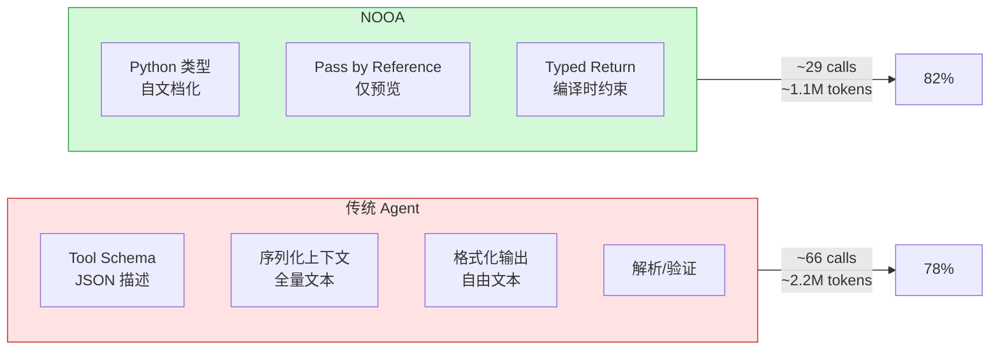
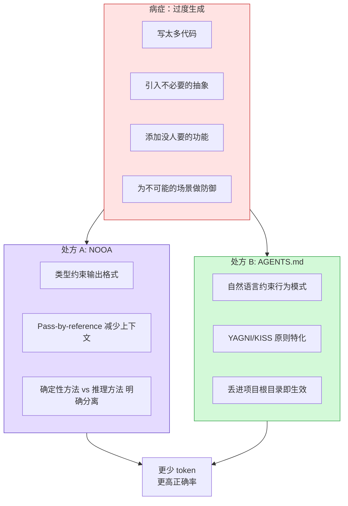

import Callout from '../../components/blog/Callout.astro'
import Diagram from '../../components/blog/Diagram.astro'
import Figure from '../../components/blog/Figure.astro'


这周 AI 圈同时出现了两件看起来不相关的事：

NVIDIA 开源了一个叫 NOOA 的 Agent 框架，用 253 行代码在 SWE-bench 上跑出了 82.2% 的成绩，token 消耗量只有同类方案的一半。

与此同时，一个 Vercel Next.js 团队的开发者说自己烧了大约 60B token（折合六位数美元），最终提炼出了 8 条写在 AGENTS.md 里的规则。这条推文被中文圈的 @AYi_AInotes 翻译转发后拿了 2200 多赞。

这两件事指向同一个结论：**让 Agent 变好的关键不是让模型变强，而是给模型戴上正确的约束。**

## NOOA：Agent 就是一个 Python Class

NOOA 的全称是 Object-Oriented Agents，NVIDIA Labs 出品，Apache 2.0 开源。它的核心设计思想用一句话就能说清：一个 Agent 就是一个 Python 类。

传统 Agent 开发的代码散落在四个地方：prompt 模板文件、tool schema（JSON）、callback 代码、workflow 图定义。改一个行为可能要动三个文件。NOOA 把所有东西收敛到一个 class 里：

- 方法 = Agent 的能力
- 字段 = Agent 的状态
- docstring = prompt
- 类型标注 = 输出约束
- 方法体是 `...`（三个点）= LLM 运行时填充
- 方法体有真实代码 = 普通 Python 直接执行

```python
class CodeAgent(Agent):
    """你是一个代码修复专家"""
    
    repo: Repository  # 状态：对代码仓库的引用
    
    def diagnose(self, error: str) -> Diagnosis:
        """分析错误根因，返回结构化诊断"""
        ...  # LLM 运行时填充
    
    def apply_fix(self, diagnosis: Diagnosis) -> PatchResult:
        """根据诊断生成补丁并应用"""
        ...  # LLM 运行时填充
    
    def run_tests(self) -> TestResult:
        """执行测试套件"""
        return self.repo.execute("pytest")  # 确定性 Python
```

这个设计解决了一个一直被忽视的问题：Agent 框架的抽象层级。LangChain 式的框架把 Agent 抽象成"链"和"工具"的组合，抽象层级太高，导致你没法精确控制 LLM 什么时候该用推理、什么时候该用确定性代码。NOOA 把决策权交回给开发者：你标 `...` 的地方 LLM 来填，你写了代码的地方就按代码跑。

## 253 行代码，82.2% 正确率

<Figure src="/images/posts/nooa-agents-md/nooa-comparison.svg" alt="NOOA vs 传统 Agent 架构对比" caption="传统 Agent 碎片化架构 vs NOOA 统一 Python Class，调用减半、token 减半、正确率更高" />

NOOA 在 SWE-bench Verified 上的数据：

| 方案 | 正确率 | LLM 调用次数 | Token 消耗/任务 |
|------|--------|-------------|----------------|
| NOOA (GPT-5.5) | 82.2% | ~29 次 | ~1.1M |
| OpenCode | 78.6% | ~66 次 | ~2.2M |
| PI | 78.2% | ~66 次 | ~2.2M |
| NOOA (Opus 4.6) | 79.8% | — | — |

关键不只是正确率高了 4 个百分点。而是：**调用次数减半、token 消耗减半的情况下，正确率还更高了。**

这在直觉上是反常识的——更少的推理步骤应该意味着更粗糙的解题过程才对。但 NOOA 的解释是：传统 Agent 浪费了大量 token 在"格式转换"和"重复理解"上。每次 LLM 调用都需要重新解析 tool schema、重新理解上下文、重新格式化输出。NOOA 通过类型系统和 pass-by-reference 消除了这些开销。

<Diagram title="Token 效率对比" caption="NOOA 消除了传统架构中大量的格式转换开销">

</Diagram>

更有说服力的是那个 SWE-bench agent 只有 253 行代码，没有任何 benchmark-specific 的 prompt 优化。它是一个**通用** agent，不是为跑分定制的。

NVIDIA 还做了一个能力测试：88 个测试、36 个能力类别、10 个模型、每个跑 5 次。总通过率 97.9%。这些模型没有一个是在 NOOA 接口上训练过的。它们能用这套接口纯粹是因为它本质上就是 Python，而所有大模型对 Python 都有很强的先验知识。

## 60B Token 烧出来的 8 条规则

另一边，@MarcosHernanz 的 AGENTS.md 走的是完全不同的路径——不是设计一个新框架，而是**告诉现有框架里的 AI 应该怎么行为**。

8 条规则的核心逻辑用一句话概括：让你的 AI 编程 Agent 别像实习生什么都想自己造，要像干了十年的老油条一样写代码。

具体规则：

1. **不保留向后兼容。** 过时的直接删，别加兼容层、别写 migration、别留 fallback
2. **选最简实现。** 不要预防性抽象，不要多此一举的配置层
3. **系统分层长。** 先跑通最小端到端版本，再往上加东西
4. **别动没让你动的东西。** 修 bug 时不要顺手重命名变量、删注释、重构相邻代码
5. **新建文件前先检查。** 看看现有文件能不能扩展，避免文件膨胀
6. **保守的技术选择。** 优先用成熟库，没有明确理由别自己重写
7. **测试验证行为而非实现。** 不写每次重构都会挂的测试
8. **错误处理要成比例。** 只处理真实会发生的错误，别为不可能的场景写防御代码

看起来眼熟？这基本就是 YAGNI + KISS + "别多管闲事"的 AI 特化版本。但"眼熟"不等于"没用"。

有研究数据支撑：不加约束的 AI Agent 平均多写 54% 的代码——一个倒计时功能，人写 13 行，不加约束的 Agent 写 190 行。

## 这两件事的底层逻辑是一样的

NOOA 用类型系统约束 Agent 的输入输出，让它不能乱来。8 条规则用自然语言约束 Agent 的行为模式，让它不会过度工程化。

方法不同，但它们诊断的是同一个病症：**LLM 在开放式编码任务中的默认行为是"过度生成"。**

<Diagram title="两种处方，同一个病症" caption="硬约束和软约束从不同路径对抗 LLM 的过度生成倾向">

</Diagram>

为什么 LLM 倾向于过度生成？Karpathy 很早就指出过：LLM 天然喜欢把代码写复杂、把抽象层堆高。这不是 bug，是训练数据的分布导致的——GitHub 上的高 star 项目往往有复杂的抽象和完善的错误处理，模型学到了"复杂 = 好"的隐含偏置。

约束的作用就是对抗这个偏置。NOOA 用类型系统做硬约束（你的返回值必须是这个类型），AGENTS.md 用自然语言做软约束（你应该选最简实现）。两者配合使用效果最好。

## 软约束的局限性

但 8 条规则不是万能药。社区讨论中出现了几个清醒的批评：

**规则 1（不保留向后兼容）在生产环境是危险的。** @MarcosHernanz 自己承认过，这条规则曾经让 Agent 差点删掉生产数据库的表，差点丢了 2000 美元的数据。他明确标注"只适合 side project，生产环境慎用"。

**规则本身需要可测试。** "尽量简单"这种表述对 LLM 来说太模糊。有效的 AGENTS.md 规则需要具体到可验证的程度："单个文件不超过 300 行"、"不引入项目中尚未使用的依赖"。

**软约束的衰减问题。** 有 V2EX 用户分享经验：超过 4 小时后，AI Agent 开始出现"上下文焦虑"——就像早期 LLM 一样，没法可靠地完成长任务。AGENTS.md 里的规则在上下文压缩后可能被丢弃。

这恰好解释了为什么 NOOA 的方法在 benchmark 上效果更好——类型约束不会被上下文压缩丢掉。Python 的类型系统是代码结构的一部分，不管上下文窗口怎么压缩，类型签名始终存在。

## Harness 论：Agent 领域的共识正在形成

回顾 2026 年到现在关于 Agent 的讨论，一个共识正在浮现：

Tw93 在他的 Agent 文章里写："更贵的模型带来的提升，很多时候没有想象中那么大，反而 Harness 和验证测试质量对成功率的影响更大。"

NVIDIA 的论文用数据证明了同样的事：**仅仅改变 harness 设计（用同一个模型），就能产生两位数的分数差异和 50% 的成本差异。**

OpenAI 内部的案例也支撑这个判断：3 个工程师 5 个月写了百万行代码，10 倍传统速度。成功原因不是模型多强，而是 harness 的工程决策做对了。

这里有一个对 Agent 开发者非常实用的推论：如果你的 Agent 效果不好，**先改 harness 再换模型**。换一个更贵的模型可能提升 2-3 个百分点；重新设计约束架构可能提升 10+ 个百分点。

## 实际操作建议

对于正在做 Agent 开发的工程师，这两件事结合起来给出了一个清晰的操作路径：

**立即能做的（5 分钟）**：在你项目根目录放一个 AGENTS.md（或 CLAUDE.md），写入 4-8 条行为约束规则。不需要 60B token 的经验，从"别动没让你动的东西"和"优先用现有依赖"这两条开始就够了。Cursor、Claude Code、Codex、Windsurf 都会自动读取。

**中期值得投入的**：评估 NOOA 是否适合你的 Agent 项目。如果你的 Agent 需要频繁调用工具、处理结构化数据、多步推理，NOOA 的类型约束 + pass-by-reference 设计能显著降低 token 成本。`pip install nooa`，253 行的 SWE-bench agent 是一个好的起点。

<Callout type="warning" title="注意陷阱">
- NOOA 的 Agent 执行的是 LLM 生成的 Python 代码，安全边界必须是 OS 级隔离（容器/VM），不是 AST 检查
- AGENTS.md 规则在长时间运行后可能被上下文压缩丢弃，需要在关键节点重新注入
- "不保留向后兼容"这条在生产环境必须删掉或改温和
</Callout>

## 约束是新的能力

AI Agent 领域正在经历一个认知转变：从"怎么让模型更强"到"怎么让模型不犯蠢"。

NOOA 证明了：用 Python 类型系统做硬约束，同一个模型的表现能提升 4+ 百分点、成本降低 50%。

60B token 的经验证明了：用自然语言做软约束，能把 AI 的代码产出从 190 行砍到 100 行以内，同时减少返工和 token 浪费。

两者共同指向的方向是：**下一代 Agent 工具的竞争力不在于接入了什么模型，而在于设计了什么约束体系。**

模型智能是通货膨胀资产，每个季度都在变便宜。约束设计是知识壁垒，需要领域经验、工程判断、和大量试错（比如那 60B token）来沉淀。

如果你在做 Agent 产品，约束体系才是你的护城河，不是你接了哪个模型的 API。

---

**参考资料**

- [NOOA Paper (arXiv)](https://arxiv.org/abs/2607.20709)
- [NOOA GitHub](https://github.com/NVIDIA-NeMo/labs-OO-Agents)
- [NVIDIA Blog](https://developer.nvidia.com/blog/six-agent-harness-capabilities-for-higher-model-performance/)
- [@MarcosHernanz 60B tokens AGENTS.md](https://x.com/MarcosHernanz/status/2083954734487212511)
- [@AYi_AInotes 中文解读](https://x.com/i/status/2084522269745820010)
