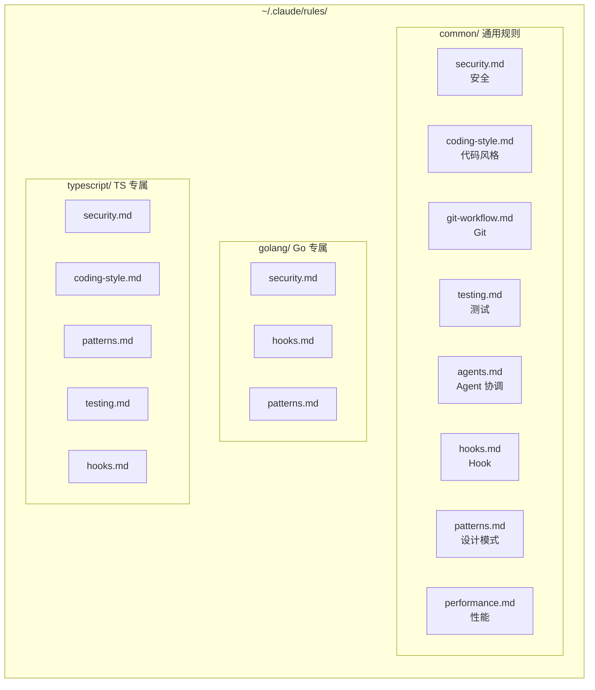
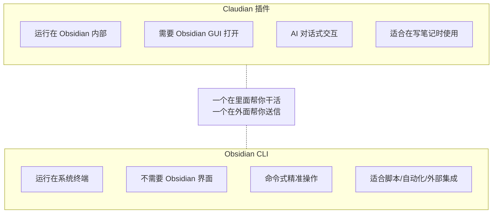
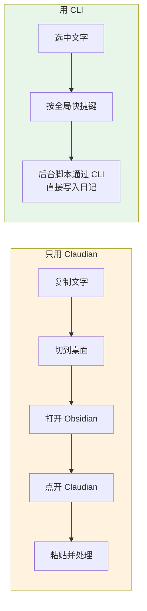
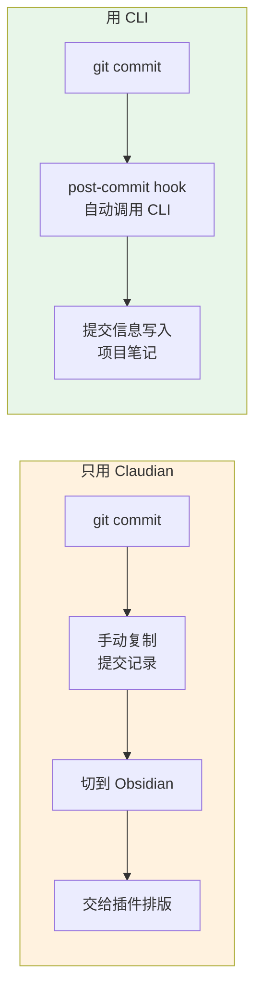
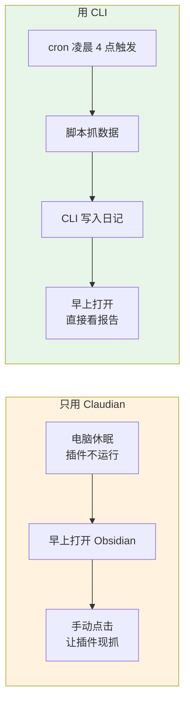
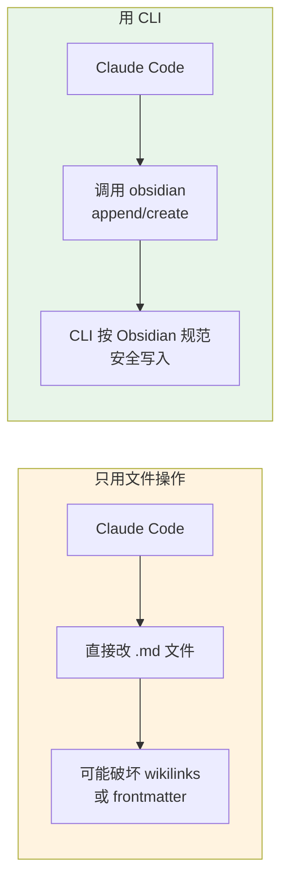
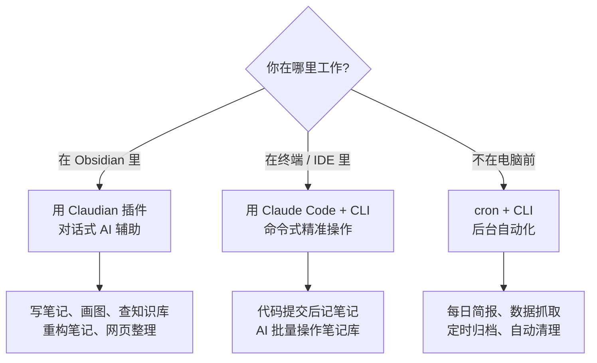
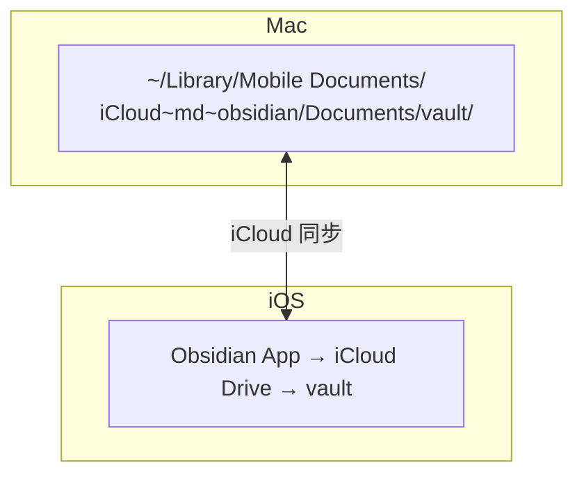
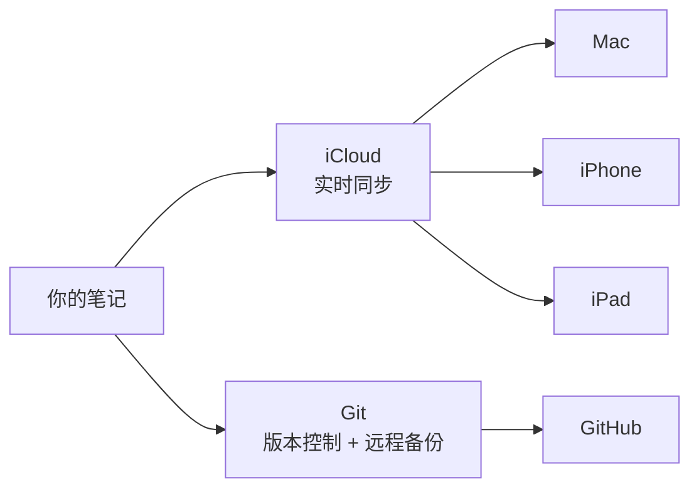
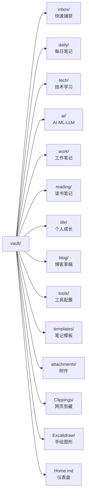

---

## 目录

- [一、架构总览](#一架构总览)
- [二、Obsidian 基础配置](#二obsidian-基础配置)
- [三、主题与外观](#三主题与外观)
- [四、核心插件配置（Core Plugins）](#四核心插件配置core-plugins)
- [五、社区插件详解（Community Plugins）](#五社区插件详解community-plugins)
- [六、模板系统](#六模板系统)
- [七、Claude Code 集成](#七claude-code-集成)
- [八、Claudian 插件 vs Obsidian CLI](#八claudian-插件-vs-obsidian-cli)
- [九、iCloud 三端同步](#九icloud-三端同步)
- [十、Git 版本控制](#十git-版本控制)
- [十一、Vault 目录规划](#十一vault-目录规划)
- [十二、Dataview 数据查询](#十二dataview-数据查询)
- [十三、Properties 与 Frontmatter 规范](#十三properties-与-frontmatter-规范)
- [十四、高级技巧与最佳实践](#十四高级技巧与最佳实践)
- [十五、常见问题排查](#十五常见问题排查)

---

## 一、架构总览


### 数据流


### 技术栈一览

| 组件 | 版本/方案 | 用途 |
| --- | --- | --- |
| Obsidian | v1.9+ | 知识管理前端 |
| Claude Code | 最新可用模型 | AI 编程代理 |
| Claudian | v1.3+ | Obsidian 内嵌 Claude Code |
| iCloud Drive | 系统级 | 跨设备同步 |
| Git + GitHub | obsidian-git | 版本控制 + 远程备份 |
| Obsidian CLI | v1.12+ | 终端自动化/脚本集成 |
| Minimal Theme | v8.x | 美观主题 |

---

## 二、Obsidian 基础配置

### 2.1 应用全局设置 (`app.json`)

打开 Obsidian -> Settings -> Files & Links:

| 设置项 | 推荐值 | 说明 |
| --- | --- | --- |
| **Attachment folder path** | `attachments` | 所有附件集中管理 |
| **Default location for new notes** | `inbox` | 新笔记统一进 inbox，后续整理 |
| **Always update internal links** | `true` | 重命名/移动文件时自动更新链接 |
| **Use Wikilinks** | `true` | 使用 `[[]]` 而非 Markdown 链接 |
| **Default editing mode** | `Source mode` | 源码模式，精确控制 Markdown |
| **Strict line breaks** | `false` | 兼容 CommonMark 换行 |
| **Prompt before deletion** | `false` | 快速删除，Git 兜底 |

```json
{
  "attachmentFolderPath": "attachments",
  "newFileLocation": "folder",
  "newFileFolderPath": "inbox",
  "alwaysUpdateLinks": true,
  "showUnsupportedFiles": false,
  "defaultViewMode": "source",
  "strictLineBreaks": false,
  "useMarkdownLinks": false,
  "promptDelete": false,
  "userIgnoreFilters": [
    "**/node_modules",
    "**/.venv",
    "**/__pycache__",
    "**/.git",
    "**/outputs"
  ]
}
```

> 排除过滤器
`userIgnoreFilters` 非常重要 – 如果你的 vault 中包含代码项目，一定要排除 `node_modules`、`.venv`、`__pycache__` 等目录，否则 Obsidian 会尝试索引这些文件，导致严重卡顿。
> 

### 2.2 核心理念

1. **Inbox Zero 工作流**: 所有新内容先进 `inbox/`，定期整理到对应目录
2. **Wikilinks 优先**: `[[]]` 是 Obsidian 的灵魂，支持自动补全、反向链接、图谱
3. **Properties 标准化**: 每个笔记都有 YAML frontmatter，便于 Dataview 查询
4. **渐进式组织**: 不要过度分类，让链接和标签自然形成知识网络

---

## 三、主题与外观

### 3.1 Minimal Theme

推荐使用 **Minimal** 主题（by @kepano），这是 Obsidian 社区最受欢迎的主题之一。

**安装**: Settings -> Appearance -> Themes -> Browse -> 搜索 “Minimal”

**特点**:
- 极简设计，减少视觉干扰
- 高度可定制（通过 Minimal Theme Settings 插件）
- 支持多种配色方案
- 适配移动端

### 3.2 Minimal Theme Settings 插件配置

安装 `obsidian-minimal-settings` 后可以精细调整：

| 设置 | 推荐值 | 说明 |
| --- | --- | --- |
| Light style | `minimal-light` | 亮色方案 |
| Dark style | `minimal-dark` | 暗色方案 |
| Line height | `1.5` | 行高，阅读舒适 |
| Line width | `40` | 正常宽度（rem） |
| Max width | `88` | 最大宽度 |
| Text size (normal) | `16` | 正文字号 |
| Text size (small) | `13` | 小字号 |
| Full width media | `true` | 图片撑满宽度 |
| Borders | `true` | 显示边框 |
| Underline links | `true` | 链接带下划线 |
| Folding | `true` | 启用折叠 |
| Readable line length | `true` | 限制行宽，提升可读性 |

### 3.3 辅助外观插件

| 插件 | 用途 |
| --- | --- |
| **Style Settings** (`obsidian-style-settings`) | 通过 GUI 调整 CSS 变量，与 Minimal 配合使用 |
| **Hider** (`obsidian-hider`) | 隐藏界面元素（标题栏、滚动条等），更沉浸 |
| **Iconize** (`obsidian-icon-folder`) | 为文件夹和文件添加图标，提升视觉辨识度 |

> [!tip] 主题选择建议
Obsidian 社区热门主题还有 **AnuPpuccin**、**Things**、**Blue Topaz**。Minimal 胜在简洁和可定制性，适合「内容优先」的使用者。如果喜欢更丰富的色彩，可以试试 AnuPpuccin。
> 

---

## 四、核心插件配置（Core Plugins）

Obsidian 内置了很多核心插件，以下是推荐的开启/关闭方案：

### 开启（19 个）

| 插件 | 说明 | 使用场景 |
| --- | --- | --- |
| **File explorer** | 文件浏览器 | 导航必备 |
| **Search** | 全局搜索 | 基础搜索 |
| **Quick switcher** | 快速切换文件 (Cmd+O) | 最常用的导航方式 |
| **Graph view** | 知识图谱 | 可视化笔记关系 |
| **Backlinks** | 反向链接 | 发现笔记间的隐含关系 |
| **Outgoing links** | 正向链接 | 查看当前笔记链接了什么 |
| **Canvas** | 画布 | 可视化思维导图 |
| **Tags** | 标签面板 | 浏览所有标签 |
| **Properties** | 属性面板 | 管理 frontmatter |
| **Page preview** | 页面预览 | 悬浮预览链接内容 |
| **Daily notes** | 每日笔记 | 配合 Periodic Notes |
| **Templates** | 模板 | 基础模板功能 |
| **Note composer** | 笔记合并/拆分 | 重组笔记内容 |
| **Command palette** | 命令面板 (Cmd+P) | 所有操作的入口 |
| **Editor status** | 编辑器状态栏 | 显示字数、光标位置 |
| **Bookmarks** | 书签 | 收藏常用笔记 |
| **Outline** | 大纲 | 显示标题结构 |
| **Word count** | 字数统计 | 状态栏显示字数 |
| **File recovery** | 文件恢复 | 意外丢失时的保底 |
| **Bases** | 数据库视图 | 笔记的表格/卡片视图 |

### 关闭

| 插件 | 关闭原因 |
| --- | --- |
| Footnotes | 很少使用脚注 |
| Slash commands | 与其他插件冲突 |
| Markdown importer | 一次性导入工具 |
| Zettelkasten prefixer | 不使用 ZK ID 命名 |
| Random note | 很少使用 |
| Slides | 不在 Obsidian 做演示 |
| Audio recorder | 不录音 |
| Workspaces | 窗口布局管理，暂不需要 |
| Publish | 不使用 Obsidian Publish |
| Web viewer | 不在 Obsidian 内浏览网页 |

---

## 五、社区插件详解（Community Plugins）

推荐启用约 **25 个**社区插件，分为 4 个层级：

### Tier 1: 核心必备

### 5.1 Obsidian Git (`obsidian-git`)

> [!important] 必装插件
Git 是你的笔记安全网，自动备份到 GitHub，即使 iCloud 出问题也不会丢数据。
> 

**推荐配置**:

| 设置 | 值 | 说明 |
| --- | --- | --- |
| Auto save interval | `10` 分钟 | 每 10 分钟自动提交 |
| Auto pull on open | `true` | 打开 Obsidian 时自动拉取 |
| Auto commit message | `vault backup: {{date}}` | 提交信息格式 |
| Auto backup after file change | `true` | 文件变化后触发备份 |
| Commit date format | `YYYY-MM-DD HH:mm:ss` | 时间戳格式 |

**使用技巧**:
- 在右侧边栏可以看到 Git Source Control 面板
- 手动提交: Cmd+P -> “Git: Commit all changes”
- 查看历史: Cmd+P -> “Git: Open history for current file”
- 冲突处理: 如果 iCloud 和 Git 同时修改了文件，Git 的合并机制会比 iCloud 更可靠

### 5.2 Dataview (`dataview`)

> [!important] 必装插件
把你的笔记库变成可查询的数据库。
> 

**基本用法**

列出所有带 `#project` 标签的笔记:

```
TABLE date, status, tags
FROM #project
SORT date DESC
```

列出最近修改的笔记:

```markdown
TABLE file.mtime AS "Modified"
WHERE file.mtime >= date(today) - dur(7 days)
SORT file.mtime DESC
LIMIT 20
```

统计各目录笔记数:

```markdown
TABLE length(rows) AS "Count"
FROM ""
GROUP BY file.folder
SORT length(rows) DESC
```

任务汇总:

```markdown
TASK
WHERE !completed
GROUP BY file.link
```

**DataviewJS** (更灵活的 JavaScript 查询):

```markdown
const pages = dv.pages("#tech")
  .where(p => p.status === "active")
  .sort(p => p.date, "desc");

dv.table(["Title", "Date", "Status"],
  pages.map(p => [p.file.link, p.date, p.status])
);
```

> [!tip] Dataview 性能
笔记超过 1000 篇时，Dataview 查询可能变慢。建议:
1. 缩小查询范围（用 `FROM "tech"` 限定目录）
2. 使用 `LIMIT` 限制结果数
3. 避免在首页放太多实时查询
> 

### 5.3 Templater (`templater-obsidian`)

**推荐配置**:

| 设置 | 值 |
| --- | --- |
| Template folder | `templates` |
| Trigger on file creation | `true` |
| Auto jump to cursor | `true` |
| Command timeout | `10` 秒 |

**Templater vs 核心 Templates**:
- 核心 Templates: 只能插入静态文本和 `{{date}}`、`{{title}}` 等简单变量
- Templater: 支持 JavaScript 执行、条件逻辑、用户输入弹窗、文件操作

**常用 Templater 语法**:

```markdown
<%*
// 获取当前日期
const date = tp.date.now("YYYY-MM-DD");
// 用户输入
const title = await tp.system.prompt("输入标题");
// 选择器
const type = await tp.system.suggester(
  ["技术笔记", "读书笔记", "会议记录"],
  ["tech", "reading", "meeting"]
);
-%>
---
tags:
  -<% type %>
date: <% date %>
---

# <% title %>
```

**光标定位**: 使用 `<% tp.file.cursor() %>` 指定插入模板后光标的位置。

### 5.4 Excalidraw (`obsidian-excalidraw-plugin`)

手绘风格的图形工具，直接在 Obsidian 中绘制:

**推荐配置**:

| 设置 | 值 | 说明 |
| --- | --- | --- |
| Excalidraw folder | `Excalidraw/` | 图形文件存放目录 |
| Autosave (desktop) | `60` 秒 | 桌面端自动保存间隔 |
| Autosave (mobile) | `30` 秒 | 移动端自动保存间隔 |
| AI enabled | `true` | 启用 AI 辅助绘图 |
| PDF export scale | `4` | PDF 导出分辨率 |

**使用场景**:
- 系统架构图
- 流程图
- 思维导图
- 手绘草稿
- 会议白板

### Tier 2: 高价值增强

### 5.5 Execute Code (`execute-code`)

在笔记中直接运行代码块:

```python
import pandas as pd

df = pd.DataFrame({"name": ["Alice", "Bob"], "score": [95, 87]})
print(df.to_markdown())
```

```go
package main

import "fmt"

func main() {
	fmt.Println("Hello from Go!")
}
```

```bash
echo "当前目录:$(pwd)"
ls -la
```

**支持的语言**: Python, JavaScript, Go, Shell/Bash, Rust, C/C++, Java, TypeScript, Ruby, R 等 30+ 种。

**配置**: Python 用 `python`，Go 用 `go run`，Shell 用 `bash`。超时 10 秒。

> [!warning] 安全提醒
Execute Code 会在本机执行代码，注意不要运行不信任的代码片段。建议配合 `.venv` 使用 Python 虚拟环境。
> 

### 5.6 Copilot (`obsidian-copilot`)

Obsidian 内的 AI 对话助手，支持 RAG（检索增强生成）:

- 基于 vault 内容回答问题
- 总结长文
- 生成笔记草稿
- 知识库问答

### 5.7 Advanced Tables (`table-editor-obsidian`)

Markdown 表格编辑增强:

| 功能 | 快捷键 |
| --- | --- |
| Tab 移动到下一列 | `Tab` |
| Enter 移动到下一行 | `Enter` |
| 自动对齐 | 输入 `|` 后自动格式化 |
| 排序 | 右键菜单 |
| 添加/删除行列 | 右键菜单 |

> [!tip] 表格技巧
在源码模式下输入 `|Header1|Header2|` 后按 Tab，Advanced Tables 会自动创建格式化的表格。
> 

### 5.8 Omnisearch (`omnisearch`)

比原生搜索更强大的全文搜索:

**推荐配置**:

| 设置 | 值 | 说明 |
| --- | --- | --- |
| Use cache | `true` | 缓存加速搜索 |
| Ignore diacritics | `true` | 忽略变音符号 |
| Fuzziness | `1` | 模糊匹配程度 |
| Weight: Basename | `10` | 文件名权重最高 |
| Weight: Directory | `7` | 目录名权重 |
| Weight: H1 | `6` | 一级标题权重 |
| Weight: H2 | `5` | 二级标题权重 |
| Weight: H3 | `4` | 三级标题权重 |

**使用**: Cmd+Shift+O 打开 Omnisearch，支持中英文混合搜索。

### 5.9 Linter (`obsidian-linter`)

自动格式化笔记:

**推荐启用的规则**:

| 规则 | 作用 |
| --- | --- |
| `yaml-timestamp` | 自动更新 `date` 和 `updated` 字段 |
| `heading-blank-lines` | 标题前后保留空行 |
| `empty-line-around-code-fences` | 代码块前后保留空行 |
| `trailing-spaces` | 删除行尾空格 |
| `consecutive-blank-lines` | 合并连续空行 |

**触发**: 保存时自动运行 (Lint on save)。

### Tier 3: 流程与效率

### 5.10 Kanban (`obsidian-kanban`)

创建看板视图管理任务/项目:

```markdown
---
kanban-plugin: basic
---
## Backlog
-[ ] 研究新框架

## In Progress
-[ ] 写技术学习笔记

## Done
-[x] 完成第一章读书笔记
```

### 5.11 Calendar (`calendar`)

日历小部件，显示在右侧边栏:

- 点击日期创建/打开每日笔记
- 通过颜色指示器显示每天的活跃度:
    - 黄色点: 字数 (每 250 字一个点)
    - 橙色点: 未完成任务
    - 绿色点: 链接数
    - 蓝色点: 反向链接数
    - 紫色点: Zettelkasten 笔记

### 5.12 Periodic Notes (`periodic-notes`)

管理周期性笔记:

| 设置 | 推荐值 |
| --- | --- |
| Daily note folder | `daily` |
| Daily note format | `YYYY-MM-DD` |
| Daily note template | `templates/daily-template` |

### 5.13 Tasks (`obsidian-tasks-plugin`)

增强的任务管理:

```markdown
-[ ] 完成报告 📅 2026-03-15
-[ ] 每周复盘 🔁 every week
-[x] 买咖啡 ✅ 2026-02-28
```

**查询任务**:

```markdown

```

not done

due before tomorrow

sort by due

group by folder

```markdown

```

### 5.14 QuickAdd (`quickadd`)

快速捕获和宏操作:

- **Capture**: 快速记录想法到指定笔记
- **Template**: 一键创建指定类型的笔记
- **Macro**: 组合多个操作为一键执行

### 5.15 BRAT (`obsidian42-brat`)

Beta Reviewer’s Auto-update Tool – 安装 GitHub 上的 Beta 版插件:

使用场景: 安装尚未上架 Obsidian 社区插件市场的插件，如 Claudian。

### Tier 4: 开发辅助

### 5.16 Claudian (`claudian`)

> [!important] 核心集成
在 Obsidian 内直接使用 Claude Code，无需切换到终端。
> 

**推荐配置**:

| 设置 | 值 | 说明 |
| --- | --- | --- |
| Permission mode | `yolo` | 自动批准（信任模式） |
| Default model | `haiku` | 日常用 Haiku 省 token |
| Thinking budget | `medium` | 中等思考深度 |
| Max tabs | `3` | 最多 3 个对话标签 |
| Load user settings | `true` | 加载 `~/.claude/` 的配置 |
| Blocked commands | `rm -rf`, `chmod 777` | 安全防护 |

**使用方式**: 右侧边栏 -> Claudian 标签 -> 直接对话。

### 5.17 Code Files (`code-files`)

在 Obsidian 中直接编辑代码文件（`.py`, `.go`, `.ts` 等），不仅限于 `.md`。

### 5.18 VSCode Editor (`vscode-editor`)

在 Obsidian 中嵌入 VS Code 编辑器，用于编辑代码文件。

### 5.19 Open in VSCode (`open-vscode`)

一键在 VS Code 中打开当前文件或 vault。

### 5.20 Code Emitter (`code-emitter`)

Execute Code 的替代/补充，另一种在笔记中运行代码的方式。

### 5.21 JupyMD (`jupymd`)

Markdown 和 Jupyter Notebook 之间的同步桥梁:

| 设置 | 推荐值 |
| --- | --- |
| Auto sync | `true` |
| Python interpreter | `python3` |
| Notebook editor | `jupyter-lab` |

---

## 六、模板系统

### 6.1 每日笔记模板 (`templates/daily-template.md`)

```markdown
---
tags:
  - daily
date: <% tp.date.now("YYYY-MM-DD") %>
---

# <% tp.date.now("YYYY-MM-DD ddd") %>

## Tasks

-[ ]

## Notes

## Log
```

**说明**:
- 使用 Templater 语法 `<% %>` 而非 `{{ }}`
- `tp.date.now("YYYY-MM-DD ddd")` 输出如 `2026-03-01 Sat`
- Tasks 区域写当日待办
- Notes 区域写笔记和想法
- Log 区域记录时间线

### 6.2 通用笔记模板 (`templates/note-template.md`)

```markdown
---
tags:
  - template
  - note
date: "{{date}}"
status: draft
---

# {{title}}

## Summary

## Details

## References
```

### 6.3 推荐补充的模板

> [!tip] 模板建议
根据使用场景，建议补充以下常用模板:
> 

**会议记录模板**:

```markdown
---
tags:
  - meeting
  - work
date: <% tp.date.now("YYYY-MM-DD") %>
attendees: []
status: draft
---

# Meeting: <% await tp.system.prompt("会议主题") %>

## Attendees
-

## Agenda
1.

## Discussion

## Action Items
-[ ]

## Next Steps
```

**技术笔记模板**:

```markdown
---
tags:
  - tech
date: <% tp.date.now("YYYY-MM-DD") %>
status: draft
category: <%* const cat = await tp.system.suggester(
  ["算法", "系统设计", "Go", "Python", "工具"],
  ["algorithm", "system-design", "golang", "python", "tooling"]
); tR += cat; %>
---

# <% tp.file.title %>

## 概述

## 核心内容

## 代码示例

## 参考资料
```

**读书笔记模板**:

```markdown
---
tags:
  - reading
  - book
date: <% tp.date.now("YYYY-MM-DD") %>
author:
rating:
status: reading
progress: 0
---

# <% tp.file.title %>

## 书籍信息

-**作者**:
-**出版年**:
-**分类**:

## 核心观点

## 章节笔记

## 金句摘录

## 读后感
```

---

## 七、Claude Code 集成

这是本攻略的核心亮点 – 通过 Claude Code 为 Obsidian 笔记库注入 AI 能力。

### 7.1 集成方式

有两种方式使用 Claude Code 操作笔记库:

| 方式 | 入口 | 优势 | 适用场景 |
| --- | --- | --- | --- |
| **终端 Claude Code** | 终端中运行 `claude` | 完整功能，Opus 模型 | 大规模操作、复杂任务 |
| **Claudian 插件** | Obsidian 右侧边栏 | 不离开 Obsidian | 快速提问、小改动 |

### 7.2 CLAUDE.md 项目配置

在 vault 根目录放置 `CLAUDE.md`，这是 Claude Code 进入你 vault 时自动加载的指令文件:

**关键配置项**:

```markdown
# Vault 结构
告诉 Claude 你的目录结构，每个目录放什么内容

# 规范
-使用 Obsidian Flavored Markdown
-附件放 attachments/
-YAML frontmatter 必须包含 tags, date
-文件名用 kebab-case
-中文内容用中文，技术术语用英文
-每日笔记放 daily/，格式 YYYY-MM-DD.md

# Git 规则
-每次操作后必须 git commit
-使用 conventional commits

# iCloud 同步规则
-排除 venv/, node_modules/, __pycache__/ 等
```

### 7.3 Claude Code Skills（Vault 级 + 全局级）

Skills 是 Claude Code 的专业知识模块，当你的请求匹配到某个 skill 时，Claude 会自动加载对应的详细指令。

### 推荐的 Vault 级 Skills

将以下 skills 安装到 `<vault>/.claude/skills/` 目录:

| Skill | 触发场景 | 能力 |
| --- | --- | --- |
| **obsidian-markdown** | 编辑 .md 文件、提到 wikilinks/callouts/frontmatter | 完整的 Obsidian Markdown 语法参考，包括 wikilinks `[[]]`、嵌入 `![[]]`、callouts、properties、LaTeX、Mermaid |
| **obsidian-bases** | 操作 .base 文件、提到数据库视图/过滤器/公式 | Obsidian Bases 的 YAML 格式、过滤器语法（AND/OR/NOT）、公式引擎、汇总函数 |
| **json-canvas** | 操作 .canvas 文件、创建画布/思维导图/流程图 | JSON Canvas Spec 1.0，支持文本/文件/链接/分组四种节点，边的连接和样式 |
| **obsidian-cli** | 通过命令行操作 Obsidian | CRUD 操作（read/create/append/search）、每日笔记、属性管理、插件开发调试 |
| **defuddle** | 提供 URL 要求阅读/分析网页内容 | 清理网页内容提取纯 Markdown，去除导航/广告/杂质，节省 token |
| **excalidraw-diagram** | “画图”、“流程图”、“思维导图”、“diagram” | 3 种输出模式（Obsidian/标准/动画），8 种图表类型，语义配色方案 |
| **mermaid-visualizer** | “可视化”、“流程图”、创建图表 | 6 种 Mermaid 图表类型，语法错误预防，专业配色 |
| **obsidian-canvas-creator** | 创建 Canvas 思维导图 | MindMap 和自由布局两种模式，碰撞检测，节点大小自适应 |

### 推荐的全局 Skills（`~/.claude/skills/`）

| Skill | 触发场景 | 能力 |
| --- | --- | --- |
| **docx** | 处理 Word 文档 | 创建/编辑/分析 .docx，tracked changes，格式转换 |

### 7.4 Claude Code Agents（专业代理）

Agents 是 Claude Code 的专业分身，放置在 `~/.claude/agents/` 目录。以下是推荐配置:

| Agent | 模型 | 用途 | 何时触发 |
| --- | --- | --- | --- |
| **planner** | Opus | 功能规划 | 复杂特性设计前，分析依赖和风险 |
| **architect** | Opus | 系统架构 | 系统设计、ADR 文档、扩展性评估 |
| **code-reviewer** | Sonnet | 通用代码审查 | 代码提交前，安全/质量/模式检查 |
| **go-reviewer** | Sonnet | Go 代码审查 | Go 项目专属，检查并发/错误处理/性能 |
| **go-build-resolver** | Sonnet | Go 构建修复 | go build/vet/staticcheck 报错时 |
| **python-reviewer** | Sonnet | Python 代码审查 | Python 项目，PEP 8/类型提示/安全 |
| **security-reviewer** | Sonnet | 安全审计 | OWASP Top 10 分析，密钥检测 |
| **build-error-resolver** | Sonnet | 构建错误修复 | TypeScript/通用构建错误 |
| **refactor-cleaner** | Sonnet | 死代码清理 | 代码瘦身，使用 knip/depcheck 检测 |
| **code-simplifier** | Sonnet | 可读性重构 | DRY 原则，guard clauses，现代化语法 |

**模型选择策略**: Opus 用于需要深度推理的任务（规划、架构），Sonnet 用于所有接触代码的任务（审查、修复、重构）。

### 7.5 Rules 规则系统

分层的规则系统确保 Claude Code 在不同语言环境下遵循最佳实践，放置在 `~/.claude/rules/` 目录:



> [!tip] 按需配置
根据你的技术栈选择对应的规则文件。如果你主要写 Python，可以新建 `rules/python/` 目录放 Python 专属规则。
> 

### 7.6 Hooks 自动化钩子

Claude Code 的 hooks 在特定事件发生时自动执行，配置在 `~/.claude/settings.json` 中:

| Hook | 触发时机 | 动作 |
| --- | --- | --- |
| **PreToolUse: Bash** | 执行 shell 命令前 | 拦截 `rm -rf`、`drop table` 等危险命令 |
| **PreToolUse: Bash** | `git push` 前 | 提醒确认 |
| **PostToolUse: Edit** | 编辑 `.go` 文件后 | 自动运行 `goimports -w` 或 `gofmt -w` |
| **UserPromptSubmit** | 每次用户提交 prompt | 可运行自定义脚本防止 AI 盲目同意 |

### 7.7 Claude Code 实际工作流示例

**场景 1: 批量创建学习笔记**

```
你: 帮我把这个课程大纲拆成 10 个独立的笔记，放到 tech/ 目录下，
    每个笔记用标准 frontmatter，互相用 wikilinks 链接

Claude: (加载 obsidian-markdown skill，创建 10 个文件，
         自动添加 frontmatter、wikilinks、git commit)
```

**场景 2: 画架构图**

```
你: 帮我画一个微服务架构的 Excalidraw 图

Claude: (加载 excalidraw-diagram skill，生成 .md 格式的
         Excalidraw 图，保存到 Excalidraw/ 目录)
```

**场景 3: 网页内容整理**

```
你: 把这篇文章整理成笔记 https://example.com/article

Claude: (加载 defuddle skill，抓取网页，清理内容，
         创建笔记到 inbox/，添加 frontmatter)
```

**场景 4: 知识库查询**

```
你: 我之前写的关于并发模式的笔记在哪？总结一下要点

Claude: (搜索 vault，找到相关笔记，汇总关键内容)
```

---

## 八、Claudian 插件 vs Obsidian CLI

Obsidian 1.12 引入了官方 CLI（命令行接口），它和 Claudian 插件分别解决不同层面的问题。理解两者的定位差异，才能搭配出最高效的工作流。

### 8.1 定位对比



| 维度 | Claudian 插件 | Obsidian CLI |
| --- | --- | --- |
| **运行位置** | Obsidian 内部 | 系统终端 / 任意脚本 |
| **依赖** | 必须打开 Obsidian | Obsidian 需安装但不需要在前台 |
| **交互方式** | AI 对话，自然语言 | 命令行指令，精确参数 |
| **能力范围** | 读写文件、搜索、画图、运行代码、网页抓取 | 读写笔记、追加内容、搜索、属性管理、每日笔记 |
| **AI 能力** | 有（Claude 模型） | 无（纯命令执行） |
| **自动化** | 需要手动触发 | 可被 cron/脚本/Git Hook 调用 |
| **适合谁** | 在 Obsidian 里工作的人 | 在终端/其他工具里工作的人 |

### 8.2 Obsidian CLI 命令速查

> [!info] 版本要求
Obsidian CLI 随 v1.12 发布（2026-02-27 public release）。安装后在终端中通过 `obsidian` 命令使用。
> 

**核心命令**:

| 命令 | 用途 | 示例 |
| --- | --- | --- |
| `obsidian read` | 读取笔记内容 | `obsidian read file=my-note.md` |
| `obsidian create` | 创建新笔记 | `obsidian create file=inbox/idea.md content="..."` |
| `obsidian append` | 追加内容到笔记末尾 | `obsidian append file=daily.md content="- 新想法"` |
| `obsidian prepend` | 插入内容到笔记开头 | `obsidian prepend file=daily.md content="## 早间"` |
| `obsidian search` | 搜索笔记 | `obsidian search query="关键词"` |
| `obsidian search:context` | 带上下文搜索 | `obsidian search:context query="..."` |
| `obsidian rename` | 重命名笔记 | `obsidian rename file=old.md to=new.md` |
| `obsidian daily:read` | 读取今日日记 | `obsidian daily:read` |
| `obsidian daily:append` | 追加到今日日记 | `obsidian daily:append content="..."` |
| `obsidian daily:prepend` | 插入到今日日记 | `obsidian daily:prepend content="..."` |
| `obsidian daily:path` | 获取日记路径 | `obsidian daily:path` |
| `obsidian property:set` | 设置笔记属性 | `obsidian property:set file=note.md key=status value=done` |
| `obsidian help` | 查看帮助 | `obsidian help create` |

**多 vault 指定**: `obsidian vault=MyVault read file=note.md`（vault 参数必须放第一个）

### 8.3 四个典型场景

### 场景一：随手记点东西不想被打断

你正在浏览网页，突然冒出一个好点子，想立刻记到今天的日记里。



**只用插件**: 复制 -> 切回桌面 -> 呼出 Obsidian -> 打开 Claudian -> 粘贴处理。来回切换打断思路。

**有 CLI**: 配一个系统全局快捷键，选中文字按一下，后台脚本直接调用 `obsidian daily:append content="..."` 写入日记。Obsidian 连界面都不用弹出来。

```bash
# 示例: macOS 快捷键脚本 (配合 Automator / Raycast)
#!/bin/bash
CONTENT=$(pbpaste)
obsidian daily:append content="-$(date +%H:%M)$CONTENT"
```

### 场景二：和其他软件打通工作流

你刚提交了一段代码到 GitHub，想在项目笔记里自动留底。



**只用插件**: 插件被关在 Obsidian 内部，它不知道终端里发生了什么。只能手动复制提交记录，切到 Obsidian 交给插件排版。

**有 CLI**: 在代码仓库挂一个 Git Hook，每次提交后自动调用 CLI 写入项目笔记。开发环境和笔记库直接连通。

```bash
# 示例: .git/hooks/post-commit
#!/bin/bash
MSG=$(git log -1 --pretty=format:"%s")
DATE=$(git log -1 --pretty=format:"%Y-%m-%d %H:%M")
obsidian append file="work/project-log.md" \
  content="- **$DATE**$MSG"
```

### 场景三：后台自动整理资料

你想每天早上醒来，笔记里已经准备好了昨天的工作摘要、今天的天气和抓取的新闻。



**只用插件**: 插件依赖 Obsidian 软件开着才能跑。电脑休眠或没开软件，定时任务就失效。只能早上手动触发。

**有 CLI**: 交给系统级定时任务（cron / launchd），凌晨后台脚本抓完数据，通过 CLI 存进笔记库。早上打开 Obsidian 直接看现成报告。

```bash
# 示例: crontab -e
0 4 * * * /path/to/morning-briefing.sh

# morning-briefing.sh
#!/bin/bash
WEATHER=$(curl -s "wttr.in/?format=3")
obsidian daily:prepend content="## Morning Briefing\n-$WEATHER"
```

### 场景四：让终端里的 AI 操作更安全

你在终端用 Claude Code 重构项目，想让它顺手把架构变动更新到笔记里。



**只用文件操作**: 终端里的 AI 够不着 Obsidian 插件，只能强行修改 Markdown 文件，容易把双向链接或 frontmatter 搞乱。

**有 CLI**: Claude Code 可以直接调用 CLI 的指令（`obsidian create`、`obsidian append`），CLI 会用符合 Obsidian 规范的方式操作，不会破坏笔记的生态结构。还省 token – 不需要 AI 自己拼接 Markdown 格式。

### 8.4 最佳搭配策略



> [!tip] 一句话总结
**Claudian 插件是为了让你在写笔记时更省力，Obsidian CLI 是为了让你在干别的事情时，依然能让四面八方的信息自动流进笔记库。** 两者互补，不是替代关系。
> 

---

## 九、iCloud 三端同步

### 9.1 原理



Obsidian 在 iOS 上原生支持 iCloud Drive 作为 vault 存储位置。Mac 上的 vault 位于 iCloud Drive 目录下，系统自动双向同步。

### 9.2 设置步骤

**Mac 端**:
1. 确保 System Settings -> Apple ID -> iCloud -> iCloud Drive 已开启
2. vault 路径放在 iCloud Drive 目录下
3. 在 Finder 中确认 vault 文件夹有 iCloud 同步图标

**iOS/iPadOS 端**:
1. 安装 Obsidian App
2. 打开 Obsidian -> Create new vault -> Store in iCloud
3. 选择已有的 vault 文件夹

### 9.3 同步排除规则

> [!danger] 关键
iCloud 会尝试同步所有文件。以下文件/目录**绝对不能**同步到 iCloud，否则会导致同步卡死、空间爆炸:
> 

| 排除项 | 原因 |
| --- | --- |
| `venv/`, `.venv/` | Python 虚拟环境，几百 MB |
| `node_modules/` | Node.js 依赖，几百 MB 到几 GB |
| `__pycache__/`, `*.pyc` | Python 字节码 |
| `.ipynb_checkpoints/` | Jupyter 检查点 |
| `*.parquet`, `*.csv.gz`, `*.pkl` | 大数据文件 |
| `*.pt`, `*.safetensors`, `*.onnx`, `*.h5` | ML 模型权重 |
| `dist/`, `build/`, `*.whl` | 构建产物 |
| `.git/` | Git 元数据（Obsidian 的 userIgnoreFilters 已排除） |

**解决方案**:

方案一: `.nosync` 扩展名（推荐）

```bash
# 将大目录重命名为 .nosync，然后创建符号链接
mv node_modules node_modules.nosync
ln -s node_modules.nosync node_modules
```

方案二: 在代码项目目录中放 `.gitignore`（Git 会忽略，但 iCloud 不认）

方案三: 把代码实验项目放在 iCloud Drive 之外，用符号链接进来

> [!tip] 推荐方案
最稳妥的方式是: 在 vault 内的代码项目使用 `.nosync` + symlink 模式。例如:
> 
> 
> ```bash
> cd my-project/
> mv venv venv.nosync && ln -s venv.nosync venv
> mv node_modules node_modules.nosync && ln -s node_modules.nosync node_modules
> ```
> 

### 9.4 iCloud 同步常见问题

| 问题 | 解决方案 |
| --- | --- |
| 文件显示为 `.icloud` 占位符 | 点击文件，iCloud 会下载真实内容 |
| 同步冲突 | Obsidian Git 是更可靠的合并机制，优先信任 Git |
| 同步速度慢 | 检查网络，重启 iCloud 服务: `killall bird` |
| 插件配置不同步 | `.obsidian/plugins/` 会同步，但部分插件在 iOS 不可用 |
| 移动端缺少某些功能 | 正常现象，Execute Code、Git 等仅 Desktop 可用 |

### 9.5 iCloud + Git 双保险策略



- **iCloud**: 负责设备间的实时同步，包括所有配置和插件
- **Git**: 负责版本控制和灾难恢复
- 两者互不冲突，但建议以 Git 为最终的 source of truth

---

## 十、Git 版本控制

### 10.1 .gitignore 配置

完整的推荐 `.gitignore`:

```
# === OS & Editor ===
.DS_Store
.Trash/
Thumbs.db
*.swp
*.swo

# === Python intermediate files ===
venv/
.venv/
__pycache__/
*.pyc
*.pyo
*.egg-info/
dist/
build/
*.whl

# === Node.js ===
node_modules/

# === Jupyter ===
.ipynb_checkpoints/

# === Go ===
*.exe
*.test
*.out

# === Data & model artifacts ===
*.parquet
*.csv.gz
*.tsv.gz
*.pkl
*.joblib
*.pb
*.h5
*.onnx
*.pt
*.safetensors

# === Build outputs ===
*.o
*.so
*.dylib

# === Environment & secrets ===
.env
.env.local

# === Sub-repo git (如果 vault 中有子项目) ===
# tech/_lab/**/.git
```

### 10.2 Git 提交规范

使用 **Conventional Commits**:

| 前缀 | 用途 | 示例 |
| --- | --- | --- |
| `docs:` | 新增/修改笔记 | `docs: add system design learning notes` |
| `feat:` | 新功能/新模板 | `feat: add meeting template with Templater` |
| `fix:` | 修复链接/错误 | `fix: broken wikilinks in tech/ directory` |
| `chore:` | 配置/维护 | `chore: update obsidian-git plugin` |
| `refactor:` | 重组笔记结构 | `refactor: reorganize reading/ directory` |

### 10.3 自动备份 + 手动提交

- **自动**: obsidian-git 每 10 分钟自动 commit + push
- **手动**: Claude Code 每次操作后手动 commit（conventional commits）
- **拉取**: 打开 Obsidian 时自动 pull

---

## 十一、Vault 目录规划

### 11.1 推荐目录结构



### 11.2 各目录使用指南

| 目录 | 放什么 | 不放什么 | 命名规范 |
| --- | --- | --- | --- |
| `inbox/` | 临时想法、未整理的内容 | 已分类的笔记 | 随意，后续整理时重命名 |
| `daily/` | 每日记录、时间线 | 主题笔记 | `YYYY-MM-DD.md` |
| `tech/` | 编程学习、算法、系统设计 | 工作相关 | `topic-name.md` |
| `ai/` | AI/ML 学习、Agent 追踪 | 通用编程 | `topic-name.md` |
| `work/` | 会议记录、项目文档、复盘 | 学习笔记 | `project-topic.md` |
| `reading/` | 书评、文章摘要、论文笔记 | 原文 | `book-name.md` |
| `life/` | 职业规划、健康、反思 | 技术内容 | 描述性名称 |
| `blog/` | 准备发布的文章 | 草稿 | `article-title.md` |
| `tools/` | 工具配置、操作手册 | - | `tool-name.md` |
| `templates/` | 笔记模板 | 实际笔记 | `type-template.md` |
| `attachments/` | 图片、PDF、音频 | Markdown 文件 | 自动命名 |

### 11.3 Home.md 仪表盘

建议创建一个 `Home.md` 作为 vault 的入口:

```markdown
# My Vault

## 当前焦点
> [[_dashboard|学习 Dashboard]] -- 学习进度、本周计划、知识地图

## 目录
| 目录 | 内容 | 入口 |
|------|------|------|
| tech/ | 技术学习 | [[_dashboard]] |
| ai/ | AI/LLM 追踪 | [[ai-weekly-log]] |
| work/ | 工作笔记 | - |
| reading/ | 书单、阅读 | [[reading-list]] |
| life/ | 个人成长 | - |
| daily/ | 每日笔记 | 日历组件 |

## 快速链接
-[[reading-notes-index]] - 读书笔记索引
-[[newsletters-and-blogs]] - 订阅清单
-[[learning-roadmap]] - 学习路线图
```

> [!tip] MOC (Map of Content)
Home.md 本质上就是一个 MOC – 内容地图。建议每个主要目录都有一个 `_index.md` 或 `_dashboard.md` 作为该目录的入口点，用 Dataview 动态生成内容列表。
> 

---

## 十二、Dataview 数据查询

### 12.1 常用查询模板

**最近修改的笔记**:

```markdown
TABLE file.mtime AS "修改时间", file.size AS "大小"
WHERE file.name != "Home"
SORT file.mtime DESC
LIMIT 15
```

**按标签分组的知识图谱**:

```markdown
TABLE WITHOUT ID
  file.link AS "笔记",
  file.tags AS "标签",
  file.outlinks AS "链接"
FROM "tech"
WHERE status = "active"
SORT date DESC
```

**待办事项仪表盘**:

```markdown
TASK
WHERE !completed AND file.folder != "templates"
GROUP BY file.folder
SORT rows.length DESC
```

**阅读进度追踪**:

```markdown
TABLE author, rating, status, progress + "%" AS "进度"
FROM "reading"
WHERE contains(tags, "book")
SORT status ASC, rating DESC
```

**每周创建的笔记数**:

```markdown
const notes = dv.pages("")
  .where(p => p.file.cday >= dv.date("today") - dv.duration("7 days"));

dv.paragraph(`本周新建 **${notes.length}** 篇笔记`);
```

### 12.2 Dataview + Properties 最佳实践

1. **统一 frontmatter 字段**: 同类笔记用相同的 property 名称
2. **使用枚举值**: `status` 用 `draft/active/archived`，方便过滤
3. **避免过度查询**: 首页不要超过 3-4 个 Dataview 块
4. **缓存友好**: 避免使用 `file.mtime` 排序的大范围查询（会频繁刷新）

---

## 十三、Properties 与 Frontmatter 规范

### 13.1 标准字段定义

每个笔记的 YAML frontmatter 至少包含:

```yaml
---
tags:          # 标签列表 (必需)
- category
- topic
date:          # 创建日期 (必需, YYYY-MM-DD)
updated:       # 最后更新 (Linter 自动维护)
status:        # 状态: draft / active / archived
---
```

### 13.2 扩展字段（按笔记类型）

**技术笔记**:

```yaml
---
tags:[tech, golang]
date: 2026-03-01
status: active
category: system-design    # 分类
difficulty: medium         # easy/medium/hard
related:                   # 相关笔记
-"[[other-note]]"
---
```

**读书笔记**:

```yaml
---
tags:[reading, book]
date: 2026-03-01
author: Martin Kleppmann
rating:5                  # 1-5 评分
status: reading            # reading/finished/abandoned
progress:45               # 阅读进度百分比
---
```

**工作笔记**:

```yaml
---
tags:[work, meeting]
date: 2026-03-01
project: my-project
attendees:[Alice, Bob]
action-items:3
---
```

### 13.3 Property Types 配置

Obsidian 的 `types.json` 定义了全局的属性类型:

```json
{
  "types": {
    "aliases": "aliases",
    "cssclasses": "multitext",
    "tags": "tags",
    "rating": "number",
    "status": "text",
    "progress": "number",
    "author": "text",
    "completed": "checkbox"
  }
}
```

设置方法: Settings -> Properties -> 为每个字段指定类型。这样 Dataview 查询和 Properties 面板都能正确显示。

---

## 十四、高级技巧与最佳实践

### 14.1 Obsidian 隐藏功能

**快速打开 (Cmd+O)**:
- 最常用的导航方式，支持模糊搜索
- 输入 `#tag` 可以按标签过滤
- 输入 `path:tech/` 可以限定目录

**链接未创建的笔记**:
- 直接写 `[[尚不存在的笔记]]`，Obsidian 会标记为红色链接
- 点击后自动创建笔记 – 这是 Zettelkasten 的精髓

**块引用 (Block References)**:

```markdown
这段文字可以被其他笔记引用 ^my-block

在另一个笔记中:
![[笔记名#^my-block]]
```

**搜索链接 (Search Links)**:

```markdown
[[##某个标题]]     搜索包含 "某个标题" 的所有标题
[[^^某段内容]]     搜索包含 "某段内容" 的所有块
```

**Callouts 折叠**:

```markdown
>[!faq]- 点击展开 (默认折叠)
> 隐藏的内容

>[!faq]+ 点击折叠 (默认展开)
> 可见但可折叠的内容
```

### 14.2 知识管理方法论

**PARA + Zettelkasten 混合法**:

推荐的 vault 目录结构实际上是 PARA 方法的变体:

| PARA | 对应目录 | 说明 |
| --- | --- | --- |
| **P**rojects | `work/`, `blog/` | 有明确目标和截止日期的项目 |
| **A**reas | `tech/`, `ai/`, `life/` | 持续关注的领域 |
| **R**esources | `reading/`, `tools/` | 参考材料 |
| **A**rchive | (通过 status: archived) | 不再活跃但保留的内容 |

同时结合 Zettelkasten 的核心理念:
1. **原子笔记**: 每个笔记聚焦一个概念
2. **丰富链接**: 通过 `[[wikilinks]]` 建立笔记间的关系
3. **涌现结构**: 不预设复杂分类，让结构从链接中自然涌现

### 14.3 常用快捷键

| 快捷键 | 功能 |
| --- | --- |
| `Cmd+O` | 快速打开文件 |
| `Cmd+P` | 命令面板 |
| `Cmd+Shift+O` | Omnisearch |
| `Cmd+E` | 切换编辑/预览模式 |
| `Cmd+Click` | 在新标签页打开链接 |
| `Cmd+[` / `Cmd+]` | 后退/前进导航 |
| `Cmd+Shift+F` | 全局搜索 |
| `Cmd+,` | 设置 |
| `Alt+Enter` | 跟随光标下的链接 |

### 14.4 Graph View 使用技巧

推荐图谱设置:

| 参数 | 推荐值 | 说明 |
| --- | --- | --- |
| Center strength | `0.52` | 中心吸引力 |
| Repel strength | `10` | 节点间斥力 |
| Link strength | `1` | 链接拉力 |
| Link distance | `250` | 链接距离 |

**使用建议**:
- 过滤掉 `attachments/` 和 `templates/` 减少噪音
- 用 Color Groups 为不同目录着色
- 定期查看图谱发现孤立笔记（orphans），考虑补充链接

### 14.5 Obsidian Bases 数据库视图

Bases 是 Obsidian 原生的数据库功能（类似 Notion Database）:

创建 `.base` 文件:

```yaml
views:
-type: table
name: 技术笔记
source:
type: folder
value: tech
filters:
-property: status
operator: is
value: active
visibleProperties:
- file.name
- tags
- date
- status
sort:
-property: date
order: desc
```

支持的视图类型: `table`（表格）、`cards`（卡片）、`list`（列表）。

### 14.6 移动端优化

iOS/iPadOS 上的 Obsidian 功能有限，以下是优化建议:

| 方面 | 建议 |
| --- | --- |
| 编辑 | 使用 Live Preview 模式（比 Source 更友好） |
| 导航 | 善用 Quick Switcher (Cmd+O) |
| 捕获 | QuickAdd 配置一键 Capture 到 inbox/ |
| 插件 | 部分插件不支持移动端（Execute Code、Git 等） |
| 性能 | 笔记太多时移动端可能较慢，保持文件在合理数量 |

---

## 十五、常见问题排查

### Q1: iCloud 同步卡住怎么办？

```bash
# 重启 iCloud 同步守护进程
killall bird
# 检查同步状态
brctl monitor com.apple.CloudDocs
# 查看 iCloud 日志
log stream --predicate 'process == "bird"' --info
```

如果某个文件一直显示 `.icloud`:

```bash
# 强制下载
brctl download "<vault-path>/path/to/file.md"
```

### Q2: Git 和 iCloud 冲突了？

1. 关闭 Obsidian
2. 在终端用 `git status` 检查状态
3. 如果有冲突文件，用 `git checkout --theirs/--ours` 解决
4. 重新打开 Obsidian

> [!tip] 预防冲突
避免在多个设备上**同时**编辑同一个文件。iCloud 的冲突处理不如 Git 可靠。实际操作中:
- Mac 做主力编辑
- iPhone/iPad 只做查看和轻量记录
- Claude Code 只在 Mac 上运行
> 

### Q3: Obsidian 启动很慢？

1. 检查 `userIgnoreFilters` 是否排除了 node_modules 等
2. 禁用不常用的插件
3. Dataview 查询过多会拖慢启动
4. 检查 vault 中是否有超大文件

### Q4: Dataview 查询不工作？

1. 确认 frontmatter 格式正确（YAML 语法）
2. 确认属性名一致（大小写敏感）
3. 日期格式必须是 `YYYY-MM-DD`
4. 刷新: Cmd+P -> “Dataview: Force Refresh All Views”

### Q5: Templater 模板不生效？

1. 检查 Templater 设置中 Template folder 是否正确
2. 确认使用 `<% %>` 而非 `{{ }}`（后者是核心 Templates 语法）
3. “Trigger on file creation” 必须开启
4. 模板文件不要有 YAML 语法错误

### Q6: Claude Code 找不到 vault 中的文件？

1. 确认在 vault 目录下运行 Claude Code
2. 检查 `CLAUDE.md` 是否存在于 vault 根目录
3. 确认文件不在 `userIgnoreFilters` 排除列表中

---

## 附录

### A. 完整插件清单

| # | 插件 | 层级 | 移动端 | 说明 |
| --- | --- | --- | --- | --- |
| 1 | obsidian-git | Tier 1 | 部分 | Git 版本控制 |
| 2 | dataview | Tier 1 | 支持 | 数据库查询 |
| 3 | templater-obsidian | Tier 1 | 支持 | 高级模板 |
| 4 | obsidian-excalidraw-plugin | Tier 1 | 部分 | 手绘图形 |
| 5 | execute-code | Tier 2 | 不支持 | 运行代码块 |
| 6 | obsidian-copilot | Tier 2 | 支持 | AI 对话 |
| 7 | table-editor-obsidian | Tier 2 | 支持 | 表格增强 |
| 8 | omnisearch | Tier 2 | 支持 | 全文搜索 |
| 9 | obsidian-linter | Tier 2 | 支持 | 自动格式化 |
| 10 | obsidian-kanban | Tier 3 | 支持 | 看板视图 |
| 11 | calendar | Tier 3 | 支持 | 日历组件 |
| 12 | periodic-notes | Tier 3 | 支持 | 周期笔记 |
| 13 | obsidian42-brat | Tier 3 | 支持 | Beta 插件 |
| 14 | obsidian-tasks-plugin | Tier 3 | 支持 | 任务管理 |
| 15 | quickadd | Tier 3 | 支持 | 快速捕获 |
| 16 | claudian | Tier 4 | 不支持 | Claude Code 集成 |
| 17 | code-files | Tier 4 | 不支持 | 代码文件编辑 |
| 18 | vscode-editor | Tier 4 | 不支持 | VS Code 内嵌 |
| 19 | open-vscode | Tier 4 | 不支持 | 打开 VS Code |
| 20 | code-emitter | Tier 4 | 不支持 | 代码运行 |
| 21 | jupymd | Tier 4 | 不支持 | Jupyter 桥接 |
| 22 | obsidian-icon-folder | 外观 | 支持 | 文件夹图标 |
| 23 | obsidian-hider | 外观 | 支持 | 隐藏界面元素 |
| 24 | obsidian-minimal-settings | 外观 | 支持 | Minimal 主题设置 |
| 25 | obsidian-style-settings | 外观 | 支持 | CSS 变量调整 |

### B. Skills 与 Agent 快速参考

**Skills（说对应的关键词即可自动加载）**:

| Skill | 关键词 |
| --- | --- |
| obsidian-markdown | wikilinks, callouts, frontmatter, 编辑笔记 |
| obsidian-bases | .base, 数据库视图, 过滤器, 公式 |
| json-canvas | .canvas, 画布, 思维导图 |
| obsidian-cli | obsidian 命令行, vault 操作 |
| defuddle | URL, 网页内容, 抓取文章 |
| excalidraw-diagram | 画图, 流程图, 架构图, diagram |
| mermaid-visualizer | 可视化, mermaid, 图表 |
| obsidian-canvas-creator | Canvas 思维导图, 空间布局 |
| docx | Word 文档, .docx |

**Agents（复杂任务时自动调度）**:

| 需求 | Agent |
| --- | --- |
| 规划复杂功能 | planner |
| 系统设计 | architect |
| 审查代码质量 | code-reviewer |
| 审查 Go 代码 | go-reviewer |
| 修复 Go 编译错误 | go-build-resolver |
| 审查 Python 代码 | python-reviewer |
| 安全漏洞分析 | security-reviewer |
| 修复 TS 构建错误 | build-error-resolver |
| 清理死代码 | refactor-cleaner |
| 提升可读性 | code-simplifier |

### C. 参考资源

- [Obsidian 官方文档](https://help.obsidian.md/)
- [Obsidian 社区插件](https://obsidian.md/plugins)
- [Minimal Theme 文档](https://minimal.guide/)
- [Dataview 文档](https://blacksmithgu.github.io/obsidian-dataview/)
- [Templater 文档](https://silentvoid13.github.io/Templater/)
- [Obsidian Tasks 文档](https://publish.obsidian.md/tasks/)
- [Claude Code 文档](https://docs.anthropic.com/en/docs/claude-code)
- [JSON Canvas 规范](https://jsoncanvas.org/)

---

> [!quote] 最后一句话
知识管理系统的价值不在于工具有多花哨，而在于你**持续使用**它。最好的系统是你每天都愿意打开的那个。
>
