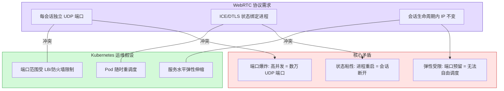
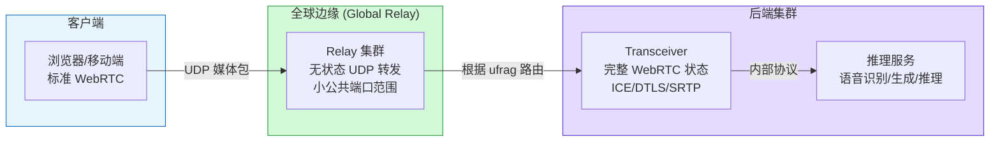
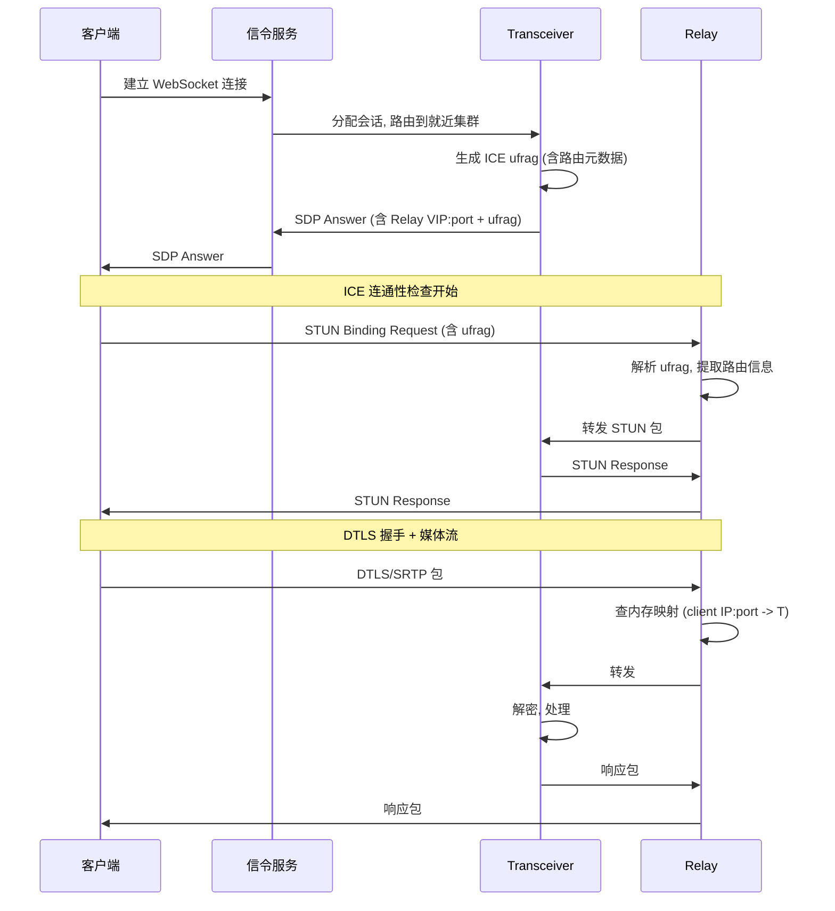
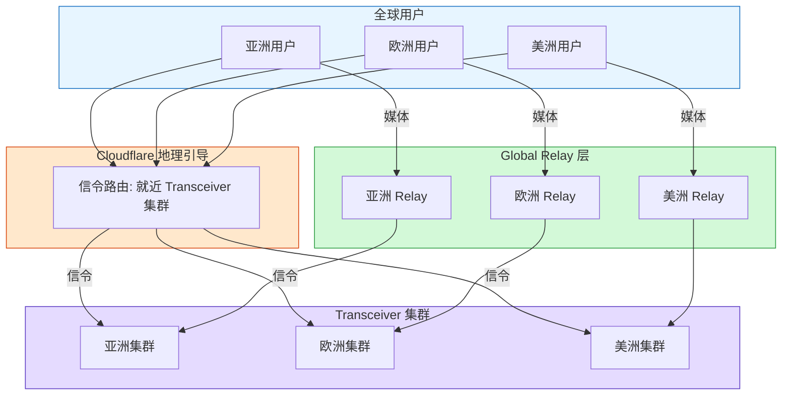
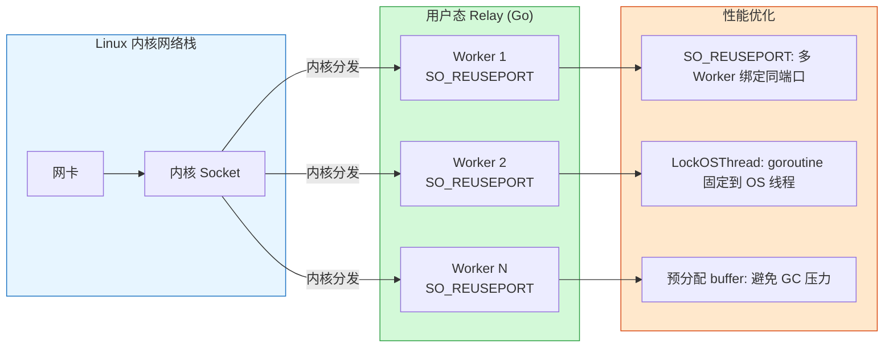
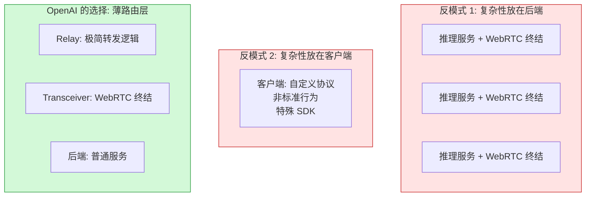

import Callout from '../../components/blog/Callout.astro'

OpenAI 上周发布了一篇技术博文，详细描述了 ChatGPT Voice 和 Realtime API 背后的 WebRTC 基础设施架构。这不是一篇产品公告，而是一篇扎实的工程文章——讨论了端口耗尽、会话状态粘性、ICE credential 路由、全球 relay 部署和 Go 实现细节。

这篇文章值得深入分析的原因不是"OpenAI 做了语音 AI"这件事本身，而是它展示了一个通用的基础设施挑战：**如何在云原生（Kubernetes）环境中运行一个本质上是有状态的、需要固定端口的实时协议（WebRTC）**。这个问题不止 OpenAI 面临——任何在 K8s 上做实时音视频的团队都会遇到同样的矛盾。

## 问题定义：WebRTC 和 Kubernetes 为什么打架

要理解 OpenAI 的设计决策，先得理解 WebRTC 在传统部署模式下的工作方式，以及它为什么和 Kubernetes 的假设冲突。

WebRTC 是为点对点通信设计的协议栈，包含了 ICE（连接建立和 NAT 穿越）、DTLS（加密握手）、SRTP（加密媒体传输）和 RTCP（质量控制）。关键特征是：**每个会话需要一个独立的 UDP 端口来接收媒体流**。

在传统部署中（物理机或固定 VM），这不是问题——一台服务器暴露几万个 UDP 端口，每个会话占一个。但 Kubernetes 的核心假设是工作负载可以弹性伸缩：Pod 随时创建、销毁、重调度。这和 WebRTC 的需求产生了三个具体冲突：

**端口爆炸**。高并发意味着数万甚至数十万个公共 UDP 端口。云负载均衡器不是为这个场景设计的——管理大范围 UDP 端口的健康检查、防火墙策略、滚动更新极其复杂。

**状态粘性**。ICE 和 DTLS 是有状态协议。创建会话的进程必须继续接收该会话的后续包——因为只有它持有加密密钥和连接状态。如果包被路由到错误的进程，会话就会断开。

**弹性受限**。每个 Pod 需要预留大量端口范围，这让 Kubernetes 的自动伸缩变得脆弱——你不能随意调度一个需要特定端口范围的 Pod。

OpenAI 的表述很直接："one-port-per-session media termination does not fit OpenAI infrastructure well"。9 亿周活跃用户的规模下，这些矛盾被放大到了无法回避的程度。

## 行业现有方案及其局限

在 OpenAI 的方案之前，行业有三种主流架构处理 WebRTC 媒体：

**方案一：SFU（Selective Forwarding Unit）**

SFU 是 WebRTC 领域最成熟的架构模式。每个参与者和 SFU 建立一条 WebRTC 连接，SFU 负责选择性转发流。Discord 用这种架构处理 250 万并发语音用户。LiveKit、Janus、mediasoup 都是这个路线的开源实现。

SFU 适合多方通话场景（群聊、课堂、会议），因为它天然支持多对多。但 OpenAI 的工作负载是 1:1 的——一个用户对一个模型。用 SFU 做 1:1 引入了不必要的复杂性：推理服务需要表现得像一个 WebRTC 对端（peer），增加了后端服务的耦合度。

**方案二：TURN Relay**

TURN（Traversal Using Relays around NAT）是 WebRTC 标准中的中继方案。客户端和 TURN 服务器建立连接，TURN 转发流量到目标。解决了 NAT 穿越问题，但 TURN 分配（allocation）本身是有状态的——在 TURN 服务器之间迁移或恢复分配仍然困难。

**方案三：每服务器单端口 + 应用层复用**

把每会话一端口改为每服务器一端口，由应用层根据包内容做多路复用。解决了端口数量问题，但只在单机场景有效。跨负载均衡集群时，第一个包仍然可能落到错误的实例上——你仍然需要一种确定性的方式将每个会话的流量引导到拥有该会话状态的进程。

OpenAI 的方案本质上是方案三的分布式扩展——但解耦了转发和协议终结。

## OpenAI 的架构：Relay + Transceiver

OpenAI 的核心设计决策是**将包路由和协议终结分离**为两个独立服务：

**Relay**：轻量级 UDP 转发层。不解密媒体，不运行 ICE 状态机，不参与编解码协商。它唯一做的事是：读取包的元数据（具体来说是 ICE ufrag），决定把包转发给哪个 Transceiver。

**Transceiver**：有状态的 WebRTC 终结点。拥有完整的 ICE、DTLS、SRTP 会话状态和生命周期管理。从客户端视角看，Transceiver 就是 WebRTC 对端——只是它的 IP 不是直接暴露给客户端的。

这个分离的关键价值是：
1. Relay 无状态，可以随意水平扩展、重启，不影响任何会话
2. Transceiver 有状态但只需要暴露内部端口，不需要公共 UDP 端口范围
3. 公共 UDP 面积缩小到 Relay 的几个固定 VIP:port

## 首包路由：ICE ufrag 中编码路由信息

架构的关键难点在于**首包路由**——第一个从客户端发来的 UDP 包到达 Relay 时，Relay 怎么知道该转发给哪个 Transceiver？

OpenAI 的方案利用了 WebRTC 协议本身已有的机制：**ICE username fragment（ufrag）**。

ufrag 是 SDP 协商阶段交换的一个短标识符，后续每个 STUN 连通性检查包里都会携带它。OpenAI 在生成服务端 ufrag 时，在里面编码了路由元数据——目标集群和拥有该会话的 Transceiver 标识。

流程是这样的：

1. 信令阶段，Transceiver 分配会话状态，生成带路由信息的 ufrag
2. SDP Answer 返回给客户端，包含 Relay 的 VIP:port 和这个 ufrag
3. 客户端向 Relay VIP:port 发送第一个 STUN Binding Request（携带 ufrag）
4. Relay 解析 STUN 包的 ufrag，提取路由提示，转发给正确的 Transceiver
5. Relay 创建一个内存映射：`<client IP:port> → <Transceiver IP:port>`
6. 后续的 DTLS、RTP、RTCP 包不需要再解析 ufrag——直接查映射转发

这个设计的精妙之处在于：**路由信息已经存在于协议标准字段中，不需要额外的外部查找服务**。首包路由不需要热路径上的数据库查询或 RPC 调用——Relay 直接从包内容推断目的地。

如果 Relay 重启丢失了内存映射呢？下一个 STUN 包会重建映射。为了进一步提高可靠性，OpenAI 用 Redis 缓存已建立的路由映射，这样即使在下一个 STUN 包到达之前 Relay 就恢复了，会话也不会中断。

## 全球 Relay 和地理感知信令

解决了单集群内的包路由问题后，OpenAI 将同样的 Relay 模式扩展到全球部署：

**Global Relay** 是在全球多个地理位置部署的 Relay 入口点。它的价值是缩短第一跳——用户的 UDP 包在进入 OpenAI 骨干网之前，只需要经过很短的公网路径到达最近的 Relay，而不是跨洲到达远端集群。

信令层使用 **Cloudflare 的地理/邻近引导**，让初始的 HTTP/WebSocket 请求到达就近的 Transceiver 集群。请求上下文决定了会话的位置，以及 SDP Answer 中通告给客户端的 Global Relay 地址。

ufrag 中编码了足够的信息，让 Global Relay 知道把包路由到哪个集群，再由集群内的 Relay 路由到目标 Transceiver。

这样信令和媒体都走就近入口，但会话锚定在一个特定的 Transceiver。减少了信令和首次 ICE 连通性检查的往返时间——直接缩短用户开始说话前的等待时间。

## Go 实现：不需要内核旁路

Relay 的实现选择了 Go 语言（基于 Pion WebRTC 库的作者也加入了 OpenAI 团队）。值得注意的是，OpenAI 明确表示**不需要内核旁路（kernel bypass）框架**：

具体的优化手段：

- **SO_REUSEPORT**：Linux socket 选项，允许多个 Worker 绑定同一个 UDP 端口。内核负责将入包分发到各个 Worker，避免单一读循环瓶颈
- **runtime.LockOSThread**：将每个 UDP 读取 goroutine 固定到特定 OS 线程。结合 SO_REUSEPORT，同一个流（相同的源/目的 IP:port）倾向于被分发到同一个 CPU 核心，提升缓存局部性
- **预分配 buffer + 最小拷贝**：降低解析和分配开销，减少 Go GC 压力

这是一个重要的工程判断：在处理全球实时媒体流量的 Relay 服务上，Go 的用户态实现加上这些优化就足够了。不需要 DPDK 或 XDP 这类内核旁路技术。OpenAI 原文的表述是："This implementation handled our global real-time media traffic with a relatively small relay footprint, so we kept the simpler design instead of taking on a kernel bypass route."

这说明对于转发逻辑极简的场景（只读包头、查映射、转发），应用层的瓶颈不在包处理速度上，而在架构设计是否能让每个组件保持简单。

## 为什么不用 SFU：工作负载决定架构

OpenAI 明确选择了 Transceiver 模型而非 SFU。这个决策背后有一个清晰的工程判断：**工作负载的形状决定了架构的形状**。

SFU 的核心价值是多方通话的流管理——N 个参与者各自发一路流给 SFU，SFU 选择性地转发给其他 N-1 个参与者。这需要 SFU 理解媒体内容（编解码、质量分层、带宽估计）。

但 OpenAI 的 Realtime API 绝大多数是 1:1 会话——一个用户和一个模型对话。在这种模式下，SFU 的多路复用能力是多余的，反而带来了不必要的复杂性：

- 推理服务需要表现为 WebRTC 对端，增加了后端服务的协议负担
- SFU 需要理解媒体内容，而实际上后端只需要原始音频流
- SFU 的故障域更大——一个 SFU 故障影响上面所有会话

Transceiver 模型让后端服务回归为"普通服务"——它们不需要知道 WebRTC 的存在，只需要处理内部协议传来的音频帧。这是一个更干净的关注点分离。

## 架构哲学：复杂性应该加在哪里

这篇技术博文的最后总结了一个更广泛的工程原则："The best place to add complexity is in a thin routing layer, not in every backend service, and not in custom client behavior."

这句话值得反复品味。它描述了一种架构哲学：

1. **不要把复杂性推到每个后端服务**。如果每个推理 Pod 都要处理 WebRTC，意味着每次后端变更都需要考虑实时协议的影响
2. **不要把复杂性推到客户端**。客户端继续使用标准 WebRTC——浏览器和移动端的互操作性不受影响
3. **在一个薄的路由层集中处理转换**。Relay 只做一件事（转发），做得极度简单。Transceiver 做 WebRTC 终结，也是单一职责

这种思路和微服务架构中 sidecar proxy（如 Envoy）的设计理念一脉相承：把跨切关注点（cross-cutting concern）集中到基础设施层，让业务服务保持纯粹。

## 对实时 AI 基础设施的工程启示

OpenAI 的这篇文章对正在构建实时 AI 系统的工程师有几个实际启示：

**WebRTC 在 AI 场景的定位正在明确**。WebRTC 不再只是视频会议的协议——它正在成为实时 AI 交互的标准传输层。原因很直接：音频作为连续流到达，Agent 可以在用户说话的同时就开始转录、推理、调用工具或生成语音。这是对话式 AI 和 push-to-talk 式 AI 的本质区别。

**"有状态协议 + 无状态基础设施" 是一个通用模式**。把有状态的会话管理和无状态的包转发分离，这个思路不只适用于 WebRTC。任何需要在 K8s 上运行有状态实时协议的场景都面临类似问题——MQTT、gRPC streaming、WebSocket 长连接。分离策略是相同的：在边缘做无状态路由，在内部做状态锚定。

**协议原生字段是最好的路由信号**。OpenAI 利用 ICE ufrag 编码路由信息，避免了热路径上的外部查找。这提示一个通用原则：如果你需要在负载均衡器做应用层路由，尽量利用协议本身已有的字段，而不是引入额外的 sideband 机制。HTTP 的 Header、gRPC 的 metadata、QUIC 的 connection ID——都是类似的路由信号锚点。

**Go + 用户态优化对大多数实时转发场景足够**。不需要盲目追求 DPDK/XDP。如果你的转发逻辑足够简单（不需要深度包解析或复杂状态），Go 的 `SO_REUSEPORT` + `LockOSThread` + 预分配 buffer 组合在实际工程中已经被验证足够处理全球级流量。

## 未解答的问题

OpenAI 的博文聚焦于 WebRTC 媒体传输层的架构，有几个相关问题没有涉及：

**推理延迟**。文章关注的是网络传输延迟（媒体包从客户端到 Transceiver 的延迟），但对话式 AI 的总延迟 = 网络延迟 + 推理延迟 + 语音合成延迟。推理端如何实现低延迟流式输出？这是另一个完全不同的问题。

**故障转移**。如果一个 Transceiver 崩溃了，会话怎么恢复？ICE restart 可以让客户端重新协商连接，但会话上下文（对话历史、推理状态）的恢复没有提及。

**成本**。Global Relay 意味着全球多地部署 UDP 入口点。使用 Cloudflare 做地理引导意味着信令走 CDN，但 UDP 媒体流走 OpenAI 自己的 Relay。这套全球基础设施的运维成本和规模效益临界点是什么？

**多模态扩展**。当前描述的是音频场景。如果 Realtime API 扩展到视频（屏幕共享、摄像头输入给 Vision 模型），视频流的带宽需求比音频大 10-100 倍，Relay 的设计是否仍然成立？

---

这篇技术博文的价值不只在于"OpenAI 怎么做语音 AI"，而在于它清晰地展示了一个通用的工程权衡：当一个有状态的实时协议需要运行在为无状态工作负载设计的基础设施上时，最好的解法不是让基础设施适配协议（那意味着回到物理机时代），也不是让协议适配基础设施（那意味着放弃标准），而是在两者之间插入一个极薄的适配层——只做路由，不做其他。

Relay 的代码可能只有几千行 Go。但这几千行代码解决的问题——让 WebRTC 在 Kubernetes 上像普通服务一样运行——对任何需要构建实时 AI 基础设施的团队都有参考价值。

---

**参考链接**

- [How OpenAI delivers low-latency voice AI at scale](https://openai.com/index/delivering-low-latency-voice-ai-at-scale/)
- [Pion WebRTC - Go implementation](https://github.com/pion/webrtc)
- [How Discord Handles Two and Half Million Concurrent Voice Users using WebRTC](https://discord.com/blog/how-discord-handles-two-and-half-million-concurrent-voice-users-using-webrtc)
- [Cloudflare Calls: millions of cascading trees all the way down](https://blog.cloudflare.com/cloudflare-calls-anycast-webrtc/)
- [STUNner: A Kubernetes media gateway for WebRTC](https://github.com/l7mp/stunner)
