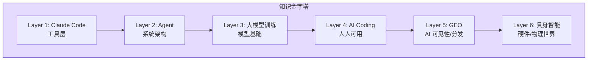
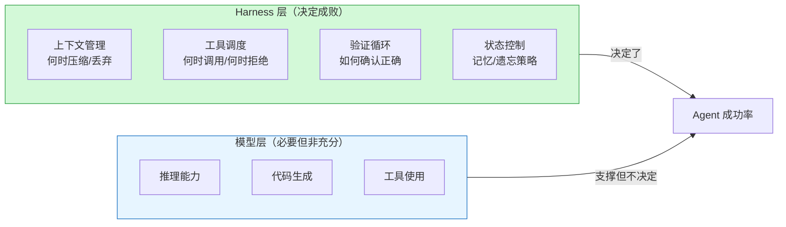

import Callout from '../../components/blog/Callout.astro'
import Diagram from '../../components/blog/Diagram.astro'
import Figure from '../../components/blog/Figure.astro'

六月中旬，Tw93 在 X 上发了条帖子，说听朋友反馈，他写的系列文章成了 AI 岗位面试准备的必读材料。帖子得了 2800 多个赞。

这件事有意思的地方不在于"又有人写了 AI 科普"，而在于一个做 Pake（60K star 的桌面应用打包工具）出身的产品工程师，用三个月时间写了六篇文章，居然比大量专业 AI 课程更适合用来准备面试。

他是怎么做到的？更值得问的是：为什么这种"非专业背景的人写的东西"反而成了面试标配？

## 六篇文章的知识架构

这个系列从 3 月写到 6 月，标题统一格式"你不知道的 X"：

| 序号 | 标题 | 发布日期 | 核心命题 |
|------|------|----------|----------|
| 1 | Claude Code：架构、治理与工程实践 | 03-12 | Claude Code 不是聊天机器人，是一个上下文治理系统 |
| 2 | Agent：原理、架构与工程实践 | 03-21 | Agent 的成功取决于 Harness 而不是模型智能 |
| 3 | 大模型训练：原理、路径与新实践 | 04-03 | 拉开差距的不再是预训练，而是后训练和数据配方 |
| 4 | AI Coding：非技术人的上手与实战 | 04-26 | Claude Code 本质是通用 Agent，不只是写代码 |
| 5 | GEO：AI 可见性的原理与实践 | 05-01 | 让 AI 理解你的内容，不是投机而是基建 |
| 6 | 具身智能：从小机器狗到 Optimus | 06-07 | 从 200 块的 STM32 机器狗出发理解具身 AI |

六篇文章构成了一个层次分明的金字塔：

<Figure src="/images/posts/tw93-ai-interview/knowledge-pyramid.svg" alt="Tw93 AI 工程师知识金字塔" caption="从工具层到物理世界，六层递进的 AI 工程师认知框架" />

<Diagram title="知识层次结构" caption="每一层都建立在前一层的基础上">

</Diagram>

从工具到架构到原理到应用到分发到硬件，这不是六篇独立科普，是一套完整的 AI 工程师认知框架。

## 为什么这些文章能当面试材料

2026 年 AI 岗位招聘爆发（算法工程师岗位增长 220%，传统开发岗位下降 8-25%），大量工程师从后端、前端、移动端转型 AI 方向。他们面临的核心困境是：面试官问的不是论文细节，而是"你怎么理解这个系统"。

Tw93 的文章恰好填了这个缺口。有人在掘金写："腾讯一面，我霸气反问：你说你们在做 Agent 项目，说说 SubAgent、Plan 模式、Skill 调用这些你们都是怎么做的？"——这种问题的知识来源，就是这个系列。

具体来说，这些文章有三个特点让它们比正规教材更适合面试准备：

**第一，工程视角而非学术视角。** 系列里最有力的观点几乎都是反直觉的工程判断：

- "卡住的地方几乎从来不是模型不够聪明，更多时候是给了它错误的上下文"
- "更贵的模型带来的提升，很多时候没有想象中那么大，反而 Harness 和验证测试质量对成功率的影响更大"
- InstructGPT 的 1.3B 参数模型在人类偏好评测中击败了 175B 的 GPT-3

这些观点在面试中说出来，立刻把你和"只看过论文标题"的候选人区分开来。

**第二，有"做过"的底气。** Tw93 不是在总结别人的论文。他自己半年深度使用 Claude Code 写了 Pake（60K star）、Kaku（AI 原生终端）、妙言等项目；自己花 200 块组装了 STM32 机器狗来理解具身智能；自己用 GEO 实践让自己的博客被 AI 索引。

面试官能分辨出"我读过这个概念"和"我踩过这个坑"之间的区别。Tw93 的文章传递的是后者的质感。

**第三，写给"聪明的非专家"。** 他自己说过目标是"争取让非专业背景的人也能读得懂"。这恰好是面试准备的理想难度——比入门教程深很多，但不会深到只有相关领域研究者才能理解。

## 几个值得展开的洞察

### Agent 那篇：Harness 比模型更关键

Agent 文章里最重要的一个论断是：OpenAI 内部 3 个工程师用 5 个月写了百万行代码，是传统开发速度的 10 倍。这个速度背后不是模型有多强，而是几个工程决策做对了。

他把 Agent 成功的关键归因于 Harness（脚手架/运行时框架），而不是模型本身。具体拆解：

<Diagram title="Agent 成功的决定因素" caption="Harness 层的设计比模型选择更影响最终成功率">

</Diagram>

这个判断对面试回答的指导意义非常直接：当面试官问"你怎么设计一个 Agent 系统"时，比起大谈 prompt engineering 或模型选择，聊 context management、verification loop、error recovery 这些 harness 层面的设计，更能展示系统工程的思维。

他还给出了一个实用的判断框架：Agent Loop 本身只有约 20 行代码的抽象，稳定性来自于**不修改**核心循环，而是通过 Harness 层控制输入输出。

### Claude Code 那篇：上下文是第一资源

Claude Code 文章的核心观点是：这个工具的难点不在于模型能力，而在于上下文治理。他列了一个让人印象深刻的数据：5 个 MCP server，每个约消耗 5000 token 的 tool schema 描述，光工具定义就吃掉了 12.5% 的上下文窗口。

这意味着你还没开始干活，可用空间已经缩水了八分之一。再加上 Tool Output 的噪声、之前对话的累积，"Context Rot"（上下文腐烂）在 300K-400K token 时就会发生——即使模型号称支持 1M context。

他给出的对策是六层架构：Rules → Skills → Agents → Tools/MCP → Hooks → Prompt Caching，每一层解决不同的上下文问题。

### 大模型训练那篇：数据配方 &gt; 规模

训练文章里最有力的判断是：大模型效果真正拉开差距的地方，慢慢不再是预训练本身了，而在后训练。

他指出了一个趋势：模型往往要先在更大规模上形成能力，后面才可能把这些能力压缩到更小的模型上。这解释了为什么"小模型追赶大模型"的进度总是落后一代——不是训练方法不行，是能力形成有路径依赖。

这类判断在面试中特别有价值：它展示了候选人理解行业结构性趋势的能力，而不只是知道最新论文标题。

## 这个现象背后的信号

Tw93 系列文章变成面试教材，反映的不只是"有人写得好"这么简单。它指向了一个更大的变化：**AI 工程正在从"会训模型"变成"会用模型"，而后者更接近传统软件工程的思维方式。**

2026 年的 AI 面试，问得最多的不再是"推导 attention 公式"或"解释 RLHF 的梯度流"，而是：

- 你怎么管理一个 Agent 的上下文窗口？
- 你怎么验证 AI 生成的代码是对的？
- 你怎么在 LLM 调用链上做 error recovery？
- 你怎么判断一个任务适合用 Workflow 还是 Agent？

这些问题的正确答案不来自论文，来自工程实践。Tw93 作为一个"做过真东西"的产品工程师，恰好能提供这种实践视角。

另一个信号是：知识传播的最佳载体变了。过去技术面试准备靠教材和课程，现在靠的是有生产经验的个人博客。因为 AI 领域变化太快，教材还没印出来就过时了；而个人博客能在一周内把最新的工程经验结构化输出。

Tw93 自己的表述很准确："不喜欢技术网红环境，相信长期主义。"他没有追热点写 10 篇短文，而是用三个月时间构建了一个完整的知识体系。这种输出方式反而在信息过载的环境里获得了最大的杠杆。

## 对想转型 AI 的工程师的启示

如果你正在准备 AI 方向的面试，从这个案例能得到几个实用建议：

**构建知识体系而不是收集知识点。** Tw93 的六篇文章之所以有效，不是因为每篇单独看有多高深，而是因为它们组成了一个自洽的框架。面试官能感知到候选人的回答是"体系里的一部分"还是"临时背的一个点"。

**做一个小东西比读十篇论文更有说服力。** Tw93 花 200 块组装了一个机器狗来学具身智能。这件事本身的技术含量不高，但它给了他一个讲述视角——"我动手试过"——这在面试中的可信度远超"我看过 Optimus 的论文"。

**关注 Harness/Engineering 层面而不只是 Model 层面。** 当 95% 的候选人都能回答"transformer 的 attention 机制是什么"时，能回答"一个 Agent 的 context window 在什么条件下会腐烂、怎么治理"的人就脱颖而出了。

Tw93 用六篇文章证明了一件事：在 AI 时代，最有价值的知识不是"模型能做什么"的理论理解，而是"模型跑起来之后会出什么问题、怎么解决"的工程判断。

这些判断来自实践，不来自教材。这就是为什么一个产品工程师写的博客比正规课程更适合面试准备。

---

**参考资料**

- [Tw93 博客](https://tw93.fun/)
- [Tw93 X 帖子](https://x.com/i/status/2067851910464565374)
- [Pake GitHub](https://github.com/tw93/Pake)
- [V2EX Agent 文章讨论](https://www.v2ex.com/t/1202137)
