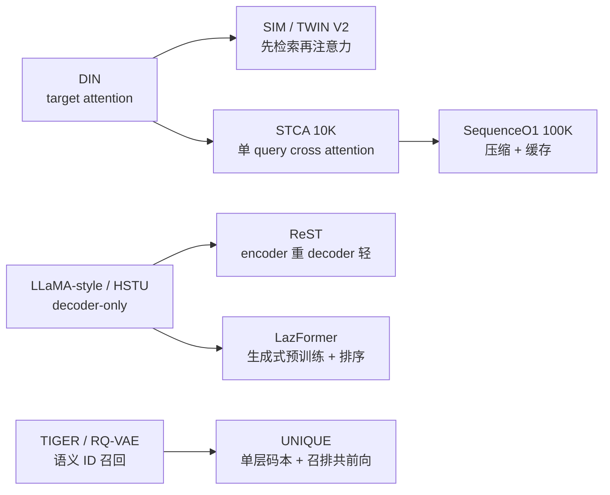

import Callout from '../../components/blog/Callout.astro'
import Figure from '../../components/blog/Figure.astro'
import TechGraph from '../../components/blog/TechGraph.astro'

# 一份历史，千个候选：四篇工业推荐论文里的计算复用

> 解读对象（均为 arXiv 预印本，下文页码指各自 PDF）： 
> **ReST**：From Language to Behavior: Scaling Sequence Transformers for Industrial Recommendation Ranking with Rec-Native Designs，ByteDance，[arXiv 2609.01240](https://arxiv.org/abs/2609.01240) 
> **SequenceO1**：End-to-End Ultra-Long (100K) Sequence Modeling in Recommendation with Low-Rank Caching，ByteDance，RecSys '26，[arXiv 2609.08443](https://arxiv.org/abs/2609.08443) 
> **LazFormer**：Scaling Transformers for Industrial Recommendation via Transferable Generative Pre-training，Alibaba International Digital Commerce，[arXiv 2609.14978](https://arxiv.org/abs/2609.14978) 
> **UNIQUE**：A Unified Retrieval and Ranking System for Large-Scale Feed Recommendation，Baidu 等，RecSys '26，[arXiv 2609.23718](https://arxiv.org/abs/2609.23718)

九月这三周里，arXiv 上出了四篇有线上 A/B 的工业推荐论文：字节两篇，阿里国际一篇，百度一篇。标题里的关键词各不相同，ReST 讲 rec-native 的 Transformer scaling，SequenceO1 讲 100K 长序列，LazFormer 讲生成式预训练，UNIQUE 讲召回排序统一。

四篇放在一起读，会发现它们花最多篇幅处理的是同一件事。推荐的一次请求里，只有一份用户历史，却要给几十到几千个候选打分。模型越大、历史越长，谁能把“用户这一侧”的计算只做一次，谁就能把更大的模型放进同样的延迟预算里。四篇论文的区别，主要在于它们把这份“只算一次”的东西放在哪一层：请求内、同一用户的多条训练样本之间、连续的多次请求之间，还是召回和排序两个阶段之间。

下面按这条线逐篇拆：先讲建模，再讲怎么省计算，最后放在一起比，并单独列出论文没交代清楚、需要打折扣的地方。

## 1. 推荐为什么不能照搬 LLM 的 scaling

LLM 的 scaling 路线已经很清楚：decoder-only Transformer，数据、参数、算力一起加，loss 按幂律下降。推荐团队这两年一直想把这条路线搬过来，HSTU、OneTrans、RankMixer 都是这个方向的尝试。ReST 在引言里把搬不过来的原因归成两点，后面三篇其实也都在回应这两点。

**第一点是信号质量**，语言里每个 token 都是可靠的观测，而用户行为里混着误点、随手划过、被位置偏差带出来的曝光。行为之间的时间间隔也不均匀，相邻两次点击可能隔几秒，也可能隔几天，只按序号编码位置就丢掉了这层信息。监督信号也很稀疏：LLM 每个位置都有“下一个 token”作为标签，排序模型只有一个延迟到达的 0/1 转化标签。ReST 还观察到一个更具体的现象：在“序列模块 + 传统 DLRM 特征”的混合排序器里，主 loss 可以靠记忆性很强的非序列特征走捷径，序列模块几乎拿不到梯度。模型越大，这个问题越严重。他们把它叫作 sequence starvation。

**第二点是计算形状**。LLM 推理是一条序列往后生成。排序是一份历史配 N 个候选。如果把用户历史和每个候选拼在一起、每个候选各跑一遍 decoder，计算量是 N·(T + C)，其中 T 是用户侧，C 是候选侧。把用户侧拆出来只算一次，变成 T + N·C。当 T 远大于 C 时，这两种写法的差距就是 N 倍。

<TechGraph src="/images/posts/一份历史千个候选-四篇工业推荐论文里的计算复用/compute-shape.svg" title="LLM 和推荐排序的计算形状" caption="图解：LLM 每个位置都有标签；排序是一份历史对 N 个候选，标签稀疏且延迟。用户侧能不能只算一次，决定了序列模型能放多大（博主自绘，基于 ReST Section 1 的论述）" />

长序列这条线之前的工业做法，大多是两阶段检索：SIM、TWIN、TWIN V2 先离线聚类或按类目检索出和候选相关的一小段行为，再做 target attention。这类方法能上线，但检索这一步和最终排序目标是分开优化的。字节在 WWW 2026 的 STCA 把端到端建模推到了 10K：去掉历史内部的 self-attention，只保留“候选对历史”的单 query cross attention，每层复杂度随长度线性增长。SequenceO1 的 baseline 就是 STCA 10K 加 TWIN V2，ReST 也把 STCA 列为 baseline。

四篇的起点不同，面对的序列长度也差了两个数量级。先看一张总览：

<TechGraph src="/images/posts/一份历史千个候选-四篇工业推荐论文里的计算复用/sequence-length-map.svg" title="序列有多长，历史怎么进模型" caption="图解：四篇论文处理的序列长度与历史进入模型的方式，横轴为对数刻度（博主自绘，基于四篇原论文实验设置与部署章节）" />

UNIQUE 的序列很短，严格说它不是长序列论文。我仍然把它放进来，是因为它把“复用”推到了另一个方向：召回和排序共用一次前向。这一点放到第 5 节再说。

## 2. ReST：先把序列模块喂饱，再把计算拆成两半

ReST 来自字节，场景是 TikTok Shop Ads 的 CVR 预估。它做的事情可以分成两部分：一部分让序列 encoder 在推荐数据上能越堆越好，另一部分让它在 50ms P99 的预算里跑得起来。

<Figure src="/images/posts/一份历史千个候选-四篇工业推荐论文里的计算复用/rest-fig1.png" alt="ReST 架构：重的序列 encoder T 与轻的 cross decoder C" caption="来源：ReST 原论文 Figure 1，PDF 第 3 页；仅作忠实裁剪" />

### 2.1 encoder 里的三处改动

ReST 的 encoder 从 LLaMA 风格的 block 出发（causal self-attention + SwiGLU），改了三个地方。

**Dual-Gated Attention（DGA）**，在 attention 前后各加一个 sigmoid 门。value 门在聚合之前压低不可靠的行为特征，输出门在聚合之后控制这段上下文能改写当前表示多少。论文特意说明没有沿用 HSTU 的 SiLU 输出门，因为 SiLU 无上界，在他们的规模上出现过 attention 输出发散。消融里（Table 3），只加输出门 +0.03%，Q/K/V 全加门能到 +0.06%，但 FLOPs 多 14.9%；输出门加 value 门也是 +0.06%，FLOPs 只多 7.5%。最后选的是后者。

**RoPE + RoTE**，把 attention head 分成两组：一组用普通 RoPE 编码序号，另一组用 Rotary Temporal Embedding，把真实时间戳按 head 各自的粒度分桶后再旋转。附录 A.2 给了工业实现：一个 head 用 RoPE，其余 head 分别用秒、分、时、天、周、季度、年七种粒度。因为用的还是旋转矩阵，点积只依赖两个时间桶之差，FlashAttention 也照样能用。消融里 RoPE 贡献 +0.04%，加单一粒度（秒）的 RoTE 到 +0.08%，多粒度到 +0.12%。论文特意交代：所有变体都已经把时间差当作 token 的附加特征输入了，所以这 +0.08% 是“把时间写进 attention 本身”额外带来的。

**Stabilized Residual Normalization（SRN）**，前约 25% 的层用 Post-LN，之后用 Pre-LN（Mix-LN 的做法），再给每个残差分支乘一个可学习的标量，初始化为 0.01。深层网络一开始接近恒等映射，残差更新随训练逐步放开。16 层设置下，Mix-LN 单独 +0.02%，SRN +0.08%。

### 2.2 sequence starvation 和两个训练期辅助 loss

这是 ReST 里对广告团队最有用的部分，改动小，也容易复现。

做法是在序列侧单独挂一个 CVR 预测头，只能看序列输出和候选广告特征，看不到非序列的 DLRM 特征，权重 λ = 0.1。另加一个 SigLIP 风格的对比 loss，把同一用户的序列表示和非序列表示拉近。两个 loss 都只在训练时使用，推理时去掉。

<Figure src="/images/posts/一份历史千个候选-四篇工业推荐论文里的计算复用/rest-fig2.png" alt="加与不加辅助序列 CVR loss 时，序列 encoder 的梯度范数" caption="来源：ReST 原论文 Figure 2，PDF 第 4 页；仅作忠实裁剪" width="70%" />

附录 A.3 给了具体数字：加上辅助 loss 后，encoder 各层 Q/K/V 投影的平均梯度范数从 2.35 升到 8.50。Table 4 显示，这个 loss 对所有序列模型都有用，而且模型越大收益越大：LLaMA 从 Base 的 +0.16% 到 Large 的 +0.22%，STCA 从 +0.13% 到 +0.20%。ReST 自己只有 +0.07% 到 +0.12%，作者的解释是它的 encoder 本身对这个 loss 依赖较小。

另外，主表里所有 baseline 都加了这个辅助 loss。所以 ReST 相对 LLaMA、HSTU 的领先，不包含这部分收益。

### 2.3 encoder 重、decoder 轻

decoder 只用四个语义 query token（[CLS]、context、user、ad）去读 encoder 的输出。有两个省计算的设计。

- **Projection-free KV**：直接把 encoder 输出当 K 和 V，不再为每个候选重新做 K/V 投影。
- **Token-Specific Parameterization**：四个 query token 各有一套 Q、输出门和 FFN 参数，参数量增加，激活 FLOPs 不变。

Table 3 的 Architecture 组算了这笔账：加 decoder 带来 +0.05% AUC，FLOPs 只多 0.2%；如果不用 projection-free KV，FLOPs 会多 6.7%，AUC 一样。同一组里还有一行：**在 encoder 里加 MoE，参数 +500%，AUC +0.00%**。在这个任务上，encoder 的瓶颈不在参数量。

<Figure src="/images/posts/一份历史千个候选-四篇工业推荐论文里的计算复用/rest-tab3.png" alt="ReST 架构与 block 设计消融表" caption="来源：ReST 原论文 Table 3，PDF 第 7 页；仅作忠实裁剪" width="60%" />

结构拆开以后，系统侧顺着这个边界做了两件事：

- **User-level shared-prefix training（ULT）**：同一用户在一个时间窗内的多条样本合并成一条并集序列，encoder 跑一次，用前缀掩码保证每条样本只看到自己当时的历史。在已经做过算子融合、混合精度、去 padding 的训练框架上，端到端吞吐又提升了 5.8 倍。
- **Shared-prefix serving**：每个请求只跑一次 encoder，所有候选复用，序列部分的单请求推理成本最多降到 1/20。

### 2.4 结果

离线在 TikTok Shop Ads 数据上，以线上 DLRM 为基准报相对 AUC。Large 配置下（序列部分约 32 GFLOPs），ReST +0.92%，LLaMA +0.70%，HSTU +0.61%，参数量对齐的现代 encoder-decoder（Trans.）+0.72%。论文说在这个场景里离线 +0.05% 就有实际意义。

<Figure src="/images/posts/一份历史千个候选-四篇工业推荐论文里的计算复用/rest-fig4.png" alt="ReST 在序列长度、深度、宽度三个轴上的 scaling 曲线" caption="来源：ReST 原论文 Figure 4，PDF 第 6 页；仅作忠实裁剪" />

scaling 曲线是这篇论文的核心证据。序列长度从 100 加到 16K，不加辅助 loss 的 LLaMA 几乎不涨，加了以后 ReST 在整个区间多涨了约 0.4%。深度方向上，LLaMA 过了 8 层、HSTU 过了 16 层就基本不再涨，ReST 从 +0.59% 升到 +0.76%。宽度从 128 到 512，LLaMA 和 HSTU 在 256 附近就平了，ReST 是唯一在 512 仍单调上升的。

线上 A/B 一周，实验组 20% 流量，满足 50ms P99：线上流式 AUC +1.31%，广告主价值指标 Advv +11.93%（p 小于 0.01），已全量。

<Callout type="warning" title="读 ReST 数字时要注意的三点">
线上 AUC +1.31% 比离线 Large 配置的 +0.92% 还高，说明上线的配置和离线表里的不是同一个，但论文没有给出线上配置的层数、长度和硬件。Advv 的具体定义没有公开，这类广告收入指标还受竞价和预算分配影响，+11.93% 不能直接理解成模型精度的提升幅度。scaling 拟合 ΔAUC = a·F^b 的 R² 是在 log 空间里算的，指数 b 在 0.09 到 0.10 之间，三条曲线的主要差别在系数 a。
</Callout>

## 3. SequenceO1：把 100K 历史压成可缓存的固定大小

SequenceO1 也来自字节，场景是抖音精排，已发表在 RecSys '26。它的起点是 STCA 10K：再往 100K 走，瓶颈已经不只是每层的计算量，还包括样本存储、主机和 GPU 之间的传输、分布式通信。所以它的思路是：让 100K 这部分只依赖用户，压缩成固定大小，然后尽可能缓存。

<Figure src="/images/posts/一份历史千个候选-四篇工业推荐论文里的计算复用/seq-fig2.png" alt="SequenceO1 总览：现有瓶颈、模型、训练、推理" caption="来源：SequenceO1 原论文 Figure 2，PDF 第 3 页；仅作忠实裁剪" />

### 3.1 Sketch Attention：换一个方向做 softmax

Sketch Attention 用 k 个全局共享的可学习原型（prototype）当 query，去和 100K 条行为算亲和度，得到 k×n 的矩阵，然后加权聚合出 k×d 的 sketch。线上配置是 k = 1024、d = 128，堆两层做细化。

关键在 softmax 的方向。普通 attention 是每个 query 在所有 token 上做 softmax，每个原型各自挑出最相关的几条行为。Sketch Attention 反过来，每条行为在所有原型上做 softmax，也就是每条行为都必须把 1 份权重分配出去。前一种做法下，多个原型可能都挤到少数显眼的行为上，大量历史没人管。后一种做法保证每条行为都进了 sketch。因为 sketch 生成时还不知道候选是谁，它需要尽量完整地保留历史，挑选的工作留给后面的 STCA。

sketch 算出来以后，模型走两条路：最近 10K 条行为直接做 STCA，捕捉近期兴趣；sketch 上再做一次 STCA，读长期信号。两路结果交给 MixFormer 融合。

Table 3 对比了几种压缩方式。同样压到 1K×128，Sketch Attention 比 STCA(512) 基准高 +1.07%，TWIN V2 风格的 KMeans 聚类只有 +0.30%，按块平均 +0.46%，按位置分桶的 query +0.72%，Lightning Attention 压缩器 +0.83%。按位置分桶效果一般，说明相关的行为在序列里经常隔得很远，这一点和语言不一样。

<Figure src="/images/posts/一份历史千个候选-四篇工业推荐论文里的计算复用/seq-tab3.png" alt="100K 压缩方法对比" caption="来源：SequenceO1 原论文 Table 3，PDF 第 7 页；仅作忠实裁剪" width="60%" />

### 3.2 缓存、合批和提前计算

sketch 只依赖用户，所以能缓存。缓存 key 包含用户 ID、模型版本、历史时间戳和 sketch 配置，按 TTL 失效。训练侧 TTL 3 小时，命中率约 0.5；线上用同一套接口，TTL 1 小时，命中率约 0.6。训练和线上用同一套缓存接口，也减少了训练和服务之间的不一致。

另外两个配套手段：

- **MRLB**（Multi-Request Level Batching）：训练时把同一用户短时间内的多次请求分成一组，sketch 算一次，组内所有目标共用。附录用 R = 40 估算。
- **Pipeline lift**：sketch 只依赖用户，可以在请求刚进来时就开始算，和召回并行。命中缓存就直接查表；没命中，计算也不占精排的延迟预算。

还有一个 FlashSA 融合 kernel，分块计算亲和度和按原型的 softmax 统计量，不在 HBM 里存完整的 k×n 矩阵。

<Figure src="/images/posts/一份历史千个候选-四篇工业推荐论文里的计算复用/seq-fig1.png" alt="SequenceO1 到 100K 的训练/推理 FLOPs 与效果" caption="来源：SequenceO1 原论文 Figure 1，PDF 第 2 页；仅作忠实裁剪" width="60%" />

### 3.3 数字怎么看

摘要和 Figure 1 里最显眼的是 49.9 倍和 63.9 倍。这两个数要看清楚是怎么算的（附录 G）：

- 只统计 100K 这一条分支的 GEMM FLOPs，近期 10K 分支和排序器的开销在两边都不算；
- 训练侧按命中率 0.5、R = 40 代入公式，推理侧按命中率 0.6、R = 300 代入公式；
- 对比对象是在 100K 上直接跑 STCA，线上并没有这个系统。

所以这是基于观测命中率的解析估算，不是端到端实测的加速比。论文没有给出线上延迟、GPU 用量和缓存陈旧对效果的影响。

效果方面，Figure 1(c) 显示，在平均 85K 长度下，SequenceO1 保留了直接加长 STCA 83% 的收益（+1.07% 对 +1.29%）。图例把 STCA 分成 measured 和 estimated 两种点，所以 +1.29% 这个对照值本身可能是外推出来的。生产环境离线对比中，baseline 是 STCA 10K + TWIN V2，SequenceO1 去掉 TWIN V2，换成 100K sketch 分支：所有目标都有提升，Finish AUC +0.29%，Dislike AUC +1.29%、UAUC +3.63%。

线上在抖音和抖音极速版跑了一个月，全部指标显著。抖音：30 日活跃 +0.20%，时长 +1.50%，完播 +2.33%，评论 +3.59%，点赞 +2.36%，不喜欢 -6.98%。极速版完播 +3.49%，评论 +8.61%。

## 4. LazFormer：复用的是参数，还有训练数据

LazFormer 来自阿里国际数字商业集团，场景是一个大型电商平台的首页推荐，同时预估 CTR 和 CVR。它的序列最长，默认只有 2048，实验扩到 9216，对长序列的处理也最朴素。这篇的新东西主要在训练流程：预训练出来的参数怎么接到排序模型上，以及同一批数据怎么安全地多训几轮。

### 4.1 预训练怎么接到排序

第一步是生成式预训练。在一年的用户行为上做 next-item prediction（1600 万用户，110 亿 token），5 层 Transformer，16000 个 batch 内负样本，InfoNCE。预训练同时得到稀疏的 item embedding 和稠密的 Transformer 参数。

问题出在排序阶段有预训练时没有的特征，比如加购、下单，以及它们和最近一次点击的时间间隔。直接把这些特征拼进输入，会打乱预训练学到的表示空间。LazFormer 的办法是 Transferable Residual Adapter：新特征经过 down-GELU-up 两层映射后加到 token 表示上，up 矩阵初始化为 0。排序开始时新特征完全不起作用，模型等于预训练模型，然后逐步学会使用新特征。这就是 LoRA 那种零初始化的思路。

消融（Table 3）对比了几种做法：只迁移稀疏参数，CTR AUC 0.7699；直接拼接新特征 0.7701；在输入投影之前加一个随机初始化的融合层 0.7699；零初始化 adapter 0.7735。还有一个值得看的结果：完全不用新特征时，CTR GAUC 还不错，但 CVR AUC 掉到 0.8809。加购和下单这类信号对转化预估是必需的。

### 4.2 排序时的历史怎么处理

排序模型是请求级的：一条样本是一个请求，包括一份历史和这个请求里的所有候选，历史只序列化、传输、编码一次。

<Figure src="/images/posts/一份历史千个候选-四篇工业推荐论文里的计算复用/laz-fig2.png" alt="LazFormer 的 hybrid sparse attention 掩码" caption="来源：LazFormer 原论文 Figure 2，PDF 第 4 页；仅作忠实裁剪" width="60%" />

历史部分三层处理：

- **从粗到细压缩**：最近 1024 条保留原样，更早的每 8 条做一次 sum pooling；
- **Hybrid sparse attention**：历史 token 用 128 的滑动窗口做因果注意力，最近 128 条是全局 token；候选能看到全部历史，但候选之间互相看不见，只能看自己；
- **逐层裁剪**：层数越深，保留的历史 token 越少，最少 128 个。

实现上用 flex attention 把掩码编译成块稀疏 kernel。最终配置的注意力稀疏度 92.63%，注意力加速 5.1 倍，AUC 比完整 self-attention 低 0.10 个百分点。作者的取舍逻辑是：省下的算力拿去加层数、加长度、多训几轮，收益大于这 0.10 个点的损失。

### 4.3 多 epoch：每轮重置稀疏参数

推荐里的“一个 epoch 就过拟合”现象大家都见过：embedding 表参数量太大，同样的数据多看一遍就记住了。LazFormer 的做法是每个 epoch 开始时，把稀疏参数重置回预训练时的状态，稠密参数继续沿用上一轮的结果。

<Figure src="/images/posts/一份历史千个候选-四篇工业推荐论文里的计算复用/laz-tab4.png" alt="LazFormer 多 epoch 训练策略对比" caption="来源：LazFormer 原论文 Table 4，PDF 第 7 页；仅作忠实裁剪" width="60%" />

Table 4 的结果：

| 配置 | CTR AUC |
|---|---|
| 从零训练，1 个 epoch | 0.7577 |
| 加载预训练 sparse 并冻结，1 个 epoch | 0.7675 |
| 加载预训练 sparse 并继续更新，1 个 epoch | 0.7699 |
| 继续更新 sparse，3 个 epoch | **0.7387** |
| 每轮重置 sparse，3 个 epoch | 0.7731 |
| 每轮重置 sparse + 加载预训练 dense，3 个 epoch | 0.7761 |

持续更新稀疏参数训三轮，AUC 比只训一轮还低 3 个百分点。改成每轮重置，三轮才比一轮好。

### 4.4 结果

离线：CTR AUC 0.7735，比最好的 baseline（OneTrans 0.7661）高 0.74 个百分点；三轮训练版本 0.7761。论文说在这个数据上 0.1 个百分点就算显著。缩小到和 baseline 一样的 3 层、1024 长度，仍有 0.7704，训练 FLOPs 14G，比 vanilla Transformer 的 20G 还少。

线上首页推荐两周 A/B，对照组是 3 层的 SORT 类模型：IPV +5.21%，订单 +3.38%，买家 +3.70%，GMV +9.85%。模型从 3 层加到 5 层、序列变长以后，A10 单机 QPS 下降 12.1%。

<Callout type="note" title="LazFormer 的对比条件">
所有 baseline 都统一在 1024 长度、3 层下比较，并且都加载了同一份预训练 sparse 参数，这个设置本身是公平的。但 STCA 的设计目标是 10K 以上的长序列，在 1024 长度下比较，发挥不出它的优势；论文对 STCA 的描述（“aggressively compressing the user history”）也和 STCA 原文的机制不完全一致。线上结果没有报显著性检验，PDF 模板里还留着 "Conference'17" 的占位信息，属于较早期的预印本。
</Callout>

## 5. UNIQUE：召回和排序共用一次前向

UNIQUE 来自百度（与北航、港城大合作），RecSys '26，部署在手机百度的首页信息流、发现页、短视频三个场景，而且部署在**召回阶段**。

<Figure src="/images/posts/一份历史千个候选-四篇工业推荐论文里的计算复用/uni-fig1.png" alt="UNIQUE 总览：UIGN、EQN、TDN 三个模块" caption="来源：UNIQUE 原论文 Figure 1，PDF 第 4 页；仅作忠实裁剪" />

### 5.1 单层码本

生成式召回通常用 RQ-VAE 给 item 分配多层语义 ID。UNIQUE 认为多层结构有两个问题：第一层分错了，后面几层会跟着错；热门 item 会占掉大部分码的容量，长尾 item 挤在少数几个码里。

它的做法是换成单层码本：生产环境用一层 16384 个码，替换原来 128×128 的两层结构，总容量相同。量化前，item embedding 先经过一组 DSSM 风格的多任务双塔，用相关性、CTR、时长、完播这些反馈信号训练，所以码里带有“用户实际怎么反应”的信息，而不只是内容元数据。码本用 EMA 更新，分配时按码的使用频率调整距离：用得越多的码，分配代价越高。

<Figure src="/images/posts/一份历史千个候选-四篇工业推荐论文里的计算复用/uni-fig2.png" alt="单层码本与两层码本的资源集中度对比" caption="来源：UNIQUE 原论文 Figure 2，PDF 第 7 页；仅作忠实裁剪" width="60%" />

生产码本分析显示，每个码分到的资源数方差从 1510.85 降到 389.57；每个码内占比最高的类目平均占比从 65.43% 升到 78.08%。也就是说，码的负载更均匀了，每个码内的内容也更集中在同一类目上。

### 5.2 early fusion 和 target split

模型是一个 Transformer：前缀是用户画像加三段行为（短期 100 条曝光，包括没点的；中期 200 条满意观看；按类目整理的兴趣序列 200 条），后面接上候选 item token 和候选码 token。前缀内部做 self-attention，候选 token 只能看前缀、彼此看不见，这和 LazFormer 的候选隔离是同一个思路。

一次前向同时产出两类结果：码 token 位置的输出过 MLP 得到码的 logits，用于召回；item token 位置的输出接多个任务头，用于打分。论文的主要论点是，这样排序的监督信号也能改善召回用的表示。

序列长度 501 这个配置写在公开数据集的实现细节里，生产环境的序列长度论文没有单独说明。

### 5.3 部署细节是这篇最有价值的部分

UNIQUE 的离线实验只用了 KuaiRand-Pure 一个公开数据集，只有 7583 个 item，作者自己也说这只是“sanity check”。这篇真正有参考价值的是部署和成本信息，这在工业论文里很少见：

- 约 400 张 NVIDIA L20，每个实例绑一张卡，TensorRT FP16；
- 峰值约 10000 QPS，平均延迟 37ms，P99 89ms，线上推理 MFU 44.23%；
- 每千次请求成本约 0.0013 美元；
- 召回时取 100 个码，召回几十万个 item，先用内积粗排取 10K，再按码分组进精排，每个码出 30 个；
- 中午用 15 秒缓存窗口，晚上用 30 秒，命中率分别是 37% 和 60%；
- 新 item 首次曝光后 5 分钟内进入训练流，1 小时内完成量化。

线上 A/B 一周：总时长 +0.96%，总分发量 +1.08%，留存 +0.70%，新用户时长 +1.44%。UNIQUE 召回的候选占召回池的 22.5%。长尾候选占比相对提升 25.7%，类目覆盖相对提升 23.3%。

<Callout type="warning" title="“统一召排”要打个折扣">
从部署描述看，UNIQUE 上线的是一路召回源：码预测召回之后，仍然有内积粗排和独立的精排阶段，A/B 的对照组是“之前的召回链路”。所以线上收益验证的是一个更好的召回源，召回和排序真正合并成一个模型还没有在线上证明。另外，论文引言说 2026 年 2 月起部署，4.1.2 节又说 1 月起，两处不一致。
</Callout>

## 6. 放在一起比：什么只算一次，在哪一层复用

四篇的建模差别很大，但如果只看“省计算”这条线，它们都在复用用户侧计算，只是复用的层次不同。

<TechGraph src="/images/posts/一份历史千个候选-四篇工业推荐论文里的计算复用/reuse-matrix.svg" title="什么只算一次，在哪一层复用" caption="图解：按请求内、训练样本、跨请求、跨阶段四个层次对比四篇论文的复用手段（博主自绘，基于四篇原论文方法与系统章节）" />

**请求内复用已经是标配**，四篇都做了，只是写法不同：ReST 拆成 encoder 和 decoder；LazFormer 和 UNIQUE 把候选拼在历史后面，用 mask 隔离候选之间的注意力；SequenceO1 的 sketch 天然只依赖用户。现在新写排序模型，如果每个候选还要重新编码一遍历史，很难说得过去。

**训练侧的复用最容易被低估**。ReST 的 ULT 在已经很优化的训练框架上又提升了 5.8 倍吞吐。LazFormer 把样本改成请求级，同一份历史只序列化和传输一次。两者都没动模型结构，改的只是样本怎么组织。长序列模型的训练成本，有很大一部分花在反复存储、搬运同一段历史上。

**跨请求缓存会带来新鲜度问题**。SequenceO1 和 UNIQUE 都做了跨请求缓存，分别是 1 小时 TTL 和 15 到 30 秒窗口。用户刚刚的行为，要等缓存过期才会进入 sketch。SequenceO1 用“最近 10K 走单独分支”来弥补这一点，这可能也是它保留双路结构的原因之一。但两篇都没有量化缓存陈旧带来的效果损失。

**跨阶段复用还在早期**，UNIQUE 让召回和排序共享表示，SequenceO1 把 sketch 计算提前到召回阶段。LazFormer 复用的则是训练流程里的参数：预训练的参数给排序用，同一份数据安全地多训几轮。

四篇都从 LLM 借了技巧，也都做了改动：

<TechGraph src="/images/posts/一份历史千个候选-四篇工业推荐论文里的计算复用/llm-borrow.svg" title="从 LLM 借来的技巧，到推荐里怎么改" caption="图解：七组 LLM 做法与四篇论文在推荐场景中的改法对照（博主自绘，基于四篇原论文方法章节与消融表）" />

改动的方向基本一致：LLM 的做法默认 token 可靠、间隔均匀、监督稠密、计算只沿一条序列展开，推荐数据在这几点上都不满足。RoTE 处理不均匀的时间间隔，DGA 处理行为噪声，辅助 loss 处理稀疏监督，sketch 缓存和 shared-prefix 处理“一份历史对多个候选”的计算形状。其中最能说明问题的是 ReST 那行消融：MoE 在 LLM 里是低成本扩容的标准做法，在这个任务上参数加了 5 倍，AUC 完全没变。

## 7. 这四篇没说清楚的地方

**离线指标不能横比**。ReST 报的是相对线上 DLRM 的 AUC 百分比；SequenceO1 报的是相对 STCA(512) 或 STCA 10K 的相对提升；LazFormer 报的是绝对 AUC 和百分点；UNIQUE 报的是公开数据集上的 HR 和 NDCG。“+0.92%”和“+0.74 pt”不是一个单位，四篇也没有共享任何数据集。

**线上指标更不能比**。Advv +11.93%、GMV +9.85%、完播 +2.33%、时长 +0.96%，四个数字分别对应广告收入、电商成交、内容消费和召回源替换，基线的成熟度也不一样。数值大的不代表模型改进更大。

**训练成本基本没有披露**。四篇都没有给训练所需的 GPU 小时。LazFormer 报了单次训练的 FLOPs，SequenceO1 报了解析 FLOPs，ReST 报了吞吐倍数，只有 UNIQUE 给了线上服务的硬件规模和单位成本。对想复现的团队来说，这正是最需要的信息。

**SequenceO1 的收益取决于缓存命中率**。附录的公式写得很清楚：期望 FLOPs 等于命中时的成本加上（1 - 命中率）乘以 SA 的计算量。用户访问越稀疏，命中率越低，收益越小。0.5 和 0.6 这两个命中率是抖音的访问频率下测出来的，换到用户一天只来一两次的业务，结果会明显不同。

**字节两篇有共同的技术来源**。SequenceO1 的作者和 STCA 原文作者有很大重合，ReST 也用 STCA 做 baseline，两篇的内部基线都是字节自己的系统。它们互相印证了“用户侧重计算、候选侧轻计算”这个方向可行，但不能算两个独立团队的交叉验证。

## 8. 给做广告和推荐的人

如果手上有一个“DLRM + 序列模块”的混合排序器，下面几件事不需要大改结构，可以直接试：

1. **先检查序列分支是不是在“挨饿”。** 看序列模块的梯度范数；给序列侧挂一个看不到 DLRM 特征的辅助 CTR/CVR 头，λ 从 0.1 开始。ReST 的数据显示，模型越大，这一步收益越大。
2. **先改样本组织，再改模型。** 把同一请求、同一用户的样本合并，历史只存储、传输、编码一次。ULT 的 5.8 倍和 LazFormer 的请求级样本，都是在不改模型的前提下拿到的。
3. **给预训练模型加新特征时，零初始化新增的分支。** 这个做法成本很低，LazFormer 的消融说明直接拼接会损失效果。
4. **想多训几轮，就每轮重置 embedding。** 稀疏参数重置，稠密参数继续训练。LazFormer 的 Table 4 给了很清楚的对照。
5. **做用户侧缓存，先定 key 和 TTL，再定模型。** 缓存 key 至少要包含模型版本和历史时间戳，否则模型更新以后会读到旧版本的 sketch；TTL 设多长，要同时看命中率和新鲜度损失，最好线上实测。
6. **不要急着在序列 encoder 里加 MoE。** 至少先做一次 ReST 那样的对照实验。

## 参考资料与图片来源

- Chen et al. *From Language to Behavior: Scaling Sequence Transformers for Industrial Recommendation Ranking with Rec-Native Designs.* ByteDance, arXiv 2609.01240, 2026.
- Guan et al. *SequenceO1: End-to-End Ultra-Long (100K) Sequence Modeling in Recommendation with Low-Rank Caching.* RecSys '26, arXiv 2609.08443, DOI 10.1145/3773078.3831864.
- Li et al. *LazFormer: Scaling Transformers for Industrial Recommendation via Transferable Generative Pre-training.* Alibaba International Digital Commerce, arXiv 2609.14978, 2026.
- Liu et al. *UNIQUE: A Unified Retrieval and Ranking System for Large-Scale Feed Recommendation.* RecSys '26, arXiv 2609.23718, DOI 10.1145/3773078.3831936.
- 论文原图均为对应 PDF 的页面无损裁剪，未做任何修改；标注“博主自绘”的图为本文作者根据论文内容绘制。
