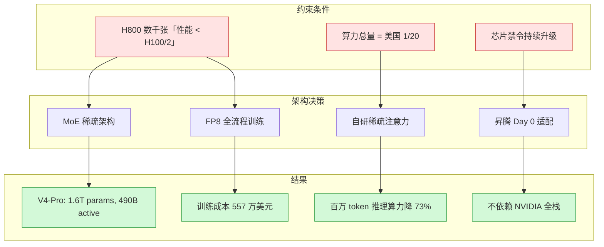
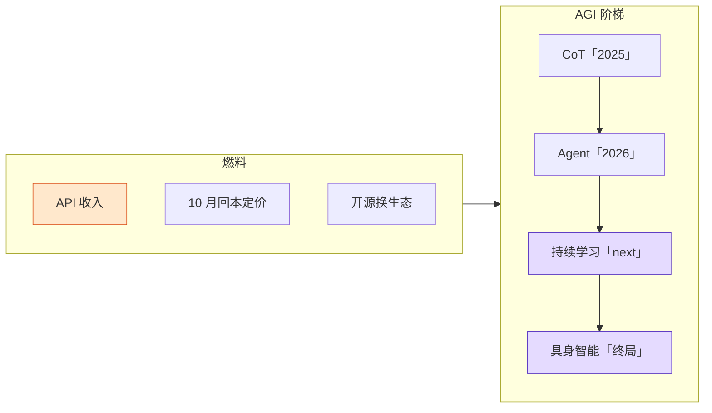

import Diagram from '../../components/blog/Diagram.astro'

# 二十分之一的算力，凭什么只落后一年

本周一份 42 页的文件在投资圈疯传。DeepSeek 创始人梁文锋今年 5 月 20 日与投资人的闭门交流会，3 小时 44 分钟的完整录音被整理成了 3.4 万字的文字稿。

这场交流会发生在 DeepSeek 完成首轮外部融资期间，募资总额超 500 亿元人民币，投前估值约 3675 亿元。但整份文稿里最有冲击力的不是估值数字，而是一句话：

"落后美国一到两年，但只用了美国二十分之一的算力把这个事情做出来。"

这个数字值得停下来想一想。不是二分之一、不是五分之一，是二十分之一。如果你把它类比成赛车，就是别人用 2000 马力的引擎跑到 300km/h，你用 100 马力跑到 280km/h。这不是"省了点钱"，这意味着两台车在用完全不同的空气动力学。

## 约束产生的四个架构决策

为什么 1/20 的算力能逼近 1x 的性能？约束迫使 DeepSeek 在四个关键节点上做了不同于硅谷主流的架构选择。

**第一个：MoE 稀疏架构而非 Dense 模型。** V4-Pro 总参数 1.6 万亿，但每次推理只激活 490 亿。V4-Flash 参数 2840 亿，激活 130 亿。相比之下，GPT-4o 和 Claude 的训练是在 Dense 架构上做的，每个 token 都要过全部参数。MoE 的代价是路由算法的复杂度和通信开销，好处是训练和推理的算力需求可以降一个数量级。

他们手里只有几千张 H800（被阉割过的版本，性能不到 H100 的一半）。Dense 模型在这个算力规模上根本训不到有竞争力的参数量。MoE 不是最优选项，是唯一选项。

**第二个：FP8 低精度训练从第一天就是默认选项。** 传统做法是 FP32 训练、FP16 推理，然后逐步量化。DeepSeek 从 V3 开始就用 FP8 做全流程训练，内存占用降低 50% 以上，等效算力翻倍。这在技术上是有风险的，精度损失在长序列场景下会累积。但他们没有"先 FP32 训好再量化"的算力预算。

**第三个：自研稀疏注意力。** V4 在百万 token 场景下，单 token 推理算力降到 V3.2 的 27%，KV cache 占用仅 10%。标准的 multi-head attention 在长上下文场景下的计算量是 O(n^2)，这在有限算力下是不可接受的。他们被迫在注意力机制本身上做手术。

**第四个：与华为昇腾的 Day 0 联合适配。** V4 是全球最大规模 AI 开源模型中第一个在国产芯片上完成从训练到推理全栈部署的，不依赖任何 NVIDIA 硬件。昇腾 950 原生支持 FP8/MXFP4，针对 MoE 离散访存做了硬件级优化。这不是"也能跑"的兼容性适配，而是"只能跑这个"的生存选择。

<Diagram title="约束 → 决策 → 结果" caption="红色是约束条件，绿色是架构产出">

</Diagram>

## 定价作为架构延伸

梁文锋对 API 定价的描述只有一句话："买一批设备回来，大概 10 个月收回设备成本，我们觉得就够了。这就是一个合理的利润。"

R1 发布时的定价是百万 token 输入 0.55 美元、输出 2 美元，对比 o1 的 15 美元和 60 美元。降幅不是 50%，是 95%。

这个定价不是"亏损换市场份额"的互联网打法。它的底层逻辑是：当你的 MoE 架构让每次推理只激活总参数的 3%，当你的 FP8 训练让同样的卡能跑两倍的量，你的成本结构本身就和 Dense + FP16/32 的竞争对手不在同一个数量级。10 个月回本在他们的成本结构下是真实可行的。

更精妙的是这个定价对生态的影响。梁文锋说："在这个利润水平下，独立部署的第三方无利可图。"开源代码谁都可以拿，但你自己跑的成本比直接调 DeepSeek API 还高。开源不损害商业化，反而把潜在竞争者变成了生态的一部分。

这是第五个创新，也是最精妙的：用效率壁垒让复制者无利可图，不需要资本壁垒。

## AGI 路线：阶梯式，不是突变

梁文锋把 AGI 发展比作爬楼梯：

- 去年的阶梯是 CoT（思维链），让 AI 通过"想"来提升智能上限
- 今年的阶梯是 Agent，让 AI 从"回答"走向"执行"
- 下一个阶梯是持续学习（Continual Learning）

他的原话是："下一代模型的核心能力，它必须要有持续学习的能力，它才能叫下一代模型。如果先把持续学习做出来，通用智能可能就很容易了。"

这个判断和 Richard Sutton 本周宣布创办 Oak Lab 时的表态高度一致。Sutton 说当前的深度学习方法是"脆弱且低效的，需要从根基上重新来过"。两人在同一周各自表达了同一个观点：当前范式（预训练 + RLHF/RLVR + 推理时间计算）不是 AGI 的终局，持续学习才是。

有意思的是梁文锋对终局的判断："所有路线的终点可能都是具身，因为人的需求不是电脑，而是人力。" 这和他把 C 端、B 端都定义为"做 AGI 路上的副产物"是一致的。API 收入不是目标，是维持研究的燃料。

<Diagram title="AGI 阶梯与燃料" caption="紫色是下一步方向，橙色是当前收入支撑">

</Diagram>

## 500 亿融资的真实目的

市场关注的是估值和 IPO 传闻。但文稿揭示的融资逻辑完全是另一个故事。

DeepSeek 此前多名核心骨干被挖走，四大方向（基座、代码、多模态、推理）的负责人分别被腾讯、小米、字节、自动驾驶公司以最高总包近 1 亿的条件争抢。500 亿融资的首要目的是给员工期权定下市场化估值锚点，缓解人才流失。

投资人条件极为特殊：无董事会席位、无经营投票权、资金强制锁定 5 年。梁文锋对此的解释是："你越克制，越有可能做成这件事。" 他不希望资本干预技术路线。

融资结构本身就体现了这套约束思维：用资本解决人的问题，但不让资本制造新的约束。

## 为什么硅谷的反应不是"抄"

DeepSeek 的技术路线在理论上完全可以被复制。MoE 架构的论文是公开的，FP8 训练的方法是共享的，代码甚至是开源的。但硅谷没有跟进的根本原因是：他们没有这个约束。

当你手里有 10 万张 H100，Dense 模型训练的路径是清晰的、成熟的、风险低的。MoE 的路由算法调优是一个深坑，通信开销的工程问题在大规模集群上尤其痛苦。如果算力不是瓶颈，选择 Dense 是理性的。

约束驱动创新的本质就是这样：以色列的农业技术不是因为以色列人对农业更有热情，而是因为沙漠里不滴灌就没有收成。DeepSeek 的效率不是因为中国工程师更追求效率，而是因为 H800 不够用就训不出模型。

梁文锋自己的总结是："我们跟美国的差距只有一点，就是资源。" 精确的自我定位。在资源约束下，你被迫发展出的能力（极致稀疏化、低精度训练、软硬协同优化）变成了结构性优势。当约束解除时，这些能力不会消失，会叠加。

## 对工程师的启示

这个故事对做系统的人有一个直接的提示：不要急着消除你的约束。

在广告系统里，我们经常面临类似的场景。算力预算有限时，你被迫设计更高效的特征检索方案、更轻量的模型架构、更聪明的缓存策略。这些"被迫的优化"在算力充裕后不会变成负担，而是变成你的效率护城河。

梁文锋说的另一句话适用于所有工程决策："假设 AI 最终会占人类 GDP 的 10%，DeepSeek 随便分一点点就足够了。" 这是对市场规模的判断，也是对竞争策略的判断：在一个足够大的市场里，效率优势比先发优势更持久。

关灯工厂不行（上篇写过了），但约束驱动的效率优化是真实的杠杆。不是所有路都通向 10x，但二十分之一的资源逼近 1x 的性能，本身就是一种 10x。

---

**References**

- [梁文锋四小时投资人会议实录（深蓝财经/金融界）](https://stock.jrj.com.cn/2026/07/23134157880611.shtml)
- [DeepSeek V4 的五个关键信号（36Kr）](https://m.36kr.com/p/3780450463552771)
- [从 5% 到 0.1%，梁文锋拆掉硅谷 1.1 万亿美元 AI 叙事幻觉](https://m.toutiao.com/group/7666024867611673131/)
- [华为宣布全面支持 DeepSeek V4](https://cj.sina.cn/articles/view/7879848900/1d5acf3c402002xqdq)
- [DeepSeek pause fundraise after comments on compute gap leaked (HN)](https://news.ycombinator.com/item?id=49051361)
