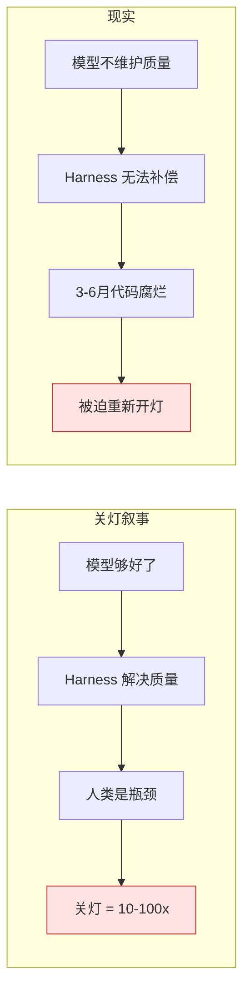
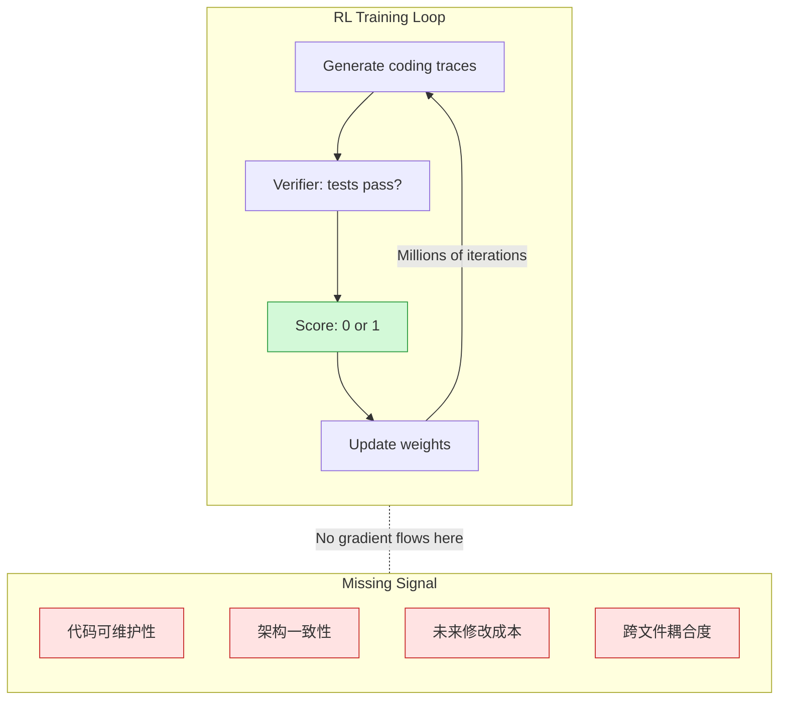
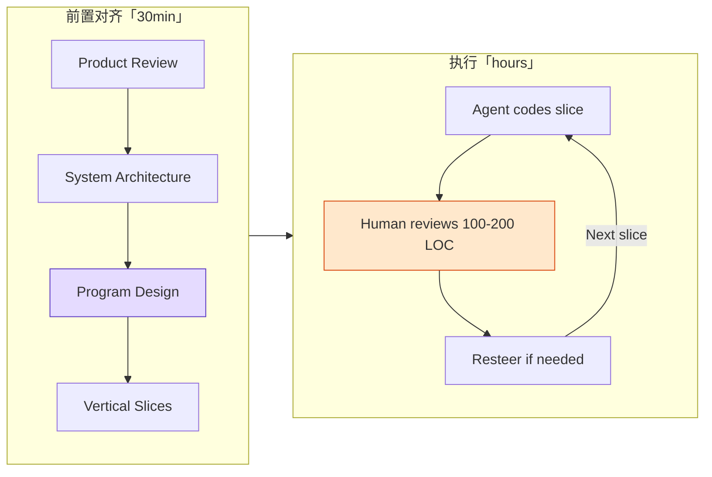

import Diagram from '../../components/blog/Diagram.astro'

# 关不了的灯：Software Factory 为什么必然失败

Faros AI 在七月初发布了一份报告，统计了企业大规模部署 AI 编程工具后的生产质量变化：incidents per PR 上升 242.7%，每位开发者的 bug 产出增加 54%，31.3% 的 PR 完全跳过了人工 review 直接合入。

这组数据和行业叙事形成了刺眼的反差。2026 上半年最有统治力的技术热词是 Harness Engineering。翁荔在七月连发两篇万字博客为它正名，LangChain 用实验数据证明同一个模型换 harness 性能差 26%，OpenAI 把内部的 Symphony 工厂公开布道，中文社区几乎每个技术平台都出了"一文读懂 Harness"。所有人都在说，只要 harness 够好，代码质量就有保障，人类可以从 review 中解放出来。

但数据说的是另一件事。Harness Engineering 是真实的、有价值的工程进步。然而它有一个结构性盲区，这个盲区让所有试图"关灯"运行的 Software Factory 都在 3-6 个月后被迫重新开灯。

## "关灯"叙事是怎么兴起的

Software Factory 这个词可以追溯到 1968 年的 NATO 会议，同一场会议也诞生了"软件工程"这个学科名。但它在 2026 年突然变成全行业热词，是因为一系列事件的叠加。

StrongDM 在年初宣布了 lights-off factory：没有人读代码，没有人写代码。OpenAI 的 Ryan Lopopolo 公开了内部系统 Symphony 的架构，并在四月的演讲中将其总结为一句话："harness engineering is what separates demo agents from production agents"。Ramp、Stripe、WorkOS、Brex 接连发文，解释自己如何让 agent 产出 75% 以上的代码。

叙事的核心逻辑很简单：

1. 你才是瓶颈
2. 模型够好了
3. 代码是免费的
4. 多 ship 就行

翁荔的博客《Harness Engineering for Self-Improvement》在七月给这个叙事加了学术层面的合法性。她的核心判断是：如果 AI 真的要走向递归自我改进（RSI），最先被改写的不是模型权重，而是模型外层的 Harness，那套负责编排任务、管理记忆、调用工具、执行评估的"操作系统"。DeepSeek 研究员崔添翼第一时间转发附议，称"Harness 方向的自进化和模型方向的自进化一样，都是非常可能出成果的方向"。

中文社区在一周内产出了数十篇解读文。腾讯云、掘金、CSDN 上的"Harness Engineering 入门"类文章，加上各种翻译稿和观点整合，形成了一个信号明确的共识：Harness 是 2026 年 AI 工程最重要的能力维度。

这个共识本身没问题。问题在于，它被过度推演成了"有了好 harness 就可以关灯"。

<Diagram title="关灯叙事 VS 现实" caption="两条逻辑链的终点都是红色警告">

</Diagram>

## "关灯实验"的真实结局

Dex Hunter-Torricke 是 HumanLayer 的创始人，也是 "Advanced Context Engineering for Coding Agents" 系列视频的作者，YouTube 累计超百万播放。他在七月的 AI Engineer World's Fair 上做了一个 keynote，把自己 2025 年七月开始的 lights-off 实验和盘托出。

他们做的事情和每个被 harness 叙事激励的团队一样：读 spec、读 ticket、background agents 处理所有中小任务。前几个月确实快了很多，感觉终于摆脱了 review 的枷锁。

然后事情开始出问题。

第一次是发现了一个 gnarly bug，agent 用了十种方式尝试复现都没有成功。他不得不硬着头皮去读自己已经三个月没看的代码库。那时候才发现，代码已经变成了"claude spaghetti"，到处是吞掉异常的 try-catch、绕过类型系统的 as any cast、以及 agent 为了通过测试而引入的各种 hack。

第一次他忍了。"downside risk was worth the velocity"。到十一月第三次发生同类事件时，他的联合创始人花了两整周在纯 VS Code 里手动重写所有核心模式。

他总结说：

> Models degrade codebase quality over time — not without a decent amount of human steering.

这个结论不是孤例。Matt Pocock 在七月的视频里说"codebases are falling apart faster than they ever have before"。Faros AI 的数据是统计层面的佐证。而如果你在任何一个活跃的工程社区待过超过三个月，你大概率见过有人发帖问："怎么把 agent 弄乱的代码库救回来？"

## 根因：RL 的奖励信号盲区

为什么模型"不维护质量"？这不是一个玄学问题，答案藏在它们的训练方式里。

当前最先进的 coding agent 是通过 RLVR（Reinforcement Learning with Verifiable Rewards）训练的。Claude Code 之所以碾压了所有同期 CLI agent（aider、cline、codebuff），公认的原因是 Anthropic 第一次在 harness 内部做了 RL，模型不是泛化地学"怎么写代码"，而是针对它将要使用的那套工具（read、write、edit、grep、bash）做了强化训练。

这个训练循环的结构大致是：

1. 给模型一个 coding 任务（比如修一个 bug）
2. 模型在 harness 内生成行动轨迹（tool calls + code edits）
3. 用 verifier 评分：测试过了吗？(FAIL\_TO\_PASS + PASS\_TO\_PASS)
4. 根据分数更新权重，好轨迹概率上升，坏轨迹概率下降
5. 重复几百万次

关键在第 3 步。Verifier 的评分是**二进制**的：测试通过 = 1，测试不通过 = 0。没有中间地带，也没有任何信号告诉模型"你的实现虽然通过了测试，但你引入了一个未来会让人痛苦三天的耦合"。

<Diagram title="RL 训练循环与信号盲区" caption="绿色是模型能看到的奖励，红色是它看不到的">

</Diagram>

这里存在一个根本性的时间尺度错配：

- 测试反馈是秒级的，RL 可以在秒级跑完验证循环
- 架构退化的代价是周级到月级的。第一次有人打开那个文件改一行却发现改不动，才意识到三个月前的一个"无害"决策制造了 shotgun surgery

RL 需要一个快速且可靠的 oracle 来提供奖励信号。"测试是否通过"就是这样的 oracle，确定、快速、自动化。但"这段代码是否增加了系统的长期维护成本"，没有这样的 oracle 存在。

Dex 在文中的原话：

> If a model could reliably tell good code from bad, it might have written the good version to begin with.

这是一个递归困境。你不能用一个不懂好设计的模型去当好设计的 judge，然后用这个 judge 的信号来训练它变得懂好设计。

## Harness 能解决什么，不能解决什么

理解了根因之后，就能画出 Harness Engineering 的能力边界。

Harness 本质上是一个运行时环境和约束系统。它管的是"模型在做事的时候，怎么做得更可靠"：工具调用不报错、上下文不丢失、错误能恢复、格式能验证。这些都是真实的、重要的工程问题，解决了确实能让 agent 的可靠性上一个台阶。

但 Harness 管不了的是"模型决定做什么"：这个文件该不该拆、这个抽象该不该加、这个 API 的 contract 该长什么样。这些是设计决策，不是执行质量。

Addy Osmani 在他的 "Software Factories, Light and Dark" 文章里给出了一个判断标准：

**一个循环可以关灯（全自动化），必须满足：**

- 验证成本低且能高频运行
- 依赖不可伪造的信号（类型检查、属性测试、带真实评分标准的审查 agent）
- 答案即时且不会随时间漂移

**必须保持开灯的场景：**

- 错误代价高昂
- 影响范围大
- 决策将塑造未来一年的工作

换句话说：短循环（lint、type check、unit test）可以放心关灯，长循环（架构决策、抽象选择、接口设计）必须有人看着。

翁荔把 Harness 类比为操作系统。这个类比本身就暗示了边界：操作系统管资源调度和进程隔离，但操作系统不做产品决策。你不会指望 Linux kernel 告诉你该不该把这个微服务拆成两个。同理，Harness 管执行环境，但不管设计判断。

这个区分不是理论推演。在广告竞价系统里，大量短循环完全可以自动化，竞价计算、特征检索、频控过滤、budget pacing，全都是确定性逻辑，验证成本低、信号即时。但 bidding strategy 的变更从来不会不跑 A/B test 就全量上线，即使离线评估"理论上没问题"。原因很简单：策略变更的代价延迟显现，今天的 CPM 变化要一周后才能在 ROI 报表里反映出来。

代码的架构质量是同一种时间尺度的问题。今天的"无害"设计决策，三周后才会在某次需求变更中暴露为不可承受的耦合。这就是为什么它不能自动化验证，也就是为什么 Harness 管不了它。

## 前沿尝试：正在攻克但远未解决

既然知道了根因是 reward signal 的缺失，自然的问题是：有没有人在尝试补上这个缺口？有。但远未解决。

**SWE-Marathon**（Abundant AI）把任务时长从 SWE-bench 的 15 分钟拉到 400 小时级别，比如"克隆 Excel 的全部功能"这样的题目。它引入了复合奖励通道而非单一 pass/fail bit，试图让模型面对需要长期维护的代码库。

**Frontier Code**（Cognition / Devin 团队）做了两个聪明的事：一是用 mutation testing，如果你新写的测试在打补丁之前的代码上不会 fail，说明测试是空的；二是引入 judge model 对 diff 做代码质量规则评分。这是我见到的第一个把"质量"放进评估函数的基准。

**AREX**（BAAI，本周发布）走了另一条路：让 agent 递归改进自己的 research 策略。这不直接解决代码质量问题，但它攻克的是 harness 自优化的可行性，如果 agent 能改进自己搜索信息的方式，理论上也能改进自己审查代码质量的方式。

但所有这些尝试都面临同一个天花板：**judge model 的判断力上限就是它自己的代码能力上限**。你不能期待一个分不清好设计和坏设计的模型，去充当好设计的可靠裁判。这需要模型本身的能力先上去，才能反过来训练下一代模型。这就是为什么进展是"缓慢但存在的"，而不是"下一个版本就解决了"。

## 实际能做什么：2-3x 而非 10-100x

前沿研究在推进，但"等下一代模型"不是策略。在当前约束下能做的事情是什么？

Dex 的答案是一个四阶段前置对齐模型，在写代码之前花 30 分钟做决策对齐，换取 review 时间从小时级降到分钟级。

**阶段 1: Product Review**，确定"我们在做什么"以及"做到什么算成功"。不是技术文档，是产品层面的 mock-up 和验收标准。模型在这里的角色是帮你把语音笔记变成结构化 spec，但决策权在人。

**阶段 2: System Architecture**，sequence diagrams + endpoint contracts + data models。确定服务间怎么通信，不涉及代码实现细节。

**阶段 3: Program Design**，这是被犯罪般低估的一步。在写实现之前，先确定 call-stack trees、type signatures、file-tree diffs。不是写代码，是画出代码的形状。大多数人假设"架构对了模型就能 cook"，实际上模型在这一层做出的隐式决策会在三周后爆发。

**阶段 4: Vertical Slices**，不要让模型水平地一层一层做（先 DB → 再 service → 再 API → 再 frontend），而是垂直地一片一片做。100-200 行一个 slice，每个 slice 完成后立即 review 和验证。resteer 的成本在 200 行时是几分钟，在 2000 行时是几天。

<Diagram title="前置对齐 + 执行模型" caption="30 分钟决策对齐换取 review 从小时级降到分钟级">

</Diagram>

不是所有任务都需要全流程。大概的分布是：

- 40% 的任务直接 oneshot 或一两轮轻量反馈搞定
- 中等任务做 product + system design 合并的一份 plan
- 大型变更走全部四步

关键的心智模型转变是：**前置 30 分钟不是在"浪费时间做文档"，而是在让 review 从"intellectual + emotional burden"变成"扫一眼确认符合预期"**。一个 PR 如果需要 20% 的返工，对 submitter 和 reviewer 都是痛苦。一个 PR 如果和讨论完全一致，review 就变成了形式确认。

## 约束不是坏消息

1. Harness Engineering 是真实且重要的工程进步，但它管的是执行质量，不是设计质量
2. 模型退化代码库质量是 RL 训练的结构性缺陷，不是 prompt 写得不够好
3. 关灯工厂在当前模型能力下不可行，不是"还差一点点"，而是"缺少根本性的 reward signal"
4. 最优策略不是对抗约束追求 10-100x，而是拥抱约束安全地拿 2-3x

Dex 的结语：

> It is possible you are too busy trying to move 10-100x faster and trying to convince yourself code quality doesn't matter any more, when you could embrace the constraints and move 2-3x faster, safely.

"安全地快 2-3 倍"听起来没那么刺激。但对比"快 10 倍然后三个月后花两周重写"，哪个的 expected value 更高，做过几年生产系统的人心里都有数。

真正的杠杆不在于 harness 有多花哨，而在于**懂得什么时候关灯、什么时候开灯**。短循环、确定性验证、低错误代价的环节，放心自动化。长循环、延迟反馈、高错误代价的决策，保持人在回路中。这不是对 AI 能力的否定，是对约束的尊重。

学习约束，发展直觉，在约束的竞技场内优化系统。

然后，读那该死的代码。

---

**References**

- [Why Software Factories Fail (Dex / HumanLayer)](https://github.com/humanlayer/advanced-context-engineering-for-coding-agents/blob/main/wsff.md)
- [Software Factories, Light and Dark (Addy Osmani)](https://addyosmani.com/blog/software-factories/)
- [Harness Engineering for Self-Improvement (Lilian Weng)](https://lilianweng.github.io/posts/2026-07-04-harness/)
- [Faros AI: The AI Acceleration Whiplash Report](https://www.faros.ai/research/ai-acceleration-whiplash)
- [SWE-Marathon (Abundant AI)](https://www.swe-marathon.org/)
- [Frontier Code (Cognition)](https://cognition.com/blog/frontier-code)
- [AREX: Towards a Recursively Self-Improving Agent (BAAI)](https://arxiv.org/abs/2607.21461)
