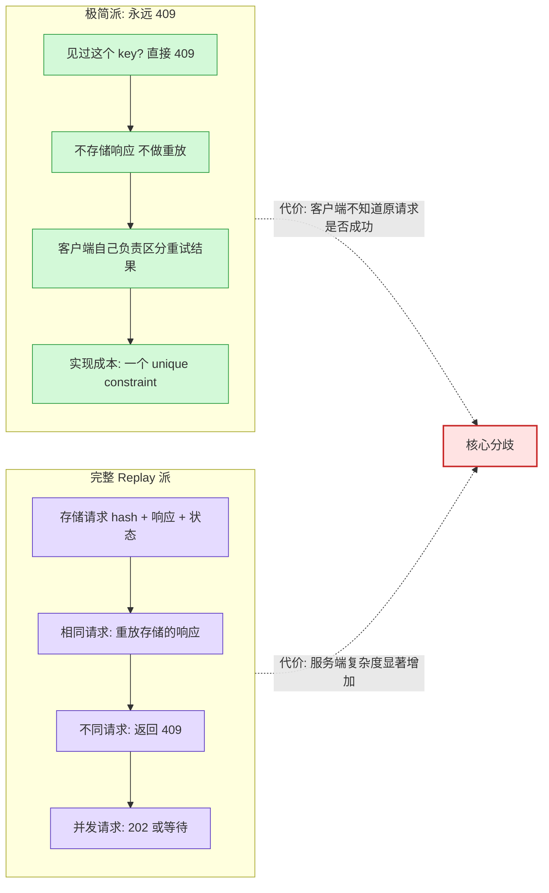
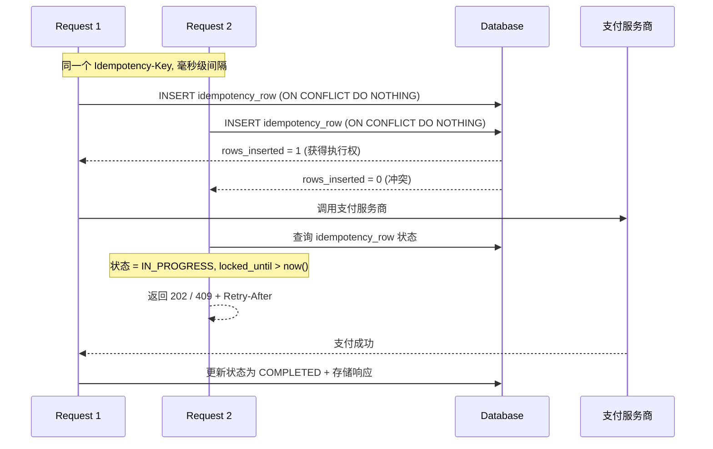
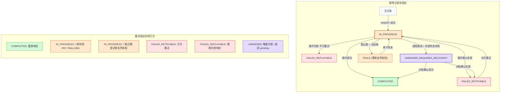

谈到 API 的幂等性设计，大多数后端工程师的第一反应是：给请求加一个 Idempotency-Key，服务端存储响应，重试时直接返回存储的结果。Stripe 的经典博客文章把这个模式推广到了整个行业，几乎成为支付 API 的标准实践。

这个实现能跑通所有 demo。

但是，Dochia 最近的一篇文章（HN 292 分，174 条评论）指出了一个被广泛忽视的问题：**大多数幂等性实现本质上只是一个 replay cache——它假设重试请求和原始请求完全相同。而真正让生产系统崩溃的，是第二个请求和第一个不一样的时候。**

同一个 Idempotency-Key，金额从 10 欧变成了 100 欧。是重试？是客户端 bug？还是新操作？服务端应该重放旧响应、拒绝请求、还是把 key+content 当新操作处理？你能选任何一种策略——但服务端必须有明确的立场。HN 174 条评论里，这个问题的答案至少有三种，没有共识。

这篇文章拆解 replay cache 搞不定的八种场景，分析 HN 上两派工程师的对立观点，以及在支付和广告计费系统中这些边界 case 的实际影响。

## 八种 Replay Cache 搞不定的场景

先回顾 replay cache 的标准流程：客户端发送带 Idempotency-Key 的 POST 请求，服务端检查是否见过这个 key——没见过就执行操作并存储响应，见过就直接返回存储的响应。这在"完全相同的请求被重试一次"时工作完美。

但生产环境里，"完全相同的请求被重试一次"只是所有可能场景中最简单的一种。Dochia 列出的完整场景矩阵：

| 场景 | Replay cache 能否处理 | 核心困难 |
|:-----|:---------------------|:---------|
| 完全相同请求的重试 | 能 | 无 |
| 第一个请求仍在执行中时重试到达 | 不能 | 幂等层变成并发控制的一部分 |
| 第一个请求本地成功但事件发布前崩溃 | 不能 | 本地行和外部副作用不同步 |
| 第一个请求调用了支付服务商，服务商接受了，但进程在记录结果前死亡 | 不能 | 数据库无法推断钱是否已转移 |
| 相同 key + 不同请求内容 | 不能 | 身份歧义：是重试还是新操作？ |
| 没有 key 的重复操作 | 不能 | 无法识别重复 |
| Key 过期后的重试 | 不能 | 过期策略和一致性的矛盾 |
| 部署/schema 变更/region 切换后的重试 | 不能 | hash 计算方式变了，旧重试看起来像新请求 |

如果你的幂等性设计只处理了第一行，你做的不是幂等，而是一个 replay cache。对某些端点来说这可能够用，但它不是完整的方案。

## 最具争议的 Case：同一个 Key，不同金额

第一个请求：

```json
{
  "accountId": "acc_1",
  "amount": "10.00",
  "currency": "EUR",
  "merchantReference": "invoice-7781"
}
```

第二个请求，相同的 Idempotency-Key `abc-123`：

```json
{
  "accountId": "acc_1",
  "amount": "100.00",
  "currency": "EUR",
  "merchantReference": "invoice-7781"
}
```

三种可选策略：

**策略 A：静默重放旧响应。** 客户端发了一个 100 欧的支付请求，拿回了一个 10 欧的支付结果。如果客户端不仔细比对响应字段，它会认为 100 欧的支付成功了。这不是幂等，这是静默误解。

**策略 B：返回 409 Conflict。** 这是 Dochia 的推荐，也是 HN 上一派工程师的立场。理由是：同一个 scoped key 被用于不同的 canonical command，本身就是一个客户端 bug，应该立刻暴露。常见的客户端错误是用 `cartId` 而不是 `paymentAttemptId` 作为幂等 key——购物车里可能有多次结算尝试，每次金额不同。

**策略 C：把 key+content hash 当复合 ID。** 即 `(key, hash(content))` 共同决定操作身份。同一个 key 但内容不同被视为不同操作。这在某些场景下合理，但这时候 key 就不再是传统意义上的幂等 key 了——它变成了复合操作标识符的一部分。

三种策略都可以选，只要你明确文档化。最危险的是中间地带：客户端以为自己在安全重试，服务端静默把第二个请求解读为别的东西。

## HN 上的两派对立

HN 174 条评论里最激烈的辩论不是关于上面这个 case，而是一个更基础的问题：**幂等层应该承担多少责任？**



**极简派（代表：stickfigure）** 的核心论点是：见到重复的 idempotency key，不管请求内容，一律返回 409。不存储响应，不做重放。客户端收到 409 就知道操作已经被执行过了，至于具体结果，客户端可以用其他接口查询。

他的理由很实际：这把问题简化成了一个 unique constraint，用标准的数据库事务就能处理并发。不需要 hash 请求内容，不需要担心 PII 存储，不需要处理"重放旧响应还是返回当前资源状态"的合约问题。他声称已经用这种方式构建了多个电商 API，运行良好。

反驳来自 halestock 和 pdonis：**409 没有告诉客户端原始请求是否成功。** 如果客户端发了一个支付请求，网络超时，它不知道钱有没有扣。重试后收到 409——好的，原始请求确实被处理了。但处理结果是什么？成功？失败？部分完成？409 不携带这个信息。

极简派的回应是：409 只在原始请求成功时才返回，如果失败了就重新执行。但 pdonis 追问了一个关键 case：**如果原始请求还在执行中呢？** 它既没成功也没失败，但重试已经到了。

这里两派的分歧变得根本性的：极简派认为这本质上就是并发控制——"用数据库事务序列化，一个成功一个 409，和普通的并发编程一样"。完整 replay 派认为并发重试需要一个显式的 IN_PROGRESS 状态，重试请求应该等待或收到 202 + Retry-After——因为客户端需要知道操作的最终结果，而不只是"有人已经在做了"。

HN 上另一个重要的声音来自 scott_w：**支付根本不是原子操作。** 不应该假装它是原子的。你需要存储每个步骤的状态，异步处理，超时后用处理器返回的 key 查询状态。"即使这样也不完美——Braintree 会在处理支付的过程中返回 500，所以你仍然需要后端对账。"

这段讨论揭示的真实分歧不是技术问题，而是**责任边界问题**：幂等层应该是一个 thin guard（极简派）还是一个 full operation manager（replay 派）？

## 并发：INSERT-first 原子所有权

不管你选哪一派，并发处理都绕不开。两个相同的请求几乎同时到达两个 API 实例：



关键是 INSERT-first 模式：先尝试插入幂等记录（IN_PROGRESS 状态），再执行业务逻辑。不是先查再插。

check-then-insert 的经典错误：

```
existing = find_by_key(key)
if existing does not exist:
    create_payment()           # 两个实例都执行到了这里
    insert_idempotency_record()
```

两个请求都观察到"不存在"，两个请求都执行了副作用。INSERT ON CONFLICT DO NOTHING 的原子性保证只有一个请求获得执行权。

获得执行权之后的本地 happy path 是一个事务完成所有操作：

```sql
BEGIN;
  INSERT INTO idempotency_requests (...) VALUES (...) -- IN_PROGRESS
  INSERT INTO payments (...) VALUES (...);            -- 业务行
  INSERT INTO outbox (...) VALUES (...);              -- 事件
  UPDATE idempotency_requests SET status = 'COMPLETED', response_body = '...';
COMMIT;
```

一个事务覆盖幂等记录、业务行、outbox 事件。这是最干净的版本。

但如果中间有外部调用——比如要调支付服务商——事情就变了。持有数据库事务的同时调外部 API 是灾难（连接池耗尽、超时导致锁滞留），但不持有事务又意味着本地状态可能是 IN_PROGRESS 而外部操作已经完成。这时你需要的不再是一张幂等请求表，而是一个操作状态机和恢复 worker。

关于 Redis SET NX EX：它充其量是一个执行 guard，不是幂等方案。它不持久记忆操作结果。如果 Redis 锁在支付服务商还在处理时过期了，另一个请求可以进入。如果进程在服务商成功后、存储响应前死亡，锁帮不了重试请求判断发生了什么。

## Hash 命令而非 Bytes

判断两个请求是否"相同"比看起来难得多。这两个 JSON body 应该被视为相同命令：

```json
{"amount": "10.00", "currency": "EUR"}
{"currency": "EUR", "amount": "10.00"}
```

字段顺序和空格不应该影响判断。但默认值是一个更微妙的陷阱：

```json
{"accountId": "acc_1", "amount": "10.00", "currency": "EUR"}
{"accountId": "acc_1", "amount": "10.00", "currency": "EUR", "channel": "web"}
```

如果 `channel: "web"` 是服务端默认值，这两个请求在逻辑上是否等价？也许是。在 hash 之前做出决定。

正确的做法是 hash 验证后的命令，不是原始 HTTP body：

1. 把请求解析成版本化的 DTO/Command
2. 规范化 API 认为等价的值：金额格式、枚举大小写、默认字段、时间戳精度
3. 排除传输层元数据
4. 包含路径参数和操作名
5. 包含影响操作语义的 header（如 API 版本号）
6. 排除 Authorization 和幂等 key 本身
7. 规范化序列化后 hash

需要特别小心的是：request hash 是一个合约。如果你改变了 hash 的计算方式（比如部署后新增了一个字段），旧的重试请求会突然看起来和原始请求不同。这会导致你拒绝合法的重试，或者接受不该接受的新操作。

## 下游未知状态：幂等性真正最难的部分

所有前面讨论的场景——并发、hash 不匹配、409 vs replay——都有一个隐含假设：服务端知道操作的最终结果。但在涉及外部系统的场景里，这个假设经常不成立。

经典场景：你调了支付服务商的 API，服务商接受了扣款请求，然后你的进程崩溃了——在把结果写入数据库之前。

此时你的本地状态说 IN_PROGRESS，但实际上钱已经扣了。重试到来时，你面临三种选择，每一种都有后果：

1. **再调一次服务商** — 如果服务商自己不做幂等，你会双扣
2. **假设没成功，不扣款** — 你可能吞掉了一笔已完成的支付
3. **触发对账** — 最安全但最慢，用户可能要等几分钟甚至几小时才能知道结果

这个场景没有漂亮的本地解。Dochia 的建议是引入一个 `UNKNOWN_REQUIRES_RECOVERY` 状态，重试到达时触发对账流程或返回一个 pending 状态。但对账本身依赖服务商提供查询接口，而且查询结果也可能有延迟。



这才是幂等性的完整状态机。和"存储响应 + 重放"的 replay cache 相比，复杂度差了一个数量级。

## 对实际系统的启示

### 支付系统

支付是幂等性讨论的经典场景，但 HN 上 scott_w 的观点值得重视：**支付不是原子操作，不应该假装它是。** 正确的架构是把支付分解成多个步骤（创建意图、授权、捕获、结算），每个步骤独立做幂等。整体流程的一致性靠状态机和对账来保证，而不是靠一个全局的幂等 key。

Stripe 的做法是经过十年生产验证的工业标准：24 小时 replay 窗口，窗口内相同 key 相同内容返回存储的响应，不同内容返回 409，窗口外允许 key 复用。这个设计在"简单性"和"安全性"之间取得了很好的平衡。

### 广告计费系统

广告系统有自己的幂等性需求，而且容错预算更低——多扣了广告主的钱是真金白银的损失。典型场景：

**展示计费去重。** 同一个广告展示可能被上报多次（网络重传、客户端重试）。这里的 idempotency key 通常是 `(impression_id, timestamp)` 的组合，幂等策略是纯去重——第二次上报直接丢弃。这是最简单的 case，一个 unique constraint 就够了。

**转化归因重试。** 转化事件（比如用户点击广告后购买了商品）从第三方归因平台回传，需要和广告投放记录匹配后计费。这里的复杂度在于：归因平台可能发送重复事件，也可能发送同一转化的不同归因版本（last-click vs multi-touch）。后者本质上就是"同一个 key，不同内容"的问题。

**出价系统的幂等约束。** RTB（实时竞价）系统的出价请求有严格的时效性——同一个竞价请求在 100ms 内必须响应。如果出价服务器的响应在网络中丢失，SSP 不会等待重试，而是直接用其他买方的出价。这里不需要传统的幂等重试，但需要确保同一个竞价请求不会在不同的处理路径上产生两次扣费。

### 设计决策清单

如果你正在设计一个需要幂等性的 API，以下是需要明确回答的问题：

1. **Key 的作用域是什么？** Tenant、user、account、merchant 还是全局？一个 broken client 生成的 `abc-123` 应该只和自己冲突
2. **操作名是否编码在 key 里？** `create_payment` 的 key 不应该自动和 `create_refund` 冲突
3. **同 key 不同内容怎么处理？** 静默重放、409、还是复合 ID？选一个并文档化
4. **并发重试怎么处理？** 等待、202、还是 409？INSERT-first 还是 check-then-insert？
5. **存储完整响应还是资源引用？** 前者有 PII 风险，后者在资源变更后重放的响应可能不一致
6. **Key 的过期策略？** 24 小时？7 天？永不过期？过期后的行为是什么？
7. **外部副作用的 unknown 状态怎么恢复？** 对账？补偿事务？人工介入？

这些问题的答案之间不是独立的。比如你选了"存储完整响应"，就需要考虑 PII 清理；你选了"409 永远拒绝"，就要确保客户端有能力查询操作的最终状态。幂等性的真正难度不在于实现某一个 case，而在于这些 case 的交叉组合形成了一个设计空间，你需要在这个空间里找到一组一致的策略。

回到标题的问题：幂等性确实没有想的那么简单。但它也不是无限复杂——一旦你把状态机画出来，把每种场景的行为填进决策表，复杂度就是有限的和可管理的。真正危险的不是不知道怎么做，而是以为 replay cache 就是全部。

---

**References:**

- [Idempotency is easy until the second request is different](https://blog.dochia.dev/blog/idempotency/) - Dochia (2026.5)
- [APIs, robustness, and idempotency](https://stripe.com/blog/idempotency) - Stripe (2018.3)
- [The Idempotency-Key HTTP header field](https://datatracker.ietf.org/doc/html/draft-ietf-httpapi-idempotency-key-header-00) - IETF Draft (2021.11)
- [Idempotence now prevents pain later](https://ericlathrop.com/2021/04/idempotence-now-prevents-pain-later/) - Eric Lathrop (2021.4)
