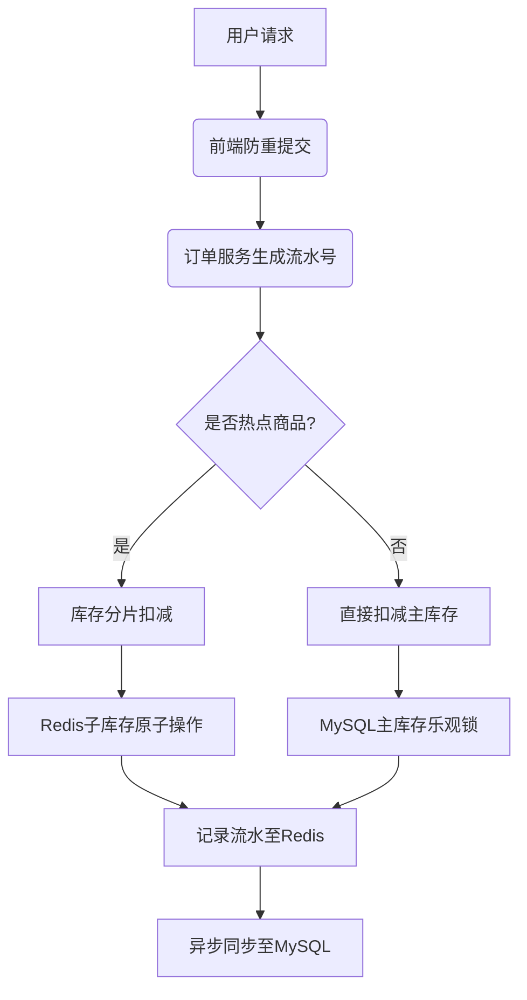

### **问题一：数据库分片策略选择总结**

### **核心结论**

在10亿级用户规模的会员系统中，**哈希分片（Hash-based Sharding）** 是最优选择，其通过数据均匀分布和线性扩展能力，有效解决高并发场景下的性能与稳定性问题。

---

### **关键对比分析**

| **分片策略** | **优势** | **劣势** | **适用场景** |
| --- | --- | --- | --- |
| **哈希分片** | 数据分布均匀，无热点问题；扩展灵活，支持动态扩容 | 无法直接支持范围查询；跨分片事务复杂 | 高并发OLTP场景（如用户状态更新） |
| **范围分片** | 天然支持范围查询；适合时间序列数据 | 易产生热点（如新用户集中写入）；扩容需数据迁移 | 时序数据（日志、订单历史） |
| **查表分片** | 灵活调整分片规则；支持异构分片 | 元数据管理成本高；路由延迟增加 | 分片规则频繁变化的低频场景 |

---

### **哈希分片的核心优势**

1. **负载均衡**
    - 通过离散的`user_id`哈希值，确保数据均匀分布，避免单分片过载。
    - 适用于每日海量会员过期更新的批量操作，分散压力至各分片。
2. **扩展性**
    - 支持一致性哈希算法，扩容时仅需迁移部分数据（如从64分片扩至128，迁移约50%数据）。
    - 业务无感知，客户端自动路由请求。
3. **性能稳定**
    - 点查（`WHERE user_id=xxx`）直接定位分片，响应时间稳定。
    - 批量任务可并行分片处理（如每个线程处理一个分片）。

---

### **范围分片的致命缺陷**

- **热点写入**：若按时间或自增ID分片，新数据集中在尾部，导致单分片压力剧增。
- **扩容成本**：新增分片需全量数据迁移，10亿级表停机时间不可接受。

---

### **问题二：秒杀场景高并发与防超卖方案总结**

### **核心设计**

采用 **预扣减库存 + 异步补偿 + 风控拦截** 的三层机制，平衡用户体验与系统安全性。

---

### **核心流程**

1. **预扣减库存**
    - **时机**：用户提交订单时，立即预占库存（非最终扣减）。
    - **实现**：通过Redis原子操作（如`DECRBY`）保证高性能（10万+ TPS）。
    - **超时释放**：设置订单支付倒计时（如15分钟），超时后自动回补库存。
2. **支付确认与最终扣减**
    - **支付成功**：标记预占库存为最终扣减，更新数据库。
    - **支付失败**：触发库存回补，并通过MQ通知下游服务。
3. **异常补偿**
    - **同步调用超时**：通过MQ发送补偿消息，由异步服务校验流水表，确保最终一致性。
    - **数据对账**：定时任务比对Redis与数据库库存，修复差异。

---

### **防超卖关键技术**

1. **原子化操作**
    - Redis Lua脚本或数据库乐观锁（`UPDATE ... WHERE stock > 0`），避免超卖。
2. **幂等性保障**
    - 全局事务ID（GID）标记每次请求，通过流水表去重，防止重复扣减。
3. **风控策略**
    - **限流**：用户/IP/设备维度限购（如每秒1单）。
    - **黑名单**：实时拦截异常账号（如短时高频下单）。

---

### **容灾与降级**

1. **服务熔断**
    - 库存服务故障时，降级返回“活动火爆”提示，保护核心链路。
2. **静态化页面**
    - 商品详情页缓存在CDN，减少服务端压力。
3. **柔性库存**
    - 预留缓冲库存（如总库存的5%），用于补偿场景下的订单履约。

### **高并发库存扣减异常处理与热点优化总结**

---

### **一、核心问题梳理**

1. **重复扣减异常**
    - **场景**：订单服务调用库存交易服务时，因网络超时触发重试，导致同一请求被多次执行。
    - **风险**：库存被多次扣减，引发超卖或数据不一致。
2. **热点库存性能瓶颈**
    - **场景**：某商品（如秒杀商品）被高频扣减，单行数据库锁竞争激烈，导致吞吐量骤降。
    - **风险**：单点故障扩散，拖垮整个数据库集群。

---

### **二、幂等性保障方案**

### **1. 流水号防重机制**

- **实现逻辑**：
    - 每次请求生成唯一流水号（如`UUID+时间戳`），贯穿整个调用链路。
    - 库存服务通过流水号校验请求是否重复（Redis记录已处理的流水号）。
- **优势**：
    - 解决网络重试导致的重复扣减问题。
    - 天然支持分布式环境下的幂等性。
- **缺陷**：
    - 需额外存储流水记录（Redis内存开销增加）。

### **2. 前端防重复提交**

- **实现逻辑**：
    - 用户点击下单后，前端按钮置灰，禁止短时重复提交。
    - 提交后生成唯一Token，后端验证Token有效性。
- **适用场景**：
    - 防止用户误操作重复提交，但对脚本攻击无效。

---

### **三、热点库存优化方案**

### **1. 库存分片（子库存拆分）**

- **实现逻辑**：
    - 将单个商品库存拆分为多个子库存（如商品ID为100，拆分为`100-1`、`100-2`、`100-3`）。
    - 扣减时通过哈希算法选择子库存（如`user_id % 3`）。
- **优势**：
    - 分散单行锁压力，提升并发能力。
    - 可动态扩展子库存数量（如从3片扩容到5片）。
- **缺陷**：
    - 需处理子库存耗尽后的遍历回退逻辑（如子库存1扣完需尝试子库存2）。

### **2. 数据库内核优化（排队论）**

- **实现逻辑**：
    - 数据库层（如阿里自研数据库）对同一行数据的更新请求进行全局排队。
    - 通过内存队列顺序执行扣减操作，减少锁竞争。
- **优势**：
    - 无需业务层改造，性能优化彻底。
    - 支持超高并发（如单行TPS从500提升至5000）。
- **适用场景**：
    - 自研数据库或支持排队机制的商业数据库（如PolarDB）。

---

### **四、技术方案对比**

| **方案** | **适用场景** | **优点** | **缺点** |
| --- | --- | --- | --- |
| **流水号+Redis防重** | 通用幂等场景 | 实现简单，兼容性强 | Redis内存成本高，需维护状态 |
| **前端Token防重** | 用户误操作场景 | 用户体验友好 | 无法防御脚本攻击 |
| **库存分片** | 热点商品高并发场景 | 分散压力，扩展灵活 | 逻辑复杂，需处理子库存耗尽问题 |
| **数据库内核排队** | 自研或定制数据库场景 | 性能极致优化，无需业务改造 | 依赖特定数据库，技术门槛高 |

---

### **五、推荐架构设计**

### **1. 分层优化策略**

### **2. 关键设计点**

1. **热点识别**
    - **实时监控**：通过流量统计（如商品维度QPS）动态标记热点。
    - **人工配置**：运营预先配置秒杀商品为热点。
2. **子库存扣减逻辑**
    - **哈希路由**：根据用户ID或订单号哈希选择子库存。
    - **失败回退**：若子库存不足，自动尝试其他子库存。
3. **数据最终一致性**
    - **异步补偿**：通过定时任务比对Redis与MySQL库存差异。
    - **异常告警**：库存差异超过阈值时触发人工干预。

---

### **六、性能与容灾指标**

| **指标** | **目标值** | **保障措施** |
| --- | --- | --- |
| 单商品峰值TPS | ≥10,000 | 库存分片+数据库内核优化 |
| 扣减延迟（P99） | ≤20ms | Redis内存操作+热点子库存隔离 |
| 数据不一致率 | ≤0.001% | 异步补偿+实时监控 |
| 系统可用性 | ≥99.99% | 多机房容灾+自动故障切换 |

---

### **总结**

- **幂等性是基石**：通过流水号+Redis防重解决重试导致的重复扣减。
- **热点需隔离**：子库存分片或数据库内核排队是应对高并发的核心手段。
- **分层设计**：结合前端交互、服务层逻辑、存储层优化，实现性能与可靠性的平衡。
- **柔性降级**：在极端流量下，可牺牲部分功能（如实时库存显示）保障核心链路可用。
