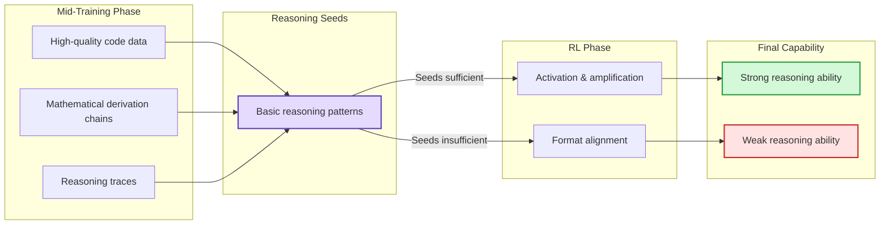
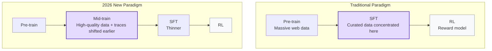

import TechGraph from '../../components/blog/TechGraph.astro'
import Diagram from '../../components/blog/Diagram.astro'

Kimi K3's technical report was open-sourced last week. 2.8 trillion parameters, 896 experts with 16 activated, 1 million token context—the numbers are indeed jaw-dropping. But after reading through the entire report, what really caught my attention wasn't what it said, but what it didn't say.

In Section 3.3 Training Recipe, there's a stage called the "Cooldown Phase" described in less than two pages: synthetic long-sequence concatenation tasks, upsampling long-document data, learning rate annealing. Then it jumps straight to Post-Training to discuss SFT and RL.

But looking at discussions in the technical community, you'll find an interesting consensus: K3's real capability leap most likely happened during this glossed-over "cooldown" phase, not the RL and MOPD distillation that the report describes in great detail. This phase has a formal academic name: Mid-Training.

## K3 Report's Strategic Silence

The K3 report's description of the cooldown phase is extremely restrained. It tells you context extension was done (256K to 1M), tells you long-sequence training data was synthesized, tells you the learning rate was annealed. But how many tokens were used in each stage, what proportions of code/math/reasoning/agent trajectory data made up the cooldown phase, how much weight synthetic data carried in the overall mid-train—none of that is provided.

This is not an oversight. Compare K3 with Meta's Llama 3 report side by side and the difference is stark: Llama 3 gave relatively detailed data descriptions for the annealing phase—how much code data was upsampled, which high-quality subsets were used—allowing the open-source community to reproduce it reasonably well. K3 chose not to provide this information, leaving the community to guess if they want to reproduce the cooldown phase's effects.

The data recipe for mid-training is the most critical trade secret in today's large model competition—worth far more than model architecture. Architectures can be published openly; KDA, MLA, NoPE and the like aren't easy for others to replicate just by reading about them. But once a data recipe is published, the reproduction barrier drops dramatically. The K3 report devotes extensive space to describing the elegant designs of RL and MOPD distillation, yet is miserly about the cooldown phase. Which part is the real competitive advantage? The answer is hidden in the silence.

## The Three Operations of Mid-Training

<TechGraph src="/images/posts/LLM-Mid-Training-被Tech-Report遮掩的关键训练阶段/pipeline.png" title="Full Training Pipeline Overview" caption="Pre-training → Mid-training (Cooldown) → Post-training: three stages, with the K3 report devoting the least ink to the middle one" />

IBM Research published a large-scale experimental paper in April this year, running over 500 controlled experiments to validate why mid-training works. The Shopee team's first Mid-Training Survey in October 2025 (arXiv:2510.06826) provided a formal definition. Synthesizing these works, what mid-training does can be broken down into three parts: data annealing, context extension, and domain reinforcement.

Data annealing is a distribution shift at the end of pre-training, switching from massive web noise to high-quality subsets: textbooks, academic papers, competition code, mathematical derivations, high-quality synthetic CoT. The learning rate simultaneously decays to 1/10 to 1/100 of the pre-training peak. To use an analogy, pre-training is going through the entire library; mid-training is doing curated problem sets before an exam.

Context extension progressively stretches the sequence length the model can handle. K3's path was 8K to 64K (pre-training phase) then 256K to 1M (cooldown phase), requiring specially cleaned and synthesized long-document data, plus positional encoding adaptation. K3 uses NoPE, completely abandoning explicit positional encoding—an entirely different approach from the Llama series' RoPE extrapolation route.

Domain reinforcement targets directions that were weak during pre-training for focused strengthening: code (high-quality codebases + competitive programming problems), math (proof processes + derivation chains), reasoning (logical reasoning + multi-step problem solving), and agent trajectories (tool-calling sequences + multi-step task execution logs). The agent trajectory item in particular is never mentioned in the K3 report, but industry discussions generally believe it constitutes a quite substantial proportion of the cooldown phase's data composition.

## Mid-Training Determines How Far RL Can Go

There's a noteworthy 2025 paper called OctoThinker (arXiv:2506.20512), from Shanghai Jiao Tong University and GAIR Lab. It investigated a specific question: why does the Qwen series show significant reasoning ability improvement after RL, while Llama shows much weaker effects from similar RL training?

The conclusion is that the gap isn't in RL itself, but in whether sufficient reasoning seeds were planted during pre-training and mid-training. Qwen's pre-training data included more code and mathematical reasoning data, which was further reinforced during mid-training. The model already possessed basic reasoning patterns before entering RL. What RL does is closer to "activating and amplifying" rather than "learning from scratch."

<Diagram title="Causal Relationship Between Mid-Training and RL" caption="OctoThinker's core finding: RL's ceiling is determined by data quality in the mid-training phase">

</Diagram>

A controlled experiment from CMU earlier this year further validated this: with a fixed total compute budget, allocating part of the compute to mid-training for high-quality data annealing and the rest to RL significantly outperformed putting the entire budget into RL. For difficult samples at the edge of the distribution in particular, mid-training's contribution was greater than RL's.

This explains a puzzling phenomenon in the industry: when the open-source community takes a Llama or Qwen base model and does their own RL, the results always fall short of the official version. The answer may not be that their RL methods are wrong, but that the base model they received is already a product of mid-training—the real capability gap was already established at that stage.

## Post-Training Signals Are Systematically Shifting Earlier

In February 2026, Shanghai Jiao Tong University and Tencent YouTu jointly published ReMiT (arXiv:2602.03075), formally turning "feeding RL signals back into mid-training" into a closed-loop framework. Around the same time, there was also work on RL-Guided Annealing, which uses signals from an RL reference model to re-weight annealing data at the token level.

<Diagram title="Training Paradigm Shift" caption="High-quality signals are systematically shifting from Post-Training to Mid-Training">

</Diagram>

These works all point to the same trend: high-quality signals that traditionally belonged to post-training—human preferences, reasoning traces, tool-calling data—are systematically shifting earlier into the mid-training phase. The logic is straightforward: the SFT phase operates at the billion-token scale, where the model can only learn surface-level alignment (formatting, style, instruction following) with limited improvement in underlying capabilities; mid-training operates at the tens-of-billions to hundreds-of-billions token scale, giving the model enough gradient steps to genuinely learn reasoning patterns rather than merely imitating formats; RL's scaling efficiency is low when the model's foundational capabilities are insufficient—only after mid-training can RL's marginal returns be unlocked.

Coming back to K3, the Post-Training chapter in the report describes an elegant RL system: 3 task domains multiplied by 3 reasoning depths yields 9 experts, which are then distilled back into a unified model via MOPD. The system is indeed beautiful, but if OctoThinker and CMU's findings are correct, the reason K3 could achieve massive improvements during the RL phase is that the cooldown phase had already planted the reasoning seeds. MOPD is the harvest; cooldown is the sowing.

## The Transparency Gradient

The degree to which different organizations disclose their mid-training forms a clear gradient. AI2's OLMo 2 is currently the most transparent: fully open-source, including the cooldown phase's data mixing ratios, learning rate schedules, and context extension strategies—the community can fully reproduce it. Llama 3 provides moderate detail: upsampled high-quality code and STEM data, used a specific learning rate annealing curve—enough to understand the direction but not enough to reproduce exact mixing ratios. Qwen 2.5 and GLM-4 are partially open, mentioning long-context extension and domain enhancement, but vague on specific data composition. K3 is almost entirely opaque, only stating that "a cooldown phase performed long-context extension," with no mention of any other core operations.

This transparency gradient is itself informative. The more commercialized and performance-advantage-seeking the model, the more deeply mid-training details are hidden. OLMo's value lies in serving as an academic baseline, not in commercial competition, so everything can be disclosed. K3 needs to beat GPT-4o and Claude on benchmarks—its mid-training recipe is the last card it wants to reveal.

## Methodology for Reading Reports

If you're doing model training, IBM's 500 experiment groups send a clear signal: mid-training's return on investment is far higher than doubling down on RL. Doing the annealing phase thoroughly contributes more to final model quality than post-training does, especially for small-to-medium-scale models. Don't skip this phase and jump straight to SFT + RL.

If you're doing fine-tuning on open-source models, you need to understand that the base model you've obtained already incorporates the effects of mid-training. When you do RL directly on a base model, the ceiling on performance may not be a problem with your RL method—rather, data selection during the mid-training stage is what determines how far RL can take you. When choosing a base model, the quality of mid-training deserves more attention than parameter count.

If you're reading a tech report, focus on the parts the report *doesn't* write about. Cooldown, annealing, continual pre-training—whatever the name, if the report is vague about this stage, it usually means that's where the model's real competitive advantage lies. Detailed descriptions of RL and RLHF may actually be a smokescreen; that part was never the most critical source of differentiation to begin with.

---

**References:**

- Kimi K3 Technical Report (Moonshot AI, 2026.7)
- Mo et al. "Mid-Training of Large Language Models: A Survey" (arXiv:2510.06826, 2025.10)
- Wang et al. "OctoThinker: Mid-training Incentivizes Reinforcement Learning Scaling" (arXiv:2506.20512, 2025.6)
- Huang et al. "ReMiT: RL-Guided Mid-Training for Iterative LLM Evolution" (arXiv:2602.03075, 2026.2)
- Huang et al. "Improve LLM Pre-training with RL-Guided Annealing" (OpenReview, 2026.2)
- IBM Research. "How an extra training step can unlock AI's reasoning power" (2026.4)
- Liu et al. "Midtraining Bridges Pretraining and Posttraining Distributions" (OpenReview, 2026.4)
