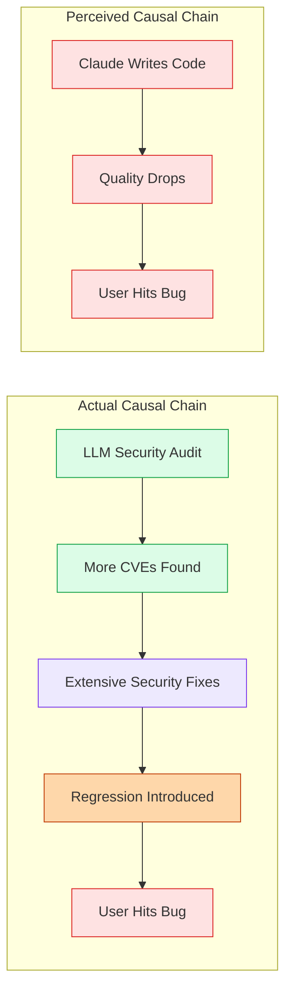
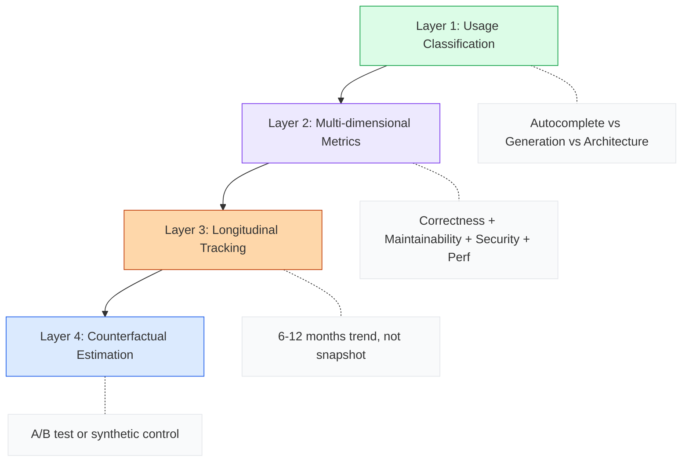

import Callout from '../../components/blog/Callout.astro'
import Diagram from '../../components/blog/Diagram.astro'
import TechGraph from '../../components/blog/TechGraph.astro'

In late May 2026, the rsync community blew up. A Mastodon post pointed out that rsync v3.4.3 had a regression bug, and also noticed that this release contained Claude-generated commits. Within days, a GitHub issue titled "Please Do Not Vibe Fuck Up This Software" had accumulated 350+ comments, escalating from technical discussion to death threats. Someone drew MLP fan art of a character strangling "the maintainer who pushed AI code."

But a week later, a statistical analysis report based on all 36 rsync releases reached its conclusion: exact permutation test p=46%. In plain English—if you randomly pick two historical releases, there's nearly a 50% chance they'd be worse than the Claude-assisted release.

The incident itself is quite dramatic, but what interests me more is the deeper problem it exposes: **when we judge AI code quality, we don't even have a basic methodology.** Everyone is drawing conclusions from gut feeling, and gut feeling is worthless in the face of statistics.

## The Facts: Two Releases, Two Directions

Let's reconstruct the data. rsync has two releases containing Claude commits:

| Release | Bug Count | Severity-Weighted/10c | Claude commits | Historical Percentile |
|:------|:-------|:--------------|:---------------|:-----------|
| v3.4.2 | 0 | 0.00 | 9 | 0th |
| v3.4.3 | 17 | 3.29 | 28 | 77th |

v3.4.2: zero bugs. v3.4.3 sits at the 77th percentile—above the median, but 8 historical releases were worse. The two Claude releases fall on opposite sides of the IQR (interquartile range), one below the lower bound and one above the upper bound. They're not outliers—they just happen to straddle the middle of the distribution.

For comparison, the release with the highest bug rate in rsync's history is v3.4.1: 59 bugs / 9 commits, severity-weighted score of 39.39/10c. This release had zero AI involvement. But nobody filed a GitHub issue cursing out the maintainer, because there was no AI to use as a target.

<TechGraph src="/images/posts/ai-code-quality-rsync/distribution.svg" title="BUG RATE DISTRIBUTION" caption="Bug rate distribution across all 36 rsync releases. The two Claude-assisted releases (blue) straddle opposite sides of the IQR; no statistical test is significant." />

## Methodology: You Can't Measure Code Quality by Feel

The rsync analysis report did several things worth examining closely:

**Metric Design**: severity-weighted bugs per 10 commits (sev/10c). Each bug was scored 0–100 by Qwen 3 35B using a clear rubric: data loss 90–100, crash/hang 70–89, functional regression 50–69, minor issues 30–49, cosmetic 10–29, feature requests scored 0. This is far more reasonable than simply counting bug numbers—a typo and a data corruption event shouldn't carry equal weight.

**Statistical Tests**:

- Exact permutation test: enumerate all C(35,2)=595 two-release combinations and see how many have a mean &gt;= the Claude pair's 1.65. The result was 272 combinations, i.e., 46%.
- Fisher's exact test: the probability of Claude releases falling above the median vs. historical releases—p=74%, odds ratio 1.06 (essentially 1:1).

**Controlled Variables**:

- Code volume: Claude releases averaged 3,756 lines changed (vs. historical 696 lines), p=5%—they genuinely changed more code. But the absolute bug count didn't increase proportionally (p=77%). More code, no more bugs.
- Regime check: some argued that the v2.x era was more unstable and shouldn't be compared together. In reality, v3.x's mean was actually higher (4.23 vs. 1.11 sev/10c), and Claude releases still didn't stand out within the v3.x subset.

This methodology isn't perfect—the author themselves acknowledged it doesn't control for commit complexity or security sensitivity. But it's ten thousand times more rigorous than "I hit a bug after upgrading, and this release has AI commits, so it's AI's fault."

## Cognitive Biases: Why Intuition Is So Unreliable

The rsync incident is a textbook case of cognitive bias. At least three biases were operating simultaneously:

**Confirmation Bias**: The community already had a prior belief—"AI-written code is low quality." When v3.4.3 had bugs, this belief was "confirmed." But people ignored the fact that v3.4.2 had zero bugs, and that v3.4.1 (no AI) was the worst in history. People only see evidence that supports their own viewpoint.

**Availability Heuristic**: A Mastodon post got shared thousands of times, forming the narrative that "rsync got wrecked by AI." This narrative spread far faster than any statistical analysis could ever reach. By the time the analysis report came out, public opinion had already solidified.

**Attribution Error**: When there's a clear "responsible party" (AI), people tend to attribute all problems to it. Someone on HN pointed out: the so-called "bug" was actually an encoding error that had existed since 2007 and was only exposed during a CVE fix. The real causal chain was: LLM discovers security vulnerability → fix needed → fix introduces regression. But that chain is too long; "AI wrote bad code" is much easier to spread.

<Diagram title="CAUSAL CHAINS" caption="Simplified attribution by the community vs. the multi-step causal chain that actually occurred">

</Diagram>

## The Bigger Problem: We Have No Scientific Method for Measuring AI Code Quality

The rsync incident exposed more than just a community overreaction. It revealed an industry-wide methodological gap.

Let's review the "research" on AI code quality over the past two years:

**July 2025, METR Study**: 16 senior open-source developers completed tasks using AI tools, and the result was an average 19% slowdown. This is one of the most rigorous controlled experiments to date. But it measured "speed," not "quality." And the sample size was only 16 people—statistically, that tells us almost nothing.

**Various experience posts on HN**: The "Oh shit moments with GenAI" post with 548 comments, filled with personal anecdotes. Some say AI saved their startup; others say AI code caused production incidents. N=1 cases prove nothing, but they spread more effectively than any paper.

**The rsync analysis this time**: Methodologically the closest attempt to "doing it right." But the author himself acknowledged: two data points aren't enough to model, aren't enough to extrapolate—only enough to say "there is currently no evidence that AI made things worse."

## Why None of the Existing Methods Are Good Enough

Let me break down several common "measurement approaches" and their fatal flaws one by one:

### Bug Counting Method (used in the rsync report)

Strengths: Intuitive, data is accessible, statistical tests can be applied.

Fatal flaws:
- **Counterfactuals are unmeasurable**: If Tridge hadn't used Claude, how many bugs would v3.4.3 have had? Maybe fewer, maybe more (because he might not have done those security fixes at all). You can never measure a version that doesn't exist.
- **Attribution chains are fuzzy**: A Claude commit fixes a security vulnerability but introduces a regression—should this count as an AI "bug" or a "fix"?
- **Sample size problem**: rsync only has 2 Claude-assisted versions. Even with 20, it would still be underpowered for a permutation test.

### Controlled Experiment Method (used in the METR study)

Strengths: Has a control group, can rule out confounding variables.

Fatal flaws:
- **Ecological validity problem**: Lab tasks differ vastly from real projects. METR's tasks were "complete a well-defined issue," but in reality, where AI may be most valuable is "helping you think of issues you hadn't thought of."
- **Time scale problem**: Experiments typically last a few hours. But AI code quality issues may take months to manifest (technical debt, declining maintainability).
- **Hawthorne Effect**: People change their behavior when being observed. Developers who know they're participating in an experiment may rely on AI more or less than they normally would.

### Code Metrics Method (cyclomatic complexity, duplication rate, etc.)

Strengths: Automated, can be applied at scale.

Fatal flaws:
- **Proxy metrics ≠ quality**: Low cyclomatic complexity code can be logically wrong; high cyclomatic complexity code can be perfectly correct.
- **AI is especially good at optimizing these metrics**: Asking AI to "refactor code to reduce complexity" will almost certainly succeed, but the refactoring itself may introduce bugs. You're optimizing the metric, not the quality.

<Callout type="warning" title="No Silver Bullet">
No single method is perfect. And what the industry currently does is either: use one imperfect method, arrive at a conclusion, and stop thinking—or simply not measure at all and go by gut feeling.
</Callout>

## A More Honest Framework: Acknowledging Uncertainty

If our discussion of AI code quality were honest, we should acknowledge several facts:

**We don't know the long-term quality impact of AI code.** The rsync data isn't long enough; the METR experiments aren't deep enough. Drawing any definitive conclusion right now is premature—including both "AI code is fine" and "AI code is problematic."

**Quality is a multidimensional concept.** Code might be fine on the "correctness" dimension but a disaster on the "maintainability" dimension. Or the reverse—AI-generated code has consistent style and thorough comments, but the logic has subtle edge-case defects. Trying to capture all these dimensions with a single metric is doomed to fail.

**How you use it determines everything.** Tridge said he was using AI "cautiously." Some solo dev is vibe coding. Mixing the results of these two scenarios together in a discussion is meaningless. A hammer can build a house or smash a window—the question "are hammers good or bad" is itself the wrong question.

<Diagram title="EVALUATION FRAMEWORK" caption="AI code quality evaluation should progress through four layers, not rely on a single metric">

</Diagram>

**Layer 1: Distinguish usage scenarios.** "AI-assisted code completion" and "AI generating an entire feature from scratch" are entirely different risk levels. Any evaluation must discuss them separately.

**Layer 2: Multi-dimensional metrics.** It's not just about bug counts. At minimum you need to cover correctness (bug rate, regression rate), maintainability (difficulty of subsequent modifications), security (vulnerability introduction rate), and performance (changes in resource usage).

**Layer 3: Longitudinal tracking.** Code quality is not a snapshot concept. You need to track over 6–12 months to see the accumulation effects of technical debt. Two versions of rsync is far from enough.

**Layer 4: Counterfactual estimation.** The hardest step—attempting to answer "what would have happened without AI?" A/B testing is the gold standard, but it's nearly infeasible for open-source projects. Synthetic control (using similar projects as a control group) may be the next-best option.

## Back to rsync: What Tridge Actually Said

Amid all the noise, rsync maintainer Andrew Tridgell's own response was actually the most clear-headed:

> To those saying "I'm a PhD at xyz university and I'm telling you LLMs are just stochastic tools," I'd say you're behind the times. The world of software engineering has changed enormously in the last few months. What you learned about these things last year is like something from another planet now.
>
> The bottom line is I roughly know how LLMs work, but that doesn't mean they aren't useful. It means you need to be careful, and I am being careful.

There are two key pieces of information in this statement. First, what triggered the large volume of code changes was not "vibe coding addiction," but rather AI-assisted security auditing that uncovered a large number of vulnerabilities no one had previously noticed. Second, the maintainer's attitude toward AI tools is cautious but practical—completely different from the community's imagined scenario of "handing all the code to AI and never reviewing it."

This leads to an awkward fact: most critics were attacking an imaginary straw man ("he's vibe coding!") rather than what actually happened (an experienced maintainer cautiously using AI tools to assist with security fixes).

## My Judgment

**The rsync incident proves neither that AI code is problematic nor that it isn't.** Two data points prove nothing. That p=46% merely says "current data does not support the claim that AI made things worse," which is an entirely different assertion from "AI code is as good as human code."

**What the industry needs is not more opinions, but more data.** We have far too many "I think AI code quality is such-and-such" articles and far too few "I measured AI code quality with rigorous methods" studies. The value of the rsync report lies not in its conclusion, but in the fact that it demonstrates a method that can be replicated.

**The most useful next step is large-scale A/B testing.** Companies like Google and Meta have the conditions to do this: randomly assign AI tools to a subset of teams, track bug rates, regression rates, and code review pass rates over 6 months. But for commercial reasons, this data may never be published.

**Until the data arrives, the most reasonable stance is: use AI, measure results, stay skeptical.** Not skeptical about whether AI is useful (for everyday coding, the answer is obviously yes), but skeptical of any sweeping claims about its "quality"—both the optimistic ones and the pessimistic ones.

Tridge was berated for two weeks, received death threats, and was depicted as a pony being strangled. And what was his "crime"? Using AI tools to help fix security vulnerabilities, with the result that the bug rates across both versions were entirely within the normal historical range.

This isn't a story about code quality. This is a story about the absence of scientific literacy.

---

**References:**

- [Did Claude Increase Bugs in rsync? Data Analysis](https://alexispurslane.github.io/rsync-analysis/)
- [GitHub Issue #667: Please Do Not Vibe Fuck Up This Software](https://github.com/RsyncProject/rsync/issues/667)
- [METR Study: AI and Experienced Open-Source Developers](https://metr.org/blog/2025-07-10-early-2025-ai-experienced-os-dev-study/)
- [Ask HN: What was your "oh shit" moment with GenAI?](https://news.ycombinator.com/item?id=48406174)
