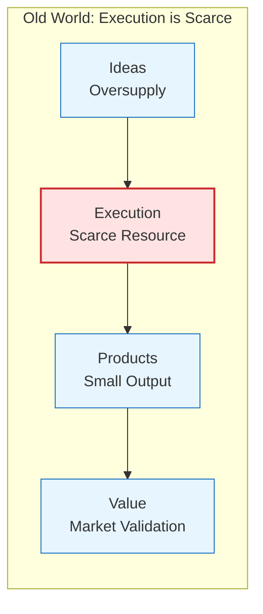
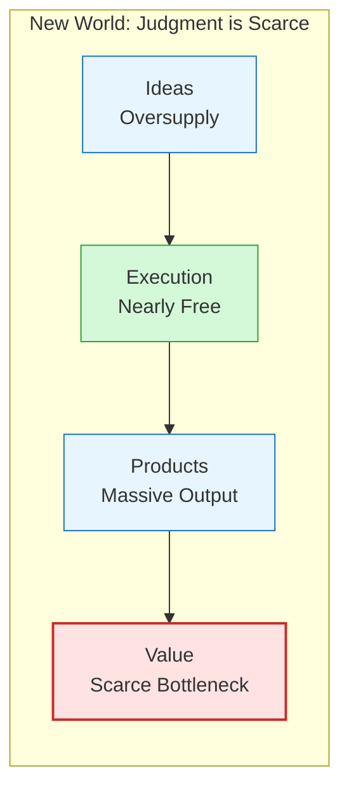
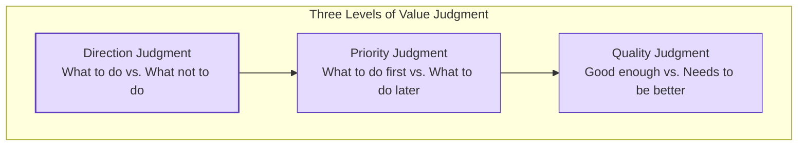
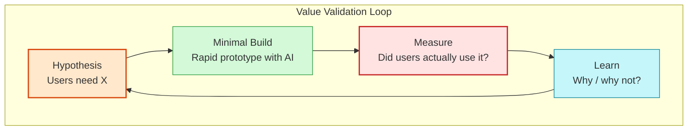

import TechGraph from '../../components/blog/TechGraph.astro'

Google's 2026 developer conference revealed that over 75% of its internal new code is generated by AI, and the engineer's role is shifting from "the person who writes code" to "the person who reviews code." Anthropic's Claude Code lets a single person build an MVP over a weekend that used to take a three-person team two weeks. Cursor, Windsurf, and Copilot have driven the marginal cost of code generation to near zero.

And then what?

An uncomfortable truth: teams whose building speed improved 10x did not see a proportional increase in the probability of producing commercially valuable products. The number of people who can write an app has grown by an order of magnitude, but the proportion who can make an app someone is willing to pay for is actually declining.

**Building is easier, generating value is still hard.** The lowering of the building threshold hasn't lowered the threshold for value creation—it has merely shifted scarcity from one dimension to another.

<TechGraph src="/images/posts/building-is-easier-generating-value-is-still-hard/value-scarcity-shift.svg" title="Scarcity Shift" caption="The number of products has exploded, but the proportion that creates real value is actually lower" />

## The Old World: Execution Ability Itself Was a Moat

Rewind to before 2022. Back then, "being able to code" was itself a scarce resource.

A non-technical founder with a product idea faced a real barrier: finding developers, affording their salaries, and managing progress. A massive number of "good ideas" stalled at the slide deck because of this barrier. When VCs funded technical teams, what they were really investing in was execution ability. You have an idea, I have an idea, but you have three full-stack engineers and I don't—so the money goes to you.

In this world, the distribution of scarcity was clear:

The bottleneck was at the execution layer. Most ideas died because they "couldn't be built," not because "nobody wanted them."

This created a side effect: the market lacked sufficient validation samples. With so few products, it was hard to judge whether "the market actually needs this thing," and the default assumption was "if you build it, someone will use it." In a supply-scarce environment, that assumption often held true.

## The Inflection Point: When Building Cost Approaches Zero

What happened in 2025–2026 wasn't a gradual improvement in code quality—it was a step-function collapse in building cost.

A few key data points:

- Google: 75% of new code generated by AI, 3,000 layoffs in basic coding roles
- Sonar data: AI-generated code can handle 65% of basic coding tasks, reducing labor costs by 70%
- Individual case: a product director spent 5 months using an AI team to refactor the entire tech stack without writing a single line of code themselves

An article on Gelonghui described this transition precisely: **from "talk is cheap" to "code is cheap."** Ideas used to be worthless because everyone had them. Now code is worthless too, because everyone can use AI.

So what's still valuable?

The distribution of scarcity in the new world has fundamentally flipped:

The bottleneck has shifted from the execution layer to the value layer. Products no longer die because they "can't be built"—they die because "nobody wants them," or "someone wants them but you don't know who."

## Three Truly Scarce Dimensions

In May 2026, the World Economic Forum published a report on the rise of "Judgement Work." The core thesis: AI is fundamentally a prediction technology—it can extrapolate outcomes from data, but it cannot judge which outcomes matter, let alone interpret outcomes based on goals and values.

Boston Consulting Group estimates that within the next two to three years, 50–55% of U.S. jobs will be reshaped by AI. Not eliminated—unbundled: every job gets split into an "automatable" part and a "depends on human judgment" part, and the premium on the latter is rising sharply.

I break "judgment" down into three specific dimensions:

<TechGraph src="/images/posts/building-is-easier-generating-value-is-still-hard/three-dimensions.svg" title="Three Scarce Dimensions" caption="Value discovery, value judgment, value validation: the truly scarce capabilities after the building threshold drops" />

### Dimension One: Value Discovery—Seeing Needs Others Haven't Seen

Value discovery is not "coming up with a good idea." In the AI era, the execution cost of ideas is extremely low, and ideas themselves are not scarce. What's scarce is **identifying unmet needs from real-world scenarios**.

In the "hand-crafted economy" cases reported by CNR (China National Radio), successful practitioners generally followed two patterns:

1. **Deep domain accumulation**: immersed in a specific field for years, clearly knowing which problems exist but remain unsolved. AI let them turn what used to require a team into something one person can do.
2. **Unique insight**: acutely perceptive of pain points in real life, spotting gaps where others see things as "just the way it is."

What both patterns share: **value discovery comes from deep immersion in the real world, not from brainstorming sessions in front of a computer.**

An article on Tencent Cloud revealed an interesting data point: AI has improved development efficiency by several- to tenfold, but the requirements stage hasn't budged. The faster development gets, the more obvious the requirements bottleneck becomes. This isn't a process problem—it's a cognition problem. Knowing "what to build" is much harder than "how to build it."

### Dimension Two: Value Judgment—Choosing the Right Direction Among Infinite Possibilities

When building cost approaches zero, what you face is no longer a constrained set of "what can be built," but an infinite space of "anything can be built." The most important capability becomes **making the right trade-offs**.

The more options you have, the harder it is to make good choices. Psychology calls it the Paradox of Choice; in engineering, it manifests more concretely:

- Two months into Vibe Coding, many developers found themselves the "least code-literate person" on the project. AI is too fast—human thinking speed can't keep up with code generation speed, and the ambiguity of requirements gets directly amplified by execution speed
- Multiple teams found in retrospectives that AI's code generation speed was astonishing, but downstream maintenance costs grew exponentially. It wasn't that code quality was poor—the direction was wrong, and speed amplified mistakes faster
- "Looks like it works but actually doesn't" products proliferated. Being able to build something doesn't mean you should

The World Economic Forum report introduced a concept called the "Judgement Premium": when prediction becomes cheap and accurate, the ability to determine whether a prediction's outcome matters and how to interpret it commands a rising premium.

Mapped to an engineer's daily work:

- AI can instantly produce ten technical solutions, but choosing which one requires understanding business constraints, team capabilities, and the long-term impact of maintenance costs
- AI can generate a complete system architecture diagram, but judging whether that architecture will still hold up in two years requires experience and insight
- AI can write code that satisfies requirements, but judging whether the requirements themselves are correct requires understanding users and the market

### Dimension Three: Value Validation—Proving That What You Built Is Actually Wanted

The most easily overlooked dimension.

After building costs dropped, the market was flooded with products. CNR's reporting showed that the "hand-crafted economy" greatly boosted societal innovation energy, but a large number of projects discovered after launch that "nobody uses it." This isn't failure—this is the new normal. Execution is no longer the bottleneck; validation has become the new bottleneck.

Value validation encompasses several layers:

1. **User validation**: Does anyone actually need this? Not "my friends said it's great," but someone willing to exchange real money for it.
2. **Market validation**: Is the scale of demand sufficient to sustain a product/business?
3. **Sustainability validation**: After users try it once, do they come back? Or is it a one-time novelty?

Stripe's Minions system has AI submit thousands of PRs per week, but the premise is that humans only do review. Why does this work? Because Stripe has already completed value validation—they know what users want, and AI is simply executing on already-established value.

But for projects starting from zero, the value itself is unknown. What you need isn't faster code writing—it's faster hypothesis validation.

AI accelerates the "Minimal Build" step in the loop (green), but the speed of the entire loop is determined by the slowest step. If you don't know how to design validation experiments, don't know what metrics to measure, and don't know how to learn from the data, then AI is just helping you build things nobody wants—faster.

## Concrete Implications for Engineers

Done with the abstract level. Let's bring it down to the individual.

### First: From "Can Write Code" to "Can Define Problems"

Before 2022, testing LeetCode in interviews was reasonable—it filtered for execution ability. After 2026, what differentiates engineers is not coding ability but problem-definition ability:

- Can you decompose a vague business objective into clear technical problems?
- Can you identify requirements that "look like they should be done but actually shouldn't"?
- Can you judge whether a technical solution will become tech debt in three months?

Former Google CEO Eric Schmidt said the engineer's role is leaping from "the person who writes code" to "the command center for AI Agents and the system architect." This description makes sense, but it doesn't go deep enough—what architects do is also being AI-assisted. What's irreplaceable is: **the ability to make decisions in ambiguous territory.**

### Second: Going Deep in One Domain Matters More Than Broadly Knowing Many Tools

Successful people in the hand-crafted economy share one trait: they're not "full-stack generalists who know a bit of everything," but "experts with deep accumulation in a specific domain." AI leveraged their professional expertise.

This runs counter to the narrative of the past decade. The past celebrated "T-shaped talent"—horizontal breadth plus vertical depth. But in the AI era, horizontal breadth has been leveled by tools (AI knows a bit of everything), and differentiation can only come from vertical depth.

Applied specifically to the technical domain: rather than learning five frameworks at 30% proficiency each, deeply understand the core challenges of one business domain. Frameworks will become obsolete, AI will learn them, but understanding "which decisions in an ad system actually impact ROI" won't become obsolete.

### Third: Validation Ability Is Worth More Than Building Ability

Writing an MVP might now only take a weekend. But knowing what hypothesis that MVP should validate, how to design the validation experiment, and how to interpret the results—that requires methodology and experience.

I recommend building a validation habit:

- Before writing code, first write down "what hypothesis does this feature validate"
- Change each sprint's goal from "complete feature X" to "validate hypothesis X"
- Use AI to accelerate building, but spend the time you save on user research—not on building more features

## Who Wins in the New World

Back to the diagram at the beginning. Among the two rows of dots, the red ones are projects that created value. In the first row, the red dots are in the middle—in the old world, as long as you could build it, there was a reasonable probability of creating value (supply itself was scarce). In the second row, the red dots are at the end—in the new world, only projects that complete the entire chain of value discovery, value judgment, and value validation can stand out.

This isn't pessimism. For people who were already good at discovering problems, making judgments, and validating ideas, AI is an enormous lever. In the past, you had insight but no execution ability—now execution is virtually free. In the past, you saw a need but couldn't assemble a team—now you can do it alone.

The good news: the building threshold has dropped, but the value creation threshold hasn't changed. **People who can create value have far more leverage in the new world than in the old one.**

The bad news: if your past competitive advantage was built solely on "I can code and you can't," that moat is being filled in. The new moat lies in the three dimensions of value discovery, value judgment, and value validation.

---

*Reference sources:*
- [World Economic Forum: The rise of 'judgement work' in the age of AI](https://www.weforum.org/stories/2026/05/rise-of-judgement-work-in-age-of-ai-jobs-skills-this-month/)
- [From Vibe Coding to Harness Engineering: Software Engineering in the Age of Attention](https://cj.sina.cn/articles/view/7879848900/1d5acf3c401902xrsq)
- [What Does the End of Model Scarcity Mean for AI Entrepreneurs?](https://cj.sina.cn/articles/view/7879848900/1d5acf3c4068031kr6)
- [From "Talk Is Cheap" to "Code Is Cheap"](https://m.gelonghui.com/p/4002890)
- [CNR: The Hands-On Economy—Small Ideas Become Big Businesses](http://www.cnr.cn/mspd/sywzl/20260630/t20260630_527682724.shtml)
- [AI Development Keeps Getting Faster—Why Have Requirements Become the Biggest Bottleneck?](https://cloud.tencent.com/developer/article/2675319)
