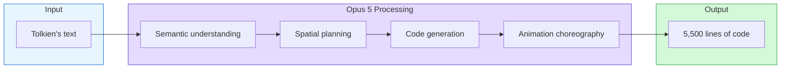
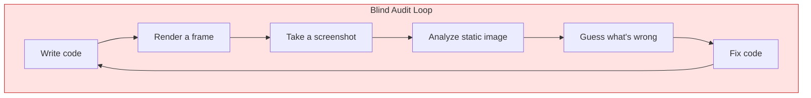
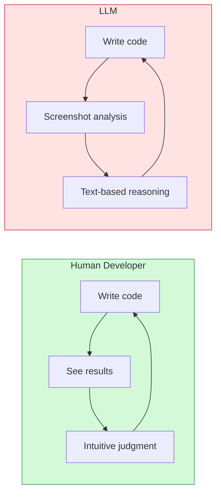

import Diagram from '../../components/blog/Diagram.astro'
import Figure from '../../components/blog/Figure.astro'

Shortly after Andrej Karpathy jumped from OpenAI to Anthropic, he used his new employer's model to do something that made the entire developer community pause and think: he fed the opening paragraph of *The Lord of the Rings* to Claude Opus 5, gave it a one-million-token budget, and issued a single instruction—render this passage as a 3D scene using Three.js.

Two hours later, the model delivered 5,500 lines of code. Open it in a browser, and Middle-earth's Shire just… appears: rolling hills, rivers, hobbit holes, walking characters, advancing camera shots. Every tree's coordinates, every rock's geometry, every animation timeline—all written out line by line in code, without a single external texture.

Cost: roughly $10.

That alone is stunning enough. But what Karpathy really wanted to say wasn't "look how powerful AI is"—what he wanted to say was "look where AI breaks."

## From Pelicans on Bicycles to Middle-earth

Two years ago, the standard move for testing an LLM's spatial reasoning was to ask it to draw an SVG of "a pelican riding a bicycle." This required the model to understand the structure of a bicycle, the body proportions of a pelican, the spatial relationship between the two, and then compose them using paths and coordinates. Most models produced something that oscillated between "barely passable" and "abstract expressionism."

What Karpathy did this time is on a completely different scale. Not a static vector image, but a 3D animated world with narrative pacing. The model needed to:

1. Understand the geographic information implicit in Tolkien's prose (where the Shire is, how the Brandywine River flows)
2. Decompose narrative elements into programmable geometric assets
3. Place thousands of objects in a 3D coordinate system
4. Write timeline code for camera movement, character animation, and scene transitions
5. Make the whole thing run in a browser

This isn't a "draw a picture" problem anymore. This is systems engineering.

<Diagram title="From Text to World" caption="Opus 5's processing pipeline">

</Diagram>

From a passage of natural language to a complete interactive 3D world, with no human intervention in between. This tells us that the code generation capability of today's top LLMs has reached a level of engineering complexity that previously required a small team collaborating for weeks.

## The Blind Sculptor's Dilemma

But here's the problem.

Karpathy himself described the finished product in three words: janky but fun.

Where is it janky? Everywhere. Character models are stick figures made of boxes and cylinders. Tree canopies are a few green spheres stacked on each other. Some objects are misplaced, some animation timing is off. More critically, there are performance issues: the original scene used 569 separate draw calls; with instanced mesh, the 1,154 repeated objects could be handled in just 4 calls. The model never proactively made this optimization.

Why? Because Opus 5 can't see what it built.

This is the part most worth thinking deeply about. Karpathy's own words:

> "They can't easily audit their work because they aren't able to efficiently and natively perceive videos or play games within them."

An LLM is a text engine. It eats text, it outputs text. It has no eyes, no 3D perception, and can't "walk" inside a scene. After writing the code, if it wants to check whether things are correct, it has to go through an extremely inefficient loop:

<Diagram title="The LLM's Blind Audit Loop" caption="Information is lost at every step">

</Diagram>

A screenshot can tell it whether a tree is in frame, whether the mountain color is right. But it can't tell it: does the character clip through objects while walking? Is camera movement smooth? Are occlusion relationships between two objects correct? Does the animation have the right rhythm?

It's like a sculptor working with eyes closed: able to carve a rough shape from memory and touch, but unable to step back and look at the overall effect. Every time they want to check, they have to ask someone else to take a photo and describe it to them.

## Generation Capability vs. Perception Capability: A Structural Rift

<Figure src="/images/posts/karpathy-llm-blind-renderer/blind-loop.svg" alt="LLM blind audit loop vs. human developer feedback loop" caption="LLMs can only audit inefficiently through screenshots; human developers have instant, high-bandwidth visual feedback" />

This isn't unique to Opus 5. This is the shared predicament of all LLMs when facing visual output.

In traditional software development, there's a tight feedback loop between writing code and seeing the result: write a few lines → save → hot reload → look with your eyes → spot the issue → fix. The entire loop might take only a few seconds. A human developer's visual system is free, instant, and high-bandwidth.

LLMs don't have this loop. Or rather, their loop is broken:

<Diagram title="Feedback Loop Comparison" caption="Human vision is a free, high-bandwidth channel; LLMs only have the narrow path of screenshots">

</Diagram>

A human developer takes one glance and knows "that tree is floating in the air"—no analysis needed, no reasoning needed, the visual system tells you directly. An LLM needs to first take a screenshot, convert the image to tokens, then reason in text space: "Based on pixel distribution, the bottom of the tree doesn't appear to be in contact with the ground"—this process is slow, lossy, and error-prone.

What's worse, visual inspection alone isn't sufficient for 3D content. What you need is interactive, continuous perception: looking from different angles, walking around the scene, triggering different animation states. A single screenshot can never substitute for these.

This is why the 5,500 lines of code, while "runnable," feel like a rough shell of an unfinished apartment everywhere—the model completed the generation but never truly "experienced" its own work.

## This Isn't Just a 3D Problem

Zoom out a bit, and this "wrote it but can't see it" problem actually permeates every corner of LLM applications:

**Front-end development**: An LLM can write syntactically correct CSS, but doesn't know if the rendered button is crooked, if the spacing is weird, or if it overflows on mobile. What's the solution in tools like Cursor and Claude Code? Screenshot → multimodal analysis. Exactly the same loop as in Karpathy's experiment.

**Data visualization**: The model can generate D3.js chart code, but doesn't know if axis labels are overlapping, if color contrast is sufficient, or if animations are smooth.

**Game development**: It can write game logic but can't playtest. It doesn't know if the feel is right, if the difficulty curve is reasonable, or if a particular level has a softlock.

What all these scenarios have in common: **the quality of the code is ultimately defined by the visual/interactive result, not by the code itself**. Code that is syntactically correct and logically consistent may render into something completely different from what you wanted.

This is an architectural-level deficiency, not something solvable through "smarter reasoning." You can't substitute imagination for eyes.

## Ephemeral GTA on Demand: The Gap Between Vision and Reality

Karpathy's picture of the future is enticing:

> "I'm excited about creating hyper custom worlds that you can imagine dropping players into... Something like an ephemeral GTA of X on demand."

On-demand generation of ephemeral open worlds. Users specify any novel, historical event, or fictional setting, and the model builds an interactive world in real time. Play it and throw it away, like a disposable paper cup.

The economic logic holds: when generation cost drops to $10, content that previously would never be produced because it was "too personalized, with too low an ROI" suddenly becomes viable. A Middle-earth made just for you used to require tens of thousands of dollars in budget and a week of work; now it's $10, two hours.

But there's a massive chasm between "it runs" and "it's worth playing." The current bottleneck isn't generation capability—5,500 lines of code prove that's no longer the issue. The bottleneck is the quality control loop: the model can't playtest itself, can't judge "is this scene interesting?", "is this interaction natural?", "is this pacing right?"

Bridging this chasm requires not "bigger models" or "longer context," but architectural changes:

1. **Native visual streams**: The model needs to watch video frames continuously, like a human, instead of analyzing one screenshot at a time
2. **Interactive environment access**: The model needs to "walk around" inside the world it generated—issuing action commands, receiving environment feedback
3. **Real-time perception-action loops**: Generate code → execute in the environment → observe results in real time → adjust—this loop needs to operate at millisecond scale, not minute scale

Any one of these three is a far harder engineering problem than "getting the model to write more code."

## Two Paradigms Collide

"Generating 3D worlds through code" isn't the only approach. The other is so-called "world models"—like Google's Genie 2 or World Labs' approach—which don't write code at all but instead directly predict the next frame of video based on input.

The two approaches solve problems at different levels:

| Dimension | Code-generated worlds | Neural world models |
|------|-------------|-------------|
| Output | Editable, debuggable code | Pixel streams / video |
| Visual quality | Depends on code precision, easily rough | Can be highly realistic |
| Controllability | High—every object has explicit state | Low—black box |
| Physics rules | Must be explicitly coded | Implicitly learned |
| Audit difficulty | Code is readable but visual audit is hard | Nearly impossible to audit |

Karpathy's experiment belongs to the first approach. Its advantage is transparency—5,500 lines of code, and you can modify whatever you want. Its disadvantage is exactly what this article discusses: the model that writes the code can't see what the code renders.

The more likely future form is a fusion of both approaches: LLMs handle planning, designing rules, and generating structural code; world models handle filling in visual detail, providing physical intuition, and environment feedback. The LLM as architect, the world model as construction crew and inspector.

## What This Means for Developers

If you're currently working on AI-assisted visual content generation, Karpathy's experiment sends a clear signal: **generation isn't the bottleneck—verification is.**

A few direct takeaways:

**The visual verification layer is more worth investing in than the generation layer.** Current toolchains have poured massive resources into "getting AI to write more code," but "getting AI to understand what it wrote" is still in the primitive stage. Whoever can make the screenshot → analysis loop fast enough and accurate enough holds the next leverage point.

**The instanced mesh lesson: domain knowledge doesn't appear automatically.** Opus 5 didn't use instanced mesh optimization not because it doesn't know the concept—give it an explicit prompt and it will use it. Rather, in open-ended generation tasks, the model has no motivation to proactively invoke this kind of optimization knowledge. This means prompt engineering and system design play a more important role than you might think: you need to inject domain best practices into the generation pipeline at the architectural level.

**The center of gravity in human-AI collaboration is shifting.** It used to be humans writing code with AI helping autocomplete. Now it's AI writing the entire system while humans playtest and judge "is it good?" This demands a different skill tree from developers: you no longer need to hand-write every line of Three.js, but you need to quickly judge whether 5,500 lines of auto-generated code are doing something dumb. This is more like code review than coding.

## The Insight $10 Bought

The value of Karpathy's experiment isn't in that janky-as-hell Middle-earth itself—it's in exposing a clear dividing line.

On one side of that line is "generation": LLMs can already do jaw-dropping things here. From a paragraph of text to a complete, interactive 3D world, two hours, $10. This line is pushing outward at a staggering pace.

On the other side is "perception and judgment": the model built the world but can't enter it, can't see it, can't play it. It can't step back to look at the overall effect, can't walk into the scene to experience its own work, can't say like a player would, "something feels off here."

This dividing line is the true frontier of current AI capability. The next major breakthrough won't come from "the model can write more lines of code," but from "the model can finally see what it wrote."

Karpathy bought a Middle-earth for $10. The more expensive insight came free of charge.

---

**References**

- [Karpathy LOTR 3D Demo](https://karpathy.ai/lotr-movie/)
- [AI Front Page detailed coverage](https://aifront-page.com/karpathy-claude-opus-5-lord-of-the-rings-ai-gaming/)
- [36Kr report](https://36kr.com/p/3923301646741120)
- [Sina Finance technical breakdown](http://finance.sina.cn/stock/jdts/2026-08-03/detail-inikzuyf6198125.d.html)
