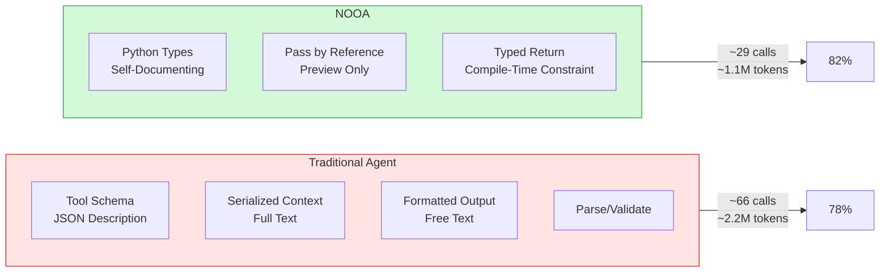
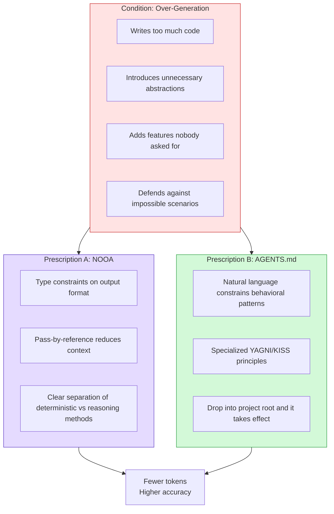

import Callout from '../../components/blog/Callout.astro'
import Diagram from '../../components/blog/Diagram.astro'
import Figure from '../../components/blog/Figure.astro'


Two seemingly unrelated things happened in the AI world this week:

NVIDIA open-sourced an Agent framework called NOOA that scored 82.2% on SWE-bench with 253 lines of code, consuming only half the tokens of comparable solutions.

At the same time, a developer from the Vercel Next.js team said he'd burned through roughly 60B tokens (six figures in USD) and ultimately distilled the experience into 8 rules written in an AGENTS.md file. The tweet was translated and reposted by @AYi_AInotes in the Chinese-speaking community and racked up over 2,200 likes.

These two things point to the same conclusion: **The key to making Agents better isn't making models stronger—it's putting the right constraints on them.**

## NOOA: An Agent Is Just a Python Class

NOOA stands for Object-Oriented Agents, from NVIDIA Labs, open-sourced under Apache 2.0. Its core design philosophy can be stated in one sentence: an Agent is a Python class.

In traditional Agent development, code is scattered across four places: prompt template files, tool schemas (JSON), callback code, and workflow graph definitions. Changing one behavior might require touching three files. NOOA collapses everything into a single class:

- Methods = the Agent's capabilities
- Fields = the Agent's state
- Docstrings = prompts
- Type annotations = output constraints
- Method body is `...` (ellipsis) = filled at runtime by the LLM
- Method body has real code = plain Python, executed directly

```python
class CodeAgent(Agent):
    """You are a code repair expert"""
    
    repo: Repository  # State: reference to the code repository
    
    def diagnose(self, error: str) -> Diagnosis:
        """Analyze the root cause of the error and return a structured diagnosis"""
        ...  # Filled at runtime by the LLM
    
    def apply_fix(self, diagnosis: Diagnosis) -> PatchResult:
        """Generate and apply a patch based on the diagnosis"""
        ...  # Filled at runtime by the LLM
    
    def run_tests(self) -> TestResult:
        """Execute the test suite"""
        return self.repo.execute("pytest")  # Deterministic Python
```

This design solves a problem that has long been overlooked: the abstraction level of Agent frameworks. LangChain-style frameworks abstract Agents into combinations of "chains" and "tools"—the abstraction level is too high, making it impossible to precisely control when the LLM should reason and when it should use deterministic code. NOOA hands that decision back to the developer: wherever you put `...`, the LLM fills in; wherever you write code, the code runs as-is.

## 253 Lines of Code, 82.2% Accuracy

<Figure src="/images/posts/nooa-agents-md/nooa-comparison.svg" alt="NOOA vs traditional Agent architecture comparison" caption="Fragmented traditional Agent architecture vs NOOA's unified Python Class—half the calls, half the tokens, higher accuracy" />

NOOA's numbers on SWE-bench Verified:

| Solution | Accuracy | LLM Calls | Tokens/Task |
|------|--------|-------------|----------------|
| NOOA (GPT-5.5) | 82.2% | ~29 | ~1.1M |
| OpenCode | 78.6% | ~66 | ~2.2M |
| PI | 78.2% | ~66 | ~2.2M |
| NOOA (Opus 4.6) | 79.8% | — | — |

The key isn't just that accuracy is 4 percentage points higher. It's that **with half the calls and half the token consumption, accuracy is still higher.**

This is counterintuitive—fewer reasoning steps should mean a coarser problem-solving process. But NOOA's explanation is: traditional Agents waste massive amounts of tokens on "format conversion" and "re-understanding." Every LLM call requires re-parsing tool schemas, re-understanding context, and re-formatting output. NOOA eliminates this overhead through the type system and pass-by-reference.

<Diagram title="Token Efficiency Comparison" caption="NOOA eliminates the massive format-conversion overhead in traditional architectures">

</Diagram>

Even more convincing: the SWE-bench agent is only 253 lines of code, with zero benchmark-specific prompt optimization. It's a **general-purpose** agent, not one custom-built for benchmarks.

NVIDIA also ran a capability test: 88 tests, 36 capability categories, 10 models, each run 5 times. Overall pass rate: 97.9%. None of these models were trained on the NOOA interface. They could use it purely because it's essentially Python, and all large models have strong prior knowledge of Python.

## 8 Rules Forged from 60B Tokens

On the other side, @MarcosHernanz's AGENTS.md takes a completely different path—not designing a new framework, but **telling the AI inside existing frameworks how to behave**.

The core logic of the 8 rules can be summed up in one sentence: make your AI coding Agent stop acting like an intern who wants to build everything from scratch, and instead code like a ten-year veteran who knows better.

The specific rules:

1. **Don't maintain backward compatibility.** Delete what's outdated—no compatibility layers, no migrations, no fallbacks.
2. **Choose the simplest implementation.** No preemptive abstractions, no unnecessary configuration layers.
3. **System layering goes long.** Get the minimal end-to-end version working first, then add on top of it.
4. **Don't touch what you weren't asked to touch.** When fixing a bug, don't rename variables, delete comments, or refactor adjacent code along the way.
5. **Check before creating new files.** See if existing files can be extended; avoid file proliferation.
6. **Conservative technology choices.** Prefer mature libraries; don't rewrite things yourself without a clear reason.
7. **Tests verify behavior, not implementation.** Don't write tests that break on every refactor.
8. **Error handling should be proportional.** Only handle errors that actually occur; don't write defensive code for impossible scenarios.

Look familiar? This is basically the AI-specialized version of YAGNI + KISS + "mind your own business." But "familiar" doesn't mean "useless."

There's research data to back it up: unconstrained AI Agents write 54% more code on average—a countdown feature that a human writes in 13 lines, an unconstrained Agent writes in 190 lines.

## The Underlying Logic of These Two Things Is the Same

NOOA uses the type system to constrain an Agent's inputs and outputs, preventing it from going off the rails. The 8 rules use natural language to constrain an Agent's behavioral patterns, preventing it from over-engineering.

Different methods, but they diagnose the same condition: **LLM's default behavior in open-ended coding tasks is "over-generation."**

<Diagram title="Two Prescriptions, Same Condition" caption="Hard constraints and soft constraints combat LLM's over-generation tendency from different paths">

</Diagram>

Why do LLMs tend toward over-generation? Karpathy pointed this out long ago: LLMs naturally like to write complex code and pile up abstraction layers. This isn't a bug—it's caused by the training data distribution. High-star projects on GitHub tend to have complex abstractions and thorough error handling, so the model learns an implicit bias that "complex = good."

The role of constraints is to counteract this bias. NOOA uses the type system as a hard constraint (your return value must be this type), AGENTS.md uses natural language as a soft constraint (you should choose the simplest implementation). The two work best in combination.

## Limitations of Soft Constraints

But the 8 rules aren't a silver bullet. Several sober criticisms emerged from community discussions:

**Rule 1 (don't maintain backward compatibility) is dangerous in production.** @MarcosHernanz himself has admitted that this rule once nearly caused the Agent to drop tables from a production database, almost losing $2,000 worth of data. He explicitly noted "only suitable for side projects—use with caution in production."

**Rules themselves need to be testable.** Phrasing like "keep it simple" is too vague for an LLM. Effective AGENTS.md rules need to be specific enough to be verifiable: "no single file exceeds 300 lines," "don't introduce dependencies not already used in the project."

**Soft constraint decay.** A V2EX user shared their experience: after more than 4 hours, AI Agents start exhibiting "context anxiety"—just like early LLMs, they can't reliably complete long tasks. Rules in AGENTS.md may be discarded after context compression.

This neatly explains why NOOA's approach performs better on benchmarks—type constraints don't get dropped by context compression. Python's type system is part of the code structure; no matter how the context window gets compressed, type signatures are always there.

## The Harness Theory: A Consensus Is Forming in the Agent Space

Looking back at the discussions about Agents from 2026 to now, a consensus is emerging:

Tw93 wrote in his Agent article: "The improvement from more expensive models is often not as large as you'd expect; rather, the quality of the harness and validation tests has a bigger impact on success rates."

NVIDIA's paper proves the same thing with data: **merely changing the harness design (using the same model) can produce double-digit score differences and 50% cost differences.**

Internal cases at OpenAI support this judgment too: 3 engineers wrote a million lines of code in 5 months at 10x traditional speed. The reason for success wasn't how strong the model was, but that the engineering decisions around the harness were right.

There's a highly practical corollary here for Agent developers: if your Agent isn't performing well, **fix the harness before switching models**. Switching to a more expensive model might gain 2–3 percentage points; redesigning the constraint architecture might gain 10+ percentage points.

## Practical Recommendations

For engineers currently doing Agent development, these two developments combined offer a clear operational path:

**What you can do immediately (5 minutes)**: Drop an AGENTS.md (or CLAUDE.md) in your project root with 4–8 behavioral constraint rules. You don't need 60B tokens of experience—starting with "don't touch what you weren't asked to touch" and "prefer existing dependencies" is enough. Cursor, Claude Code, Codex, and Windsurf all read these automatically.

**What's worth investing in medium-term**: Evaluate whether NOOA fits your Agent project. If your Agent frequently calls tools, processes structured data, or does multi-step reasoning, NOOA's type constraints + pass-by-reference design can significantly reduce token costs. `pip install nooa`—the 253-line SWE-bench agent is a good starting point.

<Callout type="warning" title="Watch Out for These Pitfalls">
- NOOA's Agent executes LLM-generated Python code; the security boundary must be OS-level isolation (containers/VMs), not AST inspection
- AGENTS.md rules may be discarded after context compression during long-running sessions; they need to be re-injected at critical checkpoints
- The "don't maintain backward compatibility" rule must be removed or softened for production environments
</Callout>

## Constraints Are the New Capability

The AI Agent field is undergoing a cognitive shift: from "how to make models more powerful" to "how to keep models from doing dumb things."

NOOA proved that: by using the Python type system as hard constraints, the same model's performance can improve by 4+ percentage points with costs reduced by 50%.

The 60B-token experience proved that: by using natural language as soft constraints, you can cut AI's code output from 190 lines down to under 100, while reducing rework and token waste.

Both point in the same direction: **The next generation of Agent tools won't compete on what model they connect to, but on what constraint system they've designed.**

Model intelligence is an inflationary asset—it gets cheaper every quarter. Constraint design is a knowledge moat that requires domain experience, engineering judgment, and massive trial-and-error (like those 60B tokens) to accumulate.

If you're building an Agent product, your constraint system is your moat—not which model's API you've plugged in.

---

**References**

- [NOOA Paper (arXiv)](https://arxiv.org/abs/2607.20709)
- [NOOA GitHub](https://github.com/NVIDIA-NeMo/labs-OO-Agents)
- [NVIDIA Blog](https://developer.nvidia.com/blog/six-agent-harness-capabilities-for-higher-model-performance/)
- [@MarcosHernanz 60B tokens AGENTS.md](https://x.com/MarcosHernanz/status/2083954734487212511)
- [@AYi_AInotes Chinese breakdown](https://x.com/i/status/2084522269745820010)
