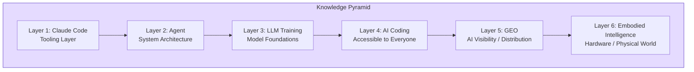
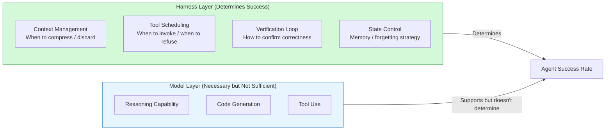

import Diagram from '../../components/blog/Diagram.astro'
import Figure from '../../components/blog/Figure.astro'

In mid-June, Tw93 posted on X saying he'd heard from friends that his article series had become required reading for AI job interview prep. The post got over 2,800 likes.

What makes this interesting isn't "someone else wrote AI explainers." It's that a product engineer known for building Pake (a desktop app packaging tool with 60K stars) wrote six articles over three months that turned out to be better interview prep material than most professional AI courses.

How did he pull it off? And a more worthwhile question: why does stuff written by someone with a "non-specialist background" end up becoming the interview standard?

## The Knowledge Architecture of Six Articles

The series was written from March to June, with titles following a uniform format of "Things You Don't Know About X":

| # | Title | Published | Core Thesis |
|---|-------|-----------|-------------|
| 1 | Claude Code: Architecture, Governance & Engineering Practice | 03-12 | Claude Code isn't a chatbot—it's a context governance system |
| 2 | Agents: Principles, Architecture & Engineering Practice | 03-21 | An Agent's success depends on the Harness, not model intelligence |
| 3 | LLM Training: Principles, Paths & New Practices | 04-03 | What separates models is no longer pre-training, but post-training and data recipes |
| 4 | AI Coding: Getting Started & Real Practice for Non-Technical People | 04-26 | Claude Code is fundamentally a general-purpose Agent, not just a code writer |
| 5 | GEO: Principles & Practice of AI Visibility | 05-01 | Making AI understand your content isn't speculation—it's infrastructure |
| 6 | Embodied Intelligence: From Mini Robot Dogs to Optimus | 06-07 | Understanding embodied AI starting from a 200-yuan STM32 robot dog |

The six articles form a clearly layered pyramid:

<Figure src="/images/posts/tw93-ai-interview/knowledge-pyramid.svg" alt="Tw93 AI Engineer Knowledge Pyramid" caption="From the tooling layer to the physical world, a six-layer progressive cognitive framework for AI engineers" />

<Diagram title="Knowledge Layer Structure" caption="Each layer builds on the one beneath it">

</Diagram>

From tools to architecture to principles to applications to distribution to hardware—these aren't six standalone explainers. They're a complete cognitive framework for AI engineers.

## Why These Articles Work as Interview Material

In 2026, AI hiring exploded (algorithm engineer positions grew 220%, while traditional development roles declined 8–25%), and massive numbers of engineers are transitioning from backend, frontend, and mobile into AI. The core challenge they face: interviewers aren't asking about paper details—they're asking "how do you understand this system."

Tw93's articles filled exactly that gap. Someone wrote on Juejin: "In my Tencent first-round interview, I confidently asked back: you say you're building an Agent project—tell me how you handle SubAgents, Plan patterns, Skill invocations?" The knowledge source for that kind of question is this series.

Specifically, three characteristics make these articles better suited for interview prep than formal textbooks:

**First, an engineering perspective rather than an academic one.** The most powerful insights in the series are almost all counterintuitive engineering judgments:

- "Where things get stuck is almost never that the model isn't smart enough—more often it's that you gave it the wrong context"
- "The improvement from a more expensive model is often not as large as you'd imagine; instead, Harness quality and verification test quality have a bigger impact on success rates"
- InstructGPT's 1.3B parameter model beat the 175B GPT-3 in human preference evaluations

Saying these things in an interview immediately separates you from candidates who've "only read paper titles."

**Second, the confidence of someone who's built things.** Tw93 isn't summarizing other people's papers. He spent half a year deeply using Claude Code to build Pake (60K stars), Kaku (an AI-native terminal), MiaoYan, and other projects. He spent 200 yuan assembling an STM32 robot dog to understand embodied intelligence. He practiced GEO to get his own blog indexed by AI.

Interviewers can tell the difference between "I've read about this concept" and "I've stepped on this landmine." Tw93's articles convey the texture of the latter.

**Third, written for "smart non-experts."** He's said himself that the goal is "to make it readable even for people without a specialist background." This happens to be the ideal difficulty level for interview prep—much deeper than beginner tutorials, but not so deep that only domain researchers can follow along.

## Several Insights Worth Expanding On

### The Agent Article: Harness Matters More Than the Model

The most important claim in the Agent article: 3 engineers at OpenAI wrote a million lines of code in 5 months—10x the speed of traditional development. The speed behind that isn't about how powerful the model is; it's about getting a few engineering decisions right.

He attributes Agent success to the Harness (scaffolding/runtime framework) rather than the model itself. The specific breakdown:

<Diagram title="Determinants of Agent Success" caption="Harness layer design affects final success rate more than model selection">

</Diagram>

The guidance this judgment offers for interview answers is very direct: when an interviewer asks "how would you design an Agent system," talking about context management, verification loops, and error recovery at the harness level demonstrates systems engineering thinking far more than going on about prompt engineering or model selection.

He also provides a practical reasoning framework: the Agent Loop itself is an abstraction of only about 20 lines of code, and stability comes from **not modifying** the core loop, but instead controlling inputs and outputs through the Harness layer.

### The Claude Code Article: Context Is the Primary Resource

The core argument of the Claude Code article: the hard part of this tool isn't model capability—it's context governance. He cites a striking data point: 5 MCP servers, each consuming about 5,000 tokens of tool schema descriptions, meaning tool definitions alone eat up 12.5% of the context window.

This means before you've even started working, your available space has already shrunk by an eighth. Add in noise from Tool Output and accumulated previous conversation, and "Context Rot" happens at 300K–400K tokens—even if the model claims to support 1M context.

His countermeasure is a six-layer architecture: Rules → Skills → Agents → Tools/MCP → Hooks → Prompt Caching, with each layer solving a different context problem.

### The LLM Training Article: Data Recipe &gt; Scale

The most powerful judgment in the training article: what truly separates large model performance is increasingly no longer pre-training itself, but post-training.

He points out a trend: models often need to first develop capabilities at a larger scale before those capabilities can be compressed into smaller models. This explains why "small models catching up to large models" always lags by one generation—it's not that training methods are inadequate; it's that capability formation has path dependency.

This kind of judgment is especially valuable in interviews: it demonstrates a candidate's ability to understand structural industry trends, not just recall the latest paper titles.

## The Signal Behind This Phenomenon

Tw93's article series becoming interview study material reflects more than just "someone writes well." It points to a larger shift: **AI engineering is moving from "knowing how to train models" to "knowing how to use models," and the latter is closer to the mindset of traditional software engineering.**

In 2026, the most common AI interview questions are no longer "derive the attention formula" or "explain the gradient flow of RLHF." They're:

- How do you manage an Agent's context window?
- How do you verify that AI-generated code is correct?
- How do you do error recovery on an LLM call chain?
- How do you decide whether a task is better suited for a Workflow or an Agent?

The right answers to these questions don't come from papers—they come from engineering practice. As a product engineer who has "built real things," Tw93 is uniquely positioned to provide that practical perspective.

Another signal: the best medium for knowledge dissemination has changed. In the past, technical interview prep relied on textbooks and courses. Now it relies on personal blogs from people with production experience. Because the AI field changes so fast, textbooks are outdated before they go to print, while a personal blog can structurally output the latest engineering experience within a week.

Tw93's own phrasing is precise: "I don't like the tech influencer environment; I believe in long-termism." He didn't chase trending topics with 10 short posts. Instead, he spent three months building a complete knowledge system. This mode of output actually achieves maximum leverage in an information-overloaded environment.

## Takeaways for Engineers Looking to Transition into AI

If you're currently preparing for interviews in an AI direction, this case offers several practical pieces of advice:

**Build a knowledge system rather than collecting knowledge points.** The reason Tw93's six articles work isn't that each one is individually profound—it's that together they form a self-consistent framework. Interviewers can sense whether a candidate's answer is "part of a system" or "a point crammed at the last minute."

**Building one small thing is more persuasive than reading ten papers.** Tw93 spent 200 yuan assembling a robot dog to learn embodied intelligence. The technical complexity of the act itself isn't high, but it gave him a narrative perspective—"I tried it hands-on"—which carries far more credibility in an interview than "I've read the Optimus paper."

**Focus on the Harness/Engineering layer, not just the Model layer.** When 95% of candidates can answer "what is the attention mechanism in a transformer," the person who can answer "under what conditions does an Agent's context window rot, and how do you govern it" stands out.

With six articles, Tw93 proved something: in the AI era, the most valuable knowledge isn't a theoretical understanding of "what models can do," but the engineering judgment of "what goes wrong after a model is running, and how to fix it."

That judgment comes from practice, not from textbooks. That's why a product engineer's blog is better interview prep than a formal course.

---

**References**

- [Tw93's Blog](https://tw93.fun/)
- [Tw93's X Post](https://x.com/i/status/2067851910464565374)
- [Pake GitHub](https://github.com/tw93/Pake)
- [V2EX Agent Article Discussion](https://www.v2ex.com/t/1202137)
