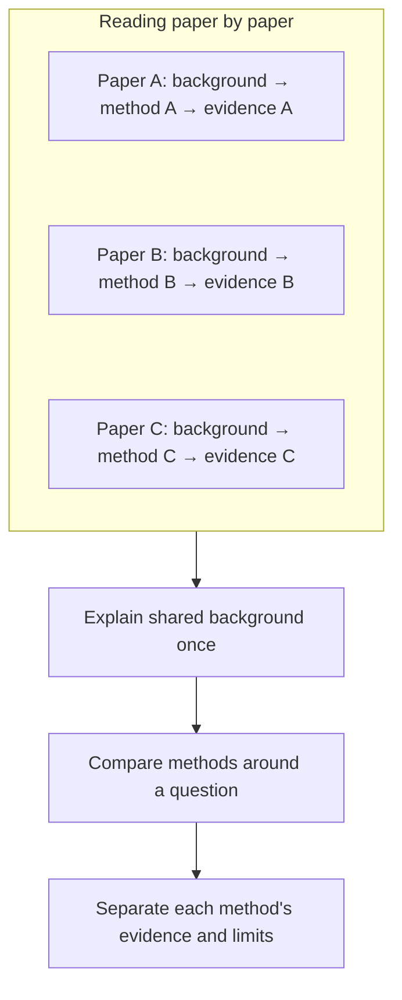
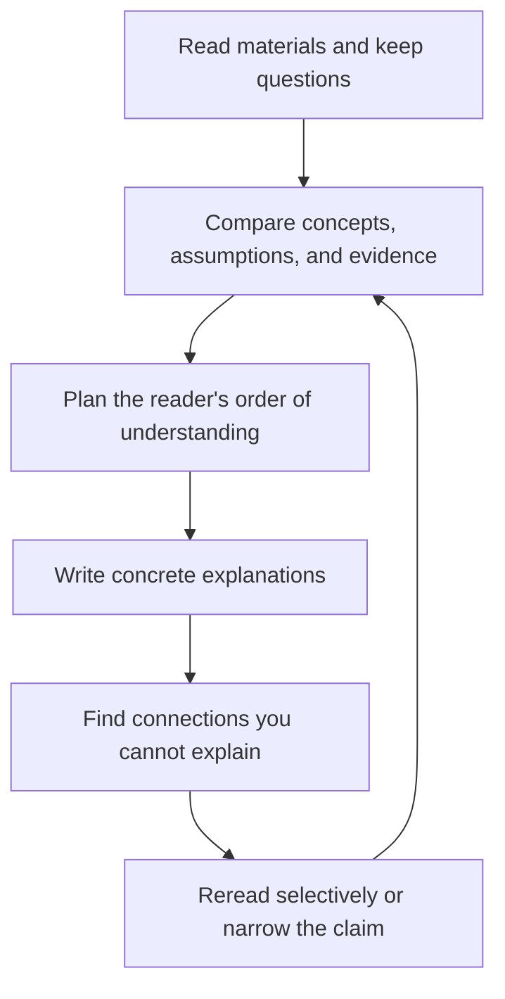

import Diagram from '../../components/blog/Diagram.astro'
import Figure from '../../components/blog/Figure.astro'

After reading a few papers and noting each one's problem, method, and results, you have notes. Then someone asks: are these papers solving the same problem? Which assumption did the later one change? Why might two apparently opposite conclusions both hold? Those answers usually aren't in any single summary.

My working definition of understanding a field is this: **you understand it when you can explain how the material relates, not when you can recall what each piece says.** Writing something another person can follow from start to finish is the cheapest way to test that. Paul Graham puts it bluntly in [Putting Ideas into Words](https://paulgraham.com/words.html): writing about something, even something you know well, usually shows you that you didn't know it as well as you thought, and about half the ideas in an essay come to you while writing it.

Lilian Weng's ICLR 2021 talk, [Catch Up with the Field by Writing a High-Quality ML Blog](https://slideslive.com/38957210/catch-up-with-the-field-by-writing-a-highquality-ml-blog), is about exactly this: keep reading, accumulate notes, then organize related work into one coherent article. This post doesn't recap the whole talk. It follows her method to answer one question: going from "I have read these materials" to "I can explain how they relate," what extra work does writing do?

## The papers are already written, so why write them again?

Weng compares papers laid out in time order to a history of research, with breakthroughs and a great deal of incremental improvement. Each paper has to present its own background and related work so that its contribution stands on its own. Read several papers in a row and you keep rereading overlapping setup.

That repetition is necessary for a single paper and a burden for someone trying to learn a topic. Learning a topic means crossing paper boundaries: working out which background can be merged and which differences must be kept. The paper format doesn't do that job.

In [Research Debt](https://distill.pub/2017/research-debt/) on Distill (2017), Chris Olah and Shan Carter gave this burden a name. Explaining an idea takes effort and so does understanding it; there's a tradeoff between the two, and they call that effort "interpretive labor." In a one-to-many setting, the explanation is done once, but every reader pays the cost of understanding separately. Interpretive labor that nobody does accumulates as research debt.

<Diagram title="From three papers to one explanatory path" caption="Author-created schematic based on approximately 14:41 to 17:24 of the talk. A, B, and C are abstract examples; shared background is merged only where definitions and assumptions are compatible.">

</Diagram>

A synthesizing blog post pays down that debt: it cuts repeated setup, puts related work side by side, and adds the explanation needed to connect it. The writer pays the explanation cost on the reader's behalf, and in paying it, the writer is the first to understand.

"Explaining to others makes you understand first" has experimental support. In [Eliciting Self-Explanations Improves Understanding](https://www.sciencedirect.com/science/article/pii/0364021394900167) (Chi et al., 1994), eighth-grade students read a text on the human circulatory system and were asked to explain each line to themselves; a control group read the same text twice. The prompted group gained more from pretest to posttest, and the students who explained the most all reached the correct mental model of the circulatory system, while many control students and low explainers did not. Same text, reading it again versus explaining it while reading: different results.

Weng also distinguishes blogs from surveys: surveys aim for comprehensive coverage and work well as an entry point into the literature; blogs can go deep on the mechanisms of a few papers, but most aren't peer reviewed, so readers have to judge them for themselves. My own rule: **read surveys to find directions, reliable blogs to understand mechanisms, and the original papers to check evidence before relying on a conclusion.**

## Topics grow out of recurring questions

<Figure src="/images/posts/writing-to-understand-lilian-weng/weng-blog-writing-process.png" alt="Lilian Weng's writing process: daily reading and inspiration at work produce notes; a cluster of papers suggests a topic, followed by drafting, Markdown conversion, proofreading, and publication. Checks cover organization, grouping related work, clear mathematics, and readers' ability to follow." caption="Original slide from Lilian Weng's talk, 'How do I Write a Blog Post?', at approximately 09:51 to 11:46. Screenshot reproduced unchanged." />

[View full-size image](/images/posts/writing-to-understand-lilian-weng/weng-blog-writing-process.png) · [Talk source](https://slideslive.com/38957210/catch-up-with-the-field-by-writing-a-highquality-ml-blog)

On this slide, daily reading and inspiration from work sit outside the writing box. They accumulate as notes first, and only then does a cluster of related papers suggest a topic. The four self-check questions below all point at content: how the material is organized, whether similar work is grouped, whether the math is clear, and whether someone who hasn't read the papers can follow. Writing starts at topic selection.

The usual approach is a straight line: pick a topic, gather sources, fill in the outline. Pick the topic too early and reading turns into a hunt for support. A paper that doesn't fit expectations feels off topic; an elegant result gets rushed into a slot.

I prefer to start from questions that keep coming back while reading. Say several methods all claim to save memory. Are they saving the same thing? Some reduce the data that must be stored; others reduce only what one query reads. Is that the same improvement? When a question starts repeating, the material holds a relationship worth explaining, and the topic can shrink to "what does each of these methods reduce?" There's no need to promise a history of the whole field up front.

This doesn't mean you must hoard notes for a long time first. Targeted reading with a clear question can produce a good article too, as long as the topic accepts correction from the material: if the evidence supports only a local conclusion, write a smaller article; if the original taxonomy can't hold important work, change the taxonomy. The bigger the topic, the easier "I haven't finished reading" becomes a permanent reason not to start. A small question with clear boundaries is one you can actually finish.

## Organize around a different question and three papers connect

The following example is constructed to illustrate the writing, does not correspond to specific papers, and has no performance data.

Three pieces of material: the first keeps the full history and checks every record at query time; the second accumulates the history into a smaller state and afterward looks only at that state; the third keeps the full history but selects only part of it for each query.

Written in source order, the natural result is three sections: method A, method B, method C, each with principles, strengths, and limitations, possibly all correct. Yet readers are left to make the most important comparison themselves.

Change the organizing question: **in what form is the history stored, and how much of it does one query actually use?** Now the three methods have clear positions.

| Method | What is stored | What a query uses | What to explain next |
| --- | --- | --- | --- |
| Keep full history | Raw records | All records | What do storage and traversal cost? |
| Accumulate into a state | A summarized state | That state | What does the summary keep, and what does it lose? |
| Select per query | Raw records plus information needed for selection | Selected records | Can selection miss useful information? |

"Stored representation" and "query-time selection" become two independent dimensions, so the third method doesn't have to exclude the second: the two designs could be combined in principle, and whether the combination works needs separate evidence. The article's order changes too: first why history is kept, then the difference between full records and a summary state, then whether a query can use only part of the information, and finally the costs of each choice. Shared background is explained once, and each concept the reader learns helps them see the differences that follow.

A taxonomy is useful because it gives reasons for comparison. To test one, try it on a new piece of material: does it help you judge what the new method changed, or does it just push a new name into a box? The test can also overturn the taxonomy. Where methods overlap, several dimensions are more honest than a forced tree; where works share only a broad keyword, keep the distance between them.

### Unify words and notation first

Weng's [Attention? Attention!](https://lilianweng.github.io/posts/2018-06-24-attention/) is a good example: it first establishes the problem and a shared formulation of attention, then compares scoring functions and variants. Shared definitions are what let readers see the differences.

The same goes for "memory" in the example above. Does it mean a persistent stored state, data read by one query, or peak runtime usage? Without separating these, the three methods collapse into a single leaderboard. Formulas work the same way: one letter may denote sequence length in one paper and state dimension in another. Making the symbols match is typesetting; the comparison holds only once you confirm they refer to the same object.

So treat the search for a common mathematical spine as an attempt that can fail. If the methods can be rewritten under consistent definitions and assumptions, show the connection; if extra conditions are needed, state them; if they can't be unified, explain why. The most valuable passage is often here: two methods that both appear to "compress" give up different properties, and only once readers see that do they understand why each suits a different problem.

## Where you can't write, you haven't understood yet

Reading "reduces overhead through a certain mechanism," we feel we understand. Writing for someone else makes the questions concrete: what operations happened before? Which step is now skipped? Did the saved work move into preprocessing, or get traded for a larger state?

If you can't answer, a familiar kind of paragraph appears: every term present, the conclusion stated, but no process between input and result. This is the moment Graham describes, when writing shows you that you didn't actually understand.

Psychologists have studied this feeling of understanding directly. In their [illusion of explanatory depth](https://pmc.ncbi.nlm.nih.gov/articles/PMC3062901/) experiments (2002), Rozenblit and Keil had participants rate how well they understood a zipper, a flush toilet, or a quartz watch, write step-by-step explanations of how each works, and then rate again. The second ratings dropped noticeably, and many participants said in debriefing that they were surprised how little they knew. The paper also found that this overconfidence is far stronger for explanatory knowledge than for facts, procedures, or narratives. That maps directly onto reading papers: remembering a paper's conclusion is factual knowledge; explaining why a method works is explanatory knowledge, and it's the latter that most easily convinces us we understand.

Filling in a paragraph like that may mean rechecking a formula's definitions, tracing one data flow, or working through a small example yourself. Teaching numbers should still compute correctly and make clear that they explain a mechanism, not prove real-world performance.

Two kinds of gaps need to be kept apart. **Explanation gaps are filled with derivations, examples, and background; evidence gaps require new observations, experiments, or proofs.** If the sources never compared a combination of two methods, structural complementarity is not grounds for writing "combining them works better."

<Diagram title="Returning to sources while writing" caption="Author-created diagram: the loop between writing and rereading.">

</Diagram>

So the outline changes as understanding changes. Writing exposes a question, rereading brings back a new distinction, and that distinction may reorder the sections. A useful revision doesn't necessarily add many words; sometimes it just separates two conclusions that never belonged together.

## Writing the method into AI instructions doesn't make the article better

Around this talk, I also revised my own AI writing skill: I removed requirements such as fixed word counts and fixed originality ratios, and added material relationships, comparison dimensions, explanation gaps, and source verification, hoping to bring the writing process closer to the approach above.

Then I ran a small A/B evaluation: two independent writing agents completed the same tasks with the skill before and after the changes, and two reviewers who didn't know which version was which scored the results. Four cases used fixed materials, covering technical explanation, theoretical limits, multi-source synthesis, and a polish-only request; another tested real web research.

In all four fixed-material cases, both reviewers' scores fell within the predefined tie range. In the live-research case, the new version verified more sources, but the old version hit repeated network failures, so the completeness gap can't be credited to the skill.

So this round doesn't support "more complete instructions produce better articles," nor does it prove the changes were useless: the tasks were short, the materials were already well organized, each condition had one sample per case, and scores were near the ceiling, leaving little room to separate them.

Looking at an outline, it's easy to feel the article already works; looking at a complete set of instructions, it's easy to feel the capability already improved. Both have to be checked against the output.

The same holds for people writing to learn: writing something isn't the same as learning it. A 2004 [meta-analysis](https://www.jstor.org/stable/3516060) of 48 school-based writing-to-learn programs by Bangert-Drowns and colleagues found that writing has a positive but small effect on conventional measures of achievement. Programs that did better shared two features: metacognitive prompts that asked students to reflect on what they did and didn't understand, and longer treatment periods. Programs with longer writing assignments did worse. Writing more isn't understanding more; what helps is that writing forces you to check your own understanding.

I check AI-written articles the same way: not by length or whether every section is present, but by asking: using only the text, can a reader explain why two methods differ? Can they identify the assumption behind a conclusion? Given new material, can they tell which earlier understanding it changes? Those questions get closer to what I want than "does it include a taxonomy section?"

## Leave understanding somewhere it can be revised

A blog post doesn't have to cover an entire field. It can answer one question, as long as readers can see what the question is, which steps the explanation takes, and how far the current evidence carries the conclusion.

In her [FAQ](https://lilianweng.github.io/faq/), Weng says she updates older posts and keeps finding related work through citations, while acknowledging that large topics are hard to cover completely. A post can leave a clear scope and be revised as new material arrives.

For the writer, this means what you've read has a place you can return to. Six months later, a new paper can do more than add another summary to the pile: you can go back to the old post and ask whether it adds an example, overturns a category, or shakes the assumption an explanation rests on. For readers, a good article leaves more than a few names; it leaves a sharper set of questions to keep reading with.

## Sources and notes

- Lilian Weng, ICLR 2021 talk: [Catch Up with the Field by Writing a High-Quality ML Blog](https://slideslive.com/38957210/catch-up-with-the-field-by-writing-a-highquality-ml-blog). The writing process and self-check questions are mainly at about 09:51 to 11:46; the ML Blog vs Papers comparison is at about 14:41 to 18:49. A [Bilibili repost](https://www.bilibili.com/video/BV1pmaV68E9N/) is also available. This post paraphrases the complete English subtitles and key slides; it is not a word-for-word translation.
- [Attention? Attention!](https://lilianweng.github.io/posts/2018-06-24-attention/), as an example of unifying definitions before comparing.
- [Lil'Log FAQ](https://lilianweng.github.io/faq/), on literature search and updating older posts.
- Chris Olah and Shan Carter, [Research Debt](https://distill.pub/2017/research-debt/), Distill, March 2017, on interpretive labor and research debt.
- Paul Graham, [Putting Ideas into Words](https://paulgraham.com/words.html), February 2022, on how writing exposes gaps in understanding.
- Chi, de Leeuw, Chiu, and LaVancher, [Eliciting Self-Explanations Improves Understanding](https://www.sciencedirect.com/science/article/pii/0364021394900167), Cognitive Science, 1994, on the learning effect of self-explanation.
- Rozenblit and Keil, [The Misunderstood Limits of Folk Science: An Illusion of Explanatory Depth](https://pmc.ncbi.nlm.nih.gov/articles/PMC3062901/), Cognitive Science, 2002, on the illusion of explanatory depth.
- Bangert-Drowns, Hurley, and Wilkinson, [The Effects of School-Based Writing-to-Learn Interventions on Academic Achievement: A Meta-Analysis](https://www.jstor.org/stable/3516060), Review of Educational Research, 2004, on the size and moderators of writing-to-learn effects.

The three-method comparison, the two author-created diagrams, and the AI skill evaluation are this post's own examples and extensions, not cases or conclusions from Weng's talk. The A/B evaluation was an exploratory check with very small samples and is not a general finding about AI writing quality.
