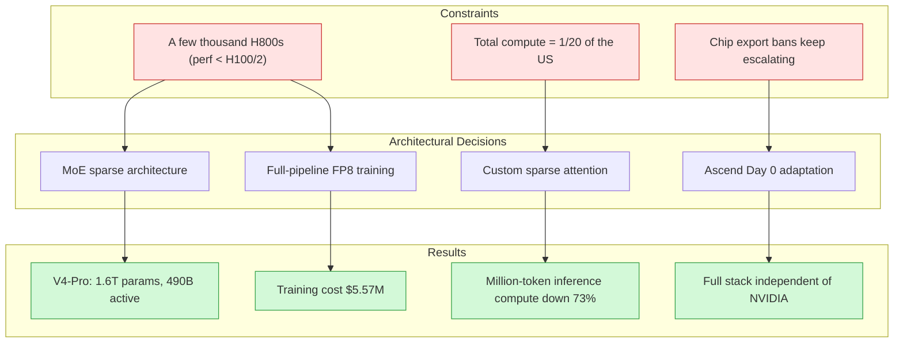
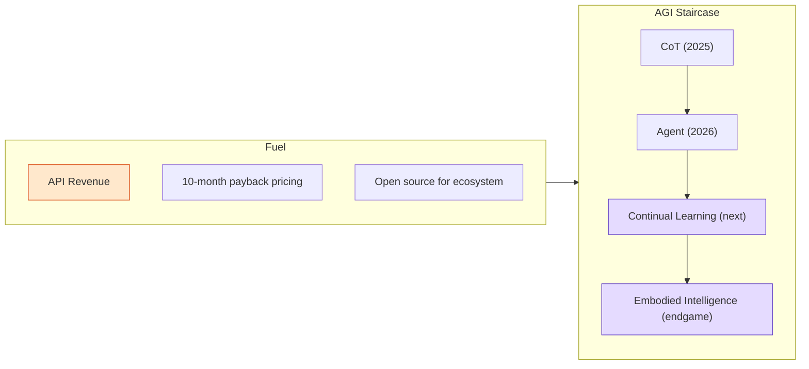

import Diagram from '../../components/blog/Diagram.astro'

# One-Twentieth the Compute — How Can You Be Only a Year Behind?

This week a 42-page document went viral in investment circles. A complete recording of DeepSeek founder Liang Wenfeng's closed-door session with investors on May 20 of this year — 3 hours and 44 minutes — was transcribed into a 34,000-character transcript.

The session took place during DeepSeek's first external fundraise, which raised over 50 billion RMB at a pre-money valuation of roughly 367.5 billion RMB. But the most striking thing in the entire transcript isn't the valuation figure. It's one sentence:

"We're one to two years behind the US, but we did it with only one-twentieth of America's compute."

That number is worth pausing on. Not one-half. Not one-fifth. One-twentieth. If you think of it as a car race, it's like someone hitting 300 km/h with a 2,000-horsepower engine while you hit 280 km/h with 100 horsepower. This isn't "saving a bit of money" — it means the two cars are running completely different aerodynamics.

## Four Architectural Decisions Born from Constraints

Why can 1/20 of the compute approach 1x performance? Constraints forced DeepSeek to make architectural choices at four critical junctures that diverged from Silicon Valley's mainstream.

**First: MoE sparse architecture instead of Dense models.** V4-Pro has 1.6 trillion total parameters but activates only 49 billion per inference call. V4-Flash has 284 billion parameters with 13 billion active. By contrast, GPT-4o and Claude were trained on Dense architectures where every token passes through all parameters. The cost of MoE is routing-algorithm complexity and communication overhead; the benefit is that compute requirements for both training and inference can drop by an order of magnitude.

They had only a few thousand H800s (a castrated version with less than half the performance of the H100). A Dense model simply cannot be trained to a competitive parameter count at that compute scale. MoE wasn't the optimal choice — it was the only choice.

**Second: FP8 low-precision training was the default from Day 1.** The conventional approach is FP32 training, FP16 inference, then gradual quantization. Starting with V3, DeepSeek ran the entire training pipeline in FP8, cutting memory usage by over 50% and effectively doubling compute. This is technically risky — precision loss accumulates in long-sequence scenarios. But they didn't have the compute budget to "train in FP32 first and quantize later."

**Third: Custom sparse attention.** In million-token scenarios, V4 reduces per-token inference compute to 27% of V3.2's, with KV cache usage at only 10%. Standard multi-head attention has O(n²) computational complexity for long contexts, which is unacceptable under limited compute. They were forced to perform surgery on the attention mechanism itself.

**Fourth: Day 0 joint adaptation with Huawei Ascend.** V4 is the first among the world's largest open-source AI models to complete full-stack deployment — from training to inference — on domestic chips, with zero dependency on any NVIDIA hardware. The Ascend 950 natively supports FP8/MXFP4 and includes hardware-level optimizations for MoE's discrete memory access patterns. This isn't a "can also run" compatibility adaptation — it's a "can only run on this" survival choice.

<Diagram title="Constraints → Decisions → Results" caption="Red indicates constraints, green indicates architectural outcomes">

</Diagram>

## Pricing as an Architectural Extension

Liang Wenfeng's description of API pricing boils down to one sentence: "Buy a batch of equipment, recoup the equipment cost in roughly 10 months, and we think that's enough. That's a reasonable profit."

When R1 launched, pricing was $0.55 per million input tokens and $2 per million output tokens, compared to o1's $15 and $60. The reduction isn't 50% — it's 95%.

This pricing isn't the classic internet playbook of "lose money to grab market share." The underlying logic is: when your MoE architecture activates only 3% of total parameters per inference call, when your FP8 training lets the same cards handle twice the volume, your cost structure is simply not in the same order of magnitude as Dense + FP16/32 competitors. A 10-month payback is genuinely feasible under their cost structure.

Even more elegant is the effect this pricing has on the ecosystem. Liang Wenfeng said: "At this profit level, independent third-party deployments are unprofitable." Anyone can take the open-source code, but running it yourself costs more than just calling the DeepSeek API. Open source doesn't undermine commercialization — it turns potential competitors into parts of the ecosystem.

This is the fifth innovation, and the most elegant one: using an efficiency moat to make replication unprofitable, without needing a capital moat.

## AGI Roadmap: Staircase, Not Mutation

Liang Wenfeng compared AGI development to climbing a staircase:

- Last year's step was CoT (chain of thought), letting AI raise its intelligence ceiling through "thinking"
- This year's step is Agent, moving AI from "answering" to "executing"
- The next step is Continual Learning

His exact words: "The core capability of the next-generation model must include continual learning — only then can it be called the next generation. If we get continual learning working first, general intelligence might come easily."

This judgment aligns closely with what Richard Sutton said this week when he announced the founding of Oak Lab. Sutton said current deep learning methods are "fragile and inefficient, requiring a fundamental restart from the ground up." In the same week, two people independently expressed the same view: the current paradigm (pre-training + RLHF/RLVR + inference-time compute) is not the endgame for AGI — continual learning is.

What's interesting is Liang Wenfeng's take on the endgame: "All paths probably converge on embodiment, because what people need isn't computers — it's labor." This is consistent with his framing of both consumer and enterprise products as "byproducts on the road to AGI." API revenue isn't the goal; it's the fuel that sustains the research.

<Diagram title="AGI Staircase and Fuel" caption="Purple indicates the next direction, orange indicates current revenue support">

</Diagram>

## The Real Purpose of the 50-Billion-RMB Fundraise

The market is focused on valuation and IPO rumors. But the fundraising logic revealed in the transcript tells a completely different story.

Multiple core members of DeepSeek had been poached, with the leads of four key directions (foundation models, code, multimodal, reasoning) recruited by Tencent, Xiaomi, ByteDance, and an autonomous driving company at total compensation packages reaching nearly 100 million RMB at the high end. The primary purpose of the 50-billion-RMB fundraise was to establish a market-calibrated valuation anchor for employee stock options to stem talent attrition.

The investor terms were highly unusual: no board seats, no voting rights on operations, and a mandatory 5-year capital lock-up. Liang Wenfeng's explanation: "The more restrained you are, the more likely you are to pull this off." He doesn't want capital interfering with the technical roadmap.

The fundraising structure itself embodies this constraint-driven thinking: use capital to solve the people problem, but don't let capital create new constraints.

## Why Silicon Valley's Response Isn't "Copy It"

DeepSeek's technical approach is, in theory, entirely replicable. The MoE architecture papers are public, the FP8 training methods are shared, and the code is even open source. But the fundamental reason Silicon Valley hasn't followed suit is: they don't have this constraint.

When you have 100,000 H100s in hand, the Dense model training path is clear, mature, and low-risk. MoE routing algorithm tuning is a deep pit, and the engineering challenges of communication overhead are especially painful at large cluster scale. If compute isn't the bottleneck, choosing Dense is rational.

This is the essential nature of constraint-driven innovation: Israel's agricultural technology doesn't exist because Israelis are more passionate about farming — it exists because without drip irrigation, the desert yields nothing. DeepSeek's efficiency doesn't exist because Chinese engineers care more about efficiency — it exists because if the H800s aren't enough, the model simply can't be trained.

Liang Wenfeng's own summary: "The only gap between us and the US is resources." A precise self-assessment. Under resource constraints, the capabilities you're forced to develop — extreme sparsification, low-precision training, hardware-software co-optimization — become structural advantages. When the constraints are lifted, these capabilities don't disappear; they compound.

## Takeaway for Engineers

This story has a direct implication for anyone building systems: don't rush to eliminate your constraints.

In ads systems, we frequently face similar scenarios. When the compute budget is limited, you're forced to design more efficient feature retrieval schemes, lighter-weight model architectures, and smarter caching strategies. These "forced optimizations" don't become liabilities when compute becomes plentiful — they become your efficiency moat.

Another thing Liang Wenfeng said applies to all engineering decisions: "Assuming AI eventually accounts for 10% of humanity's GDP, DeepSeek only needs to capture a tiny sliver and that's more than enough." This is a judgment about market size, but also a judgment about competitive strategy: in a sufficiently large market, an efficiency advantage is more durable than a first-mover advantage.

Lights-out factories don't work (I wrote about that in the previous post), but constraint-driven efficiency optimization is a real lever. Not every road leads to 10x, but approaching 1x performance with one-twentieth the resources is itself a form of 10x.

---

**References**

- [Transcript of Liang Wenfeng’s Four-Hour Investor Meeting (Deep Blue Finance/JRJ)](https://stock.jrj.com.cn/2026/07/23134157880611.shtml)
- [Five Key Signals from DeepSeek V4 (36Kr)](https://m.36kr.com/p/3780450463552771)
- [From 5% to 0.1%: Liang Wenfeng Dismantles Silicon Valley’s $1.1 Trillion AI Narrative](https://m.toutiao.com/group/7666024867611673131/)
- [Huawei Announces Full Support for DeepSeek V4](https://cj.sina.cn/articles/view/7879848900/1d5acf3c402002xqdq)
- [DeepSeek pause fundraise after comments on compute gap leaked (HN)](https://news.ycombinator.com/item?id=49051361)
