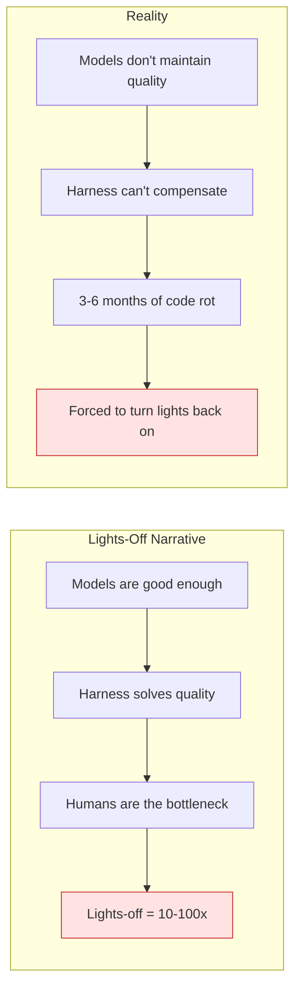
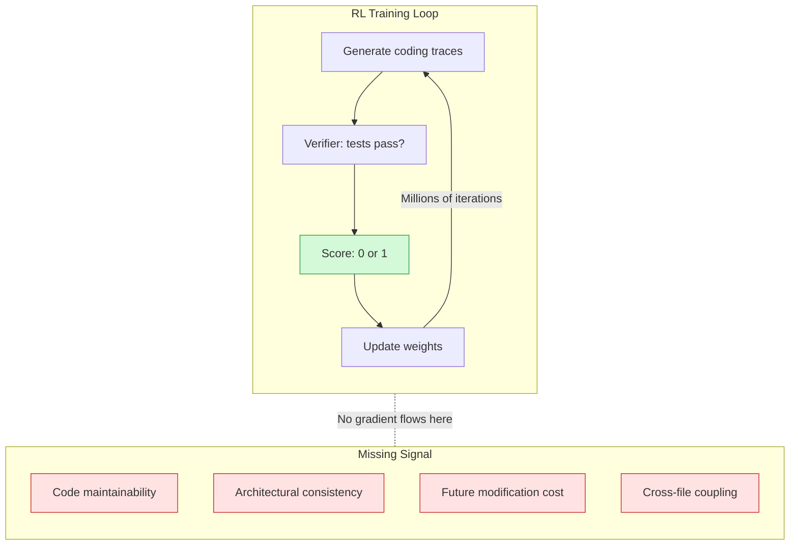
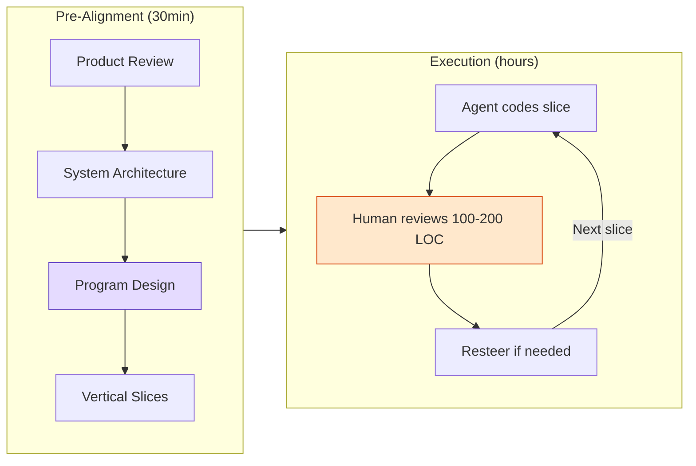

import Diagram from '../../components/blog/Diagram.astro'

# The Lights That Won't Turn Off: Why Software Factories Are Destined to Fail

In early July, Faros AI published a report tallying what happens to production quality after enterprises deploy AI coding tools at scale: incidents per PR rose 242.7%, bugs per developer increased 54%, and 31.3% of PRs were merged without any human review at all.

These numbers form a glaring contrast with the industry narrative. The most dominant buzzword of H1 2026 is Harness Engineering. In July, Lilian Weng published two back-to-back long-form blog posts to legitimize it; LangChain used experimental data to show that swapping the harness on the same model yields a 26% performance difference; OpenAI publicly evangelized their internal Symphony factory; and nearly every Chinese tech platform ran a "one article to understand Harness" piece. Everyone was saying: as long as the harness is good enough, code quality is guaranteed, and humans can be liberated from review.

But the data tells a different story. Harness Engineering is a real and valuable engineering advance. Yet it has a structural blind spot—one that forces every Software Factory attempting to run "lights-off" to turn the lights back on within 3–6 months.

## How the "Lights-Off" Narrative Arose

The term Software Factory can be traced back to the 1968 NATO conference—the same conference that coined the term "software engineering." But it suddenly became an industry-wide buzzword in 2026 thanks to a cascade of events.

StrongDM announced a lights-off factory at the start of the year: no one reads code, no one writes code. OpenAI's Ryan Lopopolo made the architecture of their internal system Symphony public and, in an April talk, summarized it in one sentence: "harness engineering is what separates demo agents from production agents." Ramp, Stripe, WorkOS, and Brex published posts one after another explaining how they got agents to produce 75%+ of their code.

The core logic of the narrative is simple:

1. You are the bottleneck
2. Models are good enough
3. Code is free
4. Just ship more

Lilian Weng's blog post *Harness Engineering for Self-Improvement* gave this narrative academic legitimacy in July. Her key argument: if AI is truly heading toward recursive self-improvement (RSI), the first thing to be rewritten won't be the model weights but the outer Harness—the "operating system" responsible for orchestrating tasks, managing memory, invoking tools, and executing evaluations. DeepSeek researcher Cui Tianyi immediately reposted in agreement, saying "self-evolution in the Harness direction and self-evolution in the model direction are both very likely to produce results."

Within a week the Chinese community produced dozens of explainer articles. "Harness Engineering 101" posts on Tencent Cloud, Juejin, and CSDN, combined with translations and opinion roundups, formed a consensus with a clear signal: Harness is the most important capability dimension in AI engineering in 2026.

That consensus itself is fine. The problem is that it was over-extrapolated into "with a good harness you can turn the lights off."

<Diagram title="Lights-Off Narrative vs. Reality" caption="Both logical chains end at a red warning">

</Diagram>

## What Actually Happened in "Lights-Off Experiments"

Dex Hunter-Torricke is the founder of HumanLayer and the creator of the "Advanced Context Engineering for Coding Agents" video series, with over a million total views on YouTube. At the AI Engineer World's Fair in July, he gave a keynote laying bare his own lights-off experiment that began in July 2025.

What they did was the same as every team energized by the harness narrative: read specs, read tickets, let background agents handle all small-to-medium tasks. The first few months were genuinely faster—it felt like they had finally broken free from the shackles of review.

Then things started going wrong.

The first time, they found a gnarly bug. The agent tried ten different approaches to reproduce it and failed every one. He had no choice but to grit his teeth and read a codebase he hadn't looked at in three months. That's when he discovered the code had turned into "claude spaghetti"—try-catches swallowing exceptions everywhere, `as any` casts bypassing the type system, and all manner of hacks the agent had introduced to make tests pass.

The first time, he swallowed it. "Downside risk was worth the velocity." By the third occurrence of the same class of incident in November, his co-founder spent two full weeks in plain VS Code manually rewriting all the core patterns.

His summary:

> Models degrade codebase quality over time — not without a decent amount of human steering.

This conclusion is not an isolated case. Matt Pocock said in a July video that "codebases are falling apart faster than they ever have before." The Faros AI data is statistical corroboration. And if you've spent more than three months in any active engineering community, you've most likely seen someone post asking: "How do I rescue a codebase the agent trashed?"

## Root Cause: RL's Reward Signal Blind Spot

Why do models "not maintain quality"? This isn't a mystical question—the answer is hidden in how they're trained.

The state-of-the-art coding agents are trained via RLVR (Reinforcement Learning with Verifiable Rewards). The widely acknowledged reason Claude Code crushed all contemporary CLI agents (aider, cline, codebuff) is that Anthropic was the first to do RL *inside* the harness—the model didn't learn "how to write code" in the generic sense but was reinforcement-trained specifically on the exact tool suite it would use (read, write, edit, grep, bash).

The rough structure of this training loop is:

1. Give the model a coding task (e.g., fix a bug)
2. The model generates an action trace inside the harness (tool calls + code edits)
3. A verifier scores it: did the tests pass? (FAIL\_TO\_PASS + PASS\_TO\_PASS)
4. Update weights based on the score—good traces get higher probability, bad traces get lower
5. Repeat millions of times

The key is step 3. The verifier's score is **binary**: tests pass = 1, tests don't pass = 0. No middle ground, and no signal whatsoever telling the model "your implementation passed the tests, but you introduced a coupling that will cause someone three days of pain down the road."

<Diagram title="RL Training Loop and Signal Blind Spots" caption="Green is the reward the model can see; red is what it cannot">

</Diagram>

There is a fundamental timescale mismatch here:

- Test feedback is on the order of seconds; RL can complete a verification loop in seconds
- The cost of architectural degradation is on the order of weeks to months. The first time someone opens that file to change one line and realizes they can't, they discover that a "harmless" decision made three months ago created shotgun surgery

RL needs a fast, reliable oracle to provide reward signal. "Do the tests pass" is exactly such an oracle—deterministic, fast, automated. But "does this code increase the system's long-term maintenance cost"—no such oracle exists.

Dex's original words in the article:

> If a model could reliably tell good code from bad, it might have written the good version to begin with.

This is a recursive dilemma. You can't use a model that doesn't understand good design as a judge of good design, then use that judge's signal to train it to understand good design.

## What Harness Can and Cannot Solve

Once you understand the root cause, you can draw the capability boundary of Harness Engineering.

A harness is essentially a runtime environment and constraint system. What it manages is "how to do things more reliably while the model is doing them": tool calls don't error out, context isn't lost, errors can be recovered from, formats can be validated. These are real, important engineering problems, and solving them genuinely takes agent reliability up a notch.

But what harness *cannot* manage is "what the model decides to do": whether this file should be split, whether this abstraction should be added, what this API's contract should look like. These are design decisions, not execution quality.

Addy Osmani, in his "Software Factories, Light and Dark" article, offered a criterion:

**A loop can go lights-out (fully automated) only if:**

- Verification cost is low and can run at high frequency
- It relies on unforgeable signals (type checks, property tests, review agents with real scoring criteria)
- Answers are immediate and don't drift over time

**Scenarios that must stay lights-on:**

- The cost of errors is high
- The blast radius is large
- The decision will shape the next year of work

In other words: short loops (lint, type check, unit test) can safely go lights-out; long loops (architecture decisions, abstraction choices, interface design) must have a human watching.

Lilian Weng analogized harness to an operating system. The analogy itself implies the boundary: an operating system manages resource scheduling and process isolation, but an operating system doesn't make product decisions. You wouldn't expect the Linux kernel to tell you whether you should split this microservice into two. Likewise, a harness manages the execution environment but not design judgment.

This distinction is not theoretical speculation. In ad auction systems, a large number of short loops can be fully automated—bid computation, feature retrieval, frequency cap filtering, budget pacing—all deterministic logic with low verification cost and immediate signals. But bidding strategy changes are never rolled out to full traffic without running an A/B test, even when offline evaluation says "theoretically fine." The reason is simple: the cost of a strategy change manifests with delay; today's CPM shift won't show up in ROI reports until a week later.

Code's architectural quality is the same kind of timescale problem. Today's "harmless" design decision won't reveal itself as unbearable coupling until some requirement change three weeks from now. That's why it can't be verified automatically, and that's why harness can't manage it.

## Frontier Attempts: Under Attack but Far from Solved

Now that we know the root cause is the absence of reward signal, the natural question is: is anyone trying to fill this gap? Yes. But it's far from solved.

**SWE-Marathon** (Abundant AI) stretches task duration from SWE-bench's 15 minutes to the 400-hour scale—problems like "clone all of Excel's functionality." It introduces composite reward channels instead of a single pass/fail bit, attempting to force the model to face codebases that require long-term maintenance.

**Frontier Code** (Cognition / Devin team) did two clever things: first, they used mutation testing—if your newly written test doesn't fail on the pre-patch code, the test is vacuous; second, they introduced a judge model to score diffs against code quality rules. This is the first benchmark I've seen that puts "quality" into the evaluation function.

**AREX** (BAAI, released this week) took a different path: letting an agent recursively improve its own research strategy. This doesn't directly solve the code quality problem, but it tackles the feasibility of harness self-improvement—if an agent can improve the way it searches for information, in theory it could also improve the way it reviews code quality.

But all these attempts hit the same ceiling: **the judge model's judgment is capped by its own coding ability**. You can't expect a model that can't distinguish good design from bad design to serve as a reliable arbiter of good design. The model's own capability needs to improve first before it can in turn train the next generation of models. This is why progress is "slow but present," not "solved in the next release."

## What You Can Actually Do: 2–3x, Not 10–100x

Frontier research is advancing, but "wait for the next-gen model" is not a strategy. What can be done under current constraints?

Dex's answer is a four-stage pre-alignment model: spend 30 minutes on decision alignment before writing code, trading that upfront time for review time dropping from hours to minutes.

**Stage 1: Product Review**—determine "what are we building" and "what does success look like." Not a technical document, but product-level mock-ups and acceptance criteria. The model's role here is to help you turn voice notes into a structured spec, but decision authority stays with the human.

**Stage 2: System Architecture**—sequence diagrams + endpoint contracts + data models. Determine how services communicate, without getting into code implementation details.

**Stage 3: Program Design**—this is the criminally underestimated step. Before writing the implementation, nail down call-stack trees, type signatures, and file-tree diffs. You're not writing code; you're drawing the shape of the code. Most people assume "once the architecture is right the model can cook," but in reality the implicit decisions the model makes at this layer will explode three weeks later.

**Stage 4: Vertical Slices**—don't let the model work horizontally layer by layer (DB first → then service → then API → then frontend). Instead, work vertically slice by slice. 100–200 lines per slice, with immediate review and verification after each slice. The cost of resteering at 200 lines is minutes; at 2,000 lines it's days.

<Diagram title="Pre-Alignment + Execution Model" caption="30 minutes of decision alignment trades review time from hours down to minutes">

</Diagram>

Not every task needs the full process. The rough distribution is:

- 40% of tasks are handled with a direct oneshot or one or two rounds of lightweight feedback
- Medium tasks get a combined product + system design plan
- Large changes go through all four stages

The key mental model shift: **spending 30 minutes upfront isn't "wasting time on documentation"—it's turning review from an "intellectual + emotional burden" into "glance and confirm it matches expectations."** A PR that requires 20% rework is painful for both the submitter and the reviewer. A PR that perfectly matches what was discussed turns review into a formality.

## Constraints Are Not Bad News

1. Harness Engineering is a real and important engineering advance, but it governs execution quality, not design quality
2. Models degrading codebase quality is a structural deficiency of RL training, not a matter of prompts being poorly written
3. Lights-out factories are not feasible with current model capabilities—it's not "almost there," it's "missing a fundamental reward signal"
4. The optimal strategy is not to fight constraints chasing 10–100x, but to embrace constraints and safely capture 2–3x

Dex's closing words:

> It is possible you are too busy trying to move 10-100x faster and trying to convince yourself code quality doesn't matter any more, when you could embrace the constraints and move 2-3x faster, safely.

"Safely 2–3x faster" doesn't sound that exciting. But compared to "10x faster then spending two weeks rewriting three months later," anyone who's spent a few years in production systems knows which has higher expected value.

The real leverage isn't in how fancy your harness is, but in **knowing when to turn the lights off and when to turn them on**. Short cycles, deterministic verification, low-cost-of-error segments—automate with confidence. Long cycles, delayed feedback, high-cost-of-error decisions—keep humans in the loop. This isn't a denial of AI's capabilities; it's respect for constraints.

Learn the constraints, develop intuition, optimize the system within the arena of those constraints.

And then, read the damn code.

---

**References**

- [Why Software Factories Fail (Dex / HumanLayer)](https://github.com/humanlayer/advanced-context-engineering-for-coding-agents/blob/main/wsff.md)
- [Software Factories, Light and Dark (Addy Osmani)](https://addyosmani.com/blog/software-factories/)
- [Harness Engineering for Self-Improvement (Lilian Weng)](https://lilianweng.github.io/posts/2026-07-04-harness/)
- [Faros AI: The AI Acceleration Whiplash Report](https://www.faros.ai/research/ai-acceleration-whiplash)
- [SWE-Marathon (Abundant AI)](https://www.swe-marathon.org/)
- [Frontier Code (Cognition)](https://cognition.com/blog/frontier-code)
- [AREX: Towards a Recursively Self-Improving Agent (BAAI)](https://arxiv.org/abs/2607.21461)
